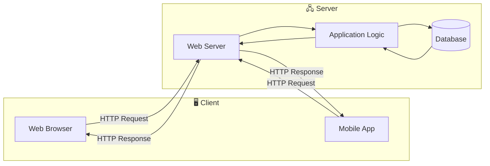
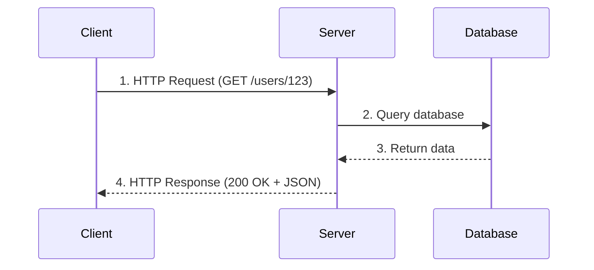

# Client-Server Model

The fundamental architecture pattern behind nearly every networked application you use.

---

## What is the Client-Server Model?

The client-server model is a way of structuring applications where work is divided between two roles:

**Client:** The requester. Initiates communication, sends requests, receives responses.

**Server:** The provider. Listens for requests, processes them, sends responses back.

When you visit a website, your browser is the client. The website's servers handle your requests. This separation is the foundation of the web and most networked applications.



---

## Why This Matters

Understanding client-server isn't just academic. It affects how you think about every system:

**Where does logic live?** Validation on client, server, or both? Processing on server, caching on client?

**What are the failure modes?** Server down? Network unreachable? Client crashes?

**What are the security boundaries?** Client is untrusted. Server must validate everything.

**How does scaling work?** Typically, many clients to few servers. Servers must handle concurrent clients.

Every design decision involves understanding which component is responsible for what.

---

## The Request-Response Cycle

The basic interaction pattern:

1. **Client sends a request** to the server (e.g., "give me my order history")
2. **Server receives and processes** the request (looks up orders in database)
3. **Server sends a response** back to the client (order data as JSON)
4. **Client handles the response** (displays orders in UI)

This cycle repeats for every interaction. Each cycle is typically:
- Client-initiated (server doesn't push unsolicited data in basic model)
- Stateless (server doesn't remember previous requests)
- Over a network (introduces latency, failure modes)



---

## Examples of Clients and Servers

The terms are broader than you might think:

### Obvious Examples

| Client | Server | Interaction |
|--------|--------|-------------|
| Web browser | Web server | HTTP requests for pages and APIs |
| Mobile app | Backend API | REST/GraphQL calls for data |
| Desktop app | Cloud service | Syncing, authentication, storage |

### Less Obvious Examples

| Client | Server | Interaction |
|--------|--------|-------------|
| Your backend service | Database | SQL queries |
| Your backend service | Redis | Cache reads/writes |
| Your backend service | Another microservice | API calls |
| Database replica | Database primary | Replication stream |

A server in one relationship is often a client in another. Your API server is a server to the mobile app, but a client to the database.

---

## Statelessness

A key property of well-designed servers: each request is independent.

### What Stateless Means

The server doesn't remember anything about previous requests from this client. Everything needed to process the request is contained in the request itself.

**Stateful (problematic):**
```
Request 1: "Login as alice"
Server remembers: this connection is alice
Request 2: "Get my orders"
Server uses: remembered identity
```

**Stateless (preferred):**
```
Request 1: "Login" → Server returns auth token
Request 2: "Get my orders" + auth token
Server: validates token, knows it's alice from token in this request
```

### Why Statelessness Matters

**Scaling:** Any server can handle any request. Put servers behind a load balancer, add more as needed. No need to route specific clients to specific servers.

**Reliability:** If a server dies, clients can retry with a different server. No session state is lost because there was no session state on the server.

**Simplicity:** Each request is self-contained. Easier to reason about, debug, and test.

### Where State Actually Lives

If servers are stateless, where does state go?

**In the request:** Auth tokens, API keys, request parameters carry necessary context.

**In external storage:** Sessions in Redis or database. User data in database. Files in object storage.

**On the client:** Local storage, cookies, local database.

The server is stateless, but state exists, it's just stored elsewhere.

---

## Synchronous vs. Asynchronous

### Synchronous (Request-Response)

Client sends request, waits, receives response. This is the standard model.

**Pros:** Simple to reason about. Client knows when operation is complete.
**Cons:** Client is blocked while waiting. Slow operations make client wait.

### Asynchronous

Client sends request, receives acknowledgment, and gets results later.

**Patterns:**
- **Polling:** Client keeps asking "is it done yet?"
- **Webhooks:** Server calls back to client when done
- **WebSockets/SSE:** Persistent connection for server to push updates

**When to use:** Long operations (video processing), real-time updates (chat, notifications), or when client shouldn't wait.

---

## Connections and Protocols

### How Clients Connect

Internet communication happens over protocols. The most common for client-server:

**HTTP/HTTPS:** The web's protocol. Request-response, text (or binary with HTTP/2+), stateless. Most APIs use this.

**WebSocket:** Full-duplex persistent connection. Both sides can send anytime. Good for real-time features.

**gRPC (over HTTP/2):** Binary protocol, schema-defined, efficient. Common for internal service-to-service communication.

**TCP (raw):** Low-level reliable byte stream. Databases and custom protocols often use this directly.

### Connection Lifecycle

Creating a connection involves overhead:
- TCP handshake (1 round-trip)
- TLS handshake for HTTPS (1-2 round-trips)
- Then your request

**Connection reuse:** HTTP keep-alive and HTTP/2 multiplexing allow multiple requests over one connection, avoiding repeated handshakes.

**Connection pooling:** Clients (like database drivers) maintain a pool of open connections, reusing them for multiple requests.

For high-traffic systems, connection management matters for latency and resource usage.

---

## Failure Modes

Networks and servers fail. Clients must handle this.

### Server Unreachable

Network is down, server crashed, or server is overloaded and dropping connections.

**What client sees:** Connection refused, timeout, no response.
**Client response:** Retry with backoff, use a different server, show error to user.

### Server Returns Error

Server received the request but couldn't process it successfully.

**What client sees:** Error response (HTTP 4xx/5xx, error in response body).
**Client response:** Depends on error type. 400 (bad request) → fix request. 500 (server error) → maybe retry. 429 (rate limited) → slow down.

### Server Is Slow

Server responds, but takes a long time.

**What client sees:** Long wait, possibly timeout.
**Client response:** Set reasonable timeouts. Long operation? Make it async.

### Partial Failure

In a microservices environment, some backends are up, some are down.

**What client sees:** Some features work, some don't.
**Design response:** Graceful degradation. Show what you can, hide or indicate unavailability for the rest.

---

## Client vs. Server Responsibilities

Where should logic live?

### Validation

**Client-side validation:** Immediate feedback, better UX. But easily bypassed.
**Server-side validation:** Authoritative, secure. But delayed feedback.
**Best practice:** Both. Client for UX, server for security.

### Business Logic

**Mostly on server.** Server is authoritative on what's allowed, how things work. Client can have presentation logic and optimistic updates.

### Data Storage

**Server-side (databases):** Authoritative data. Backed up, consistent.
**Client-side (local storage):** Offline access, caching, user preferences.

### Authentication

**On server, always.** Never trust the client's claim of identity. Server validates tokens, checks permissions.

---

## Scaling Patterns

### Horizontal Scaling

Add more servers. Put them behind a load balancer. Because servers are stateless, any server can handle any request.

```
Client → Load Balancer → Server 1
                      → Server 2
                      → Server 3
```

### Tiers

Servers often have sub-components, each with client-server relationships:

```
Client → Web Server (presentation)
      → Application Server (logic)
      → Database (data)
```

Each tier can scale independently.

### CDNs and Edge

Move server-like functionality closer to clients:

- CDN caches static content at edge locations worldwide
- Edge computing runs logic at edge (Cloudflare Workers, Lambda@Edge)

Reduces latency by reducing distance between client and the data/logic they need.

---

## Security Considerations

The client is untrusted. This is fundamental.

### Never Trust Client Input

- Validate everything server-side
- Sanitize inputs (prevent injection attacks)
- Don't rely on client-side checks for security

### Authentication and Authorization

- Authenticate: Who is this? (verify identity)
- Authorize: What can they do? (check permissions)

Both happen on the server.

### Data in Transit

- Use HTTPS (TLS encryption) for all communication
- Don't send sensitive data in URLs (visible in logs)
- Consider what data is sent to client (don't leak internal details)

### Rate Limiting

Clients can accidentally or maliciously send too many requests. Servers protect themselves with rate limiting.

---

## Common Mistakes

**Trusting the client.** Accepting client-provided data without validation. Assuming the client is your code (it could be a malicious script).

**Stateful servers without realizing it.** Storing session data in server memory. Works until you add a second server and users randomly lose their sessions.

**Too many round trips.** Requiring many back-and-forth requests to complete an operation. Consider batch endpoints or bundling related data.

**Not handling failures.** Assuming the server is always up and fast. No timeouts, no retries, no error handling.

**Blocking the client unnecessarily.** Synchronous operations that should be async. User waits 30 seconds while video processes instead of getting a "processing" status immediately.

---

## What An Experienced Senior Engineer Thinks About

**API design as a contract.** The interface between client and server is a long-term commitment. Changing it requires coordinating clients and servers. Version carefully.

**Backward compatibility.** Servers might need to support old clients for years. Don't break existing clients with changes.

**Client diversity.** Not just one client. Web, mobile, internal tools, third-party integrations. Server should be a good citizen for all.

**Observability.** What's happening in client-server interactions? Log requests, track latency, monitor error rates. This is how you understand real usage.

**Trust boundaries.** Where does trusted internal space end and untrusted external begin? This affects what you validate, encrypt, and defend.

---

## Vibe Engineering Guide

When prompting about client-server architecture:

**Less useful:**
> "Build me an app with a client and server"

**More useful:**
> "I'm building a web application with a React frontend and Node.js backend. I want to:
> - Handle user authentication with JWT tokens
> - Make the backend stateless for horizontal scaling
> - Store sessions appropriately so users stay logged in across server restarts
>
> How should I structure the auth flow between client and server?"

**For specific problems:**
> "My mobile app makes 15 API calls to load the home screen. It's slow. How can I reduce the number of round trips to the server without making the API less RESTful? Should I add a batch endpoint or use GraphQL?"

---

## Quick Check

<details>
<summary><b>What's the difference between client and server?</b></summary>

Client initiates requests and receives responses. Server listens for requests, processes them, and sends responses. The same component can be a server in one relationship and a client in another.

</details>

<details>
<summary><b>Why should servers be stateless?</b></summary>

Stateless servers can be scaled horizontally, any server can handle any request. Requests can failover to different servers without losing state. It simplifies scaling, reliability, and reasoning about the system.

</details>

<details>
<summary><b>Where does state go if servers are stateless?</b></summary>

In external storage (databases, Redis, object storage), in the request itself (tokens, parameters), or on the client (local storage, cookies).

</details>

<details>
<summary><b>Why should you never trust the client?</b></summary>

The client is outside your control. It might not be your code, it could be a malicious script or modified app. All input must be validated server-side. All security checks must happen on the server.

</details>

<details>
<summary><b>What is the main overhead of connections?</b></summary>

TCP handshake (1 round-trip) and TLS handshake (1-2 round-trips) for each new connection. Connection reuse (HTTP keep-alive, connection pooling) avoids repeated handshakes.

</details>

---

Next: [How the Internet Works](02-how-the-internet-works.md)
