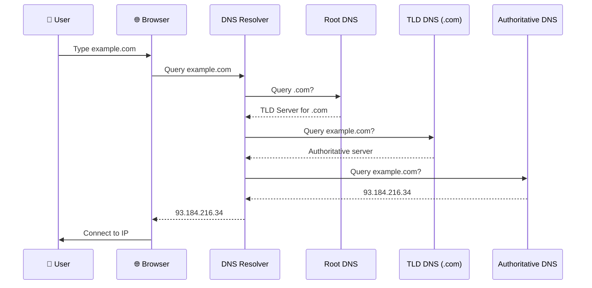

# How the Internet Works

Understanding network fundamentals helps you reason about latency, design distributed systems, and debug connectivity issues.

---

## The Big Picture

When you type a URL and press enter, here's what happens at a high level:

1. Your browser needs to find the server's address (DNS)
2. Your computer establishes a connection (TCP)
3. If using HTTPS, encryption is negotiated (TLS)
4. Your request is sent as HTTP
5. The server processes and responds
6. Your browser renders the response

Each step involves protocols, infrastructure, and potential points of failure. Understanding them helps you build and debug networked applications.

---

## IP Addresses

Every device on the internet has an IP address, a numerical identifier.

### IPv4

```
192.168.1.100
```

Four numbers (0-255) separated by dots. About 4.3 billion possible addresses.

**Problem:** We've run out. There are more devices than IPv4 addresses.

### IPv6

```
2001:0db8:85a3:0000:0000:8a2e:0370:7334
```

Much larger address space (340 undecillion addresses). Adoption is growing but IPv4 is still dominant.

### Public vs. Private

**Public IP:** Globally unique, routable on the internet. Your server's IP.

**Private IP:** Used within networks, not routable on the internet.
- `10.0.0.0 - 10.255.255.255`
- `172.16.0.0 - 172.31.255.255`
- `192.168.0.0 - 192.168.255.255`

Your home network uses private IPs. Your router has a public IP and does Network Address Translation (NAT) to route traffic.

### What This Means for You

- Servers need public IPs (or load balancers with public IPs)
- Private IPs are used within cloud VPCs
- NAT and firewalls control what traffic flows where

---

## DNS: Translating Names to Addresses

Humans use domain names (google.com). Computers use IP addresses. DNS translates between them.

### How DNS Resolution Works

When you request `www.example.com`:

1. **Browser cache:** Already know this domain? Use cached IP.
2. **OS cache:** Operating system has its own cache.
3. **Resolver (ISP or configured):** Your configured DNS resolver (often your ISP, or 8.8.8.8 for Google).
4. **Root nameservers:** If resolver doesn't know, it asks root servers "who handles .com?"
5. **TLD nameservers:** Root says "ask .com servers." Resolver asks them "who handles example.com?"
6. **Authoritative nameserver:** .com says "ask ns1.example.com." That server has the actual IP.
7. **Response cached:** Each level caches the result for the TTL (Time To Live).

This looks slow, but caching makes most lookups fast (milliseconds).



### DNS Records

| Record | Purpose | Example |
|--------|---------|---------|
| A | Maps name to IPv4 | `example.com → 93.184.216.34` |
| AAAA | Maps name to IPv6 | `example.com → 2606:2800:220:1:...` |
| CNAME | Alias to another name | `www.example.com → example.com` |
| MX | Mail server | `example.com → mail.example.com` |
| TXT | Text data, often for verification | SPF, DKIM records |
| NS | Nameserver for the domain | `example.com → ns1.example.com` |

### TTL (Time To Live)

How long resolvers cache a record.

- **Long TTL (hours/days):** Less DNS traffic, but changes propagate slowly.
- **Short TTL (minutes):** Faster updates, but more DNS queries.

Before making DNS changes, lower the TTL. After changes propagate, raise it again.

### DNS Failures

DNS is critical infrastructure. If DNS is down, nothing works, browsers can't find any server.

**Mitigations:**
- Use reliable DNS providers (Route 53, Cloudflare DNS)
- Multiple nameservers for redundancy
- Clients cache aggressively

---

## TCP: Reliable Communication

TCP (Transmission Control Protocol) provides reliable, ordered delivery of data.

### What TCP Provides

- **Reliability:** Data arrives or you get an error. Lost packets are retransmitted.
- **Order:** Data arrives in the order it was sent.
- **Flow control:** Sender doesn't overwhelm receiver.
- **Congestion control:** Sender adapts to network capacity.

### The Three-Way Handshake

Before sending data, TCP establishes a connection:

```
Client → SYN → Server
Client ← SYN-ACK ← Server
Client → ACK → Server
```

This costs one round-trip before data transfer begins.

**Latency implication:** A new TCP connection adds latency. This is why connection reuse (HTTP keep-alive, connection pooling) matters.

### When TCP Is Used

Most application protocols use TCP:
- HTTP/HTTPS (web)
- Database connections
- SSH
- Email protocols

TCP's reliability overhead is usually worth it for application data.

---

## UDP: Fast but Unreliable

UDP (User Datagram Protocol) is simpler: send packets, no guarantees.

### What UDP Provides

- No connection establishment
- No guaranteed delivery
- No ordering
- Lower overhead

### When UDP Is Used

When latency matters more than reliability:
- **Video streaming:** Losing a frame is okay; waiting for retransmission isn't.
- **Gaming:** Real-time position updates; old positions are obsolete anyway.
- **VoIP:** Voice calls need immediacy.
- **DNS queries:** Simple request-response; can retry at application level.

---

## Ports

An IP address identifies a machine. A port identifies a service on that machine.

```
192.168.1.100:443
     IP        Port
```

Ports range from 0-65535.

### Well-Known Ports

| Port | Service |
|------|---------|
| 22 | SSH |
| 80 | HTTP |
| 443 | HTTPS |
| 3306 | MySQL |
| 5432 | PostgreSQL |
| 6379 | Redis |
| 27017 | MongoDB |

**Privileged ports (0-1023):** Require root/admin to bind. Standard services use these.

**Ephemeral ports (49152-65535):** Used for outgoing connections.

---

## TLS: Encryption

TLS (Transport Layer Security) encrypts communication. HTTPS is HTTP over TLS.

### What TLS Provides

- **Confidentiality:** Data is encrypted; eavesdroppers can't read it.
- **Integrity:** Data can't be modified in transit without detection.
- **Authentication:** Server proves its identity with a certificate.

### The TLS Handshake

Before encrypted data transfer:

1. Client sends supported cipher suites and TLS version
2. Server responds with chosen cipher and certificate
3. Client verifies certificate
4. Key exchange to establish shared secret
5. Encrypted communication begins

**Latency:** Adds 1-2 round trips. TLS 1.3 reduced this.

### Certificates

A certificate proves the server is who it claims to be. Signed by a Certificate Authority (CA) that browsers trust.

**Let's Encrypt:** Free, automated certificates. No reason not to use HTTPS.

---

## Network Latency

Physical distance and network hops add latency.

### Speed of Light

Light in fiber travels at about 200,000 km/s. The theoretical minimum for a round-trip:

| Distance | Minimum RTT |
|----------|-------------|
| Same data center | <1ms |
| Same region (100km) | ~1ms |
| US coast to coast (4000km) | ~40ms |
| US to Europe (6000km) | ~60ms |
| US to Asia (12000km) | ~120ms |

Real latency is higher due to routing, processing, and network equipment.

### What Adds Latency

- **Physical distance:** Unavoidable, speed of light limit.
- **Network hops:** Each router adds processing time.
- **Congestion:** Packets queue during high traffic.
- **Protocol overhead:** TCP handshake, TLS handshake.
- **Server processing:** Time to generate response.

### Implications

- **Keep data close to users:** CDNs, edge computing, regional deployments.
- **Reduce round trips:** Connection reuse, request batching.
- **Parallel requests:** Don't sequentially call things that can be parallel.
- **Accept physics:** You can't beat the speed of light. Cross-continent will always have latency.

---

## Packet Journey

What actually happens when you send a request?

### Simplified Path

```
Your computer → Router → ISP → Internet backbone → 
    → ISP near destination → Load balancer → Server
```

### At Each Hop

- **Your computer:** Application creates HTTP request, TCP breaks it into packets, IP adds addressing.
- **Router:** Forwards based on destination IP.
- **ISP:** Routes onto larger networks.
- **Internet backbone:** High-capacity links between major networks.
- **Destination network:** Routes to the specific server.

### Traceroute

You can see the path packets take:

```
traceroute google.com
```

Shows each hop and latency. Useful for debugging network issues.

---

## Network Failures

Networks fail. Your applications must handle this.

### Common Failures

**Timeout:** No response within expected time. Server dead? Network congestion? Packet lost?

**Connection refused:** Server isn't listening on that port.

**DNS failure:** Can't resolve domain name.

**Connection reset:** Server or network forcibly closed connection.

### Handling Network Failures

- **Timeouts:** Set reasonable timeouts on all network calls.
- **Retries:** Retry transient failures with backoff.
- **Circuit breakers:** Stop calling failing dependencies.
- **Fallbacks:** Use cached data or degraded functionality.

---

## What This Means for System Design

### Latency Budgets

If your total latency budget is 200ms and network to database is 5ms, you have 195ms for everything else. Cross-region adds significant fixed cost.

### Connection Management

TCP and TLS handshakes cost time. Reuse connections. Use connection pools.

### Data Locality

Keep data close to where it's needed. CDNs for static content. Regional databases for users in that region.

### Failure Modes

Every network call can fail. Design for partial failure, timeouts, and degradation.

---

## Common Mistakes

**Ignoring latency.** Designing as if all calls are instant. 10 sequential calls at 50ms each is half a second.

**No timeouts.** Waiting forever for a response that will never come.

**Not understanding DNS.** Making DNS changes without lowering TTL first. Users get old IP for hours.

**Assuming the network is reliable.** It's not. Packets get lost, connections break, services become unreachable.

**Hardcoding IPs.** Should use DNS names so you can change servers without client updates.

---

## Vibe Engineering Guide

When prompting about networking:

**Less useful:**
> "Why is my app slow?"

**More useful:**
> "My API server is in US-East. Users in Asia experience 400ms latency even for simple requests. Breaking down: DNS ~20ms, TCP+TLS ~150ms, server processing ~30ms. The rest seems to be network transit. What are my options for reducing latency for Asia users?"

**For debugging:**
> "Requests to my API intermittently timeout after 30 seconds. Server logs don't show the request arriving. What could cause requests to disappear between client and server? How do I diagnose this?"

---

## Quick Check

<details>
<summary><b>What does DNS do?</b></summary>

DNS translates domain names (google.com) to IP addresses (142.250.x.x). It's a hierarchical, cached lookup system. Without DNS, you'd need to know the IP address of every server.

</details>

<details>
<summary><b>What's the difference between TCP and UDP?</b></summary>

TCP provides reliable, ordered delivery with connection setup. UDP is connectionless and unreliable but faster. TCP for most applications; UDP for real-time where latency matters more than reliability.

</details>

<details>
<summary><b>Why does HTTPS add latency?</b></summary>

TLS handshake requires 1-2 additional round trips to negotiate encryption and verify certificates. TLS 1.3 reduced this but it's still overhead on top of TCP handshake.

</details>

<details>
<summary><b>What's the minimum latency between US and Europe?</b></summary>

Speed of light gives us roughly 60ms round-trip minimum for ~6000km. Real latency is higher due to routing and processing. You can't do better than physics allows.

</details>

<details>
<summary><b>Why use connection pooling?</b></summary>

Each new connection costs TCP handshake (1 RTT) and often TLS handshake (1-2 RTT). Connection pooling reuses established connections, avoiding this overhead on every request.

</details>

---

Next: [HTTP and APIs](03-http-and-apis.md)
