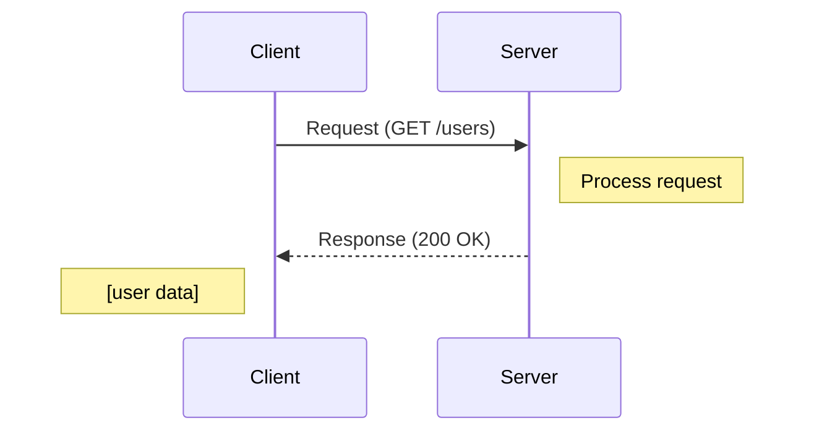

# HTTP and APIs

The language of the web, how clients and servers communicate.

---

## What is HTTP?

HTTP (HyperText Transfer Protocol) is the protocol used for communication on the web. It defines how requests and responses are formatted and transmitted.

Every time you load a web page, call an API, or submit a form, you're using HTTP.

---

## Request-Response Model

HTTP follows a simple pattern:

1. **Client sends a request** with a method, URL, headers, and optionally a body
2. **Server sends a response** with a status code, headers, and optionally a body



Each request-response is independent. The server doesn't remember previous requests (stateless).

---

## HTTP Methods

Methods (also called verbs) indicate what action you want to perform.

| Method | Purpose | Has Body | Idempotent | Safe |
|--------|---------|----------|------------|------|
| GET | Retrieve data | No | Yes | Yes |
| POST | Create a resource | Yes | No | No |
| PUT | Replace a resource | Yes | Yes | No |
| PATCH | Partially update a resource | Yes | Can be | No |
| DELETE | Remove a resource | Rarely | Yes | No |
| HEAD | GET without body (check existence/headers) | No | Yes | Yes |
| OPTIONS | What methods are allowed | No | Yes | Yes |

**Idempotent:** Calling it multiple times has the same effect as calling once.
**Safe:** Doesn't modify data.

### Using Methods Correctly

**GET:** Only for reading. Never use GET to change data. GET requests can be cached, repeated, bookmarked.

**POST:** For creating new resources. Each call may create a new resource.

**PUT:** For replacing a resource entirely. Send the complete new state. Idempotent, putting the same thing twice results in the same state.

**PATCH:** For partial updates. Send only what changed. Can be made idempotent with careful design.

**DELETE:** For removing resources. Idempotent, deleting twice is the same as deleting once.

---

## URLs and Paths

A URL identifies a resource:

```
https://api.example.com:443/users/123?include=orders#section1
  │       │             │  │         │             │
scheme   host          port path     query         fragment
```

### Path Design

Paths represent resources and hierarchies:

```
/users              # Collection of users
/users/123          # Specific user
/users/123/orders   # Orders belonging to that user
/products           # Collection of products
```

### Query Parameters

For filtering, sorting, pagination, and optional parameters:

```
/products?category=books&sort=price&page=2&limit=10
```

---

## HTTP Status Codes

Status codes tell you what happened.

### 2xx Success

| Code | Meaning | When to Use |
|------|---------|-------------|
| 200 | OK | Request succeeded. Most common. |
| 201 | Created | Resource was created. Used after POST. |
| 204 | No Content | Success, but no body to return. Used after DELETE. |

### 3xx Redirection

| Code | Meaning | When to Use |
|------|---------|-------------|
| 301 | Moved Permanently | Resource permanently at new URL. Cached. |
| 302 | Found | Temporary redirect. |
| 304 | Not Modified | Client's cached version is still valid. |

### 4xx Client Error

| Code | Meaning | When to Use |
|------|---------|-------------|
| 400 | Bad Request | Invalid input. |
| 401 | Unauthorized | Not authenticated. |
| 403 | Forbidden | Authenticated but not authorized. |
| 404 | Not Found | Resource doesn't exist. |
| 405 | Method Not Allowed | This method not supported for this resource. |
| 409 | Conflict | Conflicts with current state (e.g., duplicate). |
| 422 | Unprocessable Entity | Valid syntax but semantic errors. |
| 429 | Too Many Requests | Rate limited. |

### 5xx Server Error

| Code | Meaning | When to Use |
|------|---------|-------------|
| 500 | Internal Server Error | Something broke on the server. |
| 502 | Bad Gateway | Upstream server returned invalid response. |
| 503 | Service Unavailable | Server overloaded or down for maintenance. |
| 504 | Gateway Timeout | Upstream server didn't respond in time. |

**Key distinction:**
- 4xx = client's fault (fix the request)
- 5xx = server's fault (server needs fixing)

---

## HTTP Headers

Headers provide metadata about the request or response.

### Common Request Headers

| Header | Purpose | Example |
|--------|---------|---------|
| Authorization | Authentication credentials | `Bearer jwt-token` |
| Content-Type | Format of request body | `application/json` |
| Accept | Preferred response format | `application/json` |
| User-Agent | Client identification | Browser/app info |
| Host | Domain being requested | `api.example.com` |

### Common Response Headers

| Header | Purpose | Example |
|--------|---------|---------|
| Content-Type | Format of response body | `application/json` |
| Cache-Control | Caching instructions | `max-age=3600` |
| Set-Cookie | Set a cookie on client | Session info |
| Location | URL for redirects/created resources | `/users/123` |

### Custom Headers

Use `X-` prefix for custom headers (though this convention is now deprecated, it's still common):

```
X-Request-Id: abc123
X-RateLimit-Remaining: 95
```

---

## Request and Response Bodies

### Request Body

POST, PUT, PATCH typically include a body with data to send:

```json
POST /users
Content-Type: application/json

{
  "name": "Jane Doe",
  "email": "jane@example.com"
}
```

### Response Body

Contains the requested data or result:

```json
HTTP/1.1 200 OK
Content-Type: application/json

{
  "id": "user-123",
  "name": "Jane Doe",
  "email": "jane@example.com",
  "createdAt": "2024-01-15T10:30:00Z"
}
```

### Content Types

| Content-Type | Use |
|--------------|-----|
| `application/json` | Most APIs, structured data |
| `text/html` | Web pages |
| `text/plain` | Simple text |
| `application/x-www-form-urlencoded` | Form submissions |
| `multipart/form-data` | File uploads |

---

## REST Principles

REST (Representational State Transfer) is an architectural style for APIs.

### Core Principles

**Resources:** Everything is a resource identified by URL.

**HTTP Methods:** Use standard methods (GET, POST, PUT, DELETE) for operations.

**Stateless:** Server doesn't store client state between requests.

**Representations:** Resources can have multiple representations (JSON, XML).

### What Makes an API RESTful

- **Nouns, not verbs:** `/users/123`, not `/getUser?id=123`
- **HTTP methods for actions:** GET to read, POST to create, etc.
- **Meaningful status codes:** 201 for created, 404 for not found
- **Stateless requests:** Everything needed is in the request

### REST is Not a Standard

REST is a style, not a specification. There's no official "REST certification." APIs claim to be RESTful with varying degrees of accuracy.

Pragmatically: use the principles that make sense. Don't obsess over RESTfulness.

---

## HTTP Versions

### HTTP/1.1

The workhorse for decades.

**Characteristics:**
- Text-based protocol
- One request at a time per connection (without pipelining)
- Headers repeated on every request
- Connection keep-alive to reuse connections

### HTTP/2

Significant performance improvements.

**Characteristics:**
- Binary protocol (more efficient parsing)
- Multiplexing: multiple requests over one connection
- Header compression (HPACK)
- Server push: server can send resources before client asks
- Still uses TCP

### HTTP/3

Latest version, using QUIC instead of TCP.

**Characteristics:**
- Built on UDP with reliability in QUIC
- Faster connection establishment
- Better handling of packet loss
- Still being adopted

### Which to Use

- HTTP/2 is widely supported and provides significant benefits
- HTTP/3 support is growing
- Your server/CDN/load balancer handles this
- Most developers don't need to worry about the details

---

## Caching

HTTP has built-in caching support.

### Cache-Control Header

```
Cache-Control: public, max-age=3600
```

- **public:** Can be cached by anyone (CDN, browser)
- **private:** Only browser can cache (user-specific data)
- **max-age=N:** Cache for N seconds
- **no-cache:** Always validate with server before using cache
- **no-store:** Don't cache at all

### ETag and Conditional Requests

ETag is a version identifier for a resource:

```
Response:
ETag: "abc123"

Subsequent request:
If-None-Match: "abc123"

If unchanged: 304 Not Modified (no body needed)
If changed: 200 OK with new body and new ETag
```

This saves bandwidth when resources haven't changed.

---

## HTTPS

HTTPS is HTTP over TLS (encrypted).

### What HTTPS Provides

- **Encryption:** Data can't be read in transit
- **Integrity:** Data can't be modified in transit
- **Authentication:** Server proves its identity

### Why HTTPS Everywhere

- Protects user data
- Prevents man-in-the-middle attacks
- Required for many browser features
- SEO benefits
- Users trust it more

With Let's Encrypt, there's no cost barrier. All HTTP should be HTTPS.

---

## Cookies

Cookies are small pieces of data stored by the browser and sent with every request to the same domain.

### How They Work

```
Response:
Set-Cookie: session_id=abc123; HttpOnly; Secure; SameSite=Lax

Subsequent requests:
Cookie: session_id=abc123
```

### Cookie Attributes

| Attribute | Purpose |
|-----------|---------|
| HttpOnly | JavaScript can't access (prevents XSS theft) |
| Secure | Only sent over HTTPS |
| SameSite | Controls cross-site sending (CSRF protection) |
| Expires/Max-Age | When cookie expires |
| Domain/Path | Which requests include the cookie |

### Cookies for Sessions

Traditional session management:
1. User logs in
2. Server creates session, stores session ID in cookie
3. Every request includes cookie
4. Server looks up session by ID

Cookies are automatic, browser sends them without client-side code.

---

## Common API Patterns

### Collection Endpoints

```
GET /users          # List users
POST /users         # Create user
```

### Item Endpoints

```
GET /users/123      # Get user
PUT /users/123      # Replace user
PATCH /users/123    # Update user
DELETE /users/123   # Delete user
```

### Nested Resources

```
GET /users/123/orders       # User's orders
GET /users/123/orders/456   # Specific order
```

### Actions That Don't Fit CRUD

Some operations don't fit neatly into CRUD. Options:

**Sub-resource approach:**
```
POST /orders/123/cancel
POST /users/123/password-reset
```

**RPC-style (when appropriate):**
```
POST /actions/validate-coupon
```

Pragmatism over purity. Use what makes the API understandable.

---

## Common Mistakes

**Using GET for modifications.** GET should be safe (no side effects). Search engines and prefetching follow GET links.

**Returning 200 for errors.** Clients rely on status codes. Return appropriate 4xx/5xx codes.

**Ignoring idempotency.** PUT and DELETE should be idempotent. Clients might retry.

**No versioning.** When you need to make breaking changes, you have no path forward.

**Inconsistent naming.** `userId` in one endpoint, `user_id` in another. Pick a convention.

**Exposing internal details.** Error messages that leak database structure, file paths, or stack traces.

**Chatty APIs.** Requiring 10 requests to load one page. Consider what data is actually needed.

---

## Vibe Engineering Guide

When prompting about HTTP and APIs:

**Less useful:**
> "Create an API for users"

**More useful:**
> "Design a REST API for user management:
> - CRUD operations on users
> - Users can have multiple addresses
> - Admin and regular user roles with different permissions
> - Need pagination for listing users
> - Authentication via JWT
>
> Show me the endpoints, example requests/responses, and how to handle errors."

**For specific problems:**
> "My POST endpoint sometimes creates duplicate resources when clients retry after timeout. The operation is 'create order.' How can I make this idempotent? Should I use idempotency keys?"

---

## Quick Check

<details>
<summary><b>What's the difference between PUT and PATCH?</b></summary>

PUT replaces the entire resource. You send the complete new state. PATCH partially updates, you send only what changed. PUT is idempotent by definition.

</details>

<details>
<summary><b>What's the difference between 401 and 403?</b></summary>

401 Unauthorized: not authenticated (we don't know who you are). 403 Forbidden: authenticated but not authorized (we know who you are, but you can't do this).

</details>

<details>
<summary><b>Why shouldn't GET requests have side effects?</b></summary>

GETs can be cached, repeated, prefetched by browsers, and followed by search engines. If GET modifies data, these automatic actions cause unintended changes.

</details>

<details>
<summary><b>What does idempotent mean?</b></summary>

Calling the operation multiple times has the same effect as calling once. GET, PUT, DELETE are idempotent. POST is typically not. Matters for retries.

</details>

<details>
<summary><b>Why use HTTPS for everything?</b></summary>

Encryption prevents eavesdropping and modification. Authentication proves server identity. Many features require it. With Let's Encrypt, it's free. No downside.

</details>

---

Next: [Databases 101](04-databases-101.md)
