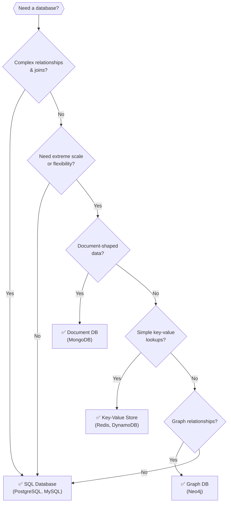

# Databases 101

Where your data lives, understanding the fundamentals of data storage.

---

## What is a Database?

A database is a system for storing, organizing, and retrieving data. More than just files on disk, a database provides:

- **Structured storage:** Data organized in predictable ways
- **Query capability:** Find and manipulate data efficiently
- **Consistency guarantees:** Rules about what data is valid
- **Durability:** Data survives crashes and power failures
- **Concurrent access:** Multiple users/processes can access simultaneously

---

## SQL (Relational) Databases

The classic database model. Data is organized in tables with rows and columns.

### Tables, Rows, Columns

```
Users Table:
┌─────┬───────────┬─────────────────────┬─────────────┐
│ id  │ name      │ email               │ created_at  │
├─────┼───────────┼─────────────────────┼─────────────┤
│ 1   │ Alice     │ alice@example.com   │ 2024-01-01  │
│ 2   │ Bob       │ bob@example.com     │ 2024-01-02  │
│ 3   │ Carol     │ carol@example.com   │ 2024-01-03  │
└─────┴───────────┴─────────────────────┴─────────────┘
```

- **Table:** A collection of related data (Users)
- **Row:** A single record (Alice's data)
- **Column:** A data attribute (name, email)
- **Schema:** The structure definition (what columns exist, their types)

### SQL: The Query Language

SQL (Structured Query Language) is used to interact with relational databases:

```sql
-- Read
SELECT name, email FROM users WHERE id = 1;

-- Create
INSERT INTO users (name, email) VALUES ('Dave', 'dave@example.com');

-- Update
UPDATE users SET email = 'newemail@example.com' WHERE id = 1;

-- Delete
DELETE FROM users WHERE id = 1;
```

SQL is declarative: you say what you want, the database figures out how to get it.

### Relationships

Tables can reference each other, creating relationships:

```
Orders Table:
┌─────┬─────────┬────────┬─────────────┐
│ id  │ user_id │ total  │ created_at  │
├─────┼─────────┼────────┼─────────────┤
│ 101 │ 1       │ 99.99  │ 2024-01-05  │
│ 102 │ 1       │ 49.99  │ 2024-01-10  │
│ 103 │ 2       │ 199.99 │ 2024-01-15  │
└─────┴─────────┴────────┴─────────────┘
```

`user_id` references the Users table. This is a foreign key.

You can query across related tables with JOINs:

```sql
SELECT users.name, orders.total
FROM orders
JOIN users ON orders.user_id = users.id;
```

### Common SQL Databases

| Database | Notes |
|----------|-------|
| PostgreSQL | Full-featured, open source, excellent for most uses |
| MySQL | Popular, open source, good for web applications |
| SQLite | Embedded, file-based, great for small apps or local development |
| Microsoft SQL Server | Enterprise, Windows-focused |
| Oracle | Enterprise, expensive, legacy systems |

**For most projects, PostgreSQL is a solid default choice.**

---

## ACID Properties

Relational databases typically provide ACID guarantees:

### Atomicity

A transaction either fully completes or fully fails. No partial state.

If you're transferring money from account A to B, either both the debit and credit happen, or neither does. You won't lose money in between.

### Consistency

The database moves from one valid state to another. Constraints are enforced.

If you have a rule "email must be unique," the database rejects operations that would violate this.

### Isolation

Concurrent transactions don't interfere with each other. Each transaction sees a consistent view.

Two people updating the same account balance don't create inconsistencies.

### Durability

Once a transaction is committed, it's permanent. Survives crashes, power failures.

When the database says "committed," the data is safe.

---

## NoSQL Databases

NoSQL databases relax some of the constraints of relational databases in exchange for other benefits (usually scalability or flexibility).

### Document Databases

Store data as documents (usually JSON-like):

```json
{
  "_id": "user-123",
  "name": "Alice",
  "email": "alice@example.com",
  "addresses": [
    {"type": "home", "city": "Seattle"},
    {"type": "work", "city": "Portland"}
  ]
}
```

**Advantages:**
- Flexible schema (fields can vary between documents)
- Natural representation of nested data
- Easier to evolve over time

**Disadvantages:**
- Joins are expensive or unsupported
- Transactions may be limited

**Examples:** MongoDB, CouchDB, Amazon DocumentDB

### Key-Value Stores

Simple model: a key maps to a value.

```
"user:123" → "{name: 'Alice', email: 'alice@example.com'}"
"session:abc" → "{user_id: 123, expires: '2024-01-01'}"
```

**Advantages:**
- Very fast (O(1) lookups)
- Simple to scale
- Great for caching

**Disadvantages:**
- No queries beyond "get by key"
- No relationships

**Examples:** Redis, DynamoDB etc.

### Wide-Column Stores

Data stored in columns rather than rows. Good for specific access patterns.

**Advantages:**
- Excellent for time-series and analytics
- Highly scalable

**Disadvantages:**
- Complex data model
- Not for general-purpose use

**Examples:** Cassandra, HBase, ScyllaDB

### Graph Databases

Optimized for data with complex relationships.

**Advantages:**
- Fast traversal of relationships
- Natural for social networks, recommendations

**Disadvantages:**
- Overkill for simple data
- Smaller ecosystem

**Examples:** Neo4j, Amazon Neptune

---

## SQL vs. NoSQL: When to Use Which

This is one of the most common questions, and the answer is nuanced.

### Choose SQL When

- **Data has clear relationships** (users, orders, products)
- **You need complex queries** (joins, aggregations, reporting)
- **Consistency is critical** (financial data, inventory)
- **You're not sure what you need** (SQL is versatile)
- **Team knows SQL** (familiarity matters)

### Choose NoSQL When

- **Data is naturally document-shaped** (blog posts, product catalogs)
- **You need extreme scale** (and can design around limitations)
- **Schema flexibility is important** (rapidly evolving data model)
- **Simple access patterns** (key-value lookups)
- **Specific use case matches** (time-series, graphs)

### The Reality

Most applications are well-served by PostgreSQL. NoSQL isn't "more modern" or "better",it's different. The trade-offs matter.



Many systems use both: PostgreSQL for core data with ACID needs, Redis for caching, Elasticsearch for search.

---

## Indexes

Indexes make queries fast. Without them, the database scans every row.

### How It Works

An index is a data structure (usually B-tree) that maps column values to row locations.

```
Without index: scan all 1,000,000 users to find email
With index: O(log n) lookup, ~20 comparisons
```

### When to Index

- Columns in WHERE clauses
- Columns used for JOINs
- Columns used for ORDER BY
- Foreign keys

### The Trade-off

Indexes speed up reads but slow down writes. Every INSERT/UPDATE must update indexes.

For read-heavy workloads (most applications), indexes are worth it.

---

## Transactions

A transaction is a unit of work that either fully completes or fully fails.

```sql
BEGIN TRANSACTION;

UPDATE accounts SET balance = balance - 100 WHERE id = 1;
UPDATE accounts SET balance = balance + 100 WHERE id = 2;

COMMIT;
```

If anything fails, the entire transaction rolls back. No partial state.

### When to Use Transactions

- Multiple related operations that must all succeed
- Operations that must not leave inconsistent state
- Anywhere atomicity matters

### Transaction Isolation Levels

How much transactions can see each other's work:

| Level | Dirty Read | Non-repeatable Read | Phantom Read |
|-------|------------|---------------------|--------------|
| Read Uncommitted | Possible | Possible | Possible |
| Read Committed | No | Possible | Possible |
| Repeatable Read | No | No | Possible |
| Serializable | No | No | No |

Higher isolation = more correctness but lower concurrency. Most apps use Read Committed (default in PostgreSQL).

---

## Primary Keys and Foreign Keys

### Primary Key

Uniquely identifies each row. Usually:
- Auto-incrementing integer (`id`)
- UUID

```sql
CREATE TABLE users (
  id SERIAL PRIMARY KEY,
  email VARCHAR(255) UNIQUE NOT NULL
);
```

### Foreign Key

References another table's primary key. Creates a relationship.

```sql
CREATE TABLE orders (
  id SERIAL PRIMARY KEY,
  user_id INTEGER REFERENCES users(id),
  total DECIMAL(10,2)
);
```

Foreign keys enforce referential integrity: you can't create an order for a non-existent user.

---

## Data Modeling Basics

### Normalization

Organizing data to reduce redundancy.

**Before normalization:**
```
Orders: id, product_name, product_price, customer_name, customer_email
```

Product information is duplicated in every order.

**After normalization:**
```
Products: id, name, price
Customers: id, name, email
Orders: id, product_id, customer_id, quantity
```

Now product changes only need to happen in one place.

### Denormalization

Sometimes you intentionally duplicate data for performance.

**When:** Read-heavy, complex joins are too slow, eventual consistency is acceptable.

**Trade-off:** Faster reads, but updates must change multiple places.

---

## Common Mistakes

**No indexes on frequently queried columns.** Queries become progressively slower as data grows.

**Indexing everything.** Too many indexes slow writes and waste space.

**N+1 queries.** Fetching a list, then fetching related data one at a time. Use JOINs or batch queries.

**Not using transactions where needed.** Related operations can leave inconsistent state.

**Storing the wrong things in the database.** Large files should go in object storage, not blobs in the database.

**Ignoring connection limits.** Databases have maximum connections. Use connection pooling.

**No backups.** Or backups that have never been tested. Test restores.

---

## What An Experienced Senior Engineer Thinks About

**Schema migrations.** How do you change the database structure without downtime? Rolling migrations, backward-compatible changes, expand-contract pattern.

**Connection pooling.** Applications should use connection pools. Opening a new connection for every query is expensive.

**Query analysis.** Use EXPLAIN to understand how queries execute. Know why queries are slow before optimizing.

**Separation of concerns.** Operational database for user-facing traffic. Replica or data warehouse for analytics. Don't let reporting queries impact production.

**Backup and recovery.** Regular backups. Tested restores. Point-in-time recovery. Know your RPO (how much data can you lose) and RTO (how long until you're back).

---

## Vibe Engineering Guide

When prompting about databases:

**Less useful:**
> "Design a database for my app"

**More useful:**
> "Design a PostgreSQL schema for an e-commerce application:
> - Users with email and password
> - Products with name, price, and inventory count
> - Orders with items (multiple products per order)
> - Need to query: user's orders, orders by date, products by category
>
> Show me the tables, relationships, and what indexes I should add."

**For specific problems:**
> "My query 'SELECT * FROM orders WHERE user_id = X ORDER BY created_at DESC LIMIT 10' is slow on a table with 5 million rows. I have an index on user_id. Why might it still be slow, and what should I check?"

---

## Quick Check

<details>
<summary><b>What are the ACID properties?</b></summary>

Atomicity: transactions fully complete or fully fail. Consistency: database stays valid. Isolation: concurrent transactions don't interfere. Durability: committed data survives crashes.

</details>

<details>
<summary><b>When would you use a document database like MongoDB?</b></summary>

When data is naturally document-shaped, schema flexibility is needed, access patterns are simple (get document by ID), or you're building features where data varies significantly between records.

</details>

<details>
<summary><b>What is an index and why does it matter?</b></summary>

An index is a data structure that speeds up queries by providing fast lookup by column values. Without indexes, the database scans every row. With them, lookups are O(log n).

</details>

<details>
<summary><b>What's a foreign key?</b></summary>

A column that references another table's primary key. Creates a relationship and can enforce referential integrity (can't reference a row that doesn't exist).

</details>

<details>
<summary><b>Why use transactions?</b></summary>

To ensure multiple operations happen together or not at all. Prevents inconsistent state when related changes must succeed or fail as a unit.

</details>

---

Next: [What Happens When You Type a URL](05-what-happens-when-you-type-url.md)
