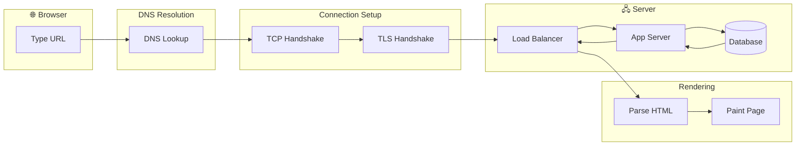

# What Happens When You Type a URL

The complete journey from keystroke to rendered page, understanding every step helps you design and debug systems.

---

## The Complete Journey

When you type "https://www.example.com" and press Enter, here's what happens:



1. Browser parses the URL
2. DNS lookup finds the IP address
3. TCP connection is established
4. TLS handshake encrypts the connection
5. HTTP request is sent
6. Request travels through the internet
7. Server processes the request
8. Response travels back
9. Browser parses and renders the page
10. Additional resources are fetched

Let's walk through each step.

---

## Step 1: Browser Parses the URL

URL: `https://www.example.com/page?id=123`

Browser extracts:
- **Scheme:** `https` (determines protocol)
- **Host:** `www.example.com` (where to connect)
- **Port:** `443` (default for HTTPS, implicit)
- **Path:** `/page` (what resource)
- **Query:** `?id=123` (parameters)

Browser also checks:
- Is this in the cache?
- Is this a search query or a URL?
- Are there any typed history matches?

---

## Step 2: DNS Lookup

Browser needs the IP address for `www.example.com`.

### Cache Checks

1. **Browser cache:** Recently resolved? Use cached IP.
2. **OS cache:** Operating system has its own DNS cache.
3. **Router cache:** Home router often caches DNS.

### DNS Resolution (if not cached)

1. Query goes to configured DNS resolver (ISP or 8.8.8.8, 1.1.1.1)
2. Resolver asks root nameservers: "Where is .com?"
3. Root says: "Ask .com TLD servers"
4. Resolver asks .com servers: "Where is example.com?"
5. .com says: "Ask ns1.example.com"
6. Resolver asks example.com's nameserver: "What's www.example.com?"
7. Authoritative server returns: "93.184.216.34"
8. Resolver caches and returns to browser

**Time:** Cached: 0ms. Uncached: 20-100ms.

---

## Step 3: TCP Connection

Browser opens a TCP connection to 93.184.216.34:443.

### Three-Way Handshake

```
Client → SYN → Server         "I want to connect"
Client ← SYN-ACK ← Server     "OK, I acknowledge"
Client → ACK → Server         "Connection established"
```

This takes one round-trip time (RTT). For a server 100ms away, this adds 100ms.

### Connection Reuse

HTTP/1.1 keep-alive and HTTP/2 allow multiple requests over one connection. Subsequent requests skip this step.

---

## Step 4: TLS Handshake

For HTTPS, encryption must be negotiated.

### TLS 1.2 Handshake

```
Client → ClientHello → Server     "I support these ciphers, this TLS version"
Client ← ServerHello ← Server     "Let's use this cipher, here's my certificate"
Client → Key Exchange → Server    "Here's key material"
Both: Derive shared secret
Client → Finished → Server        "I'm ready"
Client ← Finished ← Server        "I'm ready too"
```

This takes 2 round trips on top of TCP. TLS 1.3 reduces this to 1 round trip.

**Time:** TLS 1.2: 2 × RTT. TLS 1.3: 1 × RTT.

### Certificate Verification

Browser verifies:
- Certificate is signed by trusted CA
- Certificate is for this domain
- Certificate is not expired
- Certificate is not revoked (OCSP check)

---

## Step 5: HTTP Request

Connection is established. Browser sends the HTTP request.

```
GET /page?id=123 HTTP/2
Host: www.example.com
User-Agent: Chrome/120
Accept: text/html
Accept-Language: en-US
Accept-Encoding: gzip, br
Cookie: session_id=abc123
```

The request includes:
- Method and path
- Headers with metadata
- Cookies for this domain

---

## Step 6: Request Travels Through Internet

The request travels through multiple networks:

```
Your computer → Home router → ISP → Internet backbone → 
    → Server's ISP → Data center network → Load balancer → Server
```

Each hop adds small latency (routing, processing). Total might be 10-15 hops.

---

## Step 7: Server Processes Request

Request reaches the server infrastructure:

### Load Balancer
- Receives request
- Selects a backend server
- Forwards request

### Application Server
- Parses HTTP request
- Authentication/authorization checks
- Executes application logic
- Queries database
- Renders response

### Database
- Receives query
- Executes (index lookup, join, etc.)
- Returns results

**Time:** Simple page: 10-50ms. Complex with database queries: 100-500ms.

---

## Step 8: Response Travels Back

Server sends HTTP response:

```
HTTP/2 200 OK
Content-Type: text/html; charset=utf-8
Content-Encoding: gzip
Cache-Control: max-age=3600
Set-Cookie: tracking=xyz

<!DOCTYPE html>
<html>
...
</html>
```

Response travels back through the same network path.

---

## Step 9: Browser Parses and Renders

### HTML Parsing

Browser constructs the DOM (Document Object Model) from HTML.

When it encounters:
- **CSS `<link>`:** Fetch and parse stylesheet, construct CSSOM
- **JavaScript `<script>`:** May block parsing, fetch and execute
- **Images, videos:** Download (doesn't block initially)

### Render Pipeline

1. **DOM + CSSOM = Render Tree:** What to display and how
2. **Layout:** Calculate positions and sizes
3. **Paint:** Draw pixels for each layer
4. **Composite:** Combine layers into final image

**First paint:** When something first appears. 
**Largest contentful paint (LCP):** When main content is visible.

---

## Step 10: Additional Resources

The initial HTML references other resources:

```html
<link rel="stylesheet" href="/styles.css">
<script src="/app.js"></script>

```

Each resource may require:
- DNS lookup (if different domain)
- TCP connection (if not reused)
- TLS handshake (if new connection)
- HTTP request/response

**HTTP/2 helps here:** Multiplexes many requests over one connection.

**CDN helps:** Resources served from nearby edge server.

---

## Latency Breakdown

For a page load of 500ms total:

| Step | Time |
|------|------|
| DNS lookup | 20ms (cached: 0ms) |
| TCP handshake | 50ms |
| TLS handshake (TLS 1.3) | 50ms |
| Time to first byte (server) | 150ms |
| Content download | 100ms |
| Parsing/rendering | 130ms |

The fixed costs (DNS, TCP, TLS) are why:
- Connection reuse matters
- CDNs matter (reduce RTT)
- HTTP/2 matters (one connection, many requests)

---

## Where Things Can Go Wrong

### DNS Failure
Symptom: "Server not found"
Cause: DNS server unreachable, domain misconfigured

### Connection Refused
Symptom: Connection error
Cause: Server not running, wrong port, firewall blocking

### TLS Errors
Symptom: "Your connection is not private"
Cause: Expired certificate, wrong domain, untrusted CA

### Timeout
Symptom: Page never loads
Cause: Server overloaded, network issue, server bug

### Slow Loading
Symptom: Long wait, eventually loads
Cause: Slow server, large resources, too many requests

---

## Optimization Opportunities

### Reduce Latency

- **CDN:** Serve from edge (reduce RTT)
- **HTTP/2:** Multiplexing, header compression
- **Connection preconnect:** `<link rel="preconnect">`
- **DNS prefetch:** `<link rel="dns-prefetch">`

### Reduce Bytes

- **Compression:** gzip, Brotli
- **Image optimization:** WebP format, proper sizing
- **Minification:** CSS, JavaScript

### Reduce Requests

- **Bundling:** Combine CSS/JS files
- **Inlining:** Critical CSS in HTML
- **Caching:** Return 304 Not Modified

### Improve Server Speed

- **Caching:** Database result caching
- **Query optimization:** Indexes
- **Async processing:** Move work off the request path

---

## What This Means for System Design

### Every Step is a Potential Failure

Design for:
- DNS resolution failure
- Connection failures
- Server errors
- Slow responses

### Latency Adds Up

If your server takes 200ms, and there's 100ms network RTT, and TLS adds 100ms, you're at 400ms before any rendering.

### Caching at Every Layer

- Browser cache
- CDN cache
- Application cache
- Database cache

Each layer reduces load on the next.

### Observability Matters

Track:
- DNS resolution time
- TCP connection time
- TLS handshake time
- Server response time
- Content download time

When debugging, you need to know where time is spent.

---

## Vibe Engineering Guide

When prompting about page load performance:

**Less useful:**
> "My page is slow"

**More useful:**
> "My page load takes 3 seconds. Breaking down: TTFB is 800ms, content download is 200ms, parsing/rendering is 2 seconds. The page has 50 JavaScript files and 100 images. What should I focus on first?"

**For specific issues:**
> "Users report 'Your connection is not private' errors intermittently. Our TLS certificate is valid and not expired. What could cause intermittent certificate errors?"

---

## Quick Check

<details>
<summary><b>Why does DNS usually take 0ms for common sites?</b></summary>

Caching. Browser, OS, and router all cache DNS lookups. Popular sites are almost always cached. The full DNS resolution path only runs for the first lookup.

</details>

<details>
<summary><b>How many round trips before data transfer starts?</b></summary>

At minimum: 1 for TCP, 1 for TLS 1.3 = 2 round trips. With TLS 1.2: 1 for TCP, 2 for TLS = 3 round trips. This is why servers far away have high latency.

</details>

<details>
<summary><b>Why is HTTP/2 faster than HTTP/1.1?</b></summary>

HTTP/2 multiplexes many requests over one connection (no head-of-line blocking), compresses headers, and allows server push. HTTP/1.1 needs multiple connections for parallel downloads.

</details>

<details>
<summary><b>How does a CDN improve page load?</b></summary>

CDN serves content from a nearby edge server. This reduces the round-trip time for TCP, TLS, and data transfer. Instead of 100ms RTT to origin, it might be 10ms to edge.

</details>

<details>
<summary><b>What's the "render blocking" problem?</b></summary>

CSS and JavaScript in the <head> can block rendering. Browser must download and process them before rendering page. Solutions: async loading, defer, critical CSS inlining.

</details>

---

Next: [Level 2: Core Concepts](../02-core-concepts/README.md)
