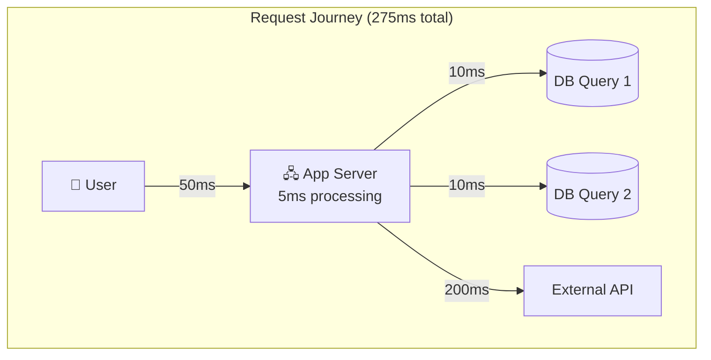

# Latency and Throughput

Two fundamental metrics that determine how your system feels to users and how much work it can handle.

---

## What is Latency?

Latency is the time it takes for a single operation to complete. The clock starts when a request is sent and stops when the response is received.

When a user clicks a button and waits 2 seconds for the page to load, that's 2 seconds of latency.

### Why Latency Matters

Users notice latency. Studies show:
- Under 100ms feels instant
- 100-300ms feels responsive
- 300ms-1s feels sluggish
- Over 1s and users start losing focus
- Over 10s and users abandon

Every 100ms of added latency can measurably reduce conversions for e-commerce sites. Latency directly affects user experience and business outcomes.

### What Contributes to Latency

When a user makes a request, latency accumulates from multiple sources:

**Network latency:** Time for data to travel. Speed of light limits this.
- Same data center: 0.5-2ms
- Same region: 1-5ms  
- Cross-country: 30-70ms
- Cross-continent: 100-300ms

**Processing time:** Time your code spends computing.
- Simple API handler: 1-10ms
- Complex business logic: 10-100ms
- Heavy computation: 100ms+

**Database queries:** Time waiting for data.
- Simple indexed lookup: 1-5ms
- Complex query with joins: 10-100ms
- Query without proper index: 100ms-10s+

**External service calls:** Time waiting for other services.
- Well-designed internal service: 5-50ms
- External API (Stripe, Twilio): 100-500ms
- Slow third-party dependency: 500ms-seconds

These add up. If your request involves:
- 2 database queries (10ms each): 20ms
- 1 external API call (200ms): 200ms
- Your processing (5ms): 5ms
- Network to user (50ms): 50ms
- **Total: 275ms**

### Percentiles, Not Averages

Averages hide problems. If 99 requests take 50ms and 1 request takes 10 seconds, your average is about 150ms. But that 1-in-100 users had a terrible experience.

**Percentiles tell the real story:**

| Percentile | Meaning |
|------------|---------|
| p50 (median) | Half of requests are faster than this |
| p95 | 95% of requests are faster |
| p99 | 99% of requests are faster |
| p99.9 | 999 out of 1000 are faster |

**Which percentile matters?**

For user-facing requests, p99 is often what matters. If you have 10,000 requests per day and p99 is 2 seconds, 100 users per day have a bad experience. That adds up.

For high-traffic systems, even p99.9 matters. At 1 million requests per day, p99.9 is still 1,000 slow requests.

### Tail Latency Amplification

Here's something that surprises many engineers.

If your service calls 5 backend services in parallel, the overall latency is the slowest of the 5. If each service has 1% of requests taking 1 second (p99 = 1s), what's the probability that at least one is slow?

Roughly 5%. The more services you call, the worse it gets.

This is why tail latency matters so much in microservices architectures. You can have every individual service performing well, but the combined system is slow frequently.

### What Affects Latency in Practice

**Things that cause high latency:**
- Missing database indexes (most common cause I've seen)
- N+1 queries (fetch list, then fetch details for each item separately)
- Synchronous calls to slow external services
- Cold starts (first request after deployment or scaling)
- Garbage collection pauses
- Network congestion
- Undersized resources (not enough CPU, memory, connections)

**Things that reduce latency:**
- Caching (serve from memory instead of computing/fetching)
- Connection pooling (reuse connections instead of creating new ones)
- Parallel requests (call services simultaneously, not sequentially)
- CDNs (serve static content from edge locations)
- Proper indexing (fast database lookups)
- Async processing (don't wait for things that don't need immediate response)

---

## What is Throughput?

Throughput is how many operations a system can handle per unit of time. Usually measured as requests per second (RPS) or transactions per second (TPS).

A server handling 1,000 requests per second has a throughput of 1,000 RPS.

### Why Throughput Matters

Throughput determines capacity. If your system handles 1,000 RPS and you get 2,000 RPS of traffic, requests will queue up, timeouts will happen, and users will see errors.

### Throughput Numbers to Know

| System | Typical Throughput |
|--------|-------------------|
| Single Node.js server | 1,000-10,000 RPS |
| Single Go server | 10,000-100,000 RPS |
| PostgreSQL (simple queries) | 10,000-50,000 QPS |
| Redis | 100,000+ operations/sec |
| Kafka (single broker) | 100,000-500,000 messages/sec |

These vary enormously based on what the request does. A "hello world" endpoint is very different from one that does complex computation and multiple database queries.

### What Limits Throughput

**CPU-bound workloads:** The server spends most of its time computing. Adding cores helps (up to a point).

**I/O-bound workloads:** The server spends most of its time waiting for database, network, or disk. Adding cores doesn't help much, you need to reduce waiting or do more things in parallel.

**Connection limits:** Databases have maximum connection limits. If each request holds a connection and you run out, new requests wait.

**Memory:** If you run out of memory, things slow down dramatically or crash.

**Bottlenecks:** Throughput is limited by the slowest component. If your database can handle 10,000 queries/sec but your app makes 3 queries per request, your app is limited to ~3,300 RPS regardless of how fast the app server is.

---

## The Relationship Between Latency and Throughput

Latency and throughput are connected but not the same thing.

**You can have:**
- Low latency, low throughput (fast but can't handle many requests)
- High latency, high throughput (slow but handles many concurrent requests)
- Low latency, high throughput (ideal, but harder to achieve)

### How Load Affects Latency

As a system approaches its throughput limit, latency increases.

At 50% capacity: latency is normal.
At 80% capacity: latency starts increasing.
At 90%+ capacity: latency increases dramatically.
At 100%+ capacity: requests queue, latency spikes, timeouts happen.

This is why you don't run systems at 100% capacity. A server that's fine at 1,000 RPS might have 10x latency at 1,200 RPS.

**Rule of thumb:** Keep servers under 70-80% capacity to maintain reasonable latency.

### Trade-offs

**Batching:** Process multiple items at once instead of one at a time. Increases throughput (fewer round trips, more efficient) but increases latency for individual items (they wait for the batch).

**Caching:** Reduces latency for cache hits. Doesn't directly increase throughput, but reduces load on backends, so they can handle more total traffic.

**Async processing:** Can improve both. Return quickly to user (low latency for the response), process work in background (keeps throughput up because you're not blocking).

---

## Measuring Latency and Throughput

You can't improve what you don't measure.

### What to Measure

**For latency:**
- p50, p95, p99 response times
- Broken down by endpoint (some endpoints are naturally slower)
- Broken down by dependency (database time, external API time)

**For throughput:**
- Requests per second
- Error rate at various load levels
- Point at which latency starts to spike

### Tools

**Application Performance Monitoring (APM):**
- Datadog, New Relic, Honeycomb
- Show latency breakdowns, identify slow dependencies

**Logging with timing:**
- Log how long each operation takes
- Aggregate to find patterns

**Load testing:**
- Send synthetic traffic to find limits
- Tools: k6, Apache JMeter, Locust

### What Good Looks Like

There's no universal answer. But some guidelines:

**User-facing API endpoints:**
- p50 under 100ms
- p99 under 500ms

**Internal service-to-service calls:**
- p50 under 50ms
- p99 under 200ms

**Background jobs:**
- Latency usually matters less than throughput
- Track queue depth and processing rate

---

## Common Mistakes

**Only measuring averages.** Average response time is 100ms, everything seems fine. But p99 is 5 seconds, 1 in 100 users has a terrible experience. You'd never know from the average.

**Ignoring latency under load.** System is fast when you test it with one request. But under realistic traffic, it's slow because of contention, connection limits, or resource exhaustion.

**Optimizing the wrong thing.** Spending weeks optimizing code that takes 5ms when database queries take 500ms. Measure first to find the actual bottleneck.

**Testing only the happy path.** Normal requests are fast. But error handling code, or code that handles edge cases, might be slow. Test realistic scenarios including failures.

**Confusing latency and throughput problems.** "Our system is slow" could mean latency is high, or it could mean throughput is maxed and requests are queuing. Different problems, different solutions.

---

## What An Experienced Senior Engineer Thinks About

**Latency budgets:** For a request that must complete in 500ms, how is that budget allocated? 200ms for database, 100ms for external service, 100ms for network, 100ms for everything else. If any component exceeds its budget, you violate the overall target.

**Latency vs. correctness trade-offs:** Sometimes you can return faster by returning slightly stale data. Is that acceptable? Under what conditions?

**Capacity planning:** If latency spikes at 80% utilization, you need to scale before you hit 80%. How do you predict when you'll get there?

**Graceful degradation:** When approaching capacity limits, what can you shed? Can you serve cached responses? Skip non-essential features? Rate limit aggressive users?

**Cost of measurement:** Detailed latency measurements add overhead. How much instrumentation is too much? What's the right sampling rate?

---

## Vibe Engineering Guide

When prompting about performance:

**Less useful:**
> "My API is slow"

**More useful:**
> "My API endpoints have p50 of 50ms but p99 of 3 seconds. Most time seems to be spent in database queries. I'm using PostgreSQL with a users table of 1 million rows. What should I look at?"

**With specific breakdown:**
> "Request total latency: 500ms. Breakdown: database queries 350ms (3 queries), Redis cache miss, external payment API 100ms, network 30ms, code 20ms. The database queries are to find user orders with joins. What would you optimize first?"

**For throughput:**
> "My Go service handles 5,000 RPS. At 7,000 RPS latency spikes to 2 seconds. Database connections show at 95% of pool limit. Is the database the bottleneck? What are my options?"

The more you can tell about WHERE time is spent, the more useful the response.

---

## Quick Check

<b>Why use percentiles instead of averages for latency?</b>

Averages hide outliers. If 99% of requests take 50ms and 1% take 10 seconds, the average (~150ms) doesn't reflect either experience. p99 shows what slow requests actually look like.

<b>What is tail latency amplification?</b>

When a request depends on multiple services, the overall latency is limited by the slowest one. If each service has 1% slow requests, and you call 10 services, roughly 10% of your requests will be slow. The more services you depend on, the worse this gets.

<b>What happens to latency as throughput approaches capacity?</b>

Latency increases, often dramatically. As the system gets busier, requests queue up waiting for resources. This is why you don't run at 100% capacity, you need headroom to maintain reasonable latency.

<b>What's the most common cause of high latency?</b>

In my experience: missing database indexes. A query that should take 1ms takes 500ms because it's scanning the entire table. Always check indexes first.

<b>How do you find the bottleneck?</b>

Measure. Break down where time is spent: network, database, external services, your code. The component consuming the most time is where to focus. Don't guess, you'll often be wrong.

---

Next: [Availability and Reliability](02-availability-and-reliability.md)
