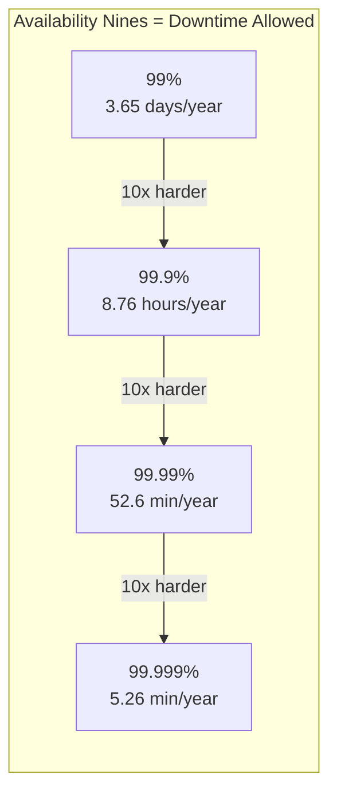

# Availability and Reliability

How often is your system up? How often does it do the right thing?

---

## What is Availability?

Availability is the percentage of time a system is operational and able to serve requests.

A system that's up 99% of the time has 99% availability. Sounds good until you realize that's over 3.5 days of downtime per year.

### The "Nines"

Availability is often expressed in "nines":

| Availability | Downtime per Year | Downtime per Month | Common Name |
|--------------|-------------------|-------------------|-------------|
| 99% | 3.65 days | 7.3 hours | "Two nines" |
| 99.9% | 8.76 hours | 43.8 minutes | "Three nines" |
| 99.95% | 4.38 hours | 21.9 minutes | |
| 99.99% | 52.6 minutes | 4.4 minutes | "Four nines" |
| 99.999% | 5.26 minutes | 26.3 seconds | "Five nines" |



Each additional nine is exponentially harder to achieve. Going from 99% to 99.9% is easier than going from 99.9% to 99.99%.

### What "Down" Means

You need to define what counts as downtime:

- **Complete outage:** Nothing works at all. Clearly down.
- **Partial outage:** Some features work, others don't. Is this "down"?
- **Degraded performance:** System works but is very slow. Does 30-second response time count as "up"?

Most formal SLAs define specific criteria: "Available means responding to requests within 5 seconds with non-error status codes for at least 95% of requests."

### Calculating Availability

Simple formula:
```
Availability = Uptime / (Uptime + Downtime)
```

If your system was up for 719 hours last month and down for 1 hour:
```
719 / 720 = 99.86%
```

Real-world tracking is more nuanced. You might use:
- Synthetic monitoring (send test requests, track success rate)
- Real user monitoring (track actual user success rates)
- Error rate thresholds (X% error rate = "down")

---

## How Components Affect Availability

Your system's availability depends on all its components.

### Serial Dependencies (You Need Everything)

If component A must work for B to work, and B must work for C to work, overall availability multiplies:

```
Overall = A × B × C
```

Example: App server (99.9%) → Database (99.9%) → Payment service (99.9%)
```
0.999 × 0.999 × 0.999 = 0.997 (99.7%)
```

Three components at 99.9% each give you 99.7% overall, three times the downtime you'd expect from any single component.

**This is why adding dependencies is expensive.** Every external service, every database, every component you depend on reduces your theoretical maximum availability.

### Parallel Redundancy (Either One Works)

If you have two redundant components and either can handle the request, availability improves:

```
Overall = 1 - (1 - A) × (1 - B)
```

Example: Two servers each at 99%:
```
1 - (0.01 × 0.01) = 0.9999 (99.99%)
```

Two components at 99% each give you 99.99%, you go from 3.5 days downtime per year to about 50 minutes.

**This is why redundancy matters.** It's the main mechanism for achieving high availability.

### The Real Math

Most systems have both serial and parallel components:

```
App servers (2 redundant at 99%) → Database (primary + standby at 99.9%) → External API (99.5%)

App tier: 1 - (0.01 × 0.01) = 99.99%
DB tier: ~99.99% (with automatic failover)
External: 99.5%

Overall: 0.9999 × 0.9999 × 0.995 = ~99.49%
```

That external API at 99.5% is now your limiting factor. You can't be more available than your least available dependency.

---

## What is Reliability?

Reliability is the probability that a system performs correctly over a given time period.

Availability and reliability are related but different:
- A system can be **available but unreliable** (up but returning wrong answers)
- A system can be **reliable when running but unavailable** (crashes often, but works correctly when running)

For users, both matter. An e-commerce site that's up but charges the wrong prices, or one that crashes during checkout, both fail to provide value.

### Measuring Reliability

**Error rate:** What percentage of requests fail or return incorrect results?

**Mean Time Between Failures (MTBF):** Average time the system operates before a failure.

**Mean Time To Recovery (MTTR):** Average time to restore service after a failure.

The relationship:
```
Availability = MTBF / (MTBF + MTTR)
```

You can improve availability by:
- Reducing failures (increase MTBF)
- Recovering faster (reduce MTTR)

Often, reducing MTTR is more practical than eliminating failures entirely.

---

## What Causes Outages?

Understanding causes helps you prevent them.

### Hardware Failures

- Disk failures (SSDs fail too, just less often than HDDs)
- Memory failures
- Network equipment failures
- Power failures

Cloud providers handle most of this, but individual instance failures are normal. AWS instances fail. You should expect it.

### Software Bugs

- Code bugs that crash the application
- Memory leaks that accumulate over time
- Race conditions that manifest under specific timing
- Resource leaks (connections, file handles)

Software bugs are often the hardest to prevent entirely. Defense is designing systems that can tolerate individual component failures.

### Human Error

Studies consistently find that human error causes 50-80% of outages:
- Configuration mistakes
- Bad deployments
- Accidental deletions
- Procedural errors during maintenance

This is why automation, guardrails, and reversible changes matter so much.

### Dependency Failures

- Third-party services going down
- DNS issues
- Certificate expirations
- Network partitions between services

You can't control your dependencies, but you can control how you handle their failures.

### Overload

- Traffic spikes that exceed capacity
- Cascading failures where one component's failure overloads others
- Resource exhaustion (connections, memory, disk)

This is particularly dangerous because it can be self-reinforcing. Overloaded systems fail, retries add more load, more things fail.

---

## Strategies for Availability

### Redundancy

Don't have single points of failure. For critical components:
- Multiple app servers behind a load balancer
- Database with replica that can be promoted
- Multiple availability zones or data centers
- Redundant network paths

**The cost:** More infrastructure to run, more complexity to manage, potential consistency challenges.

### Health Checks and Automatic Failover

Detect failures quickly and route around them:
- Load balancers check if servers are healthy
- Database clusters automatically promote replicas
- Orchestrators (Kubernetes) restart failed containers

**The key:** Detection must be reliable. False positives (marking healthy servers as unhealthy) cause unnecessary churn. False negatives (not detecting actual failures) defeat the purpose.

### Graceful Degradation

When parts fail, reduce functionality rather than failing completely:
- Search is slow → show cached results
- Recommendations service is down → hide recommendations, show everything else
- Real-time features fail → fall back to polling

**Design this upfront.** It's hard to add graceful degradation after the fact. Think about what's essential vs. nice-to-have.

### Timeouts and Circuit Breakers

Prevent cascading failures:
- Timeouts: Don't wait forever for a slow/dead dependency
- Circuit breakers: After multiple failures, stop trying and fail fast

Without these, one slow service can make your entire system slow (threads blocked waiting), or one down service can drag everything else down.

### Rate Limiting and Load Shedding

Protect against overload:
- Rate limiting: Reject requests above a threshold
- Load shedding: When overloaded, reject some requests so you can serve others successfully

It's better to reject 10% of requests cleanly than to fail 100% of requests because the system collapsed.

### Geographic Distribution

For highest availability:
- Multiple regions
- Data replicated across regions
- Traffic routed to nearest healthy region

**The cost:** Significant complexity. Cross-region data consistency is hard. More expensive to run.

---

## SLAs, SLOs, and SLIs

These terms get confused. Here's the distinction:

### SLI (Service Level Indicator)

A metric you measure.

Examples:
- Request latency (p99)
- Error rate
- Uptime percentage
- Throughput

SLIs are just numbers, what you observe about your system.

### SLO (Service Level Objective)

An internal target for an SLI.

Examples:
- "p99 latency will be under 200ms"
- "Error rate will be below 0.1%"
- "Availability will be 99.9%"

SLOs are goals your team sets. Violating them should trigger action but doesn't have immediate external consequences.

### SLA (Service Level Agreement)

A contract with customers that includes consequences for not meeting the target.

Examples:
- "We guarantee 99.9% uptime. If we miss this, affected customers receive a 10% credit."

SLAs should be less strict than SLOs, you want to know internally when you're in trouble before you're breaching contracts.

### Error Budgets

An error budget is the inverse of your SLO.

If your SLO is 99.9% availability, your error budget is 0.1%, about 43 minutes of downtime per month.

Teams can "spend" their error budget on:
- Risky deployments
- Experiments
- Maintenance that causes brief outages

When the error budget is exhausted, focus shifts to reliability.

This gives a concrete way to balance feature development (risky, spends error budget) with reliability work (less risky, preserves error budget).

---

## Designing for Availability

### What Availability Do You Actually Need?

Before engineering for five nines, ask what you actually need:

| System Type | Typical Requirement | Why |
|-------------|--------------------| ----|
| Internal tools | 99-99.5% | Users can wait a few minutes, low cost of downtime |
| Consumer web app | 99.5-99.9% | Users frustrated but not harmed |
| E-commerce checkout | 99.9-99.95% | Direct revenue impact |
| Payment processing | 99.99%+ | Financial and reputational damage |
| Healthcare/safety systems | 99.99%+ | Physical harm possible |

Higher availability costs more, in infrastructure, operational complexity, and engineering time. Don't over-engineer.

### The Diminishing Returns

Going from 99% to 99.9% might require:
- Adding redundancy to a few critical components
- Basic health checks and failover

Going from 99.9% to 99.99% might require:
- Eliminating all single points of failure
- Automated testing and deployment pipelines
- 24/7 on-call with quick response times
- Geographic redundancy

Going from 99.99% to 99.999% might require:
- Multi-region active-active deployment
- Sophisticated chaos engineering
- Extremely rigorous change management
- Significant investment in tooling and automation

Each step requires roughly an order of magnitude more effort.

---

## Common Mistakes

**No redundancy for critical components.** A single database server, a single app server, a single anything that takes down the whole system when it fails.

**Assuming cloud means automatic HA.** Cloud instances fail. An RDS instance without Multi-AZ will have downtime during failures and maintenance.

**Not testing failover.** You have a failover mechanism but never tested it. When you need it, it doesn't work because of some configuration issue.

**Ignoring dependencies.** Your system is 99.99% reliable, but you depend on an external API that's 99% reliable. You're now 99% reliable at best.

**Too many dependencies.** Every dependency is a potential failure point. The rule of multiplication means five 99.9% dependencies give you ~99.5% theoretical maximum.

**Circular dependencies.** A depends on B depends on C depends on A. If any one fails, all fail.

**No graceful degradation.** Non-critical feature fails and takes down the whole page instead of just that feature.

**Not practicing incidents.** The first time shouldn't be when it's real. Gamedays and chaos engineering find problems before users do.

---

## What An Experienced Senior Engineer Thinks About

**Dependent vs. independent failures.** If your primary and backup are on the same physical hardware, or in the same power zone, they can fail together. True redundancy requires independent failure domains.

**Partial failures are harder.** Total failures are obvious. Partial failures (10% of requests failing, intermittent issues) are harder to detect and diagnose.

**Time to detection + time to decision + time to remediation = MTTR.** Most of MTTR is often human time, noticing the problem, understanding it, deciding what to do. Monitoring and runbooks reduce this.

**Availability during deployments.** If deploys cause unavailability, and you deploy daily, your uptime ceiling is limited by deploy frequency.

**Blast radius.** When something fails, how much is affected? One user? One shard? One region? All users everywhere? Design to limit blast radius.

**Correlation between failures.** Two independent 99% systems give 99.99%. Two systems that fail together give 99%. Understand what's actually independent.

---

## Vibe Engineering Guide

When prompting about availability:

**Less useful:**
> "Make my system highly available"

**More useful:**
> "I have a web app with a single PostgreSQL database (AWS RDS, not Multi-AZ) and 2 app servers behind an ALB. If the database fails, the whole app is down. What are my options for adding database redundancy? I can accept up to 30 seconds of read unavailability during failover."

**With constraints:**
> "I need to improve availability from ~99.5% to 99.9%. Current downtime comes from: RDS maintenance windows (monthly, 10-minute downtime), deployments (twice weekly, 1-minute blips), and occasional app server failures. Budget is limited. What gives me the most improvement for least cost?"

**For specific failures:**
> "During an outage last week, our Redis connection pool was exhausted and all requests blocked. We're using Redis for session storage. What patterns prevent this from taking down the whole application?"

---

## Quick Check

<details>
<summary><b>What does "99.9% availability" actually mean in downtime?</b></summary>

About 8.76 hours of downtime per year, or about 44 minutes per month. Sounds high, but that's three nines.

</details>

<details>
<summary><b>How do serial dependencies affect availability?</b></summary>

They multiply. Three 99.9% dependencies in sequence give you 99.7% overall. Every dependency you add reduces your theoretical maximum availability.

</details>

<details>
<summary><b>What's the difference between availability and reliability?</b></summary>

Availability is whether the system is up. Reliability is whether it works correctly when up. A system can be available but returning wrong answers, or can be very reliable when running but frequently down.

</details>

<details>
<summary><b>How do you improve availability: MTBF or MTTR?</b></summary>

Often MTTR is more practical to improve. You can't prevent all failures, but you can detect them quickly, failover automatically, and have clear runbooks for recovery. Many high-availability systems have frequent small failures but recover so fast users don't notice.

</details>

<details>
<summary><b>What's an error budget?</b></summary>

The amount of downtime or errors your SLO allows. If your SLO is 99.9% uptime, you have 0.1% downtime as your "budget." You can spend it on risky changes. When it's exhausted, focus on reliability.

</details>

---

Next: [Scalability Basics](03-scalability-basics.md)
