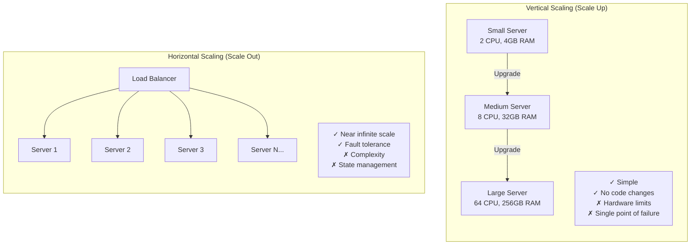

# Scalability Basics

What happens when your system needs to handle more load?

---

## What is Scalability?

Scalability is the ability of a system to handle increased load by adding resources.

A scalable system can grow to handle 10x or 100x the current load without a complete rewrite. An unscalable system hits walls that require rearchitecting.

But here's what many resources don't tell you: most applications never need to scale beyond a single well-configured server. A single PostgreSQL instance can handle thousands of queries per second. A single Node.js or Go server can handle thousands of concurrent connections.

The question isn't "how do I scale?" It's "do I need to scale, and if so, which part?"

---

## Before You Think About Scaling

Most performance problems aren't scaling problems. They're inefficiency problems.

Before adding infrastructure:
- Are your database queries using indexes? A missing index can make a query 1000x slower.
- Are you making N+1 queries? Fetching 100 items then making 100 more queries for related data?
- Are you doing expensive computation on every request that could be cached?
- Are you fetching more data than you need?

I've seen teams add Redis, read replicas, and multiple app servers when the actual problem was a missing database index. Fix the obvious inefficiencies first.

---

## Understanding Load

Load isn't just "number of users." You need to understand your specific load characteristics.

### Questions to Answer

**What's your read/write ratio?**
- 100:1 reads to writes? Caching and read replicas help a lot.
- 1:1 reads to writes? Write scaling becomes critical earlier.

**What's the data access pattern?**
- Do 10% of items get 90% of traffic? (Power law) Caching is very effective.
- Is access spread evenly? Caching helps less.

**What's time-sensitive?**
- Real-time features (chat, live updates) have different scaling needs than batch processing.

**What are your peak vs. average loads?**
- 10x spikes during product launches?
- Steady traffic throughout the day?

These patterns determine which scaling strategies matter for you.

---

## Types of Scaling

### Vertical Scaling (Scale Up)

Add more resources to a single machine: more CPU, more RAM, bigger disk, faster network.

**When it works well:**
- You haven't hit the limits yet (and you probably haven't)
- The problem is genuinely resource-bound, not inefficiency
- You want to stay simple as long as possible

**Practical limits:**
- Cloud instances go up to around 128-256 vCPUs, 1-2TB RAM
- Database servers with 64GB RAM and fast SSDs handle significant workloads
- A single PostgreSQL server can handle 5,000-10,000 simple queries per second

**The real downside:**
- Single point of failure. If that machine dies, you're down.
- Diminishing returns on cost. 2x the resources costs more than 2x the price.

Vertical scaling works until it doesn't. But "until it doesn't" is further than most people think.

### Horizontal Scaling (Scale Out)

Add more machines. Distribute the load across them.

**When you actually need it:**
- You've genuinely hit the limits of vertical scaling
- You need redundancy (critical systems that can't have downtime)
- Your workload is naturally parallelizable

**What it costs:**
- Distributed systems complexity (network failures, consistency, coordination)
- Operational overhead (more machines to monitor, deploy to, debug)
- Often requires application changes (can't assume local state)

**The honest trade-off:**
- Horizontal scaling adds complexity before it adds capacity
- Don't do it for capacity until you need the capacity
- Do it for redundancy if you need high availability

---

## Numbers to Know

These are rough estimates. Your specific workload will vary. But they give you a starting point for reasoning about capacity.

### Database Throughput (Single PostgreSQL Instance)

| Query Type | Rough Capacity |
|------------|----------------|
| Simple key lookup (indexed) | 10,000-50,000/sec |
| Complex query with joins | 100-1,000/sec |
| Write (INSERT/UPDATE) | 1,000-10,000/sec |

A well-configured PostgreSQL server with 32GB RAM and SSDs handles more than most applications need.

### Application Server Throughput

| Server Type | Concurrent Connections | Requests/sec |
|-------------|----------------------|--------------|
| Node.js (single core) | 10,000+ | 1,000-10,000 |
| Go | 100,000+ | 10,000-100,000 |
| Python (with async) | 1,000-10,000 | 500-5,000 |

These are for simple requests. Heavy processing per request reduces throughput.

### Cache Throughput (Redis, Single Instance)

| Operation | Capacity |
|-----------|----------|
| GET/SET (simple) | 100,000+/sec |
| Typical real-world | 50,000-100,000/sec |

Redis is rarely the bottleneck.

### Network Latency

| Path | Latency |
|------|---------|
| Same data center | 0.5-2ms |
| Same region, different AZ | 1-5ms |
| Cross-region (US East to West) | 60-80ms |
| Cross-continent | 100-200ms |

Every network hop adds latency. Minimize round trips.

---

## What Actually Needs to Scale?

Different components have different scaling characteristics and strategies.

### Web/Application Servers

**Scaling characteristic:** Usually the easiest to scale horizontally.

**Why:** If they're stateless (no local data that matters), you just add more behind a load balancer.

**What makes it hard:** Session state stored locally, file uploads stored locally, in-memory caches that need warming.

**Strategy:** Make them stateless. Store sessions in Redis, files in object storage, use distributed caching.

### Databases (Relational)

**Scaling characteristic:** The hardest to scale horizontally.

**Why:** Strong consistency, ACID transactions, complex queries all assume a single source of truth.

**Scaling path:**
1. Optimize queries and add indexes (goes surprisingly far)
2. Add read replicas for read-heavy workloads
3. Shard when you genuinely can't fit data on one machine or write volume exceeds single-node capacity

Most applications never need step 3.

### Caches (Redis, Memcached)

**Scaling characteristic:** Relatively easy to scale horizontally.

**Why:** Simple key-value access patterns partition well.

**Strategy:** Redis Cluster distributes keys across nodes. Memcached can be sharded at the client level.

### Background Jobs

**Scaling characteristic:** Usually easy to scale.

**Why:** Jobs are typically independent. Add more workers.

**What makes it hard:** Jobs that need ordering, jobs that share state, jobs that compete for limited resources.

---

## Scaling Strategies in Depth

### Stateless Services

This is the most important concept for horizontal scaling.

**What "stateless" means:**
- No user session stored in memory on the server
- No uploaded files stored locally that are needed later
- No in-memory cache that would cause inconsistency if requests hit different servers

**How to achieve it:**
- Store sessions in a shared store (Redis, database)
- Store files in object storage (S3, GCS)
- Use a distributed cache or accept cache inconsistency

**Why it matters:**
- Any server can handle any request
- You can add/remove servers freely
- A server dying doesn't lose user state

**Trade-off:**
- Every request now requires network calls to shared state stores
- Adds latency (typically 1-5ms to Redis)
- Adds a dependency on those stores

### Read Replicas

When reads are your bottleneck and you can tolerate slightly stale data.

**How it works:**
- One primary database handles writes
- One or more replicas receive all changes asynchronously
- Read queries go to replicas

**What you need to understand:**

*Replication lag:* Replicas are not instantly updated. There's a delay, typically milliseconds to seconds, sometimes more under load.

*Read-your-writes problem:* User writes something, immediately reads it, gets routed to a stale replica that doesn't have their write yet. They think it failed.

**When it works well:**
- Read-heavy workloads (90%+ reads)
- Data where slight staleness is acceptable
- Analytics and reporting queries

**When it doesn't help:**
- Write-heavy workloads (replicas don't help with writes)
- Data that must be immediately consistent
- When you can't handle the application complexity of routing reads

### Caching

Reduce load on the database by serving repeated requests from memory.

**How effective is caching?**

That depends on your cache hit rate.

| Cache Hit Rate | DB Load Reduction |
|----------------|-------------------|
| 50% | 2x |
| 90% | 10x |
| 99% | 100x |

If you can get 90% of requests served from cache, your database sees 10% of the traffic. That's often the difference between needing to scale and not.

**What affects hit rate:**
- How often the same data is requested (access pattern)
- How long data can stay cached (TTL vs. freshness requirements)
- Cache size vs. working set size

**The hard parts:**
- Cache invalidation (when data changes, cached version is stale)
- Cache stampede (cache expires, many requests hit database simultaneously)
- Cold cache (after restart, cache is empty and everything hits database)

More on caching in the Building Blocks section.

### Sharding

Splitting data across multiple databases when one isn't enough.

**When you actually need sharding:**
- Data volume exceeds what fits on one machine (multiple terabytes)
- Write volume exceeds single-node capacity (typically 10k+ writes/sec sustained)

Most applications never reach this point.

**What sharding breaks:**
- Joins across shards (data is on different machines)
- Transactions across shards (traditional ACID doesn't work)
- Queries that don't include the shard key (must query all shards)

**Sharding is a one-way door:**
- Once you shard, your application is fundamentally changed
- Resharding (adding more shards) is painful
- Choose your shard key carefully, it's very hard to change

Don't shard until you must. When you must, expect it to be a significant project.

### Asynchronous Processing

Not everything needs an immediate response.

**What can be async:**
- Sending emails
- Processing uploaded files
- Generating reports
- Updating search indexes
- Analytics events

**The pattern:**
1. Request comes in
2. Enqueue work to a message queue
3. Return immediately to user
4. Worker processes the queue in background

**Benefits:**
- Faster response times for users
- Ability to handle bursts (queue absorbs spikes)
- Failed processing can be retried

**Complexity:**
- Now you have a queue to manage
- Need to handle failures and retries
- User doesn't know immediately if background work succeeded

---

## Load Balancing in Depth

Distributing traffic across multiple instances.

### Algorithms

**Round-robin:** Each server gets requests in turn. Simple, works when servers are identical and requests are similar.

**Least connections:** Send to the server with fewest active connections. Better when request processing times vary.

**Weighted:** Some servers get more traffic than others. Useful when machines have different capacities.

**Health checks:** Remove unhealthy servers from rotation. Without this, traffic goes to dead servers.

### Implementation Options

**Cloud load balancers (AWS ALB/NLB, GCP Load Balancer):**
- Managed, no servers to run yourself
- Scales automatically
- Integrates with cloud auto-scaling
- Cost: usage-based, can add up

**Software load balancers (Nginx, HAProxy):**
- Run on your own servers
- Very high performance
- Full control over configuration
- You manage them

For most cloud deployments, managed load balancers are simpler.

### What Load Balancers Don't Solve

- If your database is the bottleneck, adding more app servers behind a load balancer doesn't help
- If requests are slow because of inefficient code, load balancing just distributes the slowness
- If you have a stateful service, you need sticky sessions or shared state

---

## Signs You Need to Scale

**Response times increasing:** Average response time creeping up over weeks/months. Often the first signal.

**Resource utilization high:** CPU consistently above 70-80%, memory near limits, disk I/O saturated.

**Error rates during peaks:** System works fine normally, errors during traffic spikes.

**Queue depth growing:** Background jobs backing up, taking longer to process.

**Database query latency increasing:** Same queries taking longer, especially during peak hours.

### What to Do When You See These Signs

1. **Confirm the bottleneck.** Don't guess. Use monitoring to identify whether it's CPU, memory, database, network, etc.

2. **Look for inefficiencies first.** Missing indexes, N+1 queries, and unnecessary computation are often the real problem.

3. **Scale the actual bottleneck.** If the database is slow, more app servers don't help.

4. **Prefer simple solutions.** Bigger machine before more machines. Caching before sharding.

---

## Scaling Decision Framework

When facing a scaling decision, work through these questions:

**1. Is there actually a scaling problem?**
- What are the current numbers (requests/sec, response time, error rate)?
- What's the trend?
- When will you hit the limit at current growth?

**2. What's the bottleneck?**
- CPU? Memory? Network? Disk? Database? External service?
- Is it all the time or during peaks?

**3. Can you fix inefficiency instead of scaling?**
- Missing indexes?
- N+1 queries?
- Unnecessary computation?
- Fetching too much data?

**4. What's the simplest scaling option?**
- Bigger machine?
- Add caching?
- Read replicas?
- Add more app servers?

**5. What's the cost and complexity of each option?**
- Dollar cost (compute, managed services)
- Operational cost (things to manage, things that can break)
- Development cost (code changes, testing)

**6. What can go wrong?**
- What are the failure modes of the new architecture?
- How will you handle them?

---

## Common Mistakes

**Premature scaling:** Adding complexity before you have the traffic to justify it. You're solving problems you don't have while creating new problems you'll have to manage.

**Scaling the wrong thing:** Database is the bottleneck, but you add more app servers because they're easier to scale. Traffic still hits the same database.

**Ignoring the real problem:** Application has a missing index that makes queries 100x slower than they should be. Instead of adding the index, team adds read replicas.

**Over-sharding:** Sharding data across 10 nodes when one node with good indexing would be fine. Now you have distributed systems complexity with no benefit.

**Not measuring:** Making scaling decisions based on intuition rather than data. "It feels slow" isn't a basis for architectural changes.

**Copying big company architectures:** Google's architecture makes sense for Google's scale. You're not at Google's scale. Their solutions add complexity that costs you without giving proportional benefit.

---

## What An Experienced Senior Engineer Thinks About

Beyond the basics, experienced engineers think about:

**Future flexibility:** Today's scaling decision constrains tomorrow's options. Sharding makes joins hard. Caching makes consistency hard. Understand what you're trading away.

**Total cost of ownership:** Not just the server costs, but the operational burden, the engineering time to maintain, the cognitive load of a more complex system.

**Failure modes:** Every component you add is something that can fail. More instances means more things to go wrong. Where are the new failure modes and how will you handle them?

**Organizational scaling:** Can your team operate this system? Having 50 microservices with 5 engineers means nobody understands the whole system.

**Reversibility:** Some decisions are easy to undo (adding a cache). Some are hard (sharding a database). Take more time on irreversible decisions.

---

## Vibe Engineering Guide

When prompting about scaling:

**Less useful:**
> "How do I scale my application?"

**More useful:**
> "My app has 10,000 daily active users and I expect 10x growth in the next year. Current architecture: single Node.js server, PostgreSQL database. What should I focus on to prepare for scale? I'd like to stay simple as long as possible."

**Even better (with your current metrics):**
> "My Node.js API is seeing 500 requests/sec with average response time of 200ms. During peaks of 800 requests/sec, response time jumps to 2 seconds and some requests timeout. Database CPU is at 90%, app server CPU is at 40%. What's my bottleneck and what should I do?"

**With constraints:**
> "I need to support 10x more read traffic on my PostgreSQL database. I can accept reads being up to 30 seconds stale. Team is 2 engineers. What's the simplest approach?"

The more context you provide current numbers, constraints, trade-offs you're willing to make,the more useful the response.

---

## Quick Check

<b>What should you check before scaling?</b>

Whether the problem is actually a scaling problem or an inefficiency problem. Missing indexes, N+1 queries, and inefficient code are often the real issue. Fix those first.

<b>What's the difference between vertical and horizontal scaling?</b>

Vertical: bigger machine. Horizontal: more machines. Vertical is simpler but has limits. Horizontal scales further but adds distributed systems complexity.

<b>Why is statelessness important for horizontal scaling?</b>

Stateless services can have any request handled by any instance. You can add/remove instances freely. State forces you to route specific users to specific servers, which complicates scaling.

<b>When do you actually need to shard a database?</b>

When data volume exceeds one machine (multiple terabytes) or write volume exceeds single-node capacity (10k+ writes/sec sustained). Most applications never reach this point. Sharding breaks joins, transactions, and queries without shard keys.

<b>How do you identify the bottleneck?</b>

Measure. Look at CPU, memory, disk I/O, database query latency, network. The component with highest utilization during slowness is typically the bottleneck. Don't guess, you'll often be wrong.

---

Next: [Trade-off Thinking](04-trade-offs-thinking.md)
