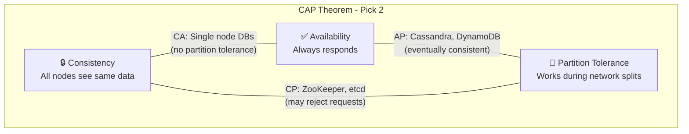

# CAP Theorem

A fundamental constraint of distributed systems that affects every architecture decision.

---

## What CAP Theorem Actually Says

The CAP theorem states that a distributed system can provide only two of these three properties simultaneously:

**Consistency (C):** Every read receives the most recent write. All nodes see the same data at the same time.

**Availability (A):** Every request receives a response (not an error). The system is always ready to respond.

**Partition Tolerance (P):** The system continues to operate despite network partitions, when nodes can't communicate with each other.

It's not \"pick any two.\" In practice, it's more specific than that.

---

## Why Partition Tolerance Is Non-Negotiable

Here's what many explanations miss:

Partitions happen. Networks fail. Cables get cut. Data centers lose connectivity. In any real distributed system, you will experience partitions.

If you don't tolerate partitions, the first network hiccup takes down your entire system. That's not a real distributed system,it's a distributed system pretending partitions won't happen.

So partition tolerance is not optional. **The real choice is between Consistency and Availability during a partition.**

---

## The Actual Choice: CP vs. AP

When a partition happens, you must choose:

### CP (Consistency + Partition Tolerance)

During a partition, some requests will fail or wait. The system refuses to answer rather than give wrong answers.

**What happens during partition:**
- Writes to the minority partition fail
- Reads from the minority partition might fail or block
- The majority partition continues working
- When partition heals, data is consistent

**Good for:**
- Bank account balances (wrong answer is worse than no answer)
- Inventory counts for ordering (selling items you don't have is bad)
- Append-only logs where order matters
- Anything where incorrect data causes real harm

**Trade-off:** Some requests fail during partitions. Reduced availability.

### AP (Availability + Partition Tolerance)

During a partition, all requests are answered, but some might return stale data.

**What happens during partition:**
- All nodes continue responding
- Writes to different partitions might conflict
- Reads might return old data
- When partition heals, conflicts must be resolved

**Good for:**
- Shopping carts (worst case: item added twice or lost)
- Social media feeds (slightly stale is fine)
- User preferences (temporary old settings are okay)
- Analytics (approximate is usually fine)

**Trade-off:** Data might be stale or conflicting. System stays available.

---

## Understanding Consistency Levels

CAP's "Consistency" is strong consistency, every read sees the most recent write. But there's a spectrum:

### Strong Consistency

Every read sees the most recent write. Requires coordination between nodes.

**How it's achieved:**
- All writes go to a leader, reads are from leader
- Or reads query a majority of nodes, ensuring at least one has the latest data
- Coordination has latency and availability costs

**When you need it:**
- Financial transactions
- Double-booking prevention
- Any case where stale data causes real problems

### Eventual Consistency

Given enough time with no new writes, all replicas converge to the same value. There's no guarantee how long "enough time" is.

**What this means in practice:**
- You might read stale data
- Different clients might see different values at the same time
- Eventually, all see the same thing
- "Eventually" could be milliseconds or minutes, depending on system design

**Important:** Eventual consistency has no time bound by default. If your application needs staleness limits (e.g., "data no more than 5 seconds old"), you need to design and measure for that explicitly. Some systems call this "bounded staleness."

**When it's fine:**
- User feed algorithms
- View counts that don't need to be exact
- Caching systems
- Content that doesn't change frequently

### In Between

There are many levels between strong and eventual:

**Read-your-writes:** When you write something, your subsequent reads see your own writes. Others might see stale data.

**Monotonic reads:** Once you see version N, you never see older versions. No "going back in time."

**Causal consistency:** If A happened before B, everyone sees A before B. Unrelated events might appear in different orders.

These matter when designing applications. Knowing which level you actually need prevents over-engineering (paying for strong consistency you don't need) and under-engineering (accepting inconsistency that causes bugs).

---

## Real-World Database Examples

### CP Systems (Favor Consistency)

**Traditional SQL (PostgreSQL, MySQL, single-node):** Strongly consistent. When you write, subsequent reads see the write.

**Distributed SQL (CockroachDB, Spanner):** Strongly consistent across nodes. Trades latency for consistency.

**ZooKeeper, etcd:** Coordination systems that need consistency. Used for distributed locks, leader election.

### AP Systems (Favor Availability)

**Cassandra (default configuration):** Available during partitions. Multiple replicas can diverge.

**DynamoDB (default):** Eventually consistent reads by default. Strongly consistent reads available at higher cost/latency.

**Couchbase:** Designed for high availability. Eventual consistency.

### Tunable Systems

Many modern databases let you choose per-operation:

**Cassandra consistency levels:**
- `ONE`: Read/write to one replica. Fast, eventually consistent.
- `QUORUM`: Majority of replicas. Balanced.
- `ALL`: All replicas. Strongly consistent but blocks if any replica is down.

**DynamoDB:**
- Default reads: eventually consistent
- Optional: strongly consistent reads (higher latency, same cost)

This flexibility lets you have strongly consistent reads for balances and eventually consistent reads for feeds in the same database.

---

## PACELC: The Extended Theory

CAP only describes behavior during partitions. PACELC extends it:

**If there's a Partition, choose Availability or Consistency. Else (normal operation), choose Latency or Consistency.**

Even without partitions, there's a trade-off:
- Strong consistency requires coordination between nodes → adds latency
- Weaker consistency can skip coordination → lower latency

So PACELC says: during partition, AP or CP. During normal operation, latency vs. consistency.

This explains why systems might sacrifice consistency for latency even when everything is working fine, not just during partitions.

---

## When CAP Actually Matters

CAP applies to distributed systems that replicate data. Single-node systems don't have this trade-off.

**When CAP matters:**
- Database with replicas in different locations
- Microservices that maintain their own state
- Distributed caches
- Any system where data lives on multiple nodes

**When CAP doesn't apply:**
- Single database server (no replication)
- Stateless application servers (no data to be inconsistent)
- Purely local systems

Most production systems involve distributed data at some level, so CAP usually matters somewhere.

---

## Practical Decision Making

### Step 1: What Data Are We Talking About?

Different data has different consistency needs in the same application:
- Account balances → strong consistency
- User profile photo → eventual consistency fine
- Order history → strong consistency for recent, eventual for old
- Session data → depends on what sessions control

Don't apply one answer to all data.

### Step 2: What Happens When Data Is Wrong?

**High-cost failures:**
- Money is lost
- Inventory is oversold
- Reservations are double-booked
- Compliance is violated

For these, pay the cost of strong consistency.

**Low-cost failures:**
- User sees slightly stale feed
- Count is off by a bit
- Preference takes a moment to sync

For these, eventual consistency is fine.

### Step 3: What Are Your Operational Constraints?

**Strong consistency is harder to operate:**
- Leader election failures
- If majority of nodes are down, writes fail
- Cross-region latency for global consistency

**Eventual consistency has different challenges:**
- Conflict resolution logic
- Users may see confusing behavior during lag
- Harder to reason about (what state am I in?)

Neither is "easier",they're different.

---

## Common Mistakes

**Thinking you have to choose globally.** Different data types need different consistency. Bank balances need strong consistency. "Trending now" can be eventually consistent. Design accordingly.

**Ignoring latency costs of consistency.** Strong consistency across regions means writes wait for cross-region round-trips. That's 100-200ms added latency per write. Is that acceptable?

**Not planning for partitions.** "Network partitions are rare" → they still happen. What happens when they do? If you don't know, you're implicitly choosing CP (things will fail) rather than designing for it.

**Assuming eventual consistency is simpler.** Eventual consistency requires handling stale data in application logic. "Show old and new" or "refresh after a moment" or "conflict resolution." This complexity has to go somewhere.

**Calling a single-node system "CP" or "AP."** CAP applies to distributed systems. A single PostgreSQL server is just consistent, no partition trade-off exists.

---

## What An Experienced Senior Engineer Thinks About

**Consistency at different boundaries.** Within a service, strong consistency. Between services, eventual consistency. This pattern balances simplicity (strong consistency is easier to reason about) with scalability (cross-service strong consistency is expensive).

**Defining what "correct" means.** Before choosing consistency level, define what correctness means for this data. Is stale data "wrong" or just "not ideal"? The answer varies.

**Leases and fencing.** In CP systems, how do you prevent a node that thinks it's leader from making changes after losing leadership? Leases, fencing tokens, and similar mechanisms prevent this.

**Observability of consistency.** How do you know if your eventually consistent system is converging quickly enough? Measure replication lag. Alert on extended inconsistency.

**CAP and humans.** In an eventually consistent system, a user might refresh and see their change gone, then refresh and see it back. This confuses users. Design UI/UX to handle this.

---

## Vibe Engineering Guide

When prompting about consistency:

**Less useful:**
> "Should I use a CP or AP database?"

**More useful:**
> "I'm designing an e-commerce system. Inventory counts must be accurate to avoid overselling, we've had that problem before. But product descriptions and images can be slightly stale. How should I think about consistency for different parts of this system?"

**With specific constraints:**
> "We have users in US and EU. PostgreSQL is in US. EU users experience 150ms latency on every write. Product owners want faster EU performance but finance requires account balance consistency. What are our options?"

**For debugging:**
> "Users report occasionally seeing old data after updating their profile. We have a Redis cache in front of our API, and the database has a read replica. Where might consistency be breaking, and what patterns would ensure read-your-writes consistency?"

---

## Quick Check

<b>What does CAP theorem actually say?</b>

A distributed data store can only provide two of three properties: Consistency, Availability, and Partition Tolerance. Since partitions are unavoidable in distributed systems, the practical choice during a partition is between consistency (correct but sometimes unavailable) and availability (always responds but might be stale).

<b>What's the difference between CP and AP systems?</b>

CP systems refuse to answer during partitions rather than give stale/wrong data. AP systems always answer but may return stale or conflicting data during partitions.

<b>What's eventual consistency?</b>

A model where replicas may diverge temporarily, but given enough time without new writes, all replicas eventually converge to the same value. Application must be designed to handle temporary staleness.

<b>When should you choose strong consistency?</b>

When incorrect data causes real harm: financial transactions, inventory for ordering, any case where the cost of a wrong answer exceeds the cost of no answer.

<b>Does CAP apply to a single-node database?</b>

No. CAP is about trade-offs in distributed systems with data replicated across nodes. A single database server doesn't face partition tolerance questions, it's either up or down.

---

Next: [Level 3: Building Blocks](../03-building-blocks/README.md)
