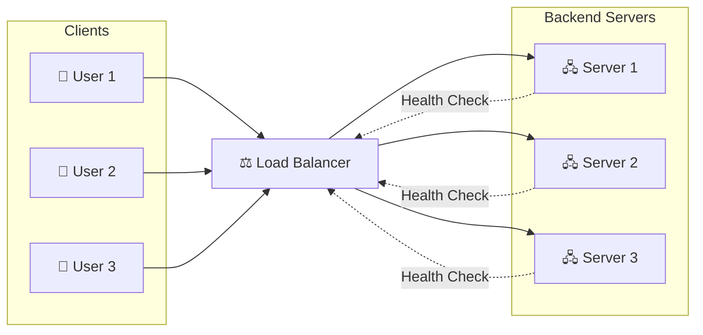
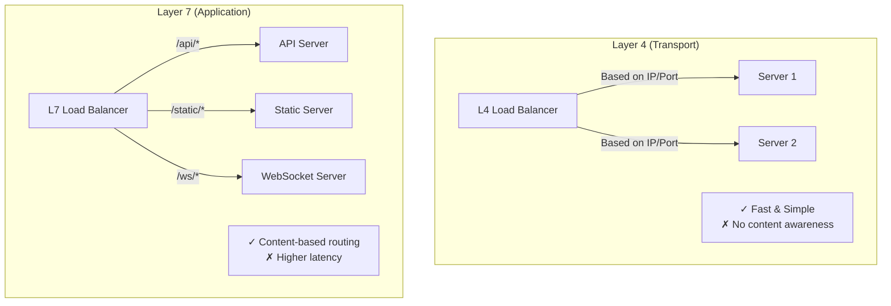

# Load Balancers

Distributing traffic across multiple servers, the foundation of horizontal scaling and high availability.

---

## What a Load Balancer Does

A load balancer sits between clients and servers, distributing incoming requests across multiple backend instances.

Instead of all traffic hitting one server, it's spread across many. This enables both capacity (more total throughput) and redundancy (one server failing doesn't take down the system).

---

## Why Load Balancers Matter

### Capacity

A single server can handle a finite amount of traffic. Add more servers behind a load balancer, and you can handle proportionally more traffic.

One server handles 1,000 requests/second. Put 5 servers behind a load balancer, handle ~5,000 requests/second.

### Availability

If one server crashes, the load balancer stops sending traffic to it. Users are automatically routed to healthy servers. They may not even notice the failure.

Without a load balancer: dead server = complete outage.
With a load balancer: dead server = one fewer server handling traffic.

### Maintenance

You can take servers out of rotation for updates, debugging, or replacement without affecting users. Roll through servers one at a time with zero downtime deployments.

### Flexibility

Add capacity by adding servers. Remove capacity by removing servers. The load balancer handles the routing. Clients don't need to know anything changed.

---

## How Load Balancing Works

### The Basic Flow

1. Client makes request to load balancer's address (e.g., api.example.com)
2. Load balancer selects a backend server
3. Load balancer forwards request to that server
4. Server processes request, sends response to load balancer
5. Load balancer forwards response to client

The client thinks it's talking to one server. It doesn't know multiple servers exist.

### Health Checks

Load balancers continuously check if backend servers are healthy.

**Active health checks:** Load balancer periodically sends a request (e.g., `GET /health`) to each server. If response is healthy, server stays in rotation. If unhealthy or unresponsive, server is removed.

**Passive health checks:** Load balancer monitors real traffic. If a server returns many errors or times out, it's marked unhealthy.

Good health checks are critical. Without them, traffic is sent to dead servers.

**What makes a good health endpoint:**
- Returns 200 if server can serve traffic
- Checks critical dependencies (can reach database?)
- Fast (not expensive to compute)
- Doesn't interfere with normal operation

---

## Load Balancing Algorithms

Different algorithms for deciding which server gets each request.

### Round-Robin

Requests go to each server in turn: 1, 2, 3, 1, 2, 3...

**Good for:** Servers with similar capacity, requests with similar cost.
**Bad for:** Servers with different capacities, requests with highly variable processing times.

### Weighted Round-Robin

Like round-robin, but some servers get more traffic.

Server 1 (weight 3): 3 requests
Server 2 (weight 1): 1 request
Then repeat.

**Good for:** Servers with different capacities (more powerful server gets more traffic).

### Least Connections

Send to the server with fewest active connections.

**Good for:** When request processing times vary. A server handling a slow request will have connections pile up; new requests go elsewhere.

### Least Response Time

Send to the server responding fastest.

**Good for:** When some servers are performing better than others.

### IP Hash

Hash the client's IP address to determine server. Same client always goes to same server.

**Good for:** Sticky sessions without cookies. Consistent routing for the same client.
**Bad for:** If clients are behind a NAT (all appear as same IP).

### Random

Randomly select a server.

Surprisingly effective for large server pools. Simple, no shared state.

---

## Layer 4 vs. Layer 7

Load balancers operate at different network layers.

### Layer 4 (Transport Layer)

Sees: IP addresses and ports. Doesn't look inside HTTP requests.

**How it works:** Routes based on IP/port combinations. Fast, minimal processing.

**Use cases:**
- TCP load balancing
- Very high throughput requirements
- When you don't need content-based routing

**Examples:** AWS NLB, HAProxy in TCP mode.

### Layer 7 (Application Layer)

Sees: HTTP content, URL paths, headers, cookies, body.

**How it works:** Makes routing decisions based on request content.

**Capabilities:**
- Route `/api/*` to API servers, `/static/*` to static servers
- Route based on headers (mobile vs. desktop)
- Route based on cookies (specific user to specific server)
- Modify requests/responses (add headers, rewrite URLs)
- Terminate SSL (decrypt HTTPS, talk HTTP to backends)

**Use cases:**
- Most web applications
- Microservices routing
- When you need content-based decisions

**Examples:** AWS ALB, Nginx, HAProxy in HTTP mode.

### Which to Choose

**Layer 7 for most web applications.** You likely want URL-based routing, SSL termination, and the visibility into HTTP.

**Layer 4 for:** Very high performance, non-HTTP protocols, or when you need to pass connection through unchanged.

---

## Common Load Balancer Implementations

### Cloud-Managed

**AWS ALB (Application Load Balancer):**
- Layer 7
- Integrates with AWS services (ECS, EC2 auto scaling)
- Path and host-based routing
- WebSocket support
- Automatic scaling

**AWS NLB (Network Load Balancer):**
- Layer 4
- Very high performance (millions of requests/second)
- Static IP addresses
- Preserves source IP

**GCP Cloud Load Balancing, Azure Load Balancer:** Similar offerings.

**When to use managed:** Most of the time. No servers to manage, automatic scaling, integrated monitoring.

### Software Load Balancers

**Nginx:**
- Very popular
- HTTP and TCP load balancing
- Also functions as web server and reverse proxy
- Configuration via files

**HAProxy:**
- High performance
- HTTP and TCP
- Very configurable
- Popular for demanding setups

**When to use software:** When you need more control, on-premises, or specific configurations not available in managed services.

### Hardware Load Balancers

**F5, Citrix:** Enterprise hardware appliances.

Expensive, high performance. Largely replaced by software and cloud solutions for most use cases.

---

## SSL/TLS Termination

Load balancers often handle HTTPS encryption.

**SSL termination at load balancer:**
- Client ↔ Load Balancer: HTTPS (encrypted)
- Load Balancer ↔ Backend: HTTP (unencrypted)

**Benefits:**
- Backends don't manage certificates
- Simpler backend configuration
- Load balancer can inspect HTTP content

**Considerations:**
- Traffic between load balancer and backends is unencrypted
- In some environments, this is fine (private network)
- In others, you want encryption throughout (SSL passthrough or re-encryption)

**SSL passthrough:**
- Load balancer just forwards encrypted traffic
- Can't inspect content
- Backend handles encryption
- Used when backend must handle certificates or for non-HTTP TLS

---

## Session Persistence (Sticky Sessions)

Sometimes you need requests from the same user to go to the same server.

**Why:**
- Server stores session state locally
- WebSocket connections must maintain server affinity
- Caching at server level

**How:**
- Cookie-based: Load balancer adds a cookie identifying the backend
- IP-based: Hash client IP to server (less reliable with NAT)

**The problem with sticky sessions:**
- One server failing loses sessions on that server
- Can't freely add/remove servers
- Uneven load if different users have different activity levels

**Better approach:** Make servers stateless. Store sessions in Redis or database. Then any server can handle any request, no stickiness needed.

---

## High Availability for the Load Balancer

The load balancer itself can be a single point of failure.

### Active-Passive

Two load balancers. One active, one standby. If active fails, standby takes over.

Uses a virtual IP (VIP) that floats between them.

### Active-Active

Multiple load balancers, all handling traffic. Often combined with DNS round-robin.

### Cloud Load Balancers

Managed load balancers (ALB, Cloud Load Balancing) are designed for high availability. They're distributed across multiple availability zones. You don't manage redundancy, it's built in.

---

## Connection Handling

### Connection Draining

When removing a server from rotation, existing connections should complete before traffic stops.

**Without draining:** Server is removed, in-flight requests fail.
**With draining:** No new connections to server, existing connections finish normally, then server is removed.

Configure a draining timeout. Typically 30-300 seconds depending on your application.

### Keep-Alive Connections

HTTP keep-alive allows multiple requests over one connection.

**Between client and load balancer:** Usually enabled by default.
**Between load balancer and backend:** Should also be enabled to avoid connection overhead.

### Connection Limits

Load balancers have limits on concurrent connections. Know your load balancer's limits for capacity planning.

---

## Monitoring and Observability

### What to Monitor

**Request metrics:**
- Requests per second
- Latency (at load balancer, to backend, total)
- Error rates (4xx, 5xx)

**Backend health:**
- Healthy vs. unhealthy instance count
- Health check latency and failure rate

**Resource utilization:**
- Active connections
- Bandwidth

### Logging

Most load balancers can log all requests. This is valuable for debugging and analysis, but consider the volume and cost.

---

## Common Mistakes

**Single load balancer without redundancy.** You added servers for redundancy but the load balancer is a single point of failure. Use HA pairs or managed load balancers.

**No health checks.** Traffic goes to dead servers. Users see errors. Configure health checks properly.

**Wrong health check.** Health check returns 200 even when the server can't actually handle requests (e.g., database connection is dead). Health check should verify real functionality.

**Too aggressive health checks.** Marking servers unhealthy from transient issues. Configure appropriate thresholds and intervals.

**Sticky sessions everywhere.** Complicates scaling and failover. Use external session storage instead when possible.

**Not configuring connection draining.** Servers are removed abruptly, breaking in-flight requests.

**Ignoring load balancer limits.** Load balancers have throughput and connection limits. Size appropriately.

---

## What An Experienced Senior Engineer Thinks About

**Load balancer as a distributed systems component.** The load balancer is in the critical path. Its failure modes, latency contribution, and limitations directly impact system reliability.

**Multi-layer load balancing.** Global load balancer (DNS or anycast) routes to regional load balancers, which route to instance pools. Each layer has different concerns.

**Cost modeling.** Cloud load balancers charge for data transfer and connections. At high traffic, this can be significant. Evaluate cost vs. running your own.

**Traffic shifting for deployments.** Load balancers can gradually shift traffic during deployments (canary, blue-green). This is a deployment capability, not just routing.

**Observability integration.** Load balancer logs and metrics are often the first place to look when something is wrong. Ensure they're properly captured and queryable.

---

## Vibe Engineering Guide

When prompting about load balancing:

**Less useful:**
> "Add a load balancer to my app"

**More useful:**
> "I have a Node.js API deployed to 3 AWS EC2 instances. I want to set up load balancing with:
> - HTTPS termination at the load balancer
> - Health checks to /health endpoint
> - Automatic removal of unhealthy instances
> - Connection draining on deploys
>
> Should I use ALB or NLB? What configuration do I need?"

**For architecture decisions:**
> "We have API servers and also WebSocket servers for real-time features. API can be stateless but WebSocket needs connection affinity. How do I configure load balancing for both? Should they be behind the same load balancer?"

**For troubleshooting:**
> "Our load balancer health checks show instances flapping between healthy and unhealthy. Health endpoint returns 200 but sometimes takes 10+ seconds. What might cause this and how should I configure the health check timeout?"

---

## Quick Check

<b>What's the difference between Layer 4 and Layer 7 load balancing?</b>

Layer 4 routes based on IP/port without looking at content. Layer 7 can see HTTP details (URL, headers, cookies) and make routing decisions based on content. Layer 7 is more flexible; Layer 4 is simpler and faster.

<b>Why are health checks important?</b>

Without health checks, load balancers send traffic to servers that can't handle it, crashed servers, servers that lost database connection, etc. Health checks detect unhealthy servers and remove them from rotation.

<b>What's the problem with sticky sessions?</b>

If a server fails, sessions on that server are lost. You can't freely scale up/down. Load can become uneven. Better approach: store session state externally (Redis, database) so any server can handle any request.

<b>What is connection draining?</b>

When removing a server from the pool, allow existing requests to complete before stopping traffic. Without draining, in-flight requests fail when server is removed.

<b>How do you make the load balancer not be a single point of failure?</b>

Use HA pairs (active-passive or active-active) for software load balancers. Managed cloud load balancers (ALB, Cloud Load Balancing) are designed for HA automatically.

---

Next: [Caching](02-caching.md)
