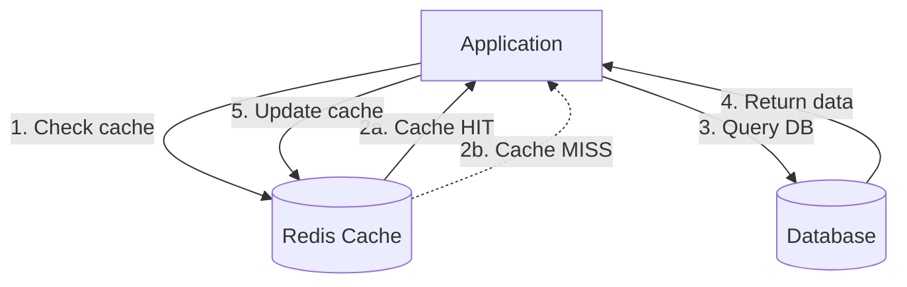
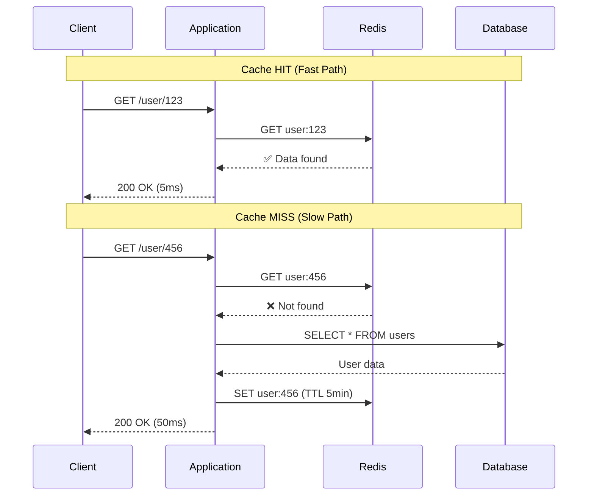

# Caching

Storing data closer to where it's needed, trading memory for speed and reduced load.

---

## What is Caching?

A cache stores a copy of data that's expensive to fetch or compute. Instead of going to the source every time, you check the cache first.

Cache hit: data is in cache, return it immediately.
Cache miss: data is not in cache, fetch from source, store in cache, return it.

The fundamental trade-off: memory (cache storage) for speed (avoiding slow operations) and reduced load on backends.

---

## Why Caching Matters

### Speed

Cache access is orders of magnitude faster than alternatives:

| Data Source | Typical Latency |
|-------------|-----------------|
| L1 CPU cache | ~1ns |
| L2 CPU cache | 4-7ns |
| Main memory | ~100ns |
| Redis (localhost) | 0.1-0.5ms |
| Redis (network) | 0.5-2ms |
| SSD read | 0.1-0.5ms |
| PostgreSQL query | 1-100ms |
| Network to another datacenter | 50-150ms |
| External API call | 100-500ms |

A Redis cache hit at 0.5ms instead of a 50ms database query is 100x faster. Users notice this difference.

### Reduced Load

If 90% of requests can be served from cache, your database sees only 10% of the traffic, a 10x reduction in load.

This often means you don't need to scale your database yet. Caching can delay expensive scaling projects.

### Cost

Serving from cache is cheaper than computing. A Redis instance serving 100,000 requests per second costs less than the database capacity you'd need to serve those directly.

---

## Where Caching Happens

Caching happens at multiple layers. Understanding all the places data can be cached helps you design effective caching strategies.

### Browser Cache

Static assets (CSS, JavaScript, images, fonts) are cached in the user's browser.

**Controlled by:** HTTP cache headers (`Cache-Control`, `Expires`, `ETag`)
**Duration:** From seconds to years
**Benefit:** Zero latency for cached assets, no server load

### CDN Cache

Content Delivery Networks cache content at edge locations around the world.

**What's cached:** Static files, and optionally dynamic content with short TTLs
**Benefit:** Content served from location near user
**Control:** Origin's cache headers plus CDN configuration

### Application Cache

Your application stores data in memory or a cache service (Redis, Memcached).

**Common uses:**
- Database query results
- Computed values
- External API responses
- Session data

**Control:** Your code manages what's cached and for how long

### Database Cache

Databases maintain their own internal caches:
- Query plan cache
- Buffer pool (recently accessed data pages)
- Query result cache (some databases)

**Control:** Database configuration, but also affected by your access patterns

### Operating System Cache

The OS caches file system data in memory, avoiding disk reads.

**Benefit:** Automatic, transparent
**Gotcha:** You might think you're measuring disk performance when you're actually measuring OS cache performance

---

## Cache Patterns

### Cache-Aside (Lazy Loading)

The most common pattern. Application code manages the cache.

**How it works:**
1. Check cache for data
2. If cache hit: return cached data
3. If cache miss: fetch from database
4. Store result in cache
5. Return data

**Advantages:**
- Only caches data that's actually requested
- Simple to understand and implement
- Cache failure is survivable (fall back to database)

**Disadvantages:**
- First request for any data is always slow (cache miss)
- Cache misses temporarily increase database load
- Stale data possible if underlying data changes





### Write-Through

Writes go to both cache and database together.

**How it works:**
1. Application writes to cache
2. Cache synchronously writes to database
3. Write completes when both succeed

**Advantages:**
- Cache is always consistent with database
- No stale data from cache

**Disadvantages:**
- Higher write latency (two writes)
- Every write goes to cache, even if data is never read
- More complex than cache-aside

### Write-Behind (Write-Back)

Writes go to cache immediately; cache writes to database asynchronously.

**How it works:**
1. Application writes to cache
2. Cache acknowledges write immediately
3. Cache writes to database asynchronously (batched, delayed)

**Advantages:**
- Very fast writes (just cache write)
- Batching improves database efficiency
- Absorbs write spikes

**Disadvantages:**
- Data loss risk if cache fails before database write
- Complex durability guarantees
- Harder to reason about consistency

### Read-Through

Cache sits in front of database; application only talks to cache.

**How it works:**
1. Application requests data from cache
2. On miss, cache fetches from database (not application)
3. Cache returns data to application

**Advantages:**
- Simpler application code
- Cache manages data fetching

**Disadvantages:**
- Requires cache system that supports this pattern
- Less flexibility in application code

---

## Cache Invalidation

The classic hard problem. When underlying data changes, cached copies become stale. How do you keep cache and source in sync?

### Time-Based Expiration (TTL)

Data expires after a set time.

**Simple:** Set TTL when caching, let data expire naturally.

**Trade-off:** Freshness vs. hit rate. Short TTL = fresher data but more cache misses. Long TTL = higher hit rate but staler data.

**Works well when:**
- Slight staleness is acceptable
- Data changes infrequently
- You can tolerate occasional stale reads

### Explicit Invalidation

When data changes, actively remove or update the cache.

**Approaches:**
- Delete cached data on write (next read repopulates)
- Update cached data on write (cache stays warm)

**Challenges:**
- Every place that modifies data must invalidate cache
- Easy to miss a code path
- If cache and database are inconsistent with multiple servers, race conditions occur

### Event-Based Invalidation

Database changes trigger cache invalidation via events.

**How it works:**
- Database publishes change events
- Cache subscribes and invalidates affected entries

**Advantage:** Centralized invalidation logic.
**Complexity:** Need event system, need to handle failures and delays.

### Cache Stampede Problem

When a popular item expires, many requests simultaneously hit the database to repopulate, potentially overwhelming it.

**Solutions:**
- **Locking:** Only one request fetches from database; others wait.
- **Probabilistic early refresh:** Randomly refresh slightly before expiration.
- **Background refresh:** Refresh cache before it expires.

---

## What to Cache

### Good Candidates

**Data that's read frequently but changes rarely:**
- User profile (reads often, changes occasionally)
- Product details (many views, few updates)
- Configuration and feature flags

**Expensive computations:**
- Aggregations and reports
- Complex query results
- Rendered templates

**External API responses:**
- Third-party data that changes slowly
- Rate-limited APIs (cache to avoid limits)

### Poor Candidates

**Data that's always different:**
- Unique per-request data (nothing to reuse)
- Real-time data that must be current

**Data that changes constantly:**
- Leaderboards updating every second
- Live counters (unless slight lag is okay)

**Data where staleness is dangerous:**
- Account balances (for transactions)
- Inventory counts (for ordering)
- Security-related data

**Low-repetition data:**
- If each key is accessed once, caching adds overhead without benefit

---

## Cache Metrics

### Hit Rate

The percentage of requests served from cache.

```
Hit Rate = Cache Hits / (Cache Hits + Cache Misses)
```

**Interpreting hit rate:**

| Hit Rate | Meaning |
|----------|---------|
| 95%+ | Excellent, cache is very effective |
| 80-95% | Good for most applications |
| 50-80% | Moderate, some benefit, room to improve |
| Under 50% | Cache may not be effective for this workload |

If hit rate is low, investigate:
- Is TTL too short?
- Is the working set larger than cache size?
- Are you caching the right things?

### Eviction Rate

How often items are removed from cache due to size limits.

High eviction rate means cache is too small. Items are being pushed out before they're used again.

### Latency Breakdown

Track separately:
- Cache hit latency (should be very fast, 1-2ms for Redis)
- Cache miss latency (fetch + store + return)

If cache hit latency is high, the cache itself is overloaded.

---

## Common Cache Implementations

### Redis

**What it is:** In-memory data store with persistence options.

**Strengths:**
- Rich data structures (strings, lists, sets, sorted sets, hashes)
- Pub/sub for messaging
- Lua scripting for complex operations
- Persistence for durability

**Common uses:** Sessions, caching, queues, real-time features.

**Typical capacity:** Single instance handles 100k+ operations/sec.

### Memcached

**What it is:** Simpler in-memory cache.

**Strengths:**
- Simpler than Redis
- Consistent hashing for distribution
- Lower memory overhead per key

**Limitations:** No persistence, fewer data structures.

**When to choose:** Simple key-value caching, very high object counts.

### Local In-Process Cache

**What it is:** Cache in application memory (dictionary/map).

**Strengths:**
- Zero network latency
- Simplest implementation

**Limitations:**
- Not shared between instances (each server has its own)
- Lost on restart
- Uses application memory

**When to use:** Small datasets, single-instance apps, or as L1 cache in front of Redis.

### Distributed Cache Clusters

**Redis Cluster:** Shards data across multiple nodes.
**Memcached clustering:** Client-side consistent hashing.

For large cache datasets or high availability requirements.

---

## Cache Consistency Challenges

### Read-After-Write Inconsistency

User writes data, then reads and gets old cached value.

**Solutions:**
- Invalidate cache on write before returning
- Write-through caching
- Cache-aside with TTL (accept temporary staleness)

### Cache Stampede

Popular cache key expires, many requests hit database simultaneously.

**Solutions:**
- Lock during fetch (only one request populates)
- Early probabilistic refresh
- Never let the cache expire (background refresh)

### Cold Cache

After restart, cache is empty and everything hits database.

**Solutions:**
- Pre-warming (load popular data into cache at startup)
- Gradual rollout (not all traffic at once)
- Accept that cold start is temporarily slow

### Thundering Herd

Similar to stampede: sudden load after cache is unavailable.

**Solutions:**
- Circuit breaker to prevent overwhelming database
- Degrade gracefully (serve stale data if available)
- Rate limit cache misses

---

## Common Mistakes

**Caching everything.** Only cache what benefits from caching. Caching rarely-accessed or always-changing data adds complexity without benefit.

**No invalidation strategy.** Setting TTL and forgetting. When data changes, cached copies are wrong until TTL expires. Users see stale data.

**Cache as source of truth.** Cache should be a copy, not the original. If cache is lost or needs to restart, you should be able to rebuild it from the source.

**Ignoring cache failures.** What happens when Redis is down? If cache is required for functioning, it's no longer a cache, it's part of your architecture. Ensure your app can survive cache failures.

**Not monitoring hit rate.** Low hit rate means cache isn't helping. You're paying for cache infrastructure without getting the benefit.

**User-specific data with shared keys.** User A's cached data is returned to User B. Include user ID or session in cache keys for user-specific data.

---

## What An Experienced Senior Engineer Thinks About

**Cache layers.** L1 local in-process cache, L2 Redis, L3 database. Layered caching reduces latency and load on each subsequent layer.

**Consistency boundaries.** Decide explicitly where stale data is acceptable. Document TTLs and their implications. "Profile picture may be up to 5 minutes stale" is a product decision.

**Cache warming strategies.** For a new deployment or region, how does the cache get populated? Slow ramp-up? Pre-warming from database? Background job?

**Capacity planning.** How big does the cache need to be? Depends on working set size. If your working set is 10GB and cache is 1GB, hit rate will suffer.

**Failure modes.** Cache fails partially (some keys unavailable) or completely. How does the system behave? Degrade to database? Serve stale data with warnings? Return errors?

**Cost of consistency.** The more consistent your caching, the more complex the invalidation logic, and often the lower the hit rate. Is the consistency worth the cost?

---

## Vibe Engineering Guide

When prompting about caching:

**Less useful:**
> "Add caching to my app"

**More useful:**
> "I have a read-heavy API endpoint that loads product details from PostgreSQL. Products change a few times per day. Currently seeing 500ms response times under load. How should I implement Redis caching? What TTL would you recommend? How do I handle cache invalidation when products are updated?"

**With specific problem:**
> "My cache hit rate is only 40%. Cache is Redis with 4GB. I'm caching user data by user ID. We have 500,000 active users. Most users visit once a day. What might explain the low hit rate, and how can I improve it?"

**For specific patterns:**
> "We're seeing issues where users update their profile but then see the old data for a few seconds. We use cache-aside with 5-minute TTL. How can we ensure read-your-writes consistency while keeping the caching benefits?"

---

## Quick Check

<details>
<summary><b>What problem does caching solve?</b></summary>

Caching reduces latency (faster than fetching from source) and load (fewer requests to database/backend). It trades memory for speed and capacity.

</details>

<details>
<summary><b>What's the difference between cache-aside and write-through?</b></summary>

Cache-aside: application checks cache, on miss fetches from database and populates cache. Write-through: writes go to cache and database synchronously; cache is always up-to-date but writes are slower.

</details>

<details>
<summary><b>Why is cache invalidation hard?</b></summary>

When data changes, all cached copies become stale. You must either accept staleness (TTL expires eventually), actively invalidate (requires knowing every place data changes), or use complex event systems. Missing an invalidation path means stale data.

</details>

<details>
<summary><b>What's cache stampede and how do you prevent it?</b></summary>

When a popular cache key expires and many requests simultaneously hit the database. Prevent with locking (one request repopulates), probabilistic early refresh, or background refresh before expiration.

</details>

<details>
<summary><b>How do you know if your cache is effective?</b></summary>

Measure hit rate. Above 80-90% is good. Also measure latency improvement and backend load reduction. Low hit rate means cache isn't helping, investigate TTL, cache size, and what you're caching.

</details>

---

Next: [CDNs](03-cdns.md)
