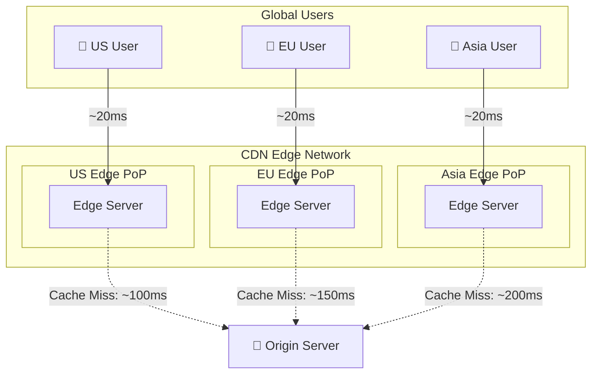

# CDNs (Content Delivery Networks)

Bringing content closer to users, reducing latency and offloading traffic from your servers.

---

## What is a CDN?

A CDN is a geographically distributed network of servers that cache and deliver content from locations close to users.

Instead of every user fetching files from your origin server (which might be on another continent), they get content from a nearby CDN edge server.



---

## Why Use a CDN?

### Reduced Latency

Physical distance creates unavoidable latency (speed of light). A CDN server in the same city as the user dramatically reduces this.

**Real numbers:**
- User to nearby CDN: 10-30ms
- User to distant origin: 100-300ms

For a page with 50 assets, this difference is substantial.

### Reduced Origin Load

Requests served from CDN cache don't reach your origin. If 90% of requests are cache hits, your origin handles 10% of the traffic.

This means:
- Smaller origin infrastructure
- Origin handles dynamic work, CDN handles static
- Origin is protected from traffic spikes

### Better Availability

CDN has many edge servers. If one fails, traffic routes to others. Your origin being briefly down doesn't affect cached content.

### DDoS Protection

CDN absorbs attack traffic at the edge, distributed across their global network. Much harder to overwhelm than your single origin.

---

## What Can Be Served from CDN?

### Static Content (Easy)

Files that don't change per-user:
- Images, videos, audio
- CSS, JavaScript bundles
- Fonts
- Static HTML pages
- Downloads (PDFs, installers)

These are cached for long periods and served to everyone.

### Dynamic Content (Harder)

Content that changes:
- API responses
- Personalized pages
- Real-time data

Can still benefit from CDN:
- Short TTLs (cache for seconds)
- Edge computing (generate at edge)
- Stale-while-revalidate (serve stale, update in background)

---

## How CDN Caching Works

### Cache Hit vs. Cache Miss

**Cache hit:** Edge server has the file, returns immediately. Origin never contacted.

**Cache miss:** Edge server doesn't have the file. Fetches from origin, caches it, returns to user.

### TTL (Time to Live)

How long an edge server keeps a file before checking the origin again.

**Long TTL (hours, days):**
- Great for truly static content (images, versioned JS)
- Origin load reduction is maximized
- Changes take time to propagate

**Short TTL (seconds, minutes):**
- For content that changes (API responses, news)
- Still reduces origin load for popular content
- Changes visible faster

### Cache-Control Headers

Origin tells CDN how to cache:

```
Cache-Control: public, max-age=31536000
```

- **public:** Anyone can cache (CDN, browser)
- **max-age=31536000:** Cache for 1 year
- **private:** Only browser caches (user-specific data)
- **no-cache:** Always validate with origin
- **no-store:** Never cache

### Cache Invalidation

When you need to update cached content before TTL expires:

**Purge:** Tell CDN to delete specific file from all edges.

**Versioning:** Change filename (style.v2.css). New URL = cache miss = fresh content. Old version served until it expires (fine since nobody requests it).

**Versioning is preferred.** Purging is slow to propagate globally. Versioned filenames are instant.

---

## CDN Architecture

### Edge Servers (POPs)

Points of Presence distributed globally. Major CDNs have 100+ locations worldwide.

Edge servers:
- Cache content
- Handle SSL termination
- Apply security rules
- Return cached responses

### Origin Shield (Mid-tier Cache)

Optional layer between edges and origin.

Without shield:
- Cache miss at Edge A → origin
- Cache miss at Edge B → origin
- Origin gets hit from many edges

With shield:
- Cache miss at Edge A → shield → origin
- Cache miss at Edge B → shield (already cached)
- Origin gets fewer requests

Useful for expensive-to-generate content.

### Origin Server

Your actual server where content comes from. CDN fetches on cache miss.

---

## CDN Providers

### Major Players

| Provider | Notes |
|----------|-------|
| Cloudflare | Free tier, integrated security, easy setup |
| AWS CloudFront | Deep AWS integration, pay-per-use |
| Akamai | Enterprise, largest network, expensive |
| Fastly | Developer-focused, real-time purging, edge compute |
| Google Cloud CDN | GCP integration |

### Choosing a CDN

**Consider:**
- Your cloud provider (integration is easier)
- Global presence (where are your users?)
- Features (edge compute, security, real-time analytics)
- Pricing (per GB, per request, flat fee)
- Ease of setup

For most applications, **Cloudflare** or **CloudFront** are good defaults.

---

## Setting Up CDN

### Basic Setup

1. **Configure origin:** CDN needs to know where to fetch content.
2. **Set up DNS:** Point domain to CDN (CNAME).
3. **Configure caching rules:** What to cache, for how long.
4. **Enable HTTPS:** CDN handles SSL termination.

### Cache Rules

Configure based on file type or path:

```
/assets/*      → Cache 1 year (static assets)
/api/*         → Cache 0 (don't cache API)
/                → Cache 1 hour (homepage)
```

---

## Common Patterns

### Whole Site Through CDN

Route all traffic through CDN. CDN caches what it can, forwards rest to origin.

**Advantages:**
- DDoS protection for everything
- SSL termination at edge
- Single entry point

### Static Assets Only

Only images, CSS, JS go through CDN. API and pages hit origin directly.

**Advantages:**
- Simpler caching rules
- No worry about caching sensitive data

### Multiple Domains

```
www.example.com      → Origin (dynamic)
static.example.com   → CDN (assets)
images.example.com   → CDN (images)
```

Different caching policies for different content types.

---

## Edge Computing

Modern CDNs can run code at the edge, not just cache files.

### Use Cases

**Authentication:** Verify tokens at edge before forwarding.

**A/B testing:** Route users to different variants.

**Personalization:** Light customization without origin round-trip.

**Redirects:** Handle URL routing at edge.

### Platforms

- Cloudflare Workers
- CloudFront Lambda@Edge
- Fastly Compute@Edge
- Vercel Edge Functions

### Trade-offs

**Advantages:**
- Very low latency (code runs close to user)
- Reduces origin load further

**Disadvantages:**
- Limited computing environment
- Debugging is harder
- Another piece to manage

---

## Performance Optimization

### Asset Optimization

CDNs often provide:
- Image compression and format conversion (WebP)
- Minification of CSS/JS
- Brotli/gzip compression

Enable these to reduce bytes transferred.

### HTTP/2 and HTTP/3

CDNs support modern protocols automatically:
- Multiplexing
- Header compression
- Connection reuse

Users get benefits without origin changes.

### Prefetching and Preconnecting

```html
<link rel="preconnect" href="https://cdn.example.com">
<link rel="prefetch" href="/next-page-asset.js">
```

Browser establishes connections early, reducing latency.

---

## Measuring CDN Performance

### Key Metrics

**Cache hit ratio:** Percentage of requests served from cache. Higher is better (90%+).

**Time to First Byte (TTFB):** How long until user receives first byte. CDN should reduce this.

**Origin shield efficiency:** How much origin traffic is reduced.

### Monitoring

Most CDNs provide dashboards with:
- Requests and bandwidth
- Cache hit/miss rates
- Error rates
- Latency percentiles

---

## Common Mistakes

**Caching authenticated content.** User A's data cached and served to User B. Use `Cache-Control: private` or unique URLs.

**Long TTLs without versioning.** Update CSS, users still get old version from cache. Use versioned filenames.

**Not setting cache headers.** Let origin decide, not CDN. CDN uses defaults which may not match your needs.

**Caching error pages.** Origin returns 500, CDN caches it. Users get error for TTL duration. Configure CDN to not cache error responses.

**Ignoring cache invalidation time.** Assume purge is instant. CDN purge can take minutes to propagate globally.

---

## What An Experienced Senior Engineer Thinks About

**Cache key design.** What makes one request different from another? URL, query params, cookies? Incorrect cache keys mean wrong content served.

**Stale content trade-offs.** How bad is serving content that's 60 seconds old? For most static assets, it's fine. For real-time data, it's not.

**Cost optimization.** CDN costs are per-GB and per-request. Optimize asset sizes. Use appropriate TTLs to maximize cache efficiency.

**Regional variations.** Content might differ by region (language, legal requirements). Use geo-based routing or edge logic.

**Origin protection.** Restrict origin to only accept requests from CDN. Otherwise attackers can bypass CDN protections.

---

## Vibe Engineering Guide

When prompting about CDNs:

**Less useful:**
> "Set up a CDN for my website"

**More useful:**
> "I'm setting up CloudFront for a React app:
> - index.html should have short TTL (content can change)
> - Static assets in /assets/ are versioned with hash in filename, can cache forever
> - API at /api/ should not be cached
>
> What Cache-Control headers should origin send? How do I configure CloudFront behaviors?"

**For troubleshooting:**
> "Users sometimes see old versions of our app after deployments. We use CloudFront with 24-hour TTLs. index.html is cached. How do we ensure users get the latest version without waiting a day?"

---

## Quick Check

<details>
<summary><b>Why does a CDN reduce latency?</b></summary>

Physical proximity. Instead of requesting content from a server across the world (100-300ms), users get it from a nearby edge server (10-30ms). Speed of light creates minimum latency that only proximity can reduce.

</details>

<details>
<summary><b>What's the difference between cache hit and cache miss?</b></summary>

Cache hit: content is already at the edge, served immediately. Cache miss: edge doesn't have content, must fetch from origin, which adds latency. Maximizing hit ratio is the goal.

</details>

<details>
<summary><b>Why use versioned filenames instead of cache purging?</b></summary>

Versioned filenames (app.abc123.js) create a new URL, so there's no cached content to worry about, it's automatically a cache miss. Purging takes time to propagate globally and can be unreliable.

</details>

<details>
<summary><b>What's an origin shield?</b></summary>

A mid-tier cache between edges and origin. Multiple edge cache misses hit the shield first; only if shield misses does origin get hit. Reduces origin load.

</details>

<details>
<summary><b>When shouldn't content be cached on a CDN?</b></summary>

User-specific content (use private cache or no-cache), rapidly changing real-time data, authenticated responses where caching could leak to wrong users.

</details>

---

Next: [Proxies and Gateways](04-proxies-and-gateways.md)
