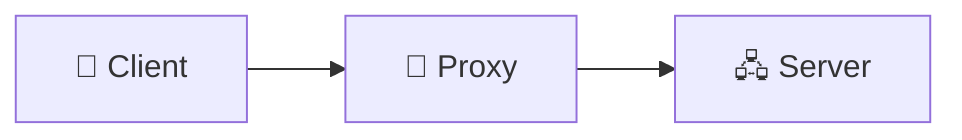
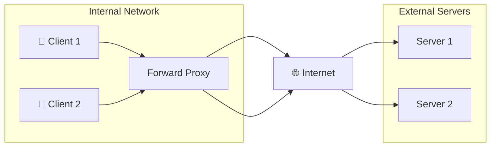
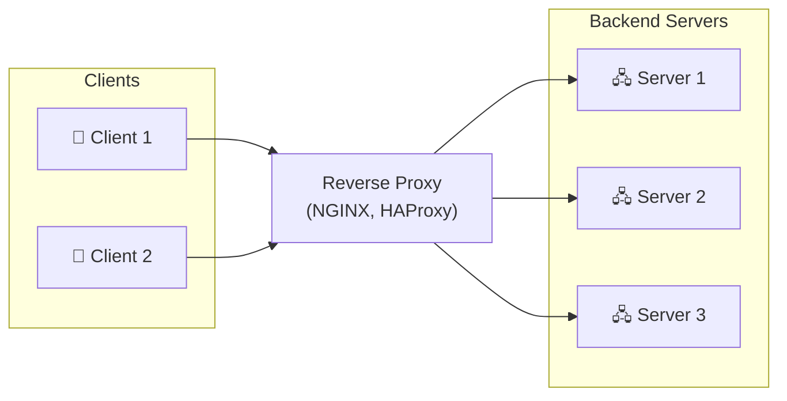

# Proxies and Gateways

The intermediaries that control, secure, and optimize traffic in your system.

---

## What Are Proxies?

A proxy is an intermediary that sits between clients and servers. Instead of clients connecting directly to servers, they connect to the proxy, which then connects to servers.



Proxies can:
- Control access
- Add functionality
- Hide details about either side
- Improve performance

---

## Forward Proxy

Sits in front of clients. Clients send requests through the proxy to access external resources.



**Use cases:**

**Access control:** Block employees from accessing certain sites.

**Anonymity:** Hide client's IP from servers. The server sees the proxy's IP.

**Caching:** Cache frequently accessed resources. Subsequent requests served from cache.

**Security:** Scan outgoing requests for sensitive data leaks.

**Corporate example:** Company proxy that controls what employees can access and logs traffic.

---

## Reverse Proxy

Sits in front of servers. Clients connect to the proxy, which forwards to backend servers.



**Use cases:**

**Load balancing:** Distribute traffic across multiple servers.

**SSL termination:** Handle HTTPS at the proxy. Backend servers use HTTP internally.

**Security:** Hide server topology. DDoS protection. WAF (Web Application Firewall).

**Caching:** Cache responses to reduce backend load.

**Compression:** Compress responses before sending to clients.

**Common implementations:** NGINX, HAProxy, Traefik, cloud load balancers.

---

## API Gateway

A specialized reverse proxy for APIs. Provides API-specific functionality.

```
[Clients] → [API Gateway] → [Backend Services]
```

### Gateway Functions

**Request routing:** Route requests to appropriate backend service based on path, method, headers.

**Authentication:** Verify JWT tokens, API keys. Reject unauthorized requests.

**Rate limiting:** Enforce request limits per client.

**Request/response transformation:** Modify requests or responses (add headers, transform format).

**Aggregation:** Combine multiple backend calls into one response.

**Monitoring:** Log all requests, track latency, error rates.

### Common API Gateways

| Gateway | Notes |
|---------|-------|
| Kong | Open source, plugin ecosystem |
| AWS API Gateway | Managed, integrates with AWS |
| Apigee | Enterprise, Google Cloud |
| Ambassador | Kubernetes-native |
| Traefik | Cloud-native, auto-discovery |

### When to Use

**Use API Gateway when:**
- Multiple backend services need unified entry point
- Need API-specific features (auth, rate limiting, transformation)
- Microservices architecture

**Skip if:**
- Single backend service
- Simple architecture
- Don't need gateway features

---

## Service Mesh

Manages service-to-service communication in microservices.

```
┌─────────────────┐     ┌─────────────────┐
│   Service A     │     │   Service B     │
│  ┌───────────┐  │     │  ┌───────────┐  │
│  │  Main App │  │     │  │  Main App │  │
│  └─────┬─────┘  │     │  └─────┬─────┘  │
│        │        │     │        │        │
│  ┌─────▼─────┐  │     │  ┌─────▼─────┐  │
│  │   Sidecar │◄─┼─────┼──►  Sidecar  │  │
│  │  (Envoy)  │  │     │  │  (Envoy)  │  │
│  └───────────┘  │     │  └───────────┘  │
└─────────────────┘     └─────────────────┘
          │                      │
          └──────────┬───────────┘
                     ▼
            ┌─────────────────┐
            │  Control Plane  │
            │  (Istio, etc.)  │
            └─────────────────┘
```

### How It Works

**Sidecar proxy:** Each service has a sidecar (usually Envoy). All traffic goes through the sidecar.

**Control plane:** Manages configuration for all sidecars. Policies, routing rules, certificates.

### Service Mesh Provides

**mTLS:** Automatic encryption between services.

**Traffic management:** Routing, load balancing, circuit breakers.

**Observability:** Automatic tracing, metrics, logging.

**Policy enforcement:** Access control, rate limiting.

### Common Service Meshes

| Mesh | Notes |
|------|-------|
| Istio | Feature-rich, complex |
| Linkerd | Simpler, lighter |
| Consul Connect | HashiCorp, integrates with Consul |

### When to Use

**Use Service Mesh when:**
- Many microservices (10+)
- Need consistent observability and security
- Team size justifies operational overhead

**Skip if:**
- Few services
- Can't invest in operational complexity
- Simple communication patterns

---

## Load Balancer vs. Reverse Proxy vs. API Gateway

| Feature | Load Balancer | Reverse Proxy | API Gateway |
|---------|---------------|---------------|-------------|
| Traffic distribution | Yes | Yes | Yes |
| SSL termination | Yes | Yes | Yes |
| Health checks | Yes | Yes | Yes |
| Authentication | No | Basic | Full |
| Rate limiting | Limited | Limited | Full |
| Request transformation | No | Basic | Full |
| API management | No | No | Yes |

**Choosing:**
- Simple load distribution? **Load balancer.**
- Web server features (caching, compression)? **Reverse proxy.**
- API features (auth, rate limit, transformation)? **API gateway.**

Often, you use combinations. API Gateway behind a cloud load balancer is common.

---

## Configuration Examples

### NGINX as Reverse Proxy

```
# nginx.conf (conceptual)
upstream backend {
    server backend1:8080;
    server backend2:8080;
}

server {
    listen 443 ssl;
    server_name api.example.com;
    
    location / {
        proxy_pass http://backend;
        proxy_set_header Host $host;
        proxy_set_header X-Real-IP $remote_addr;
    }
}
```

This configuration:
- Listens on HTTPS
- Load balances to two backend servers
- Passes original host and IP headers

### API Gateway Route

```json
{
  "route": "/api/users/*",
  "target": "http://user-service:8080",
  "plugins": [
    { "name": "jwt-auth" },
    { "name": "rate-limit", "config": { "limit": 100, "window": "60s" } }
  ]
}
```

This configuration:
- Routes /api/users to user-service
- Requires JWT authentication
- Limits 100 requests per minute

---

## Common Patterns

### Gateway Routing

Route different paths to different services:

```
/api/users/*    → User Service
/api/orders/*   → Order Service
/api/products/* → Product Service
```

Single entry point, multiple backends.

### Backend for Frontend (BFF)

Different gateways for different clients:

```
Mobile App → Mobile Gateway → Services
Web App    → Web Gateway    → Services
```

Each gateway optimized for its client.

### Gateway Offloading

Move cross-cutting concerns from services to gateway:

Before: Each service implements auth, logging, rate limiting.
After: Gateway handles these. Services focus on business logic.

---

## Common Mistakes

**Gateway as single point of failure.** Gateway must be highly available. Multiple instances behind load balancer.

**Too much logic in gateway.** Gateway should route and apply policies, not business logic. Keep it thin.

**Not considering latency.** Every proxy hop adds latency. Measure and minimize.

**Misconfigured timeouts.** Proxy timeout shorter than backend timeout = confusing errors.

**No health checks.** Sending traffic to dead backends.

**Missing headers.** Not forwarding X-Forwarded-For, X-Real-IP. Backend can't see client info.

---

## What An Experienced Senior Engineer Thinks About

**Gateway sprawl.** Too many gateways, each with different configs. Consolidate where possible.

**Security boundaries.** Where does authentication happen? Authorization? Each layer should be intentional.

**Observability.** Every proxy should log, trace, and expose metrics. This is your visibility into the system.

**Vendor lock-in.** Proprietary gateway features may be hard to migrate from.

**Defense in depth.** Don't rely on gateway alone for security. Defense at multiple layers.

---

## Vibe Engineering Guide

When prompting about proxies and gateways:

**Less useful:**
> "Set up an API gateway"

**More useful:**
> "I have three microservices: users, orders, products. I want to:
> - Single entry point at api.example.com
> - JWT authentication for all routes
> - Rate limiting: 100/min per user
> - Route /users to user-service, /orders to order-service, etc.
>
> Should I use NGINX, Kong, or AWS API Gateway? What are the trade-offs?"

**For specific problems:**
> "Our API gateway sometimes returns 502 Bad Gateway. Backend services seem healthy. What should I check? Gateway logs show upstream timeout errors."

---

## Quick Check

<details>
<summary><b>What's the difference between forward and reverse proxy?</b></summary>

Forward proxy sits in front of clients, controlling their access to external resources. Reverse proxy sits in front of servers, controlling client access to your backend. Forward proxy hides clients; reverse proxy hides servers.

</details>

<details>
<summary><b>When would you use an API gateway vs. a simple reverse proxy?</b></summary>

API gateway when you need API-specific features: authentication, rate limiting, request transformation, API versioning. Simple reverse proxy for basic load balancing and proxying without those features.

</details>

<details>
<summary><b>What's a service mesh?</b></summary>

Infrastructure layer that manages service-to-service communication. Sidecars handle traffic for each service. Provides mTLS, observability, traffic management automatically. Useful for complex microservices deployments.

</details>

<details>
<summary><b>Why should the gateway be highly available?</b></summary>

It's the single entry point. If the gateway goes down, all traffic is blocked. Run multiple instances behind a load balancer. No single point of failure.

</details>

<details>
<summary><b>What headers should be forwarded through a proxy?</b></summary>

X-Forwarded-For (client IP chain), X-Real-IP (original client IP), X-Forwarded-Proto (original protocol), Host (original host). Without these, backends can't see client info.

</details>

---

Next: [Rate Limiting](05-rate-limiting.md)
