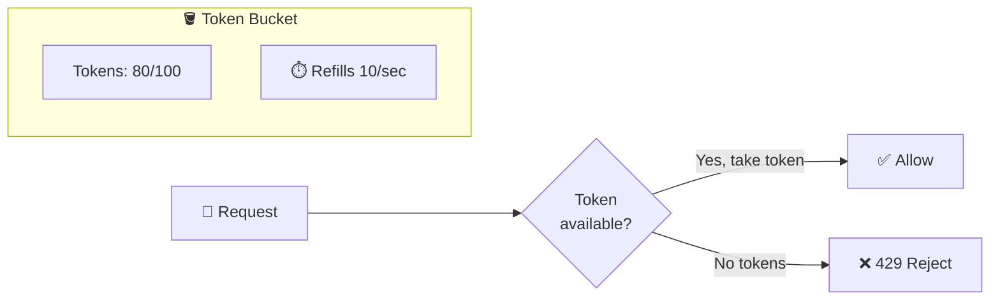

# Rate Limiting

Protecting services from overuse, essential for any production API.

---

## What is Rate Limiting?

Rate limiting controls how many requests a client can make in a given time period. When the limit is exceeded, additional requests are rejected.

**Example:** 100 requests per minute per user. Request 101 in the same minute gets rejected with 429 Too Many Requests.

---

## Why Rate Limit?

### Prevent Abuse

- **Brute force attacks:** Limit login attempts
- **Web scraping:** Limit rapid-fire requests  
- **Denial of service:** Limit total requests per IP
- **Spam:** Limit creation of content

### Ensure Fair Usage

One aggressive client shouldn't consume resources that others need. A bug in one client's code shouldn't take down your service.

### Protect Infrastructure

Your systems have capacity limits. Rate limiting rejects excess load before it overwhelms backend services.

### Control Costs

Cloud resources cost money. Unbounded usage means unbounded bills. Rate limits cap exposure.

---

## Rate Limiting Strategies

### Fixed Window

Count requests in fixed time windows (per minute on the minute).

```
Window: 12:00:00 - 12:00:59
Limit: 100 requests

Requests at 12:00:55 → count = 99 → allowed
Requests at 12:00:56 → count = 100 → allowed  
Requests at 12:00:57 → count = 101 → rejected
Requests at 12:01:00 → count resets → allowed
```

**Advantage:** Simple.
**Problem:** Boundary burst. 100 requests at 12:00:59 + 100 at 12:01:00 = 200 in 2 seconds.

### Sliding Window

Look at the last N seconds, not fixed boundaries.

At 12:01:30, count requests from 12:00:30 to 12:01:30.

**Advantage:** No boundary bursts.
**Disadvantage:** More complex. Need to track request timestamps.

### Token Bucket

Bucket holds tokens. Each request takes a token. Tokens refill at steady rate.



```
Bucket capacity: 100 tokens
Refill: 10 tokens/second

Start: 100 tokens
10 requests: 90 tokens left
Wait 1 second: 100 tokens (refilled, capped at capacity)
Burst 50 requests: 50 tokens left
```

**Advantage:** Allows bursts (up to bucket size) while maintaining average rate.
**Widely used:** AWS API Gateway, NGINX, most rate limiters use this.

### Leaky Bucket

Requests enter a queue. Queue drains at constant rate. If queue is full, reject.

**Advantage:** Very smooth output rate.
**Disadvantage:** Adds latency (requests wait in queue).

---

## What to Limit By

### By IP Address

Simple. Works for anonymous users.

**Problems:**
- NAT: many users behind one IP
- Proxies/VPNs can bypass
- Mobile networks share IPs

**Good for:** Basic abuse prevention, unauthenticated endpoints.

### By User/Account

Accurate per-user limits.

**Problems:**
- Requires authentication
- Users can create multiple accounts

**Good for:** Authenticated APIs, per-customer limits.

### By API Key

Identifies applications, not users.

**Good for:** Developer APIs, third-party integrations, tiered pricing.

### Combined

Multiple limits can apply:
- 100/minute per user (fair usage)
- 1000/minute per IP (abuse prevention)
- 10000/minute globally (infrastructure protection)

First exceeded limit triggers rejection.

---

## Response When Limited

### HTTP 429 Too Many Requests

The standard status code.

### Helpful Headers

```
HTTP/1.1 429 Too Many Requests
X-RateLimit-Limit: 100
X-RateLimit-Remaining: 0
X-RateLimit-Reset: 1616098800
Retry-After: 30
```

- **Limit:** Max requests allowed
- **Remaining:** Requests left in window
- **Reset:** When window resets (Unix timestamp)
- **Retry-After:** Seconds until retry makes sense

This helps clients back off appropriately.

### Response Body

```json
{
  "error": "rate_limit_exceeded",
  "message": "Too many requests. Limit: 100/minute.",
  "retry_after": 30
}
```

---

## Implementation Approaches

### In-Process

Store counts in application memory.

**Advantage:** Very fast, no network call.
**Disadvantage:** Not shared across servers. Each server limits independently.

### Redis-Based

Centralized counter in Redis.

```
Key: rate_limit:{user_id}:{window}
Value: request count
```

Use INCR for atomic increment, EXPIRE for automatic cleanup.

**Advantage:** Shared across all servers. Accurate.
**Disadvantage:** Network latency. Redis is a dependency.

### API Gateway

Use built-in rate limiting in API gateway (AWS API Gateway, Kong, NGINX).

**Advantage:** No code changes. Centralized.
**Disadvantage:** Coarser control. Gateway-specific configuration.

---

## Configuration Best Practices

### Start Generous

It's easier to tighten limits than to deal with angry users who were incorrectly limited.

### Different Limits for Different Endpoints

```
/api/search     → 30/minute (expensive query)
/api/users      → 100/minute (normal CRUD)
/api/status     → 1000/minute (health check)
```

### Different Limits for Different Tiers

```
Free tier:     100/hour
Basic tier:    1000/hour
Enterprise:    10000/hour
```

### Documented Limits

Tell users what the limits are before they hit them.

---

## Common Mistakes

**Rate limiting only after problems.** Build it in from the start.

**Too strict.** Legitimate users hit limits during normal usage.

**No monitoring.** You don't know how many requests are being rejected or if limits are appropriate.

**Counting wrong.** Incrementing after processing instead of before. Request is processed, then rejected, wasteful.

**No rate limit headers.** Clients can't tell how close they are to limits or when to retry.

**Single layer only.** Rate limit at gateway but not at service. Direct service access bypasses limits.

---

## What An Experienced Senior Engineer Thinks About

**Limits tied to resources.** Your rate limits should reflect actual system capacity. If the database can handle 1000 queries/sec, rate limits should ensure you don't exceed that.

**Graceful degradation.** Instead of hard rejection, consider returning cached data or degraded responses.

**Per-customer SLAs.** Enterprise customers may need guaranteed capacity that rate limiting must respect.

**Distributed rate limiting complexity.** Centralized (Redis) is simple but adds latency. Distributed algorithms (like rate limiting in a mesh) are harder but remove central dependency.

**Cost attribution.** Rate limits can inform pricing tiers and help identify costly customers.

---

## Vibe Engineering Guide

When prompting about rate limiting:

**Less useful:**
> "Add rate limiting to my API"

**More useful:**
> "I need rate limiting for a REST API:
> - Global limit: 10000 requests/minute (infrastructure protection)
> - Per-user limit: 100 requests/minute (fair usage)
> - Login endpoint: 5 attempts/15 minutes (brute force protection)
> - Using Express.js with multiple server instances behind ALB
>
> Should I use Redis? What happens if Redis is temporarily unavailable?"

---

## Quick Check

<details>
<summary><b>Why is token bucket commonly used?</b></summary>

It allows bursts (up to bucket capacity) while maintaining an average rate. Real traffic is bursty, so this matches actual usage patterns better than fixed limits.

</details>

<details>
<summary><b>What's the problem with fixed window rate limiting?</b></summary>

Boundary bursts. Users can make 100 requests at 11:59:59 and 100 at 12:00:00, 200 requests in 2 seconds. Sliding window or token bucket avoids this.

</details>

<details>
<summary><b>Why use Redis for rate limiting?</b></summary>

Shared state across servers. Without it, each server counts independently, 10 servers with 100-request limits = 1000 total allowed.

</details>

<details>
<summary><b>What should the 429 response include?</b></summary>

Headers with limit, remaining, reset time, and Retry-After. This helps clients implement proper backoff instead of hammering your server.

</details>

---

Next: [Consistent Hashing](06-consistent-hashing.md)
