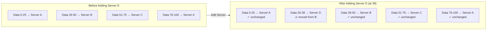
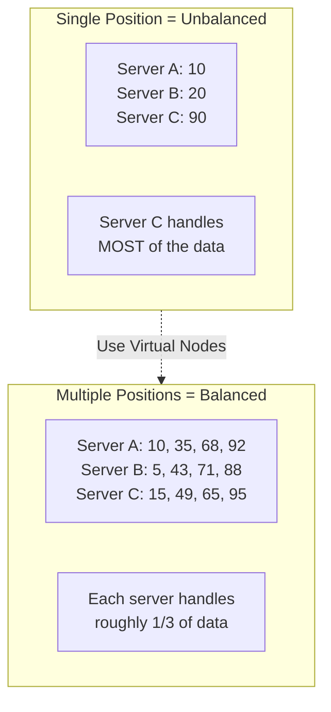

# Consistent Hashing

Splitting work across servers without reshuffling everything when servers are added or removed.

---

## What is Consistent Hashing?

Think of it like this: You have 3 filing cabinets. When a document comes in, you decide which cabinet to put it in. Later, you add a 4th cabinet. With the wrong approach, you'd have to reorganize most of your documents. With consistent hashing, you only need to move a few.

**The core idea:** Distribute data across servers in a way that adding or removing a server only affects the data near that server, not everything.

---

## The Problem (Simple Example)

You're building a cache for your app. You have 3 cache servers.

### The Simple Approach

For each piece of data, you calculate which server to use:

```
Pick a number from the data (hash)
Divide by 3
Use the remainder (0, 1, or 2)
```

**Example:**
- User "alice" → number 1234 → 1234 ÷ 3 → remainder **1** → Server 1
- User "bob" → number 789 → 789 ÷ 3 → remainder **0** → Server 0
- User "carol" → number 456 → 456 ÷ 3 → remainder **0** → Server 0

Perfect! Data is spread across 3 servers.

### The Problem Appears

Your app grows. You add Server 3 (now you have 4 servers).

Now the math changes:

```
Divide by 4 instead of 3
```

**Same data, new results:**
- User "alice" → 1234 ÷ 4 → remainder **2** → Server 2 (was Server 1) ❌ **MOVED**
- User "bob" → 789 ÷ 4 → remainder **1** → Server 1 (was Server 0) ❌ **MOVED**
- User "carol" → 456 ÷ 4 → remainder **0** → Server 0 (same) ✓

**2 out of 3 moved!** With millions of users, most of your cached data is now on the wrong server.

**What happens:**
1. User requests come in
2. Cache checks wrong server (data moved)
3. Cache miss - must fetch from database
4. Database gets slammed with requests
5. Your app slows to a crawl

This is **terrible** at scale.

---

## The Solution (Explained Simply)

Instead of using division and remainders, consistent hashing uses a different approach.

### Step 1: Create a Circle

Imagine a circle. Put numbers around it from 0 to 100 (in reality, much bigger numbers, but let's keep it simple).

```
        0/100
        |
   25 - O - 75
        |
       50
```

This is your **hash ring**.

### Step 2: Place Servers on the Circle

Give each server a number and place it at that position:

```
hash("server-A") = 25
hash("server-B") = 50  
hash("server-C") = 75
```

```
        0/100
        |
  A(25) O C(75)
        |
      B(50)
```

### Step 3: Place Data on the Circle

Each piece of data also gets a number:

```
hash("alice") = 30
hash("bob") = 60
hash("carol") = 90
```

### Step 4: The Rule

**For each piece of data, walk clockwise until you hit a server. That server stores the data.**

```
alice (30) → walk clockwise → hit Server B at 50 ✓
bob (60) → walk clockwise → hit Server C at 75 ✓
carol (90) → walk clockwise → hit Server A at 25 (wraps around) ✓
```

---

## Why This Solves the Problem

Let's add Server D at position 38.

```
        0/100
        |
  A(25) O C(75)
      \ | /
    D(38) B(50)
```

**What happens to our data?**

- **alice (30):** walk clockwise → hit Server D at 38 (was Server B) ❌ **MOVED**
- **bob (60):** walk clockwise → hit Server C at 75 (still Server C) ✓ **UNCHANGED**
- **carol (90):** walk clockwise → hit Server A at 25 (still Server A) ✓ **UNCHANGED**

**Only 1 out of 3 moved!** With millions of users, only the ones between positions 25-38 would move. Everything else stays put.



---

## Virtual Nodes (Solving Distribution)

There's one problem with the simple approach above.

### The Problem

What if servers are placed unevenly?

```
Server A at position 10
Server B at position 20
Server C at position 90
```

Server C would handle positions 20-90 (huge range!), while A and B handle tiny ranges. Very unbalanced.

### The Solution

Place each server at **multiple positions** on the circle.

Instead of:
```
Server A → 1 position
```

Do this:
```
Server A → positions 10, 35, 68, 92
Server B → positions 5, 43, 71, 88
Server C → positions 15, 49, 65, 95
```

Now each server appears 4 times. The load is much more evenly distributed.

**In production:** Servers typically have 100-200 positions each.



---

## Real Numbers Example

Let's use actual positions (computers use numbers up to 4,294,967,295).

**Servers:**
- Server A: 536,870,912
- Server B: 1,610,612,736
- Server C: 3,758,096,384

**Data:**
- "alice" hashes to 800,000,000 → walk clockwise → **Server B** (1,610,612,736)
- "bob" hashes to 2,000,000,000 → walk clockwise → **Server C** (3,758,096,384)
- "carol" hashes to 100,000,000 → walk clockwise → **Server A** (536,870,912)

**Add Server D at 2,500,000,000:**

- "alice" (800,000,000) → still **Server B** ✓
- "bob" (2,000,000,000) → now **Server D** ❌ (moved from C)
- "carol" (100,000,000) → still **Server A** ✓

Only bob moved. That's it.

---

## How Systems Use This


### Memcached

Your application code maintains the ring. When you add a server:
1. Update the ring in your code
2. Deploy the change
3. Some cache misses happen (expected)
4. Cache refills naturally

### Cassandra

Each node knows about the ring. Data is automatically:
- Distributed across nodes
- Replicated to neighbors
- Rebalanced when nodes are added/removed

---

## Common Patterns

### Pattern 1: Client Decides

Your app has the ring map. For each request:
1. Hash the key
2. Look up which server on the ring
3. Connect to that server

**Used by:** Memcached clients, simple caches

**Pro:** Fast, no middle layer  
**Con:** All clients need same ring map

### Pattern 2: Proxy Decides

Requests go through a proxy. The proxy:
1. Has the ring map
2. Routes to correct server

**Used by:** Twemproxy, Envoy

**Pro:** Clients don't need ring logic  
**Con:** Proxy can be a bottleneck

### Pattern 3: Servers Coordinate

Servers talk to each other. Any server can receive any request, then forward internally if needed.

**Used by:** Cassandra, DynamoDB

**Pro:** Very resilient  
**Con:** More complex

---

## What Can Go Wrong

### Wrong Hash Function

All clients must use the **same** hash function.

**Bad:** Python's built-in `hash()` - changes between versions  
**Good:** MD5, SHA-1, MurmurHash - always the same

### Forgetting Virtual Nodes

One position per server = uneven load. Always use multiple positions (virtual nodes).

### Hot Keys

One user has 1 million requests/second. That user's server gets crushed. Consistent hashing doesn't solve this.

**Solutions:**
- Cache hot keys locally in app
- Replicate hot keys to multiple servers
- Split hot keys into sub-keys

### Data Still Needs to Move

Consistent hashing tells you where data *should* be. You still need to actually copy the data.

This requires:
- Background jobs to migrate data
- Handling requests during migration
- Tracking what's been moved

---

## What An Experienced Senior Engineer Thinks About

**Distribution vs load.** Consistent hashing distributes *keys* evenly. If some keys are much hotter than others, servers still get uneven load.

**Migration complexity.** The algorithm is simple. Actually moving terabytes of live data without downtime is the hard part.

**Replication strategy.** You don't just use one server. Store data on server + next 2 servers clockwise for redundancy. If one fails, data is still available.

**Monitoring key distribution.** Periodically check that keys are actually balanced. Bugs in hash functions or virtual node placement can create hotspots.

**Cost of consistency.** In distributed systems, all nodes must agree on the ring. This is a distributed consensus problem. Use etcd, ZooKeeper, or gossip protocols.

---

## When to Use Consistent Hashing

**Use it when:**
- You have multiple servers
- You add/remove servers regularly
- Servers can fail
- Data can be partitioned by key

**Don't use it when:**
- You have 2-3 servers that rarely change (simple modulo is fine)
- You need to query across all data (can't partition)
- You need range queries (need to scan user:1000 to user:2000)

---

## Vibe Engineering Guide

When prompting about consistent hashing:

**Too vague:**
> "Implement consistent hashing"

**Better:**
> "I have 10 Redis nodes. Currently using key % 10 to decide which node. When I add an 11th node, 90% of keys rehash to different nodes, causing massive cache misses. I want to use consistent hashing instead. My app is in Python. How do I implement the ring logic?"

**For troubleshooting:**
> "After adding a server to my consistent hash ring, one server is at 90% CPU while others are at 30%. I'm using 50 virtual nodes per server. Is that enough? How do I diagnose why load is uneven?"

**For architecture:**
> "Building a distributed cache that will scale from 5 to 100 nodes. Need to handle nodes joining/leaving without downtime. Should I use client-side consistent hashing or a proxy? Clients are in Go and Node.js."

---

## Quick Check

<details>
<summary><b>Why doesn't modulo work well for distributed systems?</b></summary>

When you use `key % N`, changing N (adding/removing server) changes the result for most keys. Add one server to 10, and 91% of keys suddenly map to different servers. All that data has to move.

</details>

<details>
<summary><b>How does consistent hashing fix this?</b></summary>

Uses a ring. Each server owns a range. Adding a server only affects the range next to it. All other data stays on the same servers. Only ~1/N of data moves.

</details>

<details>
<summary><b>What are virtual nodes?</b></summary>

Placing each physical server at multiple positions on the ring. Server A might have positions at 100, 500, 800, etc. This prevents one server from getting a huge range and others getting tiny ranges. Use 100-200 virtual nodes per server.

</details>

<details>
<summary><b>What's the hardest part of implementing this?</b></summary>

Not the algorithm - that's simple. The hard part is actually migrating data when the ring changes. You need to identify which keys moved, copy them to new servers, handle requests during migration, and ensure nothing breaks.

</details>

<details>
<summary><b>Can consistent hashing solve hot key problems?</b></summary>

No. If one key gets 1M requests/sec, its server is overwhelmed regardless of how well you distributed other keys. Need separate solutions: local caching, replication, or request rate limiting.

</details>

---

Next: [Bloom Filters](07-bloom-filters.md)
