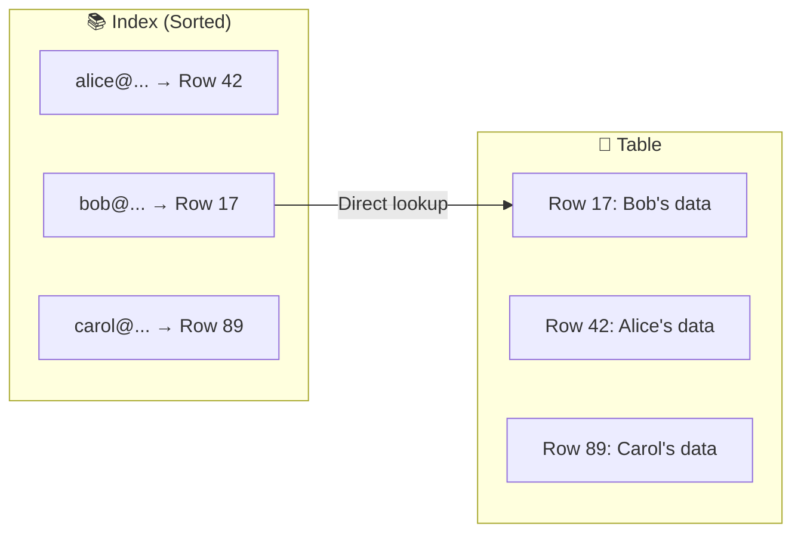
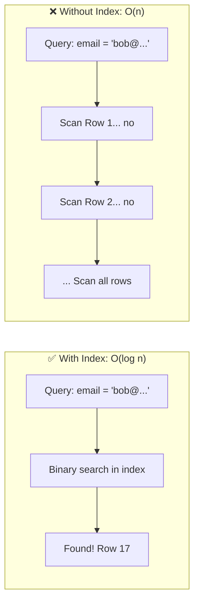

# Database Indexing

How databases find data quickly, and why missing indexes are probably slowing your application down right now.

---

## The Problem Indexes Solve

Without an index, finding a row in a table means scanning every row until you find what you're looking for. This is a full table scan.

With 1 million rows, that's 1 million comparisons.
With 100 million rows, that's 100 million comparisons.
That gets slow very quickly.

An index is a separate data structure that provides a fast path to specific rows. Instead of scanning everything, the database jumps to the right place.

The difference between a query with and without a proper index can be 1,000x or more. I've seen this repeatedly: a 5-second query becomes 5ms after adding an index.

---

## How Indexes Work

### The Library Analogy

A library without any organization: finding a book means walking through every shelf until you find it.

A library with a card catalog: look up the book in the catalog, get its location, go directly there.

An index is the card catalog. It tells the database where to find data without reading everything.

### What an Index Contains

An index maps column values to row locations:





The index is sorted, so finding an entry is fast (O(log n) for tree-based indexes).

When you query `SELECT * FROM users WHERE email = 'bob@example.com'`:
- With index: look up "bob@example.com" in index → row 17 → fetch row 17
- Without index: scan all rows, check each email

---

## Types of Indexes

### B-Tree Index

The default and most common type in relational databases.

**What it's good for:**
- Equality matches: `WHERE email = 'bob@example.com'`
- Range queries: `WHERE created_at > '2024-01-01'`
- Prefix matching: `WHERE name LIKE 'Bob%'`
- Sorting: `ORDER BY created_at`

**How it works:**

B-trees are balanced tree structures. Data is sorted, and you can navigate to any value in O(log n) comparisons.

For a million rows, that's about 20 comparisons instead of 1 million.

### Hash Index

Maps key to value directly using a hash function.

**What it's good for:**
- Exact equality: `WHERE id = 123`

**What it can't do:**
- Range queries (no ordering)
- Partial matches

**When to use:** Rarely. B-trees handle equality and also support ranges. Some databases don't support hash indexes. PostgreSQL does, but B-tree is usually fine.

### Full-Text Index

For searching text content: finding documents that contain words, handling stemming (finding → find), ranking by relevance.

**What it's good for:**
- Search within content: "Find products where description contains 'wireless headphones'"
- Ranked results by relevance

**How it works:**

Tokenizes text into words, builds an inverted index mapping words to documents that contain them.

**Considerations:**
- Different from regular indexes
- Requires specific query syntax (depends on database)
- PostgreSQL, MySQL have built-in support
- For serious search, dedicated systems like Elasticsearch are common

### GIN and GiST Indexes (PostgreSQL)

**GIN (Generalized Inverted Index):** For values with multiple elements (arrays, full-text, JSONB).

**GiST (Generalized Search Tree):** For geometric data, ranges, and custom data types.

These are specialized. Use when you have these data types and need to query into them.

---

## Single-Column vs. Composite Indexes

### Single-Column Index

Index on one column. Helps queries filtering on that column.

```sql
CREATE INDEX idx_users_email ON users(email);
-- Helps: WHERE email = '...'
```

### Composite (Multi-Column) Index

Index on multiple columns. The order matters.

```sql
CREATE INDEX idx_users_name ON users(last_name, first_name);
```

**This index helps:**
- `WHERE last_name = 'Smith'` (first column used)
- `WHERE last_name = 'Smith' AND first_name = 'John'` (both columns used)

**This index does NOT help:**
- `WHERE first_name = 'John'` (first column not used)

Think of a phone book sorted by last name, then first name. You can find all Smiths easily. You can find John Smith easily. But finding all Johns across all last names means scanning the entire book.

### Order Matters

Design composite indexes with the most selective (most unique) columns that you filter by first.

Common pattern: the column in your equality condition comes before the column in your range condition.

```sql
-- Query: WHERE user_id = 123 AND created_at > '2024-01-01'
-- Good index: (user_id, created_at)
-- user_id is equality, created_at is range
```

---

## Covering Indexes

A covering index includes all columns needed by a query in the index itself. The database can answer the query entirely from the index without touching the table.

```sql
CREATE INDEX idx_users_covering ON users(email) INCLUDE (name, created_at);

-- This query can be answered entirely from the index:
SELECT email, name, created_at FROM users WHERE email = 'bob@example.com';
```

**Benefit:** Faster queries - no second lookup to the table.
**Cost:** Larger index (stores more data).

Useful for frequently run queries where you know exactly what columns are selected.

---

## The Trade-off: Reads vs. Writes

Indexes speed up reads but slow down writes.

Every INSERT, UPDATE, or DELETE must update all relevant indexes. More indexes = more work on every write.

**Read-heavy workloads:** Add more indexes liberally.
**Write-heavy workloads:** Be selective about indexes.

For most web applications (read-heavy), having proper indexes is critical and the write overhead is acceptable.

---

## How to Know If You Need an Index

### Signs of Missing Index

- Query taking much longer than it should
- Query time grows significantly as table grows
- EXPLAIN shows "Seq Scan" (sequential scan) on large tables
- High disk I/O during queries

### Checking Query Plans

Every database has a way to explain how it executes a query:

```sql
EXPLAIN ANALYZE SELECT * FROM users WHERE email = 'bob@example.com';
```

Look for:
- **Index Scan** or **Index Only Scan**: Index is being used. Good.
- **Seq Scan** (PostgreSQL) or **Full Table Scan** (MySQL): Scanning entire table. Often bad on large tables.

If you expect an index to be used and it's not:
- Index might not exist
- Query might not match index (remember composite index order)
- Table might be small enough that sequential scan is faster
- Statistics might be outdated (try ANALYZE)

---

## When NOT to Index

Not every column needs an index.

**Low cardinality columns:**
A column with only a few distinct values (like `status` with 'active'/'inactive') usually isn't worth indexing alone. Filtering to 50% of rows still reads half the table.

**Rarely queried columns:**
If you never filter or sort by a column, indexing it adds write overhead for no read benefit.

**Very wide columns:**
Long text fields are expensive to index. Consider full-text indexing instead.

**Small tables:**
Tables with hundreds or low thousands of rows don't need many indexes. A sequential scan is fast anyway.

---

## Practical Indexing Guidelines

### What to Index

1. **Primary keys:** Automatically indexed.

2. **Foreign keys:** Almost always should be indexed. JOINs use them.

3. **Columns in WHERE clauses:** If you filter by it regularly, index it.

4. **Columns in ORDER BY:** If you sort by it regularly, an index can speed that up.

5. **Columns in JOIN conditions:** Both sides of a JOIN benefit from indexes.

### Index the Query, Not the Table

Don't just add indexes randomly. Look at your actual queries:

```sql
-- If you run this query:
SELECT * FROM orders WHERE user_id = ? AND status = 'pending' ORDER BY created_at;

-- Consider this index:
CREATE INDEX idx_orders_user_status_created ON orders(user_id, status, created_at);
```

The index should support how data is actually accessed.

---

## Primary Keys and Unique Indexes

**Primary key:**
- Uniquely identifies each row
- Automatically indexed
- Often an auto-incrementing integer or UUID

**Unique index:**
- Enforces uniqueness on a column or combination
- Is an index, so also speeds up lookups

```sql
-- Ensures no duplicate emails, also fast email lookups:
CREATE UNIQUE INDEX idx_users_email ON users(email);
```

---

## Index Maintenance

Indexes aren't "set and forget."

### Index Bloat

Over time, indexes can become bloated from many updates and deletes. Periodic reindexing can help.

PostgreSQL: `REINDEX INDEX index_name;`
MySQL: `OPTIMIZE TABLE table_name;`

### Unused Indexes

Indexes that exist but are never used waste space and slow writes. Periodically review which indexes are actually used.

PostgreSQL: Query `pg_stat_user_indexes` for usage statistics.

### Statistics

Databases maintain statistics about data distribution to choose query plans. Outdated statistics can lead to poor plan choices.

PostgreSQL: `ANALYZE table_name;`
MySQL: `ANALYZE TABLE table_name;`

---

## Common Mistakes

**No indexes on foreign keys.** JOINs become slow. Child table lookups during deletes become slow. Always index foreign keys.

**Wrong column order in composite indexes.** Index on (a, b) doesn't help queries filtering only on b. Order matters.

**Too many indexes.** Write performance suffers. Every INSERT updates all indexes. Be intentional.

**Indexing low-cardinality columns alone.** A boolean column index often isn't useful. Combine with other columns if needed.

**Not using EXPLAIN.** Guessing whether indexes are used instead of checking.

**Assuming indexes are used.** Just because an index exists doesn't mean the query uses it. Verify with EXPLAIN.

**Never maintaining indexes.** Bloat accumulates. Unused indexes pile up. Review periodically.

---

## What An Experienced Senior Engineer Thinks About

**Index design is query design.** You design indexes based on access patterns. If access patterns change, indexes might need to change too.

**Partial indexes.** Index only rows that match a condition. For example, index only active users if you rarely query inactive ones. Smaller index, faster to maintain.

```sql
CREATE INDEX idx_active_users ON users(last_login) WHERE active = true;
```

**Expression indexes.** Index on a computed value.

```sql
CREATE INDEX idx_lower_email ON users(LOWER(email));
-- Now this query uses the index:
-- SELECT * FROM users WHERE LOWER(email) = 'bob@example.com';
```

**Concurrent index creation.** Large tables can be locked during index creation. PostgreSQL supports `CREATE INDEX CONCURRENTLY` for non-blocking index creation.

**Index-only scans.** When the index contains all columns needed, the database doesn't touch the table at all. This is significant for hot queries.

**Trade-offs at scale.** At very high write volumes, each additional index has measurable cost. Senior Engineers weigh the read benefit against write cost quantitatively.

---

## Vibe Engineering Guide

When prompting about indexing:

**Less useful:**
> "Add indexes to my database"

**More useful:**
> "I have a PostgreSQL table 'orders' with 10 million rows. This query is slow:
>
> SELECT * FROM orders WHERE user_id = 123 AND status = 'pending' ORDER BY created_at DESC LIMIT 20;
>
> EXPLAIN shows Seq Scan. What indexes should I create?"

**With query plan:**
> "Here's my EXPLAIN ANALYZE output: [paste output]. Why isn't the index on (user_id) being used for this query? The query also filters on status."

**For design:**
> "I'm designing a schema for an events table. Expected to have 100M rows. Common queries: events by user, events by type in date range, events in a geographic area. What indexes should I plan for?"

---

## Quick Check

<details>
<summary><b>What problem do indexes solve?</b></summary>

Without indexes, finding rows means scanning the entire table (O(n)). Indexes provide a fast lookup path, reducing this to O(log n) for tree-based indexes. The difference can be 1000x or more.

</details>

<details>
<summary><b>Why does column order matter in composite indexes?</b></summary>

A composite index on (a, b) is sorted by a first, then b within each a. It helps queries on (a) or (a AND b), but NOT queries on just (b). Think of a phone book: sorted by last name, then first name. You can't look up by first name alone efficiently.

</details>

<details>
<summary><b>What's the trade-off of indexes?</b></summary>

Faster reads, slower writes. Every INSERT, UPDATE, DELETE must also update indexes. For read-heavy workloads, this is acceptable. For write-heavy workloads, be more selective.

</details>

<details>
<summary><b>How do you know if an index is being used?</b></summary>

Use EXPLAIN (or EXPLAIN ANALYZE) on your query. Look for "Index Scan" (good) vs "Seq Scan" or "Full Table Scan" (potentially bad on large tables).

</details>

<details>
<summary><b>When should you NOT add an index?</b></summary>

Low-cardinality columns (few distinct values), columns rarely used in queries, very small tables, very write-heavy scenarios where the overhead isn't justified.

</details>

---

Next: [Replication](02-replication.md)
