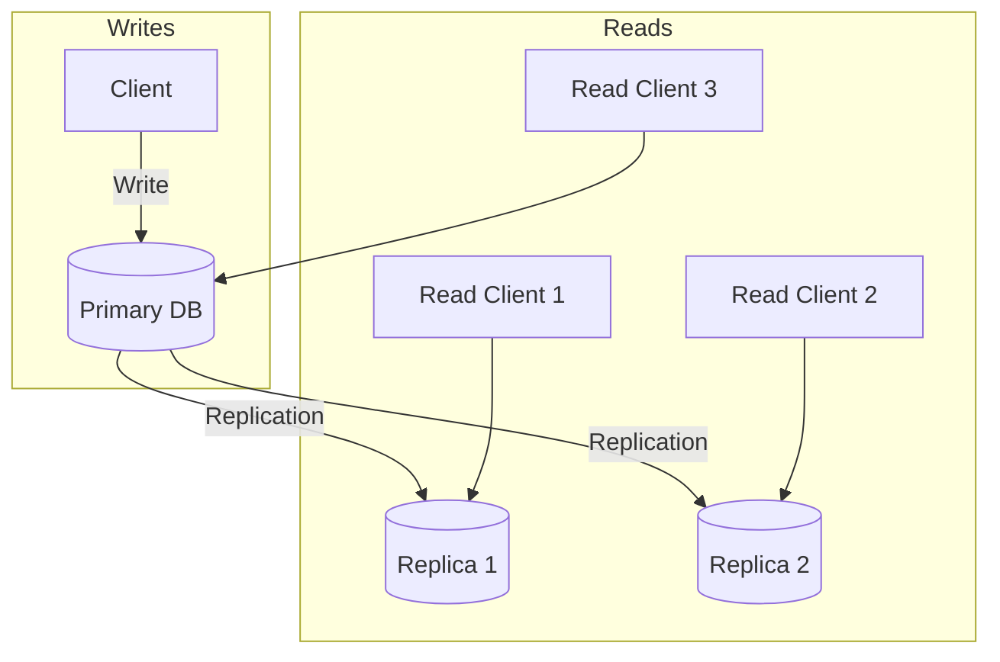

# Database Replication

Copying data across multiple database servers, for availability, read scaling, and geographic distribution.

---

## What is Replication?

Replication keeps copies of the same data on multiple database servers. When data changes on one server, the change propagates to the others.

```
Write → Primary → Replicate → Replica 1
                           → Replica 2
                           → Replica 3
```

Unlike sharding (which splits data across servers), replication puts the same data on multiple servers.

---

## Why Replicate?

### Availability

If the primary server dies, a replica can take over. Users don't lose access to data, and the system stays up while you fix the failed server.

Without replication: primary dies = complete outage until it's fixed.
With replication: primary dies = failover to replica, minimal downtime.

### Read Scaling

Most applications read more than they write. Replicas can handle read traffic, spreading the load.

One server handles 10,000 reads/second. Add two read replicas = 30,000 reads/second capacity.

### Geographic Distribution

Put replicas in different regions to reduce latency for users in those regions.

Primary in US-East, replica in EU-West. European users read from the EU replica with lower latency.

### Backup and Recovery

Replicas serve as live backups. Not a substitute for point-in-time backups, but faster recovery than restoring from a cold backup.

---

## How Replication Works

### Primary-Replica (Master-Slave)

The most common setup. One primary handles all writes. One or more replicas receive changes and handle reads.



**Writes:** Only to primary.
**Reads:** From primary or replicas.

### Write-Ahead Log (WAL) Replication

Most relational databases replicate by shipping the write-ahead log.

Every change is first written to a log (WAL). This log is streamed to replicas. Replicas replay the log to apply the same changes.

**Benefits:** Consistent replication of exact changes.
**Limitation:** Replicas must run the same database version (usually).

### Logical Replication

Replicates data by copying the actual data changes (like "insert row" or "update column") rather than exact disk bytes.

**Why it's easier:**
- **Flexible:** Works across different database versions (great for upgrades).
- **Selective:** You can replicate just one table instead of the whole database.

---

## Synchronous vs. Asynchronous Replication

This is one of the most important decisions in replication configuration.

### Asynchronous Replication

Primary confirms write to client before replica receives it.

```
1. Client writes to primary
2. Primary writes locally and confirms to client ✓
3. Primary sends change to replica (happens later)
4. Replica applies change
```

**Advantages:**
- Low write latency (doesn't wait for replicas)
- Performance not affected by slow replicas
- Default for most setups

**Disadvantages:**
- Replication lag (replicas may be behind)
- Data loss risk (if primary fails before replication, recent writes lost)
- Stale reads from replicas

### Synchronous Replication

Primary waits for **all** replicas to confirm before acknowledging the write.

**Trade-off:** Zero data loss, but if *any* replica is slow or down, the primary cannot write.

### Semi-Synchronous Replication

Primary waits for **at least one** replica (or a quorum) to confirm.

**Benefits:** Balances safety (data on at least 2 nodes) and performance (doesn't wait for everyone).
**Example:** 1 Synchronous Replica + 2 Asynchronous Replicas.

---

## Replication Lag

With asynchronous replication, replicas are behind the primary. The difference is replication lag.

### What Causes Lag

- Network latency between primary and replica
- Replica processing slower than primary write rate
- Heavy operations on replica (large queries)
- Replica catching up after restart

### Effects of Lag

**Stale reads:** User updates their profile, then reads it from a replica that hasn't received the update yet. They see the old data.

**Consistency issues:** User depends on data being updated. Replica hasn't caught up. Application makes wrong decision.

### Measuring Lag

Most databases report replication lag in their metrics. Important to monitor.

**Acceptable lag:** Depends on your application. For a social media feed, seconds of lag is fine. For account balances, it's not fine.

---

## Consistency Patterns with Replicas

### Read-Your-Writes

After you write something, you should see your own write.

**Problem:** You write to primary, then read from a replica that hasn't received your write. You think your write failed.

**Solutions:**
- Route your reads to primary for a short time after writing
- Record write timestamp, only read from replica if caught up
- Always read certain data from primary

### Monotonic Reads

Once you see version N of data, you should never see older versions.

**Problem:** Request 1 hits replica A (up to date), request 2 hits replica B (lagged). User sees data go backward.

**Solutions:**
- Sticky sessions (same user always to same replica)
- Version tracking (reject replica responses older than what you've seen)

### Consistent Prefix Reads

If A happened before B, you should never see B without A.

**Problem:** User 1 posts message, User 2 replies. Another user sees the reply but not the original message.

**Solutions:**
- Write related data together
- Keep causally related data on same replica

---

## Failover

When the primary fails, a replica must become the new primary.

### Automatic Failover

Orchestration system detects primary failure and promotes a replica.

**How it works:**
1. Monitor detects primary unresponsive
2. Coordinator selects a replica (usually most up-to-date)
3. Replica is promoted to primary
4. Other replicas switch to following new primary
5. Applications are directed to new primary

**Examples:**
- AWS RDS Multi-AZ: automatic failover in 1-2 minutes
- PostgreSQL with Patroni: automated failover with customizable policies
- MySQL with orchestrator

### Manual Failover

Operator decides when and which replica to promote. More control but slower and requires human availability.

### Failover Challenges

**Split brain:** Old primary comes back and thinks it's still primary. Now you have two primaries. Data diverges.

**Solution:** Fencing, ensure old primary can't accept writes (disconnect from network, kill process, revoke permissions).

**Data loss:** With async replication, promoted replica might be behind. Transactions on old primary but not replicated are lost.

**Solution:** Use synchronous replication for at least one replica. Or accept potential loss and have reconciliation procedures.

**Client reconnection:** Clients need to discover the new primary. DNS update, connection string change, or service discovery.

---

## Multi-Primary (Multi-Master) Replication

Multiple nodes can accept writes. Changes sync between them.

### When It's Used

- Active-active across regions (write locally in each region)
- High write availability (any node can accept writes)

### The Hard Problem: Conflicts

Two clients update the same row on different masters before sync. Now what?

**Conflict resolution strategies:**

**Last-write-wins:** Based on timestamp. Simplest but loses data.

**Application-level resolution:** Application defines how to merge conflicting updates. Complex but can be correct.

**Conflict-free replicated data types (CRDTs):** Data structures designed to merge automatically.

### When to Avoid Multi-Primary

Most applications should use single-primary. Multi-primary adds significant complexity and is only worth it when:
- You truly need write capability in multiple regions for latency
- You can handle conflict resolution correctly

If eventual consistency is fine for your cross-region needs, async replication from a single primary is simpler.

---

## Read Replica Patterns

### All Reads to Replicas

Primary handles only writes. All reads go to replicas.

**Good for:** Very read-heavy workloads.
**Challenge:** Consistency. Reads might see stale data.

### Primary for Recent, Replica for Historical

Reads that need up-to-date data go to primary. Historical or less time-sensitive reads go to replicas.

**Example:** User's own recent orders → primary. Analytics on old orders → replicas.

### Replica for Reporting and Analytics

Replicas handle heavy analytics queries that would impact primary performance.

Running a report that scans millions of rows? Do it on a replica so the primary stays responsive for the application.

---

## Configuring Replication

### PostgreSQL

**Streaming replication:** Continuous WAL streaming. Low lag.

Configuration involves:
- Primary: `postgresql.conf` settings for WAL level and replication slots
- Replica: `recovery.conf` or newer configuration to connect to primary

### MySQL

**Binary log replication:** MySQL replicates via binary log.

Configuration involves:
- Primary: Enable binary logging, create replication user
- Replica: Configure to connect to primary and start replication

### Managed Services

AWS RDS, Cloud SQL, Azure Database: just check a box for read replicas. The setup is handled for you.

For Multi-AZ high availability, enable the option and AWS handles failover.

---

## Common Mistakes

**Not monitoring replication lag.** Lag grows unnoticed until it causes visible problems. Alert on lag exceeding thresholds.

**Reading from replica immediately after write.** User doesn't see their own update. Handle read-your-writes explicitly.

**Assuming replicas are for failover without testing.** Your failover mechanism doesn't work because you never tested it. Test failover regularly.

**Too many read replicas.** Each replica needs to apply all writes. Too many replicas actually increases primary load (each needs the WAL). Usually 2-5 is plenty.

**Not handling failover in application.** Primary dies, application keeps trying to connect to old primary. Applications need to discover the new primary.

**Multi-primary without understanding conflicts.** Conflicts happen. If your application doesn't handle them, you silently lose or corrupt data.

---

## What An Experienced Senior Engineer Thinks About

**Consistency guarantees for different data.** Not all data needs the same consistency. Account balances → read from primary. User preferences → replica is fine. Design intentionally.

**Replication topology.** Chain replication (primary → replica A → replica B) reduces primary load but increases lag for downstream replicas. Star topology (primary → all replicas) has consistent lag but more load on primary.

**Cross-region replication latency.** WAL shipping across continents takes 100+ ms per round trip. This affects both lag and synchronous replication viability.

**Failover automation level.** Automatic failover vs. manual. Automatic is faster but can have false positives. Manual is slower but more controlled. Choose based on risk tolerance.

**Disaster recovery vs. high availability.** HA (same region, automatic failover) vs. DR (different region, may be manual). They're different concerns. HA for uptime, DR for regional disasters.

---

## Vibe Engineering Guide

When prompting about replication:

**Less useful:**
> "Set up replication for my database"

**More useful:**
> "I have a PostgreSQL database on AWS RDS (single-AZ). I want to:
> - Add a read replica for reporting queries that are slowing down the primary
> - Have automatic failover if the primary fails
> - Understand the consistency implications for my application
>
> What should I configure and what should my application code handle?"

**For specific scenarios:**
> "Users report sometimes seeing old data after updating their profile. We use PostgreSQL with an async read replica. Writes go to primary, reads are load-balanced across primary and replica. How do I ensure read-your-writes consistency while still using the replica?"

**For architecture:**
> "We have users in US and Europe. Database is in US-East. European users experience high latency. Options: add a read replica in EU, or multi-primary. Our data requires consistency for some operations (orders) but not others (product catalog). How should we approach this?"

---

## Quick Check

<details>
<summary><b>What's the difference between synchronous and asynchronous replication?</b></summary>

Synchronous: primary waits for replica confirmation before confirming write. No data loss on failover, but higher latency. Asynchronous: primary confirms immediately, replica catches up later. Lower latency, but can lose recent writes on failover.

</details>

<details>
<summary><b>What is replication lag?</b></summary>

The delay between a write on the primary and that write appearing on replicas. During this window, replicas have stale data. Can range from milliseconds to minutes depending on load and configuration.

</details>

<details>
<summary><b>What's the read-your-writes problem?</b></summary>

User writes to primary, then reads from a replica that hasn't received the write yet. They see old data and think their write failed. Solutions: route reads to primary temporarily after writes, or check replica is caught up before reading.

</details>

<details>
<summary><b>When would you use multi-primary replication?</b></summary>

When you need write capability in multiple geographic regions for latency reasons, and you can handle conflict resolution correctly. For most applications, single-primary with read replicas is simpler and sufficient.

</details>

<details>
<summary><b>What is split-brain and how do you prevent it?</b></summary>

When both the old primary and new primary think they're the primary, accepting writes that will conflict. Prevent with fencing: ensure old primary can't accept writes (network isolation, process termination, permission revocation).

</details>

---

Next: [Sharding](03-sharding.md)
