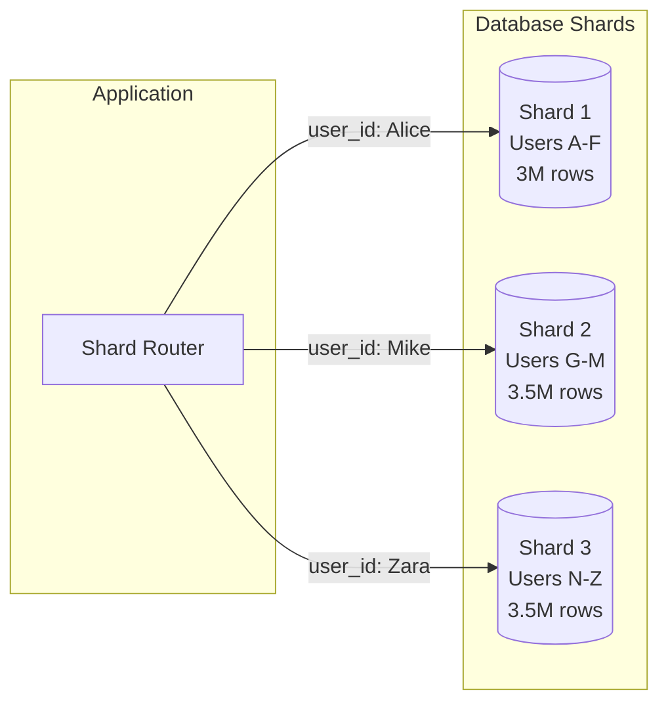

# Sharding

Splitting data across multiple databases when one database isn't enough.

---

## What is Sharding?

Sharding is partitioning data horizontally across multiple database instances. Each shard holds a portion of the data.

Unlike replication (same data on multiple servers), sharding puts different data on different servers.



Each shard is a complete database. Together they hold the full dataset.

---

## When Do You Need Sharding?

Sharding is complex. Don't do it until you must.

### Signs You Actually Need Sharding

**Data volume exceeds single-server capacity:**
- Database size exceeds what fits on reasonable hardware (multi-terabytes)
- Disk I/O is the bottleneck and can't be improved with better hardware

**Write volume exceeds single-server capacity:**
- Writes saturate one server (typically 10,000+ writes/second sustained)
- Vertical scaling and optimization have been exhausted

**Very specific isolation requirements:**
- Multi-tenant where tenants must be physically separated
- Regulatory requirements for data residency

### Signs You Don't Need Sharding Yet

- Database is under a few hundred gigabytes
- Vertical scaling (bigger server) would help
- Query optimization (indexes, query rewriting) would help
- Read replicas would handle the read load
- Write volume is moderate (under 10k writes/sec)

A well-tuned single PostgreSQL server handles millions of rows and thousands of queries per second. Most applications never outgrow this.

---

## The Cost of Sharding

Sharding isn't free. It adds significant complexity.

### What Becomes Harder

**Joins across shards:** If data is on different shards, you can't join it at the database level. Application must query multiple shards and join in memory.

**Transactions across shards:** Traditional ACID transactions don't work across shards. You need distributed transactions or design around this.

**Queries without shard key:** A query like "find all orders today" needs to ask every shard. Called a scatter-gather query. Slow as you add shards.

**Resharding:** Adding or removing shards requires moving data. This is a significant operational undertaking.

**Operational complexity:** More databases to manage, monitor, back up, upgrade.

### What This Means

Every query and transaction must be designed with sharding in mind. The shard key determines which shard has the data. Queries must include the shard key when possible.

This isn't a transparent optimization. It changes how you architect your application.

---

## Sharding Strategies

### Range-Based Sharding

Divide by ranges of the shard key.

```
user_id 1 - 999,999 → Shard A
user_id 1,000,000 - 1,999,999 → Shard B
user_id 2,000,000 - 2,999,999 → Shard C
```

**Advantages:**
- Simple to understand and implement
- Range queries within a shard stay on that shard

**Disadvantages:**
- Uneven distribution if data isn't uniformly distributed
- "Hot" shards if recent data is accessed more (e.g., new users more active)
- Adding ranges requires planning

### Hash-Based Sharding

Hash the shard key, use the result to assign to a shard.

```
shard = hash(user_id) % number_of_shards
```

**Advantages:**
- Distributes data evenly
- No hotspots from sequential keys

**Disadvantages:**
- Range queries must hit all shards
- Adding shards changes the hash calculation → resharding

### Directory-Based Sharding

A lookup service maps keys to shards.

```
user_id 12345 → lookup table → Shard B
```

**Advantages:**
- Flexible - can move individual keys between shards
- Can implement any sharding logic

**Disadvantages:**
- Extra lookup for every request
- Lookup service is a dependency and potential bottleneck

### Consistent Hashing

A hash ring that minimizes data movement when shards are added or removed.

**Advantages:**
- Adding a shard only moves some data, not everything
- Used by many distributed systems (DynamoDB, Cassandra)

**Disadvantages:**
- More complex to implement
- Can still have imbalance (use virtual nodes to improve)

---

## Choosing a Shard Key

The shard key is the most important decision. Choose wrong and you'll have serious problems.

### Characteristics of a Good Shard Key

**High cardinality:** Many unique values. Sharding by a boolean doesn't help.

**Even distribution:** Data spreads evenly across shards. User_id is often good. Country might not be (some countries have far more users).

**Frequently in queries:** The shard key should be in most of your queries. This lets you route to a single shard instead of asking all shards.

**Stable:** The shard key shouldn't change for existing records. Changing a shard key means moving the record between shards.

### Common Shard Keys

**User ID:** Good for user-centric applications. All data for one user on one shard.

**Tenant ID:** Good for multi-tenant SaaS. Each tenant's data isolated on their shard.

**Geographic region:** Good when data residency matters.

**Time-based:** Can work for append-only data (logs, events). But be careful - recent data becomes a hot shard.

### Bad Shard Keys

**Low cardinality:** Status, type, boolean. You can't split 3 values across 100 shards evenly.

**Skewed distribution:** Country where 80% of users are in one country. That shard has 80% of the load.

**Rarely in queries:** If queries don't include the shard key, every query hits all shards.

**Hotspot-prone:** Timestamp when queries hit recent data. One shard handles all recent traffic.

---

## Cross-Shard Queries

When a query can't be routed to a single shard, it must go to all shards.

### Scatter-Gather

Query is sent to all shards. Results are gathered and merged.

```
"Find all orders from today"
  → Query Shard 1 → results
  → Query Shard 2 → results
  → Query Shard 3 → results
  → Merge results
```

**Problems:**
- Latency = slowest shard + merge time
- Load multiplies by number of shards
- Scales poorly as shards increase

### Mitigation

**Design to avoid cross-shard queries:** Structure data so most queries hit one shard. Include shard key in most operations.

**Denormalize:** Copy data to where it's needed. Trade storage for query simplicity.

**Accept slow queries for some use cases:** Analytics and reporting can use batch jobs that query all shards. Not for user-facing latency-sensitive requests.

**Create global indexes:** Maintain a separate index of all data that needs cross-shard lookup. Adds consistency complexity.

---

## Cross-Shard Transactions

Traditional ACID transactions don't work across shards.

### The Problem

You want to atomically update rows on different shards. Database doesn't support this - each shard is a separate database.

### Options

**Avoid cross-shard transactions:** Design data so related items are on the same shard. User and their orders on the same shard.

**Two-phase commit (2PC):** Coordinator asks shards to prepare, then commit. Provides atomicity but:
- Slow (multiple round trips)
- Blocking (if coordinator fails during commit, participants are stuck)
- Often not supported or practical

**Saga pattern:** Sequence of local transactions with compensating actions for rollback. Each step is atomic. If step N fails, run compensating actions for steps 1 to N-1.

**Eventual consistency:** Accept that shards may be temporarily inconsistent. Design for reconciliation.

For most sharded systems, the approach is: shard to avoid cross-shard transactions + saga for cases where cross-shard coordination is necessary.

---

## Resharding

Eventually you need more shards (growth) or different sharding (strategy was wrong). Moving data between shards is resharding.

### Why Resharding is Hard

**Data is live:** You can't just stop, copy, restart. Users are making requests.

**Consistency during migration:** Old and new sharding must both work during transition.

**Scale of data:** Moving terabytes takes time. Problems can occur mid-migration.

### Approaches

**Online migration:**
1. Add new shards
2. Start writing to both old and new locations (dual-write)
3. Backfill old data to new locations
4. Verify data matches
5. Switch reads to new shards
6. Stop writes to old shards
7. Remove old shards

**Shadow migration:** Similar but writes to new locations are async. Catches up over time.

**Consistent hashing:** Minimizes data movement. Only some keys need to move when shards change.

### Prevention

**Start with more shards than you need.** Resharding from 3 to 10 is harder than just starting with 10 and filling them gradually.

**Use consistent hashing.** Built-in support for adding capacity with minimal movement.

**Use managed sharded databases.** Systems like Vitess, CockroachDB, or Spanner handle resharding automatically.

---

## Sharding in Practice

### Application-Level Sharding

Your application includes the sharding logic. It calculates which shard to query and routes accordingly.

**Advantages:** Full control, works with any database.
**Disadvantages:** Every database operation must be shard-aware. Complexity in application code.

### Sharding Middleware

A layer between application and databases handles routing.

**Examples:** Vitess (MySQL), Citus (PostgreSQL extension), ProxySQL.

**Advantages:** Application code is simpler. Middleware handles routing.
**Disadvantages:** Another layer to operate. May have limitations.

### Natively Sharded Databases

Some databases are designed for sharding from the start.

**CockroachDB:** Distributed SQL, automatic sharding.
**TiDB:** MySQL-compatible, distributed.
**Google Spanner:** Globally distributed, strongly consistent.
**MongoDB:** Built-in sharding for document store.
**Cassandra:** Wide-column store with partitioning.

**Advantages:** Sharding is the expected usage model. Cross-shard features may be supported.
**Disadvantages:** Different from traditional databases. Learning curve.

---

## Common Mistakes

**Premature sharding:** Adding complexity before you need it. A single well-tuned database goes very far.

**Wrong shard key:** Choosing a key with poor distribution or that's not in most queries. Very hard to fix later.

**Ignoring cross-shard complexity:** Designing as if joins and transactions will just work. They won't.

**Not planning for resharding:** Assuming your initial shard count is permanent. Growth will require changes.

**Inconsistent sharding logic:** Different parts of the application route differently. Data ends up in wrong places.

**Sharding before optimization:** Query optimization, indexing, and caching should come before sharding.

---

## What An Experienced Senior Engineer Thinks About

**Shard key selection is the critical decision.** It determines query patterns, data locality, and what operations are easy or hard. Get it wrong and you may need to reshard (painful) or live with constant cross-shard overhead.

**Sizing shards.** How big should each shard be? Big enough to be worth the overhead, small enough to be manageable. General starting point: plan for shards that can grow to a few hundred GB without issues.

**Hotspots.** Even with good shard key selection, hotspots can emerge. Monitor shard load. Some systems support splitting hot shards.

**Global vs. sharded tables.** Some data should not be sharded (reference data, configuration). Replicate it to all shards or keep it in a global table.

**Operational burden.** N shards = N times the backups, upgrades, monitoring. This is a real cost. Don't shard more than necessary.

**Sharding as last resort.** Before sharding: optimize queries, add indexes, add caching, add read replicas, vertically scale. Sharding is for when you've exhausted other options or truly need the data isolation.

---

## Vibe Engineering Guide

When prompting about sharding:

**Less useful:**
> "How do I shard my database?"

**More useful:**
> "I have a multi-tenant SaaS application. Each tenant has their own data that never joins with other tenants. PostgreSQL is approaching its practical limits (2TB, 10k writes/sec). Team is 4 engineers. Should I shard by tenant_id? What changes do I need in application code? How do I handle tenant migration between shards if needed?"

**For shard key decisions:**
> "I'm designing sharding for an e-commerce system. Data includes users, orders, products, and payments. Most queries are: user's orders, order details, product catalog. Product catalog is read-heavy and shared. User orders are isolated per user. How should I think about what to shard and what shard key to use?"

**For cross-shard problems:**
> "We sharded by user_id, but now we need a 'find orders by product across all users' feature for a dashboard. This requires querying all shards. How do approaches like secondary indexes or denormalization help here?"

---

## Quick Check

<details>
<summary><b>When do you actually need sharding?</b></summary>

When data volume exceeds single-server capacity (multi-terabytes) or write volume exceeds single-server throughput (10k+ writes/sec sustained). Most applications never need it - single database with optimization, caching, and read replicas handles a lot.

</details>

<details>
<summary><b>What's the difference between sharding and replication?</b></summary>

Sharding: different data on different servers (horizontal partition). Replication: same data on multiple servers (copies). They're often combined - each shard is replicated.

</details>

<details>
<summary><b>What makes a good shard key?</b></summary>

High cardinality (many unique values), even distribution (no hotspots), frequently in queries (so you can route to one shard), and stable (doesn't change for existing records).

</details>

<details>
<summary><b>Why are cross-shard queries problematic?</b></summary>

They must query all shards and merge results. Latency is the slowest shard. Load multiplies by shard count. This defeats the scaling benefit if too many queries work this way.

</details>

<details>
<summary><b>Why is resharding hard?</b></summary>

Data is live - users are making requests. You need to migrate data while maintaining consistency. The data volume is large. Requires careful coordination of dual-writes and switchover.

</details>

---

Next: [Choosing a Database](04-choosing-database.md)
