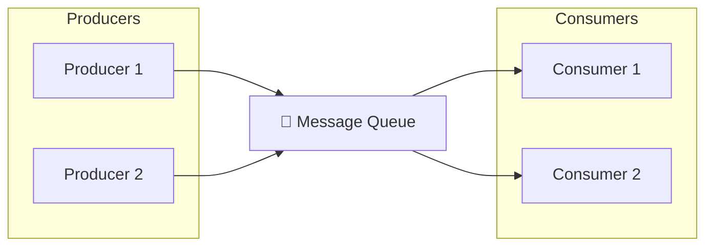

# Message Queues

Asynchronous communication between services, decoupling components, handling traffic spikes, and processing work reliably.

---

## What is a Message Queue?

A message queue is middleware that allows services to communicate by sending messages through a queue rather than calling each other directly.



The producer puts a message in the queue and moves on. It doesn't wait for the consumer. The consumer processes messages at its own pace.

---

## Why Use a Message Queue?

### Decoupling

Services don't need to know about each other. The producer puts a message in a queue. It doesn't know or care who consumes it.

**Without queue:**
```
OrderService.createOrder()
  → EmailService.sendConfirmation()    // OrderService must know about EmailService
  → InventoryService.reserve()         // And InventoryService
  → AnalyticsService.trackOrder()      // And AnalyticsService
```

**With queue:**
```
OrderService.createOrder()
  → Publish message: "OrderCreated"

EmailService, InventoryService, AnalyticsService each subscribe independently
```

Adding a new consumer doesn't require changing the producer.

### Handling Traffic Spikes

A traffic spike that would overwhelm a service directly instead fills up the queue. The consumer processes at its sustainable rate.

**Without queue:** 10x traffic spike hits your service → service falls over.
**With queue:** 10x traffic spike fills up queue → consumer works through backlog gradually.

The queue acts as a buffer.

### Reliability

If the consumer is temporarily down, messages wait in the queue. When the consumer comes back, it processes them. Work isn't lost.

**Without queue:** Consumer down → requests fail.
**With queue:** Consumer down → messages wait → consumer restarts → messages processed.

### Async Processing

Some work takes time but doesn't need an immediate response. Move it off the request path.

**Synchronous (slow for user):**
```
User uploads image
→ Server resizes to 5 different sizes (takes 30 seconds)
→ Returns to user
```

**Async (fast for user):**
```
User uploads image
→ Server puts message in queue with image reference
→ Returns to user immediately

Worker picks up message
→ Resizes to 5 different sizes
→ Stores results
```

The user doesn't wait for slow operations.

---

## Core Concepts

### Message

A message is a unit of data passed through the queue. It includes:
- **Body:** The payload (JSON, binary, etc.)
- **Metadata:** Headers, timestamps, routing information

Messages are typically small (KB to MB). For large data, put it in storage and send a reference.

### Producer

The service that creates and sends messages. It doesn't know who will consume them.

### Consumer

The service that receives and processes messages. There can be multiple consumers.

### Queue / Topic

**Queue:** Messages go to one consumer. If multiple consumers exist, each message goes to only one (work is divided).

**Topic:** Messages go to all subscribers. Each subscriber gets every message (fanout).

### Broker

The infrastructure that manages queues and routes messages. Examples: RabbitMQ, Kafka, AWS SQS.

---

## Messaging Patterns

### Point-to-Point (Work Queue)

One message goes to one consumer.

```
Producer ──► [Msg1, Msg2, Msg3] ──► One of: Consumer A, Consumer B, Consumer C
```

Each message is processed once. Add more consumers to process faster.

**Use cases:**
- Background job processing
- Task distribution
- Work that should happen exactly once

### Publish-Subscribe (Fanout)

One message goes to all subscribers.

```
Publisher ──► Topic ──┬─► Subscriber A (gets all messages)
                      ├─► Subscriber B (gets all messages)
                      └─► Subscriber C (gets all messages)
```

Each subscriber gets every message independently.

**Use cases:**
- Notifications (multiple services care about an event)
- Event distribution
- Cache invalidation across services

---

## Delivery Guarantees

How sure can you be that messages are delivered?

### At-Most-Once

Message might be lost but won't be delivered twice.

**How:** Send and forget. No acknowledgment, no retry.
**Risk:** Message loss on network issue or consumer crash.
**Use when:** Loss is acceptable (logging, analytics where some loss is fine).

### At-Least-Once

Message will be delivered, but might be delivered multiple times.

**How:** Broker waits for consumer acknowledgment. If not received (timeout, crash), broker redelivers.
**Risk:** Same message might be processed twice.
**Use when:** You can handle duplicates. This is the default for most systems.

### Exactly-Once

Message delivered exactly once. No loss, no duplicates.

**How:** Requires coordination between broker and consumer. Often through idempotency keys or transactions.
**Reality:** Hard to achieve. Usually means "at-least-once with idempotent consumers."
**Use when:** Critical operations that can't tolerate duplicates or loss.

**Practical approach:** Use at-least-once and make consumers idempotent - processing the same message twice has the same effect as processing once.

---

## Making Consumers Idempotent

Since most systems deliver at-least-once, consumers must handle duplicates.

**Strategies:**

**Check before processing:** Before processing, check if you've already handled this message ID.

**Use natural idempotency:** Some operations are naturally idempotent.
- `SET user.balance = 100` is idempotent (doing it twice gives the same result)
- `ADD 100 to user.balance` is not idempotent (doing it twice doubles the effect)

**Idempotency keys:** Store a record of processed message IDs. Skip if already seen.

**Database transactions:** Include message ID in a unique constraint. Second processing fails to insert.

---

## Acknowledgment and Retries

### How Acknowledgment Works

1. Consumer receives message from queue
2. Consumer processes message
3. Consumer sends acknowledgment to broker
4. Broker removes message from queue

If consumer crashes before acknowledging, broker redelivers to another consumer (or the same one after restart).

### Visibility Timeout

Many queues use visibility timeout:
1. Consumer receives message
2. Message becomes invisible to other consumers for X seconds
3. If acknowledged, message is deleted
4. If not acknowledged within timeout, message becomes visible again (redelivery)

Configure timeout longer than your processing time. If processing takes 30 seconds, use a 60+ second timeout.

### Retry Strategies

Transient failures should be retried. But how?

**Immediate retry:** Try again right away. Good for brief glitches.

**Exponential backoff:** Wait 1s, then 2s, then 4s, then 8s. Prevents hammering a recovering service.

**Max retries:** Give up after N attempts. Send to dead letter queue for investigation.

---

## Dead Letter Queue (DLQ)

When a message can't be processed after max retries, where does it go?

A dead letter queue stores failed messages for later investigation. Without it, bad messages might:
- Loop forever (retry indefinitely)
- Disappear silently (discarded after failures)

**With DLQ:**
- Failed messages are captured
- You can inspect them to understand the failure
- You can replay them after fixing the issue

Always configure a DLQ for production queues.

---

## Message Ordering

Do messages arrive in the order they were sent?

### Standard Queues (Most Systems)

Messages are generally in order, but not strictly guaranteed. Under load or after retries, order can shuffle.

**SQS Standard:** Best-effort ordering. May receive out of order.
**RabbitMQ (default):** Generally preserves order per queue, but not guaranteed across failures.

### FIFO Queues

Strict first-in-first-out ordering within a message group.

**SQS FIFO:** Guarantees order. Lower throughput (~3,000 messages/sec vs. unlimited for standard).
**Kafka:** Ordered within a partition. Messages with same key go to same partition.

**Trade-off:** Strict ordering limits throughput. Only use when order actually matters.

### When Order Matters

- Events that must be processed in sequence (state machine transitions)
- Financial transactions
- Operations where later events depend on earlier ones

If order doesn't matter, use standard queues for better throughput.

---

## Scaling Consumers

### Adding Consumers

With work queues, add more consumers to process faster. Each message goes to one consumer, so adding consumers divides the work.

```
Queue ──┬─► Consumer 1
        ├─► Consumer 2
        └─► Consumer 3
```

Three consumers process roughly 3x faster than one.

### Consumer Groups (Kafka)

In Kafka, consumers are organized in groups. Each partition is processed by one consumer in the group. To scale, add partitions and consumers.

### Concurrency Considerations

When adding consumers:
- Watch for ordering violations (parallel processing can reorder)
- Watch for thundering herd on downstream dependencies
- Consider whether downstream services can handle increased load

Scaling consumers faster than downstream services can handle just moves the bottleneck.

---

## Common Implementations

### AWS SQS (Simple Queue Service)

**What it is:** Managed queue service.

**Strengths:**
- No servers to manage
- Scales automatically
- Pay per message
- Simple API

**Considerations:**
- Standard queues have at-least-once delivery, possible reordering
- FIFO queues have strict ordering, lower throughput
- Max message size 256KB

**Good for:** Most background job use cases, decoupling services on AWS.

### RabbitMQ

**What it is:** Full-featured message broker.

**Strengths:**
- Flexible routing (exchanges, bindings)
- Multiple protocols (AMQP, MQTT)
- Plugins for various patterns
- Can run on-premises or cloud

**Considerations:**
- You manage it (or use managed service like CloudAMQP)
- Single broker limits

**Good for:** Complex routing needs, non-AWS environments, when you need more control.

### Apache Kafka

**What it is:** Distributed streaming platform.

**Strengths:**
- Very high throughput (millions of messages/sec)
- Persistent storage (messages retained)
- Replay capability
- Partitioning for parallelism

**Considerations:**
- More complex to operate than SQS
- Better for high-volume, event streaming scenarios
- Overkill for simple job queues

**Good for:** Event streaming, log aggregation, high-volume data pipelines.

### Redis Streams / Pub/Sub

**What it is:** Redis can function as a simple message queue.

**Strengths:**
- Low latency
- Simple if you're already using Redis

**Considerations:**
- Less durable than dedicated queue systems
- Fewer features than dedicated brokers

**Good for:** Simple cases, real-time messaging when durability isn't critical.

---

## Common Mistakes

**Not handling duplicates.** Assuming exactly-once when you have at-least-once. Double-processing causes bugs.

**No dead letter queue.** Bad messages either loop forever or disappear. You can't investigate failures.

**Synchronous mindset.** Waiting for processing to complete defeats the purpose. If you need a response, queues may not be the right pattern.

**No monitoring.** Queue depth growing = consumers can't keep up. You wouldn't know without monitoring.

**Processing in transaction boundaries.** If your consumer does database work and fails after DB commit but before ack, message replays and work is duplicated.

**Wrong visibility timeout.** Timeout shorter than processing time → message reappears while still processing → duplicate processing.

**Over-engineering.** Sometimes a simple database table with a status column is enough. Don't add Kafka for 100 messages/day.

---

## What An Experienced Senior Engineer Thinks About

**Exactly-once semantics.** True exactly-once is very hard. Most of the time, "at-least-once with idempotent consumers" is the practical path.

**Backpressure.** What happens when consumers can't keep up? Queue depth grows. At some point, you need to either scale consumers, slow producers, or shed load.

**Poison messages.** A message that crashes the consumer. Consumer restarts, gets same message, crashes again. Circuit breakers and dead letter queues handle this.

**Message versioning.** Producers and consumers deploy independently. What happens when message format changes? Version your messages and handle multiple versions.

**Observability.** Track: queue depth, messages published, messages consumed, processing time, failure rate. Alert on growing queue depth or rising failures.

**Transactional outbox.** To ensure a database change and message publish happen together: write to an outbox table in the same transaction, then publish from there. Prevents inconsistencies.

---

## Vibe Engineering Guide

When prompting about message queues:

**Less useful:**
> "Add a message queue to my app"

**More useful:**
> "I have a web app where users upload images. Currently, image processing (resize, generate thumbnails) blocks the request and takes 10 seconds. I want to:
> - Return immediately to the user
> - Process images in background workers
> - Handle failures with retries
> - Not duplicate process the same image
>
> We're on AWS. Should I use SQS? How do I structure this?"

**For architecture:**
> "We're considering Kafka vs. SQS for order events. We process ~10k orders/day, expect 10x growth. Multiple services need to react to orders (inventory, shipping, analytics). What are the trade-offs for our scale?"

**For troubleshooting:**
> "Our SQS queue depth keeps growing. Consumer Lambda processes successfully but queue isn't draining. Visibility timeout is 30 seconds, processing takes 5 seconds on average. What might cause this?"

---

## Quick Check

<details>
<summary><b>Why use a message queue instead of direct calls?</b></summary>

Decoupling (producer doesn't know about consumers), handling traffic spikes (queue absorbs bursts), reliability (messages wait if consumer is down), and async processing (user doesn't wait for slow operations).

</details>

<details>
<summary><b>What's the difference between at-least-once and exactly-once delivery?</b></summary>

At-least-once: message will be delivered, but might be delivered multiple times. Exactly-once: delivered exactly once with no duplicates. Most systems are at-least-once; consumers should be idempotent to handle duplicates.

</details>

<details>
<summary><b>What's a dead letter queue?</b></summary>

A queue where messages go after exceeding max retries. Allows you to inspect failures, understand what went wrong, and potentially replay after fixes. Without it, bad messages either loop forever or are silently lost.

</details>

<details>
<summary><b>When would you use Kafka over SQS?</b></summary>

Kafka for: very high throughput, event streaming, log aggregation, when you need message replay or retention. SQS for: simpler job queues, lower volume, when you want managed service without operational overhead.

</details>

<details>
<summary><b>Why must consumers be idempotent?</b></summary>

Because most queues deliver at-least-once. The same message might be delivered twice (network hiccup, consumer crash before ack). If processing isn't idempotent, you get double-charges, duplicate records, etc.

</details>

---

Next: [Event-Driven Architecture](02-event-driven.md)
