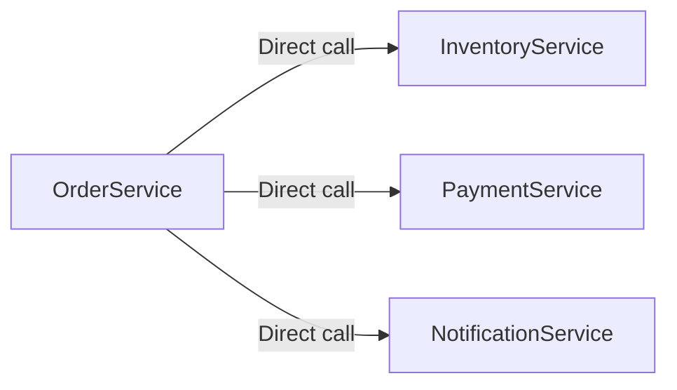
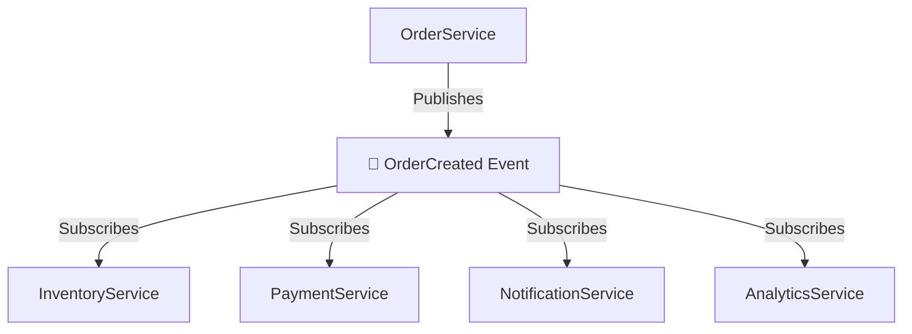

# Event-Driven Architecture

Building systems that react to events decoupling, scalability, and real-time responsiveness.

---

## What is Event-Driven Architecture?

In event-driven architecture, systems communicate by producing and consuming events rather than by direct calls.

**Traditional approach (Tight Coupling):**



OrderService directly calls each service. Tight coupling.

**Event-driven approach (Loose Coupling):**



OrderService doesn't know or care who consumes the event.

---

## Why Event-Driven?

### Decoupling

Producers don't know about consumers. Add new consumers without changing producers.

Want to add analytics when orders are created? Subscribe to OrderCreated. No code changes to OrderService.

### Scalability

Event processing can be distributed. Multiple consumers process events in parallel. Add more consumers to handle more load.

### Resilience

If a consumer is temporarily down, events wait in the queue. When it comes back, it catches up. No lost work.

### Real-Time Responsiveness

Events enable reactive systems. Something happens → other systems respond immediately.

---

## Core Concepts

### Event

A record of something that happened.

```json
{
  "eventType": "OrderCreated",
  "timestamp": "2024-01-15T10:30:00Z",
  "data": {
    "orderId": "order-123",
    "userId": "user-456",
    "total": 99.99
  }
}
```

Events are:
- **Immutable:** They represent something that happened, can't be changed
- **Named in past tense:** OrderCreated, PaymentProcessed, UserRegistered
- **Self-contained:** Include all data needed to process

### Producer

The service that creates and publishes events. Doesn't know who (if anyone) will consume them.

### Consumer

A service that subscribes to events and reacts to them.

### Event Broker

Infrastructure that routes events from producers to consumers. Examples: Kafka, RabbitMQ, AWS EventBridge.

### Topic/Channel

A named category of events. Consumers subscribe to topics they care about.

---

## Event Patterns

### Event Notification

Minimal event: something happened, here's the ID. Consumer fetches details if needed.

```json
{
  "eventType": "OrderCreated",
  "orderId": "order-123"
}
```

**Pro:** Small events, single source of truth.
**Con:** Consumer must call back to get details (coupling, latency).

### Event-Carried State Transfer

Event includes the data. Consumer doesn't need to call back.

```json
{
  "eventType": "OrderCreated",
  "data": {
    "orderId": "order-123",
    "items": [...],
    "total": 99.99,
    "shippingAddress": {...}
  }
}
```

**Pro:** Consumer is fully decoupled.
**Con:** Larger events, data might become stale.

### Event Sourcing

Store all events as the source of truth. Current state is derived by replaying events.

```
Events:
1. AccountOpened(id=123, name="Alice")
2. MoneyDeposited(id=123, amount=100)
3. MoneyWithdrawn(id=123, amount=30)

Current state: Account 123, balance $70
```

**Pro:** Full history, can rebuild state at any point, auditable.
**Con:** More complex, must handle event versioning.

### CQRS (Command Query Responsibility Segregation)

Separate write model from read model. Write side processes commands. Events update read-optimized views.

**Pro:** Optimize reads and writes independently.
**Con:** Eventual consistency between write and read models.

---

## Designing Events

### Naming

Use past tense. Events happened.

**Good:** OrderCreated, PaymentFailed, UserEmailVerified
**Bad:** CreateOrder, FailPayment, VerifyEmail

### Content

Include what's needed to process - but not everything.

```json
{
  "eventId": "evt-789",
  "eventType": "OrderShipped",
  "timestamp": "2024-01-15T14:00:00Z",
  "version": "1.0",
  "source": "shipping-service",
  "data": {
    "orderId": "order-123",
    "trackingNumber": "1Z999AA10123456784",
    "carrier": "UPS",
    "estimatedDelivery": "2024-01-17"
  }
}
```

### Versioning

Events evolve. Include version. Design for backward compatibility.

**Adding fields:** Usually safe. Old consumers ignore new fields.
**Removing fields:** Breaking. Old consumers expect them.
**Changing meaning:** Dangerous. Use new event type instead.

---

## Message Brokers

### Apache Kafka

Distributed streaming platform.

**Characteristics:**
- Very high throughput (millions of messages/sec)
- Persistent storage (replay old events)
- Ordered within partition
- Consumer groups for scaling

**Best for:** High-volume event streaming, event sourcing, log aggregation.

### RabbitMQ

Traditional message broker.

**Characteristics:**
- Feature-rich routing (exchanges, bindings)
- Multiple protocols
- Good for varied messaging patterns

**Best for:** Complex routing needs, lower-volume messaging.

### AWS EventBridge

Serverless event bus.

**Characteristics:**
- Fully managed
- Schema registry
- Integration with AWS services
- Rules for routing

**Best for:** AWS environments, connecting AWS services.

### AWS SQS + SNS

Simple queue + pub/sub.

**SQS:** Point-to-point queue.
**SNS:** Pub/sub topic that fans out to SQS queues or other targets.

**Best for:** Simple decoupling on AWS.

---

## Consumer Patterns

### Competing Consumers

Multiple consumers share the work. Each message goes to one consumer.

```
Topic → Consumer A processes message 1
     → Consumer B processes message 2
     → Consumer A processes message 3
```

Scale by adding consumers.

### Fan-Out

Each message goes to all subscribers.

```
Topic → Consumer A gets all messages
     → Consumer B gets all messages
     → Consumer C gets all messages
```

Good for: different services reacting to same events.

### Consumer Groups (Kafka)

Consumers in a group share partitions. Scale out by adding consumers to the group.

```
Partition 0 → Consumer A
Partition 1 → Consumer B
Partition 2 → Consumer A
```

Add Consumer C → rebalance.

---

## Handling Failures

### At-Least-Once Delivery

Most systems guarantee at-least-once. Message might be delivered multiple times (on retry).

**Solution:** Make consumers idempotent.

```
Process "OrderCreated" for order-123
  Check: already processed order-123?
    Yes → skip
    No → process, mark as seen
```

### Dead Letter Queue

When message processing fails repeatedly, move to DLQ for investigation.

Without DLQ: bad message blocks processing or is lost.
With DLQ: processing continues, bad messages are captured.

### Ordering

Events might arrive out of order, especially with retries.

**Solutions:**
- Use partition keys (Kafka orders within partition)
- Include sequence numbers
- Design handlers to be order-independent when possible

---

## Common Mistakes

**Synchronous mindset.** Expecting immediate results. Event-driven is async - producer doesn't wait for consumers.

**Not handling duplicates.** Assuming exactly-once when system is at-least-once. Duplicates cause double-processing.

**Coupling through events.** Event schema owned by consumer. Changes break producer. Events should be producer-owned.

**Too fine-grained.** Event for every tiny change. Overwhelming volume, complex consumers.

**Too coarse-grained.** One giant event for everything. Consumers receive data they don't need, hard to evolve.

**Ignoring ordering.** Assuming events arrive in order. They often don't.

**No event versioning.** First schema change breaks everything.

---

## What An Experienced Senior Engineer Thinks About

**Event ownership.** Who defines the event schema? Usually the producer. Consumers depend on the contract.

**Eventual consistency.** Systems are consistent eventually, not immediately. Design UX for this reality.

**Observability.** How do you trace a request that spans many async services? Correlation IDs, distributed tracing, event logs.

**Event replay.** Can you replay events to rebuild state? To backfill a new consumer? This affects infrastructure and schema design.

**Schema evolution.** How do you change events without breaking consumers? Schema registry, versioning strategy, deprecation process.

**Bounded contexts.** Events cross domain boundaries. Each domain should have clear event contracts.

---

## Vibe Engineering Guide

When prompting about event-driven architecture:

**Less useful:**
> "Make my app event-driven"

**More useful:**
> "I have an e-commerce order flow:
> 1. Order created
> 2. Inventory reserved
> 3. Payment charged
> 4. Notification sent
>
> Currently all synchronous. I want to decouple notification (non-critical) and analytics (new requirement). What events should OrderService publish? Should InventoryService also publish events?"

**For specific problems:**
> "We're seeing duplicate order processing. We use SQS with Lambda. The Lambda sometimes times out after processing but before deleting the message. How do we make processing idempotent?"

---

## Quick Check

<details>
<summary><b>What's the main benefit of event-driven architecture?</b></summary>

Decoupling. Producers and consumers don't know about each other. Add consumers without changing producers. Services can fail independently. Scale independently.

</details>

<details>
<summary><b>What's the difference between event notification and event-carried state?</b></summary>

Event notification is minimal (just ID), consumer calls back for details. Event-carried state includes the data in the event, consumer doesn't need to call back. Trade-off between event size and coupling.

</details>

<details>
<summary><b>Why must consumers be idempotent?</b></summary>

Most systems are at-least-once. The same event might be delivered multiple times (timeouts, retries). Idempotent processing ensures the same result regardless.

</details>

<details>
<summary><b>What's event sourcing?</b></summary>

Storing the sequence of events as the source of truth, not just current state. Current state is derived by replaying events. Provides full history and auditability.

</details>

<details>
<summary><b>When would you use Kafka vs. SQS?</b></summary>

Kafka for: high volume, event streaming, replay capability, ordering requirements. SQS for: simpler queue needs, already on AWS, lower volume, operational simplicity.

</details>

---

Next: [Handling Failures](03-handling-failures.md)
