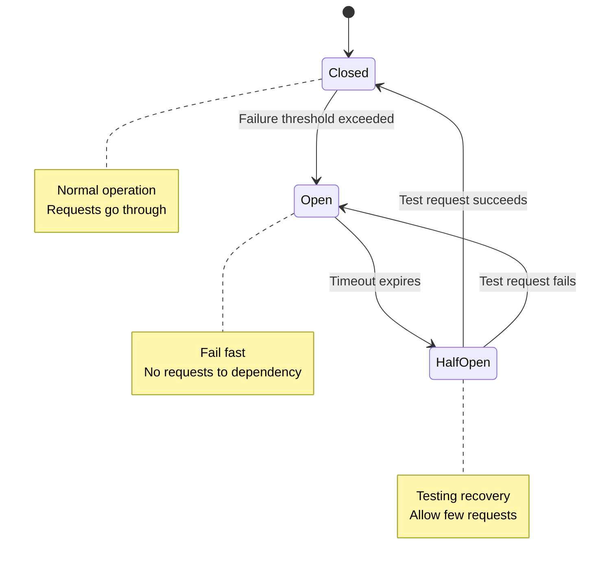

# Handling Failures

How to design systems that work even when parts fail, because parts will always fail.

---

## Failures Are Normal

In a distributed system, something is always broken. Not because the system is poorly built, but because at scale, statistics guarantee failures.

- Servers crash
- Disks fill up  
- Networks partition
- Dependencies slow down or stop responding
- Deployments introduce bugs
- Configuration changes break things
- External services have outages

The question isn't "will things fail?" but "how does your system behave when they do?"

---

## Types of Failures

### Crash Failures

A component stops responding entirely.

**What it looks like:** Server process dies, VM goes down, container crashes.

**Relatively easy to handle:** The component is clearly not working. You can route around it.

### Byzantine Failures

A component behaves incorrectly - gives wrong answers, acts maliciously, or behaves inconsistently.

**What it looks like:** Corrupted data, bugs that produce wrong results, compromised systems.

**Hard to handle:** The component seems to work but can't be trusted. Most systems don't handle this unless security-critical.

### Slowdown Failures

A component works but is very slow.

**What it looks like:** High latency, timeouts, queue buildup.

**Deceptive:** The component is technically "up" but useless for practical purposes. Often worse than crash failures because:
- Callers might keep waiting instead of failing fast
- Resources (threads, connections) are held while waiting
- Slow systems can "infect" others through blocking

### Partial Failures

Some parts of a component work, others don't.

**What it looks like:** Service can read but not write. Works for some users but not others. Some endpoints respond, others don't.

**Requires careful handling:** You need to decide what to do with partial functionality.

---

## Defense Patterns

### Timeouts

Don't wait forever for a response.

**Without timeout:** One slow dependency blocks your thread indefinitely. Threads pile up. Eventually your whole service is stuck waiting.

**With timeout:** After N seconds, give up. Return error or use fallback.

**Choosing timeout values:**
- Too short: fail on normal slow responses
- Too long: resources tied up waiting
- General guidance: p99 latency + some margin. If dependency normally responds in 200ms (p99), maybe timeout at 1-2 seconds.

### Retries

Try again when operations fail.

**When to retry:**
- Transient failures (network blip, temporary overload)
- Idempotent operations (retrying is safe)

**When not to retry:**
- Client errors (400s): request is wrong, retrying won't help
- Operations that aren't idempotent: might double-charge, create duplicates
- Persistent failures: wasting resources and adding load

**Retry patterns:**
- **Immediate retry:** For very brief hiccups
- **Exponential backoff:** Wait 1s, then 2s, then 4s... Prevents hammering a recovering system
- **Jitter:** Random delay added to backoff. Prevents all clients retrying at exact same time

### Circuit Breakers

Stop calling a failing dependency.

**The problem with retries:** If a dependency is down, every request retries, adding more load to an already struggling system. Cascading failure.

**How circuit breakers work:**

**Closed state (normal):** Requests go through normally. Failures are counted.

**Open state (tripped):** Recent failure rate exceeds threshold. Requests fail immediately without calling the dependency. This gives the dependency time to recover.

**Half-open state (testing):** After a timeout, allow some requests through to test if dependency recovered. If successful, close the circuit. If failing, reopen.

**Benefits:**
- Fail fast instead of blocking
- Reduce load on struggling dependencies
- Recover automatically when dependency is healthy

### Bulkheads

Isolate failures to prevent them from cascading.

**The ship analogy:** Ships have bulkheads - watertight compartments. If one compartment floods, the others stay dry. The ship stays afloat.

**In systems:** Isolate resources so one failure doesn't consume all resources.

**Examples:**
- Separate thread pools for different dependencies. If one is slow, it exhausts its pool, not the entire system's threads.
- Separate connection pools. Database connection exhaustion doesn't affect Redis operations.
- Separate service instances for different workloads.

### Fallbacks

When primary behavior fails, use alternative behavior.

**Examples:**
- Recommendations service is down → show popular items instead
- Payment processor times out → queue for retry, tell user "processing"
- Fresh data unavailable → serve cached data

**Not always possible:** Some operations don't have meaningful fallbacks. But many do.

**Design principle:** Decide upfront what the fallback is for each critical dependency.

---

## Graceful Degradation

When the system is stressed, do less rather than failing completely.

### What to Degrade

**Non-essential features:** Analytics tracking, recommendations, personalization. Turn off before core functionality.

**Quality:** Serve lower-resolution images, less data, simpler computations.

**Freshness:** Serve cached data that's slightly stale instead of failing to serve.

### How to Implement

**Feature flags:** Ability to turn off features without deploying.

**Load shedding:** When overloaded, reject some requests to serve the rest successfully.

**Circuit breakers:** Automatically disable problematic dependencies.

**Configuration:** Degrade thresholds tuned based on monitoring.

### Priority

Not all requests are equal:

- Checkout flow: critical, never degrade
- Product browsing: important, degrade recommendations first
- Admin dashboards: less urgent, can wait

Define SLOs per operation. Protect high-priority paths first.

---

## Cascading Failures

One failure causes another, which causes another, until the whole system is down.

### How It Happens

1. Database becomes slow
2. App servers wait longer, holding connections
3. Connection pools fill up
4. App servers stop responding
5. Load balancer marks them unhealthy
6. Remaining servers get more traffic
7. They get overloaded
8. Complete outage

### How to Prevent

**Timeouts:** Don't wait indefinitely for slow dependencies.

**Circuit breakers:** Stop calling failing dependencies before cascade starts.

**Bulkheads:** Resource isolation prevents one area's problems from spreading.

**Backpressure:** When overwhelmed, push back on incoming requests rather than accepting and failing.

**Load shedding:** Reject some requests so you can serve others. 90% success is better than 0%.

---

## Designing for Failure

### Assume Failures Happen

Every external call can fail. Every component can be unavailable.

**Write code that handles failures:**
- What if the database is unreachable?
- What if the external API returns an error?
- What if it returns garbage?
- What if it's extremely slow?

### Make Operations Idempotent

If an operation can be safely retried, failures become much easier to handle.

**Idempotent:** Doing it twice has the same effect as doing it once.
- Setting a value: `balance = 100` ✓
- Reading data ✓
- Deleting with specific ID ✓

**Not idempotent:**
- Adding to a value: `balance += 100` ✗
- Creating with auto-generated ID ✗

For non-idempotent operations, use idempotency keys or deduplication.

### Fail Fast

If something is going to fail, fail immediately rather than after consuming resources.

**Validate early:** Check if operation is likely to succeed before starting expensive work.

**Short timeouts:** Don't wait forever.

**Circuit breakers closed? Fail immediately:** Don't queue up requests to a dead dependency.

### Test Failures

You don't know how your system handles failures until you test it.

**Chaos engineering:** Intentionally inject failures in production (carefully) or staging.

**Gamedays:** Simulate outages and practice response.

**Load testing:** Push system to limits. What fails first?

---

## Observability for Failures

You can't fix what you can't see.

### Key Metrics

**Error rate:** Percentage of requests failing. Alert when it spikes.

**Latency:** Track percentiles (p50, p95, p99). Latency increase often precedes failures.

**Saturation:** How full are resources? CPU, memory, connections, queue depth.

**Availability:** Is the service responding to health checks?

### Distributed Tracing

Follow a request through multiple services. When something fails, see exactly where.

### Logs

Structured logs with request IDs. When investigating, find all logs related to a failed request.

### Alerting

Alert on symptoms, not just causes:
- High error rate
- Latency exceeds SLO
- Queue depth growing
- Circuit breaker tripped

---

## Common Mistakes

**No timeouts.** Every network call needs a timeout. Without one, you're at the mercy of the slowest dependency.

**Retrying non-idempotent operations.** Retry caused double-charge, duplicate order, duplicate message.

**Retry storms.** All clients retry simultaneously after brief outage, overwhelming system that was about to recover.

**No circuit breakers.** Failed dependency gets hammered, can't recover, takes down everything that depends on it.

**Cascading failures ignored.** "It'll never happen" until it does and the entire system is down.

**Testing only happy path.** System works great when everything is up. Nobody tested what happens when the database is slow.

**Silently dropping errors.** Error happens, code catches and ignores it. No logs, no alert. Problem grows until catastrophic.

---

## What An Experienced Senior Engineer Thinks About

**Failure domains.** What fails together? If one server fails, what else is affected? If a network partition happens, which components can still talk to each other?

**Blast radius.** When something fails, how much of the user base is affected? One user? One shard? One region? Everyone? Design to limit blast radius.

**Recovery time vs. detection time.** Often, detecting a problem takes longer than fixing it. Invest in good monitoring.

**Rehearsing failures.** Regular practice of failure scenarios. What's the runbook? Who gets paged? How long does recovery take?

**Economic trade-offs.** Perfect resilience is infinitely expensive. What failures are worth protecting against? What's the business cost of each failure mode?

**Dependencies as reliability liabilities.** Every dependency introduces failure modes. The most reliable systems have fewer dependencies, not more.

---

## Vibe Engineering Guide

When prompting about failure handling:

**Less useful:**
> "Handle errors in my application"

**More useful:**
> "I have a Node.js service that calls three external APIs: payment, shipping, and email. Currently, if any of them times out, the whole request fails. I want to:
> - Set reasonable timeouts for each
> - Implement retries with exponential backoff for transient failures
> - Add a circuit breaker for the payment API (most critical)
> - Have fallback behavior for email (queue for later)
>
> What patterns should I implement?"

**For cascading failures:**
> "Our microservices architecture had a cascading failure last week. The recommendation service got slow, which caused product service to exhaust connections waiting, which caused the main API to fail. How do we prevent this in the future?"

**For chaos engineering:**
> "We want to start chaos engineering to test our system's resilience. We run on AWS with EKS. What failures should we simulate first? How do we do this safely without impacting real users?"

---

## Quick Check

<b>Why are slowdown failures often worse than crash failures?</b>

Crash failures are clear - the component is down, route around it. Slowdowns are deceptive: the component appears to work, so callers wait. Resources (threads, connections) are held. Slow systems "infect" callers, gradually taking down the whole system.

<b>What is a circuit breaker?</b>

A pattern that stops calling a failing dependency. After threshold of failures, the circuit "opens" and requests fail immediately without calling the dependency. After a timeout, it allows test requests to see if the dependency recovered.

<b>What is a cascading failure?</b>

One failure causes another, which causes another. Example: slow database → connection pool exhaustion → service timeout → overloaded remaining servers → complete outage. Prevented by timeouts, circuit breakers, bulkheads, and backpressure.

<b>Why use exponential backoff for retries?</b>

If something failed, immediate retry might fail again. Exponential backoff (1s, 2s, 4s...) gives the system progressively more time to recover. Jitter prevents all clients retrying at the exact same time.

<b>What is graceful degradation?</b>

When the system is stressed, disable non-essential features to protect core functionality. Serve cached data, hide recommendations, reduce quality - anything to keep the most important functions working.

---

Next: [Consensus and Leader Election](04-consensus.md)
