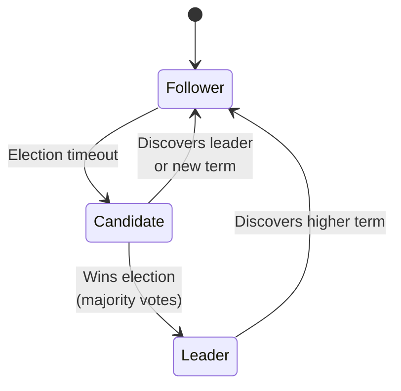
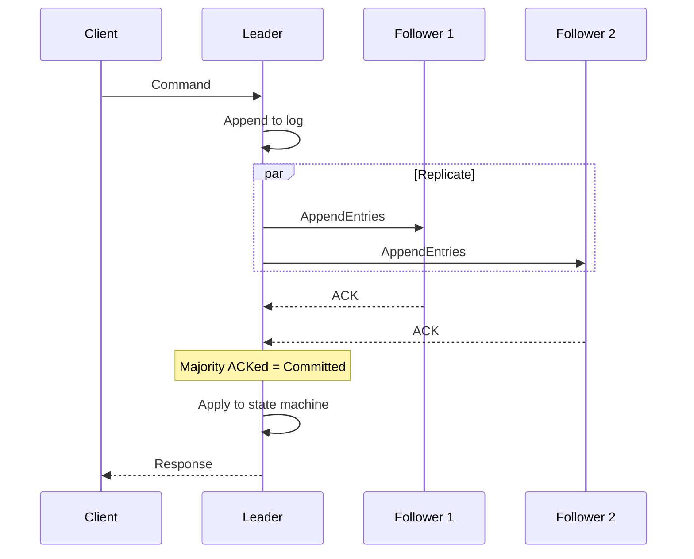

# Consensus and Leader Election

How distributed systems agree on things when communication can fail.

---

## The Problem

In a distributed system, nodes need to agree.

- Which node is the leader?
- What is the current value of X?
- In what order did events happen?

Seems simple. But networks are unreliable. Nodes crash. Messages get lost or delayed.

---

## Why Consensus is Hard

### The CAP Theorem Reality

During a network partition, you can't have both consistency and availability. Consensus algorithms choose consistency - they stop making progress rather than allow disagreement.

### Failure Modes

- **Node crash:** Node stops responding
- **Network partition:** Some nodes can't reach others
- **Byzantine failures:** Node behaves incorrectly (rare, usually ignored)

### The FLP Impossibility

It's mathematically proven that no consensus algorithm can guarantee termination in an asynchronous system with even one crash failure.

**In practice:** We use timeouts and assume partial synchrony. Real algorithms work, just can't be mathematically guaranteed.

---

## Leader Election

Many distributed systems need a single leader:
- Coordinate writes in a database
- Manage a distributed lock
- Orchestrate workflows

### The Challenge

1. All nodes need to agree on who the leader is
2. Only one leader at a time
3. If leader fails, elect a new one
4. Avoid "split brain" (two leaders)

### Basic Approach

1. Nodes detect leader failure (missed heartbeats)
2. Candidate proposes itself
3. Other nodes vote
4. Candidate with majority becomes leader
5. New leader announces itself

### Split Brain Problem

Network partition: nodes A, B can talk to each other but not to C.

A thinks it's leader. C thinks it's leader. Both accepting writes. Divergence.

**Solution:** Majority quorum. Need >50% of nodes to elect leader. Both sides can't have majority.

---

## Leaderless Replication (No Leader?)

You might see systems (like Cassandra, DynamoDB) where **any node** can accept writes, and requests are routed randomly.

**This is "Leaderless" replication.**

*   **No "Leader Election":** Nodes don't vote for a boss.
*   **No Strict Consensus:** They don't agree on a single global order upfront.
*   **How it works:**
    *   **Quorums:** Write to multiple nodes (e.g., 3). Wait for 2 to say "OK".
    *   **Read Repair:** Read from multiple nodes. If they disagree, use the timestamp to find the latest one.
*   **Trade-off:** High availability (always writable), but harder to guarantee strict consistency compared to Leader-based systems (Raft/Paxos).

---

## Paxos

The original consensus algorithm. Theoretically important, complex to understand.

### Core Idea

1. **Proposer** proposes a value
2. **Acceptors** accept proposals
3. Once majority accepts, value is chosen

### Phases

**Phase 1 (Prepare):**
- Proposer sends prepare request with proposal number n
- Acceptors promise to not accept anything with number < n
- Return any previously accepted value

**Phase 2 (Accept):**
- If majority promised, proposer sends accept request
- Acceptors accept if they haven't promised to higher number
- Majority accepts → value is chosen

### Multi-Paxos

Run Paxos repeatedly for log of values. One leader runs multiple rounds.

### Why It's Hard

- Complex state machine
- Hard to implement correctly
- Famous quote: "There are only two hard problems in distributed systems: 1. Exactly-once delivery 2. Guaranteed order of messages 1. Exactly-once delivery"

---

## Raft

Designed to be understandable. Equivalent to Paxos in power, clearer in design.

### Key Concept: Log Replication

Leader maintains a log of commands. Followers replicate the log.

### States

Each node is:
- **Follower:** Passive, responds to leader
- **Candidate:** Trying to become leader
- **Leader:** Handles all client requests

### Leader Election

1. Follower hasn't heard from leader (election timeout)
2. Becomes candidate, increments term, votes for itself
3. Requests votes from other nodes
4. Gets majority → becomes leader
5. Sends heartbeats to maintain leadership

### Log Replication

1. Client sends command to leader
2. Leader appends to its log
3. Leader sends AppendEntries to followers
4. Followers append and acknowledge
5. Once majority acknowledge, entry is committed
6. Leader applies to state machine, responds to client

### Safety Properties

- **Election safety:** At most one leader per term
- **Log matching:** If two logs have same term/index, identical up to that point
- **Leader completeness:** Committed entries are in all future leaders' logs

### Why Raft is Popular

- Clear separation of concerns
- Understandable leader election
- Widely implemented and used

**Used by:** etcd, Consul, CockroachDB, TiKV

---

## ZooKeeper (ZAB Protocol)

Apache ZooKeeper uses ZAB (Zookeeper Atomic Broadcast).

### What ZooKeeper Provides

- Distributed coordination service
- Configuration management
- Naming registry
- Distributed locks
- Leader election

### ZAB vs Raft

Similar ideas:
- Leader-based
- Quorum for decisions
- Ordered log replication

ZAB designed specifically for ZooKeeper's primary-backup model.

### Using ZooKeeper for Leader Election

1. Candidates create ephemeral sequential nodes under `/election/`
2. Node with lowest sequence number is leader
3. Others watch the node before them
4. If leader dies, ephemeral node deleted, next becomes leader

---

## Etcd and Consul

### etcd

Distributed key-value store using Raft.

**Used for:**
- Kubernetes cluster state
- Service discovery
- Configuration management

**Characteristics:**
- Strong consistency
- Watch for changes
- TTL on keys

### Consul

Service mesh and configuration by HashiCorp. Uses Raft for consensus.

**Used for:**
- Service discovery
- Health checking
- KV store
- Service mesh

**Characteristics:**
- Multi-datacenter support
- Health checking built in
- DNS interface

---

## Practical Considerations

### Cluster Size

Consensus needs majority. For fault tolerance:

| Cluster Size | Tolerable Failures |
|--------------|-------------------|
| 3 nodes | 1 |
| 5 nodes | 2 |
| 7 nodes | 3 |

**Why odd numbers:** Even numbers don't improve tolerance. 4 nodes still tolerates only 1 failure (need >2 for majority).

**Why not more:** More nodes = slower consensus (more RPCs). 5-7 is typical.

### Latency

Consensus requires network round-trips.

- Write latency = time for majority to acknowledge
- Cross-datacenter consensus is slow (100ms+ per decision)

### Network Partitions

Partition splits cluster:
- Side with majority continues
- Side without majority stops (can't reach quorum)
- On heal, minority catches up

### Leader Failover

Leader dies:
1. Followers timeout (election timeout)
2. Election period (potentially multiple rounds)
3. New leader elected

**Election timeout:** Should be 10x-100x the network round-trip time. etcd defaults to 150-300ms (good for same-datacenter). For cross-region deployments, you might need 1-5 seconds.

**Downtime:** Seconds typically. Configure timeouts appropriately - too short causes unnecessary elections, too long delays failover.

---

## When to Use What

### Need distributed coordination?
→ ZooKeeper, etcd, or Consul

### Need distributed state machine?
→ Raft-based system (etcd, Consul)

### Building a database?
→ Use existing Raft/Paxos library

### Need leader election only?
→ ZooKeeper or etcd can do this simply

---

## Common Mistakes

**Single-node "cluster."** No fault tolerance. Need at least 3 nodes.

**Even number of nodes.** 4 nodes tolerates same failures as 3. Use odd numbers.

**Ignoring network latency.** Consensus across slow links is slow. Keep consensus cluster in same region.

**Using consensus for all operations.** Consensus is expensive. Use for coordination, not data plane.

**Not handling leader failover.** Application needs to handle temporary unavailability during election.

---

## What An Experienced Senior Engineer Thinks About

**Consensus is a bottleneck.** Every write goes through leader. Leader can become bottleneck. Scale reads via followers when consistency allows.

**External vs. internal coordination.** External systems (ZooKeeper, etcd) are battle-tested. Building your own consensus is hard and risky.

**Failure detection tuning.** Election timeout: too short = frequent unnecessary elections; too long = slow failover.

**Exactly-once in consensus.** Clients should use idempotency keys. Consensus handles log, client retries handled separately.

---

## Vibe Engineering Guide

When prompting about consensus:

**Less useful:**
> "Use consensus"

**More useful:**
> "I'm building a distributed scheduler. Only one node should run each job to prevent duplicates. I need leader election to designate the scheduler master. 5 nodes across 2 availability zones. 
>
> Should I use etcd or ZooKeeper? How do I implement leader election? What happens when the leader fails during job execution?"

**For specific problems:**
> "Our etcd cluster (3 nodes) becomes unavailable when 1 node dies for maintenance. That shouldn't happen - 3 node cluster should tolerate 1 failure. What could cause this?"

---

## Quick Check

<b>Why is consensus hard?</b>

Networks are unreliable, nodes can crash, messages get lost or delayed. The FLP impossibility proves no algorithm can guarantee termination in async systems with failures. Practical algorithms use timeouts and partial synchrony.

<b>What's the difference between Paxos and Raft?</b>

Equivalent in power. Paxos is the original, theoretically important but complex. Raft was designed for understandability with clear leader election and log replication. Raft is more commonly implemented.

<b>Why use odd cluster sizes?</b>

Consensus needs majority. 3 nodes: majority is 2, tolerates 1 failure. 4 nodes: majority is 3, still tolerates 1 failure. The 4th node doesn't help. 5 nodes: majority is 3, tolerates 2 failures.

<b>How is leader election done in Raft?</b>

Follower times out waiting for leader heartbeat, becomes candidate, increments term, votes for itself, requests votes. Gets majority → becomes leader. Sends heartbeats to maintain leadership.

---

Next: [Distributed Transactions](05-distributed-transactions.md)
