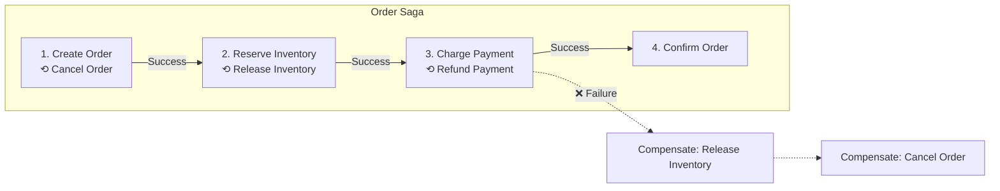
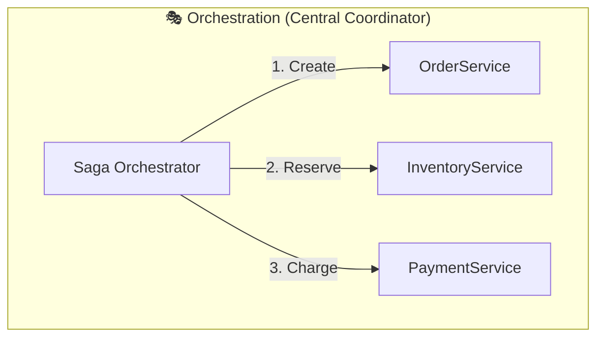
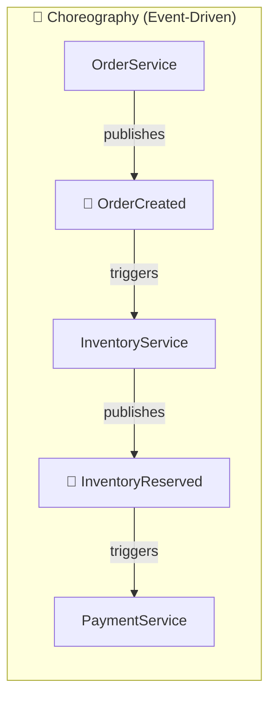

# Distributed Transactions

Maintaining data consistency across multiple services, when simple transactions aren't enough.

---

## The Problem

In a monolith with one database, transactions are simple:

```
BEGIN TRANSACTION
  Debit account A by $100
  Credit account B by $100
COMMIT
```

Either both happen or neither. ACID guarantees.

In microservices with separate databases:

```
Order Service → Order DB
Payment Service → Payment DB
Inventory Service → Inventory DB
```

How do you ensure all three are consistent?

---

## Why Distributed Transactions Are Hard

### No Single Transaction Manager

Each database has its own transaction manager. They don't coordinate.

### Partial Failures

Order service commits. Payment service crashes before committing. Inconsistent state.

### Network Unreliability

Payment service might have committed, but you don't know because the response was lost.

### Performance

Coordinating across services is slow. Locks held longer.

---

## Two-Phase Commit (2PC)

The classic approach for distributed transactions.

### How It Works

**Phase 1: Prepare**
1. Coordinator asks all participants: "Can you commit?"
2. Each participant validates and prepares
3. Each responds: "Yes" or "No"

**Phase 2: Commit (if all said yes)**
1. Coordinator tells all: "Commit"
2. Each commits and acknowledges
3. Coordinator marks transaction complete

**Phase 2 (alternate): Rollback (if any said no)**
1. Coordinator tells all: "Rollback"
2. Each rolls back

### The Blocking Problem

If coordinator crashes after Phase 1 but before Phase 2:
- Participants holding locks
- Don't know whether to commit or rollback
- Wait for coordinator to recover

System is blocked.

### When 2PC Works

- Single database with sharding (database manages 2PC internally)
- Homogeneous systems (same database vendor)
- Can tolerate blocking during coordinator failure

### When 2PC Doesn't Work

- Microservices with different databases
- Services owned by different teams
- Can't afford blocking delays
- Heterogeneous systems

---

## The Saga Pattern

Alternative to distributed transactions. Sequence of local transactions with compensating actions.

### How It Works

Each step has:
- **Action:** The forward operation
- **Compensating action:** How to undo it



If step 3 fails:
- Compensate step 2: release inventory
- Compensate step 1: cancel order

### Orchestration vs. Choreography





**Orchestration:**
Central saga orchestrator coordinates the flow.

**Pros:** Easy to understand, central control, simple error handling.
**Cons:** Single point of coordination, orchestrator becomes complex.

**Choreography:**
Each service knows what to do next.

**Pros:** Loosely coupled, no central coordinator.
**Cons:** Hard to understand flow, complex failure handling.

### Compensating Actions

Must be carefully designed:
- **Idempotent:** Running twice has same effect
- **Safe to run after actual failure:** Don't compensate what didn't happen
- **May not be exact reversal:** "Cancel order" is not exactly "uncreate"

---

## Eventual Consistency

Accept that consistency is not immediate.

### How It Works

Services update their own data. Eventually, all services reach consistent state.

```
1. Order created in OrderService (status: pending)
2. Payment charged (async)
3. PaymentService publishes "PaymentSucceeded"
4. OrderService receives, updates to (status: confirmed)
```

Between steps 1 and 4, order status is "pending" - not yet consistent with payment state.

### Trade-offs

**Pros:**
- Better availability
- No distributed locks
- Services remain loosely coupled

**Cons:**
- Temporary inconsistency visible to users
- Need to handle edge cases (what if user checks order during pending?)
- Reconciliation may be needed

---

## Outbox Pattern

Reliably publish events along with database changes.

### The Problem

```
BEGIN TRANSACTION
  Insert order into database
COMMIT
Publish "OrderCreated" event  ← what if this fails?
```

Order is saved but event never published. Downstream services never know.

### The Solution

```
BEGIN TRANSACTION
  Insert order into orders table
  Insert event into outbox table
COMMIT

Separate process:
  Read outbox table
  Publish events
  Mark as published
```

Database transaction ensures both order and event are saved atomically. Event publishing can retry safely.

### Implementation

```sql
outbox (
  id,
  event_type,
  payload,
  created_at,
  published_at
)
```

Background worker reads unpublished events, publishes, updates `published_at`.

---

## Idempotency

Crucial for distributed transactions - operations may be retried.

### What It Means

Running the same operation multiple times produces the same result.

### Implementation

```
Charge payment with idempotency_key = "order-123-payment-1"

First attempt: charge card, record idempotency_key
Second attempt: see idempotency_key exists, return cached result
```

### Where to Apply

- Event handlers
- Service API calls
- Any operation that might be retried

---

## Practical Patterns

### Try-Confirm/Cancel (TCC)

Reserve resources, then confirm or cancel.

```
1. Try: Reserve $100 from account (not debited, just reserved)
   Try: Reserve inventory item (not allocated, just reserved)
2. Confirm: Actually debit and allocate
   OR Cancel: Release reservations
```

**Use when:** Need to check feasibility before committing.

### At-Most-Once vs. At-Least-Once

**At-most-once:** Accept data loss to avoid duplicates.
**At-least-once:** Accept duplicates to avoid data loss. Handle with idempotency.

Most systems choose at-least-once with idempotency.

### Workflow Engines

For complex sagas, use a workflow engine:

- **Temporal:** Programming model for durable workflows
- **AWS Step Functions:** Managed state machine
- **Cadence:** Uber's workflow engine

Handle retries, timeouts, compensations declaratively.

---

## Common Mistakes

**Using 2PC for microservices.** Blocking, slow, hard to implement across different databases.

**Not implementing compensations.** Saga step fails, no way to undo previous steps.

**Ignoring idempotency.** Retries cause duplicate charges, duplicate inventory deductions.

**Synchronous everything.** Each service calls next synchronously. Chain of dependencies, any failure stops all.

**No saga timeout.** Saga in-progress forever due to stuck step.

---

## What An Experienced Senior Engineer Thinks About

**Modeling the domain.** Sometimes the right solution is not distributed transactions but redesigning boundaries so transactions are local.

**Compensation design.** Some actions can't be truly reversed (email sent, money transferred to external account). Design for this reality.

**Visibility and debugging.** When saga fails mid-way, how do you see the state? Audit logs, saga status dashboard.

**Testing.** Failure scenarios are hard to test. Chaos engineering, fault injection.

**Business vs. technical consistency.** Sometimes business process already handles inconsistency (refunds, customer service). Don't over-engineer technical solutions.

---

## Vibe Engineering Guide

When prompting about distributed transactions:

**Less useful:**
> "Make my services transactional"

**More useful:**
> "I have an order flow across three services:
> 1. OrderService creates order
> 2. InventoryService reserves stock
> 3. PaymentService charges card
>
> Currently synchronous. If payment fails after inventory is reserved, stock is stuck. How do I implement a saga pattern? Should I use orchestration or choreography? What compensating actions do I need?"

**For specific problems:**
> "We're using the outbox pattern but sometimes events are published twice (background worker crashes after publishing but before marking as published). How do we ensure exactly-once publishing or handle duplicates?"

---

## Quick Check

<details>
<summary><b>Why is 2PC not ideal for microservices?</b></summary>

Blocking (participants wait for coordinator), slow (coordinating across network), hard to implement across different databases, and doesn't fit the autonomous/loosely-coupled microservices model.

</details>

<details>
<summary><b>What's the difference between saga orchestration and choreography?</b></summary>

Orchestration: central coordinator directs the flow. Choreography: each service knows what to do next based on events. Orchestration is easier to understand; choreography is more loosely coupled.

</details>

<details>
<summary><b>What's a compensating action?</b></summary>

The undo operation for a saga step. If later steps fail, you run compensating actions for completed steps in reverse order. Must be carefully designed to be idempotent and safe.

</details>

<details>
<summary><b>What problem does the outbox pattern solve?</b></summary>

Reliably publishing events along with database changes. Without outbox, you might save to database but fail to publish event (or vice versa). Outbox makes both atomic using the database transaction.

</details>

---

Next: [Distributed Locking](06-distributed-locking.md)
