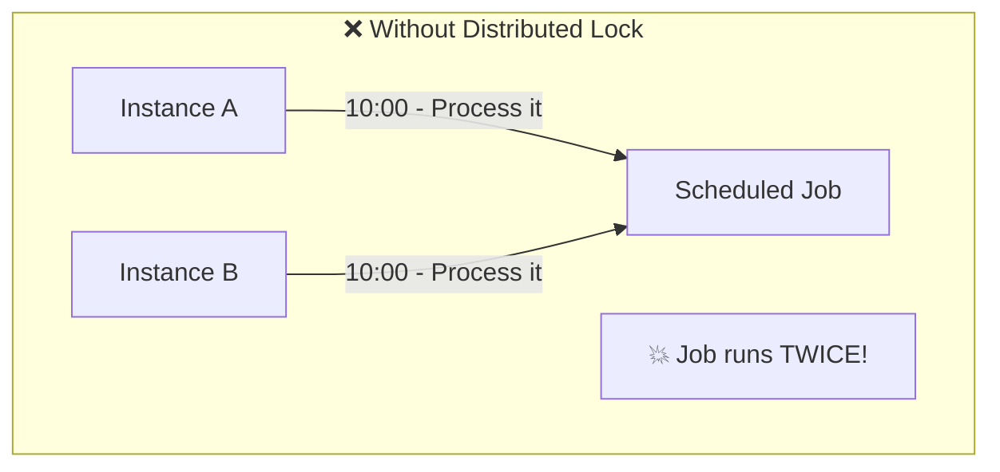
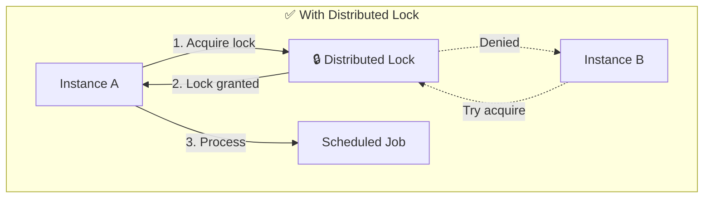

# Distributed Locking

Coordinating access to shared resources across multiple nodes.

---

## The Problem

In a single application, you use mutexes or synchronized blocks.

In a distributed system:
- Multiple application instances
- Each has its own memory
- Need to coordinate access to shared resource





**Example:** Only one instance should process a scheduled job at a time.

---

## When You Need Distributed Locks

### Preventing Duplicate Processing

```
10:00 AM - Scheduled job triggers
Instance A: "I'll process it"
Instance B: "I'll process it too"
Result: Job runs twice - duplicates, inconsistencies
```

### Resource Coordination

```
External API with rate limit: 100 requests/minute
Need to ensure across all instances we don't exceed
```

### Leader Election

```
Only one instance should be "active" leader
Others are standbys waiting to take over
```

---

## Lock Properties

### Mutual Exclusion

Only one client holds the lock at a time. The fundamental requirement.

### Deadlock-Free

Lock is automatically released if holder crashes. Usually via TTL (time-to-live).

### Fault Tolerance

Lock service remains available if some nodes fail.

---

## Simple Redis Lock

Basic distributed lock using Redis.

### Acquire Lock

```
SET lock_key random_value NX PX 30000
```

- `NX`: Only set if key doesn't exist
- `PX 30000`: Expire in 30 seconds
- `random_value`: Unique identifier for this holder

Returns OK if acquired, nil if not.

### Release Lock

```
if GET lock_key == my_random_value:
    DEL lock_key
```

Only delete if you own it. Must be atomic (use Lua script).

### Why Random Value?

Prevents accidentally releasing someone else's lock.

```
Client A acquires lock (value: "abc")
Client A takes too long, lock expires
Client B acquires lock (value: "xyz")
Client A tries to release: "abc" != "xyz", doesn't release B's lock
```

### Problems with Simple Approach

**Single point of failure:** Redis goes down = no locks.

**Time-based assumptions:** Client thinks it has lock, but lock expired. Continuing work after lock expiry.

---

## Redlock Algorithm

Proposed by Redis author for more robust distributed locking.

### How It Works

Use multiple independent Redis instances (5 recommended).

**To acquire lock:**
1. Get current time
2. Try to acquire lock on all N instances (with short timeout per instance)
3. If acquired on majority (>N/2) and total time < lock TTL, lock is acquired
4. Otherwise, release lock on all instances

**To release:**
Release on all instances.

### Why Majority?

Network partitions. At most one side can have majority.

### Criticism

Martin Kleppmann (author of "Designing Data-Intensive Applications") argues Redlock has safety issues. Distributed consensus (ZooKeeper, etcd) may be more correct.

---

## ZooKeeper Locks

Using ZooKeeper for distributed locking.

### How It Works

1. Create ephemeral sequential znode under `/locks/`
2. Check if yours has lowest sequence number
3. If yes, you have the lock
4. If no, watch the znode before yours
5. When it's deleted, check again

**Ephemeral nodes:** Auto-deleted when session ends (client crashes).

### Why ZooKeeper?

- Built for coordination
- Strong consistency (CP system)
- Handles failures correctly
- Ephemeral nodes = automatic lock release

### Herd Effect

Naive implementation: everyone watches the lock. Lock released → everyone wakes up → only one wins → others go back to waiting.

**Solution:** Each client watches only the znode before it. When released, only next client wakes up.

---

## Etcd Locks

Similar to ZooKeeper. Etcd provides lock API.

### How It Works

```
Lease: Create lease with TTL
Lock: Create key with lease, revision-based ordering
Keep-alive: Periodically refresh lease
Unlock: Revoke lease
```

### Lease Mechanism

Lease is a timed token. While refreshing, lock is held. Stop refreshing = lease expires = lock released.

Handles client crashes automatically.

---

## Lock Design Considerations

### TTL Selection

**Too short:** Lock expires while still doing work. Another client takes lock. Two clients in critical section.

**Too long:** Client crashes. Lock not released until TTL expires. Long wait.

**Typical:** 10-60 seconds with periodic renewal.

### Lock Renewal

Client should renew lock before TTL expires.

```
Loop:
  Do work
  Every TTL/3: renew lock
Until done
Release lock
```

### Fencing Tokens

Even with locks, things go wrong:
1. Client A gets lock, token 1
2. Client A pauses (GC, etc.)
3. Lock expires
4. Client B gets lock, token 2
5. Client A resumes, writes with "token 1"
6. Client B writes with "token 2"

**Solution:** Fencing tokens. Ever-increasing number with each lock acquisition. Storage rejects writes with old tokens.

```
Lock acquisition: returns fencing_token = 34
Write to database: include fencing_token
Database rejects if token < last seen token
```

---

## Lock Patterns

### Try-Lock

Try to acquire, fail immediately if can't.

```
if try_acquire_lock():
    do_work()
    release_lock()
else:
    skip or retry later
```

### Lock with Timeout

Wait up to X seconds for lock.

```
if acquire_lock(timeout=5s):
    do_work()
    release_lock()
else:
    handle timeout
```

### Leader Lock

Long-held lock for leader election.

```
while True:
    if acquire_lock():
        while holding_lock():
            do_leader_work()
            renew_lock()
    else:
        sleep(1s)  // wait to try again
```

---

## Common Mistakes

**Not handling lock expiry.** Assuming you have lock forever. Check before critical operations.

**Using single Redis instance.** Single point of failure. Lock service down = blocked.

**Not using unique identifiers.** Releasing someone else's lock.

**Blocking forever on lock acquisition.** Deadlock potential. Always use timeout.

**Holding locks too long.** Critical section should be short. Holding lock while doing I/O or network calls.

**Not implementing fencing.** Race conditions when lock expires during operation.

---

## When to Avoid Distributed Locks

### Idempotency Instead

Can the operation be made idempotent?

```
Instead of: Lock → Increment counter
Do: Set counter to known value (idempotent)
```

### Database Transactions

If the resource is a database, use database-level locking.

```
SELECT FOR UPDATE ...
```

### Design Around It

Can you partition work so each instance works on different data?

```
Instance 1 handles users A-M
Instance 2 handles users N-Z
No coordination needed
```

---

## What An Experienced Senior Engineer Thinks About

**Minimize lock scope.** The less you hold locks, the better. Compute outside lock, only hold for the critical operation.

**Failure modes.** What happens when lock service is unavailable? Can the system degrade gracefully?

**Observability.** Monitor lock contention, wait times, expiries. Locks can become bottlenecks.

**Correctness vs. liveness.** A correct lock might cause liveness issues (deadlock, convoys). Balance safety with progress.

**Business impact.** Sometimes "occasional duplicate processing" is acceptable and simpler than perfect locking.

---

## Vibe Engineering Guide

When prompting about distributed locking:

**Less useful:**
> "Use distributed locks"

**More useful:**
> "I have a scheduled job that runs every minute. I have 3 instances of my service. I need to ensure only one instance runs the job each minute. Currently using Redis (single instance). 
>
> Should I use Redis SET NX or something more robust? How do I handle the case where an instance acquires the lock but crashes mid-job?"

**For specific problems:**
> "We're using Redis SET NX for locks. Sometimes job runs twice - I suspect the lock expires while the job is still running. Job takes 20-60 seconds, lock TTL is 30 seconds. How should I handle this?"

---

## Quick Check

<details>
<summary><b>Why include a random value when acquiring a Redis lock?</b></summary>

To identify the lock holder. When releasing, check that your value matches. Prevents releasing someone else's lock if yours expired and they acquired it.

</details>

<details>
<summary><b>What's the purpose of lock TTL?</b></summary>

Automatic release if holder crashes or becomes unreachable. Without TTL, crashed clients would hold locks forever, blocking all others.

</details>

<details>
<summary><b>What's a fencing token?</b></summary>

An ever-increasing number returned with each lock acquisition. Storage rejects operations with older tokens. Prevents race conditions when locks expire during operations.

</details>

<details>
<summary><b>When might you avoid distributed locks?</b></summary>

When operations can be idempotent, when database transactions suffice, or when work can be partitioned so instances don't compete. Locks add complexity - avoid if possible.

</details>

---

Next: [Level 6: Architecture Patterns](../06-architecture-patterns/README.md)
