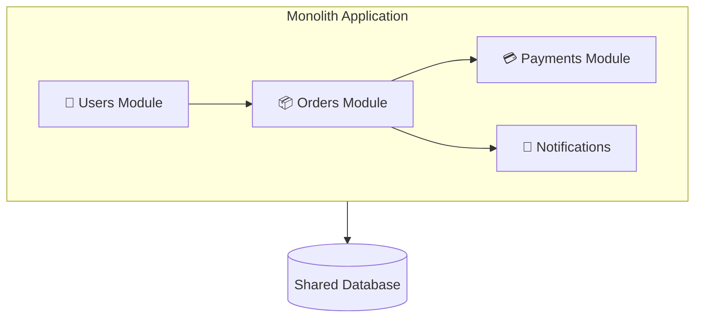
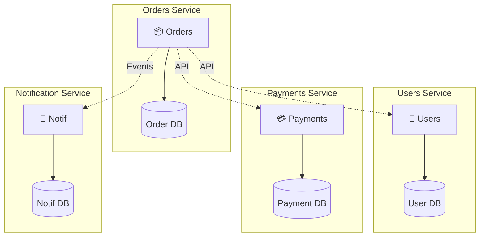

# Monolith vs. Microservices

Understanding when each architecture makes sense, and the real costs of both.

---

## What's a Monolith?

A monolith is a single deployable unit that contains all of the application's functionality.

One codebase, one build, one deployment. All features - user management, orders, payments, notifications - live together in one application.



---

## What Are Microservices?

Microservices architecture splits the application into small, independent services. Each service does one thing and does it well.

Each service:
- Has its own codebase (often)
- Has its own database (often)
- Is deployed independently
- Communicates with others over the network (HTTP, gRPC, messaging)



---

## The Honest Truth

Neither architecture is inherently better. The "best" choice depends on your context.

**The industry went through hype cycles:**
- 2000s: "Microservices are the future!"
- 2010s: Everyone building microservices
- Late 2010s: "Microservices are hard, maybe we went too far"
- Now: More pragmatic thinking

Large companies that successfully run microservices often started with monoliths. Amazon, Netflix, and others decomposed over time - they didn't start with 500 services on day one.

---

## Monolith Advantages

### Simplicity

**Development:** One codebase. Call functions directly. No network calls between features.

**Deployment:** One thing to deploy. One thing to rollback.

**Debugging:** Stack traces go through the whole system. No distributed tracing needed.

**Local development:** Run one thing and you have everything.

### Performance

Function calls are nanoseconds. Network calls are milliseconds. Monoliths don't pay the network tax for internal operations.

No serialization/deserialization between components. No service discovery.

### Consistency

One database, one transaction. ACID across the whole operation. No eventual consistency to worry about.

If order creation, inventory deduction, and payment must all succeed or fail together - trivial in a monolith, hard with microservices.

### Lower Operational Overhead

One thing to monitor. One thing to deploy. One deployment pipeline.

No need for:
- Service discovery
- Distributed tracing
- Complex CI/CD with dependency management
- Service mesh

---

## Monolith Disadvantages

### Scaling Limitations

The whole application scales as a unit. If one feature is CPU-heavy and another is I/O-heavy, you can't scale them differently.

If search needs 10 servers and checkout needs 2, with a monolith you deploy 10 copies of everything.

### Deployment Coupling

Any change requires deploying everything. A small fix in notifications means redeploying the entire application.

As the codebase grows and the team grows, deployment conflicts increase.

### Codebase Complexity

Large monoliths become hard to understand. New developers take longer to onboard. Changes have unexpected ripple effects.

"We can't change this function because something might depend on it, and we don't know what."

### Team Coupling

Multiple teams working in one codebase step on each other. Merge conflicts. Coordinated deploys. Waiting for other teams' code to be ready.

---

## Microservices Advantages

### Independent Scaling

Each service scales based on its own needs. High-traffic search can have 10 instances while low-traffic admin has 2.

### Independent Deployment

Deploy each service independently. Small, frequent releases for each service without coordinating with others.

Change one service, test one service, deploy one service.

### Technology Flexibility

Each service can use appropriate technology. CPU-heavy processing in Go. ML model in Python. Nobody cares as long as the API contract is met.

### Team Independence

Each team owns their services end-to-end. They choose their tools, set their schedules, deploy when ready.

"Two-pizza teams" that can operate autonomously.

### Fault Isolation

If one service fails, others can continue. Recommendations being down doesn't have to take down checkout.

(With proper design - circuit breakers, fallbacks.)

---

## Microservices Disadvantages

### Distributed Systems Complexity

Everything that was a function call is now:
- A network call (can fail, can be slow)
- Serialization and deserialization
- Service discovery
- Authentication between services

Every failure mode of distributed systems now applies.

### Data Consistency

Each service has its own database. Transactions across services don't work.

What used to be one transaction is now multiple separate operations that might partially succeed. Eventual consistency, compensating transactions, sagas.

### Operational Overhead

More things to:
- Deploy (N services, N deployments)
- Monitor (N services to watch)
- Debug (requests span multiple services)
- Operate (more moving parts)

Needs infrastructure: service discovery, load balancing, distributed tracing, centralized logging.

### Network Latency

Requests that traverse multiple services accumulate latency. Client → API Gateway → Service A → Service B → Database and back.

Versus: Client → Monolith → Database.

### Testing Complexity

Integration testing is harder. You need all dependent services running (or mocked).

Contract testing, staged environments, coordinated testing across services.

---

## When to Start With Monolith

**You should probably start with a monolith if:**

- You're a startup or small team
- You don't have product-market fit yet
- You don't know what the service boundaries should be
- You have limited operational experience
- You need to move fast and iterate

**Reasoning:** Monoliths are faster to build and iterate. You can always decompose later. The mistake of premature microservices is expensive; the mistake of starting with a monolith is less costly to fix.

---

## When to Consider Microservices

**Microservices might make sense if:**

- You have multiple teams that need to work independently
- You have genuinely different scaling needs for different parts
- You have different reliability requirements (some things are critical, others aren't)
- You have the operational capability (infrastructure, observability, experience)
- You understand your domain well (you know where the boundaries are)

**Reasoning:** Microservices' benefits come from independence. If you don't have multiple teams or different scaling needs, the benefits don't apply and you're just paying the costs.

---

## The Modular Monolith

A middle ground: one deployable unit with well-defined internal modules.

```
┌─────────────────────────────────────┐
│           Modular Monolith          │
│  ┌──────────────────────────────┐  │
│  │   Users Module (own package) │  │
│  │   - Clear interface          │  │
│  │   - Could become service     │  │
│  └──────────────────────────────┘  │
│  ┌──────────────────────────────┐  │
│  │   Orders Module              │  │
│  │   - Clear interface          │  │
│  │   - Could become service     │  │
│  └──────────────────────────────┘  │
│             Shared Database        │
└─────────────────────────────────────┘
```

Modules communicate through defined interfaces. If you later need to split into microservices, the boundaries are already clear.

**Benefits:**
- Simplicity of monolith deployment
- Reasonable boundaries and encapsulation
- Easier path to microservices if needed later

**This is often the sweet spot for growing companies.**

---

## How to Decompose a Monolith

When you're ready to split:

### 1. Identify Boundaries

Look for:
- Distinct business capabilities (orders, payments, users)
- Different scaling needs
- Different team ownership
- Low coupling between areas (few shared tables, few interdependencies)

### 2. Define Interfaces First

APIs between future services. Get the contract right before splitting.

### 3. Extract One Service at a Time

Start with the easiest or the most beneficial. One domain that's cleanly separable.

Keep the monolith for everything else. Gradually extract.

### 4. Handle Data

Hardest part. Services shouldn't share databases.

Options:
- Duplicate data (each service has what it needs)
- API calls between services
- Events to sync data

### 5. Embrace Eventual Consistency

Cross-service transactions don't work. Design for eventual consistency or saga patterns.

---

## Common Mistakes

**Microservices too early.** Adopting microservices before you need them. You pay all the costs without the benefits.

**Shared databases.** Multiple services access the same database tables. You have coupling without the boundary. "Distributed monolith."

**Synchronous everything.** Services call each other synchronously in chains. Latency adds up. One slow service slows everything.

**No ownership.** Services exist but no team owns them. Orphan services rot.

**Too many services.** N services means N(N-1)/2 potential interaction patterns. More services = more complexity. Don't overdo it.

**Ignoring data consistency.** Pretending microservices have the same transactional guarantees as monoliths. They don't.

---

## What An Experienced Senior Engineer Thinks About

**Organizational architecture influences technical architecture (Conway's Law).** If you have one team, microservices create coordination overhead the team doesn't need. If you have many teams, they might naturally gravitate toward service boundaries.

**The database is the hardest part.** Splitting a monolith that has a single database with many joins and transactions across domains is extremely hard. Starting with cleaner data boundaries makes future splits possible.

**You can't unbake a cake.** Extracting a service is doable. Merging services back is much harder. Be conservative about splitting.

**Network boundaries are trust boundaries.** If services are going to call each other, you need auth between them. mTLS, service mesh, token-based auth. This is real operational work.

**Deployment independence is the goal.** The benefit of microservices is deploying independently. If you can't deploy without coordinating, you've paid the costs without getting the benefits.

---

## Vibe Engineering Guide

When prompting about architecture:

**Less useful:**
> "Should I use microservices?"

**More useful:**
> "We're a startup with 5 engineers building an e-commerce platform. Currently a Rails monolith with users, products, orders, payments, notifications all in one app. We're struggling with:
> - Long deploy times (20 mins)
> - Occasional order processing issues affect the whole site
> - Hard to test the whole thing
>
> Our monolith is ~50k lines. We don't have dedicated DevOps. Should we break into microservices? What are our options?"

**For planning decomposition:**
> "We have a Django monolith (3 years old, 100k lines) and 15 engineers across 3 teams. We want to start decomposing. The order processing domain is mostly independent and has different scaling needs - it's CPU heavy at month-end. Is this a good candidate to extract first? What should we think about?"

---

## Quick Check

<details>
<summary><b>When should you start with a monolith?</b></summary>

When you're small, moving fast, don't have product-market fit, don't know where boundaries should be, or don't have operational capability for microservices. Most startups should start with monoliths.

</details>

<details>
<summary><b>What's the main operational cost of microservices?</b></summary>

More things to deploy, monitor, and debug. Each service needs its own pipeline. You need distributed tracing to understand request flows. Service discovery, load balancing, authentication between services.

</details>

<details>
<summary><b>What's a "distributed monolith"?</b></summary>

Multiple services that share a database or require synchronized deployments. You have the complexity of microservices without the benefits of independence. Worse than either a real monolith or well-designed microservices.

</details>

<details>
<summary><b>What's a modular monolith?</b></summary>

A monolith with well-defined internal modules, clear interfaces, and strong encapsulation. Has deployment simplicity of a monolith but the logical separation that makes future decomposition easier.

</details>

<details>
<summary><b>What's the hardest part of decomposing a monolith?</b></summary>

Data. Splitting the database so each service has its own data without shared access. Handling transactions that used to be atomic across what are now separate databases.

</details>

---

Next: [API Design](02-api-design.md)
