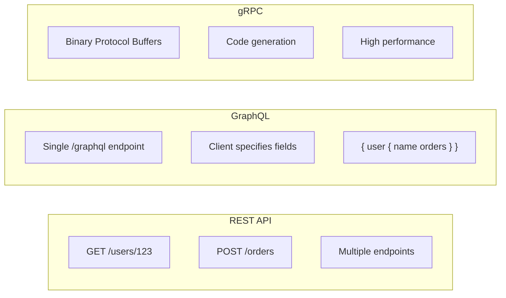

# API Design

How to design APIs that are usable, maintainable, and won't break as your system evolves.

---

## Why API Design Matters



An API is a contract between systems. When you publish an API - whether for external developers, your mobile app, or other internal services - you're making promises about how it works.

Bad API design leads to:
- Confused developers who use it wrong
- Slow clients from inefficient endpoints
- Breaking changes that require coordinated updates
- Workarounds that create technical debt
- Integration problems that waste engineering time

Good API design leads to:
- Self-explanatory usage
- Efficient data transfer
- Backward-compatible evolution
- Happy developers (including future you)

---

## REST API Fundamentals

REST (Representational State Transfer) is the most common API style for web services.

### Resources

Everything is a resource. Resources are nouns, not verbs.

**Good resource names:**
```
/users
/users/{id}
/users/{id}/orders
/products
```

**Bad resource names:**
```
/getUsers
/createUser
/fetchUserOrders
```

Resources are things. HTTP methods are actions on those things.

### HTTP Methods

| Method | Purpose | Idempotent | Safe |
|--------|---------|------------|------|
| GET | Read a resource | Yes | Yes |
| POST | Create a resource | No | No |
| PUT | Replace a resource completely | Yes | No |
| PATCH | Update part of a resource | No* | No |
| DELETE | Remove a resource | Yes | No |

**Idempotent:** Doing it twice has the same effect as doing it once.
**Safe:** Doesn't modify data.

*PATCH can be made idempotent if designed carefully.

### HTTP Status Codes

Use meaningful status codes:

**2xx Success:**
- 200 OK: Request succeeded
- 201 Created: Resource created
- 204 No Content: Success, no body to return

**4xx Client Error:**
- 400 Bad Request: Invalid input
- 401 Unauthorized: Not authenticated
- 403 Forbidden: Authenticated but not authorized
- 404 Not Found: Resource doesn't exist
- 409 Conflict: Conflicts with existing state
- 429 Too Many Requests: Rate limited

**5xx Server Error:**
- 500 Internal Server Error: Something broke
- 502 Bad Gateway: Upstream failure
- 503 Service Unavailable: Overloaded or down
- 504 Gateway Timeout: Upstream timeout

Don't use 200 for errors. Clients rely on status codes for control flow.

---

## URL Design

### Path Structure

Consistent, predictable hierarchy:

```
/users                     # Collection of users
/users/{id}                # Single user
/users/{id}/orders         # User's orders (nested resource)
/users/{id}/orders/{oid}   # Specific order of a user
```

### Query Parameters

For filtering, sorting, pagination, and optional parameters:

```
/products?category=electronics&sort=-price&page=2&limit=20
```

- `category=electronics`  -  filter
- `sort=-price`  -  sort (- for descending)
- `page=2&limit=20`  -  pagination

### Versioning

APIs evolve. How do you support old clients while introducing changes?

**URL versioning:**
```
/v1/users
/v2/users
```

Simple and obvious. Critics say it's not "RESTful" but it works well in practice.

**Header versioning:**
```
Accept: application/vnd.company.api+json;version=2
```

Keeps URL clean, but less discoverable.

**Choose one and be consistent.** URL versioning is most common.

---

## Request and Response Design

### Request Bodies

Use JSON (unless you have specific reasons for other formats).

**Consistent structure:**
```json
{
  "name": "Jane Doe",
  "email": "jane@example.com",
  "preferences": {
    "notifications": true
  }
}
```

**Naming conventions:** Pick one and stick to it. `camelCase` or `snake_case`, not both.

### Response Bodies

Include:
- The data requested
- Enough context to be useful
- Links to related resources (optional but helpful)

```json
{
  "id": "user-123",
  "name": "Jane Doe",
  "email": "jane@example.com",
  "createdAt": "2024-01-15T10:30:00Z",
  "_links": {
    "orders": "/users/user-123/orders"
  }
}
```

### Error Responses

Don't just return 500 with no body. Help the developer fix it:

```json
{
  "error": {
    "code": "VALIDATION_ERROR",
    "message": "Invalid input data",
    "details": [
      {
        "field": "email",
        "reason": "Must be a valid email address"
      }
    ]
  }
}
```

Include:
- Error code (machine-readable)
- Human-readable message
- Specific details when available
- Request ID for debugging

---

## Pagination

Large collections must be paginated.

### Offset-Based

```
/users?offset=100&limit=20
```

Returns users 101-120.

**Pros:** Simple, random access.
**Cons:** Unstable when data changes. If new user is inserted, items shift and you might skip or duplicate.

### Cursor-Based

```
/users?cursor=abc123&limit=20
```

Cursor is an opaque token pointing to a position.

**Pros:** Stable regardless of inserts/deletes.
**Cons:** No random access (can't jump to "page 5").

**Best for:** Infinite scroll, large changing datasets.

### Response Format

```json
{
  "data": [...],
  "pagination": {
    "cursor": "next-page-token",
    "hasMore": true
  }
}
```

Or with links:
```json
{
  "data": [...],
  "_links": {
    "next": "/users?cursor=abc&limit=20",
    "prev": "/users?cursor=xyz&limit=20"
  }
}
```

---

## Authentication and Authorization

### Authentication Methods

**API Keys:**
- Simple, often passed in header: `X-API-Key: abc123`
- Good for server-to-server
- Not great for user-facing apps (keys can be extracted)

**OAuth 2.0 / JWT:**
- Industry standard for user authentication
- Token-based, supports scopes
- More complex but more secure

**Session Cookies:**
- Traditional web auth
- Works for browser-based apps

### Authorization

Authentication is "who are you?" Authorization is "what can you do?"

After authenticating:
- Check if this user can access this resource
- Check if this user can perform this action

Return 401 for "not authenticated" (we don't know who you are).
Return 403 for "not authorized" (we know who you are but you can't do this).

---

## Rate Limiting

Protect your API from overuse.

**Communicate limits:**
```
X-RateLimit-Limit: 100
X-RateLimit-Remaining: 95
X-RateLimit-Reset: 1616098800
```

**When limited:**
```
HTTP 429 Too Many Requests
Retry-After: 30
```

Give developers the information they need to back off gracefully.

---

## Backward Compatibility

Once an API is in use, changing it can break clients.

### Safe Changes (Backward Compatible)

- Adding new optional fields to requests
- Adding new fields to responses
- Adding new endpoints
- Adding new enum values (if clients ignore unknowns)

### Breaking Changes (Avoid)

- Removing fields
- Renaming fields
- Changing field types
- Changing response structure
- Removing endpoints
- Changing URL structure

### How to Handle Breaking Changes

**Versioning:** New version for breaking changes. Support old version for deprecation period.

**Deprecation warnings:** Include in headers or response body that this is deprecated.

**Communication:** Document, announce, give timeline.

**Graceful sunset:** Old version continues to work for months/years. Gives clients time to migrate.

---

## Other API Styles

### GraphQL

Client specifies exactly what data they want.

```graphql
query {
  user(id: "123") {
    name
    orders {
      id
      total
    }
  }
}
```

**Advantages:**
- No over-fetching or under-fetching
- One endpoint for everything
- Strongly typed schema
- Great for complex frontends with varying data needs

**Disadvantages:**
- More complex to implement
- Caching is harder
- Can enable very expensive queries if not careful

**Good for:** Mobile apps, complex frontends with many different views.

### gRPC

Binary protocol using Protocol Buffers.

**Advantages:**
- Much faster than JSON/HTTP
- Strong typing with code generation
- Streaming support
- Great for internal service-to-service communication

**Disadvantages:**
- Not browser-friendly (needs proxy)
- Harder to debug (binary format)
- Requires schema management

**Good for:** Internal microservices, high-performance requirements.

### WebSockets

Bidirectional communication over persistent connection.

**Good for:** Real-time features (chat, live updates, gaming).

**Not for:** Regular request-response operations.

---

## API Documentation

If developers can't understand your API, they can't use it correctly.

### What to Document

- Authentication: How to obtain and use credentials
- Endpoints: URL, method, parameters, request/response examples
- Errors: What errors are possible and what they mean
- Rate limits: What limits exist and how to handle them
- Changelog: What's changed between versions

### OpenAPI (Swagger)

Standard format for describing REST APIs. Can generate documentation and client libraries.

---

## Common Mistakes

**Breaking changes without versioning.** Existing clients suddenly stop working.

**Inconsistent naming.** `userId` in one endpoint, `user_id` in another, `id` in another.

**200 for errors.** Returns 200 OK with error in body. Clients can't use status code for logic.

**No pagination.** Endpoint returns entire collection. Works fine with 10 items, crashes with 10,000.

**Not documenting errors.** Developers don't know what can go wrong or how to handle it.

**Chatty APIs.** Client needs 10 requests to load one page. Latency adds up.

**Leaking internal details.** Error messages expose database schema, stack traces, or internal paths.

**Ignoring deprecation.** Just removing old endpoints without warning or timeline.

---

## What An Experienced Senior Engineer Thinks About

**API as product.** If your API has external consumers, treat it like a product. Developer experience matters. Documentation matters.

**Stability vs. velocity.** Stable APIs mean clients don't break. But stability can slow down evolution. Find the right balance through versioning and deprecation policies.

**Efficiency vs. simplicity.** Fewer, more complex endpoints can be more efficient but harder to understand. Many simple endpoints are clearer but can be chatty.

**Schema evolution.** How do you add new capabilities without breaking old clients? This is a design problem to solve upfront.

**Consistency across services.** If you have many APIs, they should feel similar. Common conventions, common error formats, common patterns.

**Contract testing.** Tests that verify API contract between services. Catch breaking changes before deployment.

---

## Vibe Engineering Guide

When prompting about API design:

**Less useful:**
> "Design an API for users"

**More useful:**
> "Design a REST API for a user management system. Requirements:
> - CRUD operations for users
> - Users have profiles with nested address
> - Admin and regular user roles
> - Pagination for listing users
> - Proper error responses
> - Authentication with JWT
>
> Show me the endpoint structure, example request/response for each, and error handling."

**For GraphQL:**
> "We currently have REST endpoints that mobile app calls. The home screen needs data from 5 different REST calls. I'm considering GraphQL to reduce this to one call. What are the trade-offs? How would the schema look for a user profile with orders and recommendations?"

**For versioning:**
> "We need to change our /users endpoint to return a different structure. We have external partners using it with a 90-day SLA. How do we version and deprecate gracefully?"

---

## Quick Check

<details>
<summary><b>What's the difference between PUT and PATCH?</b></summary>

PUT replaces the entire resource - you send the complete new state. PATCH updates part of the resource - you send only what changes. PUT is idempotent by definition; PATCH should be designed to be.

</details>

<details>
<summary><b>When should you use cursor-based pagination?</b></summary>

When data changes frequently (new items inserted), when you have very large datasets, or when you're implementing infinite scroll. Cursor-based is stable regardless of insertions/deletions.

</details>

<details>
<summary><b>What makes a change "backward compatible"?</b></summary>

If existing clients continue to work without modification. Adding optional fields, new endpoints, or new response fields is usually safe. Removing or renaming fields, changing types, or restructuring breaks existing clients.

</details>

<details>
<summary><b>Why not use 200 for error responses?</b></summary>

Clients use status codes for control flow. 2xx means success. If you return 200 with error in body, clients can't distinguish success from failure without parsing the body. Use appropriate 4xx/5xx codes.

</details>

<details>
<summary><b>When would you choose GraphQL over REST?</b></summary>

When clients have very different data needs (mobile vs. web), when reducing round trips matters, or when you have deeply nested data. REST is simpler and has better caching. Choose based on your specific needs.

</details>

---

Next: [Common Patterns](03-common-patterns.md)
