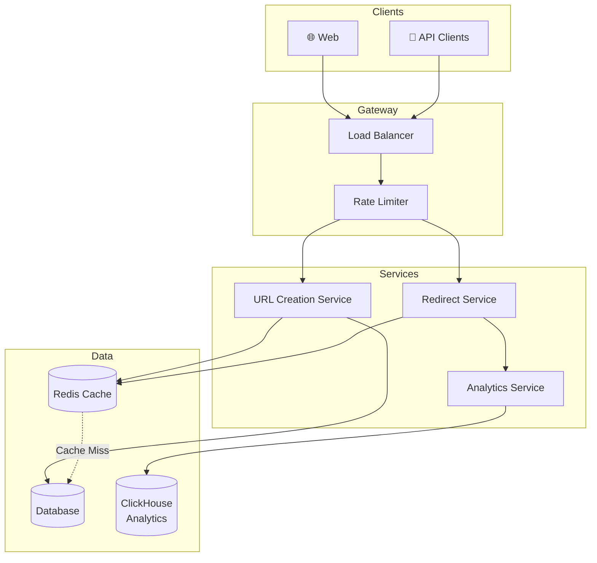
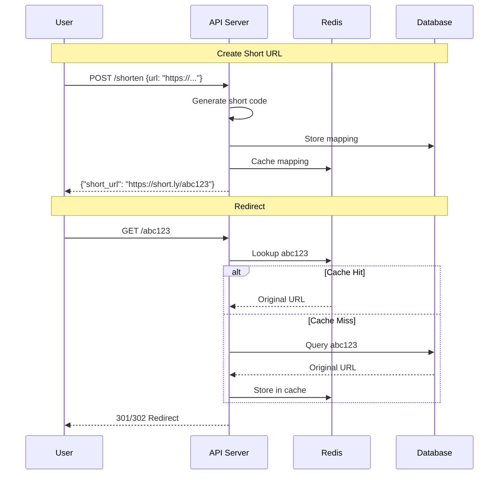

# URL Shortener Design

Designing a simple but educational system covering hashing, storage, redirection, and scaling.

---

## Requirements

A URL shortener creates short aliases for long URLs.

**Functional Requirements:**
- Given a long URL, generate a short URL
- Given a short URL, redirect to the original
- Short URLs should be as short as possible
- Custom aliases (optional)
- Expiration (optional)

**Non-Functional Requirements:**
- High availability (redirects must work)
- Low redirect latency
- URLs should not be guessable/enumerable

---

## Traffic Estimation

Before designing, estimate the scale.

**Assumptions:**
- 100M new URLs per month
- 100:1 read:write ratio (redirects vs creates)
- Average URL length: 100 characters
- Retention: 5 years

**Calculations:**

Writes: 100M / (30 × 24 × 3600) ≈ 40 URLs/second

Reads: 40 × 100 = 4,000 redirects/second

Storage: 100M × 12 months × 5 years = 6B URLs
         6B × (100 bytes + 7 bytes short code + overhead) ≈ 1TB

This is very manageable. A single well-configured database can handle this.

---

## Short URL Design

### How Many Characters?

Using alphanumeric characters (a-z, A-Z, 0-9) = 62 characters.

| Length | Combinations |
|--------|--------------|
| 6 | 62^6 = 56 billion |
| 7 | 62^7 = 3.5 trillion |
| 8 | 62^8 = 218 trillion |

6-7 characters is plenty for billions of URLs.

### Generation Approaches

#### 1. Hash-Based

Hash the URL and take first N characters.

```
MD5("https://example.com/long-page") = "abc123..."
Short URL: abc123 (first 6 characters)
```

**Problem:** Collisions. Different URLs may hash to same prefix.

**Solution:** Check for collision, rehash with suffix if collision occurs.

#### 2. Counter-Based

Use an incrementing counter, encode to base62.

```
Counter: 1000000
Base62: "4c92"
```

**Advantages:** No collisions, predictable length.

**Disadvantages:** Predictable/enumerable. Can see how many URLs exist.

**Solution:** Use a counter but shuffle/obfuscate the encoding.

#### 3. Random Generation

Generate random string, check uniqueness.

```
Generate: "xK9mN2"
Check database: not taken? Use it.
```

**Advantages:** Not predictable.

**Disadvantages:** Collision probability increases as database fills. Requires uniqueness check.

### Recommended Approach
1.  **Counter (Better):** 
    *   **The Approach:** Use the database ID (1, 2, 3...) to guarantee uniqueness.    
    *   **The Problem:** If you just use IDs, users can spy on you by guessing the next URL (`.../b`, `.../c`).
    *   **The Fix:** "Scramble" the ID using a math formula before turning it into letters. ID `100` becomes `xy7Z`. Unique, but looks random.
2.  **Random:**
    *   **The Approach:** Just generate 7 random letters (e.g., `a7X9b2`).
    *   **The Problem:** It might already constitute a duplicate.
    *   **The Fix:** Check the database. If it exists, try again. Simple to code, but gets slower as the database fills up.

---

## Database Design

Simple schema:

```sql
urls (
  id BIGSERIAL PRIMARY KEY,
  short_code VARCHAR(10) UNIQUE NOT NULL,
  original_url TEXT NOT NULL,
  created_at TIMESTAMP DEFAULT NOW(),
  expires_at TIMESTAMP,
  click_count BIGINT DEFAULT 0
)

CREATE INDEX idx_short_code ON urls(short_code);
```

### Storage Choice

**For this scale (single TB, few thousand QPS), PostgreSQL or MySQL is fine.**

NoSQL (like DynamoDB) works too:
- Key: short_code
- Value: {original_url, created_at, expires_at, ...}

At larger scale, you might shard by short_code prefix.

---

## System Architecture



### Request Flows



---

## Caching Strategy

Redirects are very read-heavy. Cache aggressively.

**What to cache:** Short code → original URL mapping

**Cache policy:**
- Cache on read (after database lookup)
- Set high TTL (URLs don't change)
- Popular URLs stay in cache

**Expected hit rate:** Very high (90%+). Most redirects are for a subset of popular URLs.

### Cache Size

If 1 million popular URLs, each ~150 bytes of data:
1M × 150 bytes ≈ 150MB

Redis handles this easily. Cache the active set.

---

## Redirect: 301 vs 302

**301 Moved Permanently:**
- Browser caches the redirect
- Subsequent visits don't hit your server
- Good for permanent URLs
- Less analytics visibility (browser doesn't ask again)

**302 Found (Temporary):**
- Browser doesn't cache
- Every visit hits your server
- Better for tracking analytics

Most URL shorteners use 302 for tracking, or 301 with separate analytics.

---

## Handling Collisions

If using hash-based or random generation, collisions must be handled.

**Approach:**
1. Generate candidate short code
2. Check database for existence
3. If exists, regenerate (add suffix, re-randomize)
4. Retry up to N times
5. If still colliding, fail and return error

At low fill rates, collisions are rare. At high fill rates, consider longer codes.

---

## Analytics

URL shorteners often track clicks.

**Data to capture:**
- Timestamp
- Referrer
- User agent (browser, OS)
- Geographic location (from IP)
- Short code

**Storage:**
- High volume (potentially millions of clicks/day)
- Append-only
- Analytics queries are separate from redirect path

**Options:**
- Write to Kafka, process for analytics
- Write to time-series database
- Async write to not slow redirects

Don't let analytics slow down the redirect. Fire-and-forget or async.

---

## Scaling Considerations

### Read Scalability

Redirects dominate. Solutions:
- Cache heavily (Redis)
- Read replicas if needed
- CDN for static parts

### Write Scalability

URL creation is lower volume. Single database handles 40 writes/sec easily.

At much higher scale:
- Partition by short code
- Distributed ID generation (Snowflake-style)

### Global Deployment

Users worldwide want low latency.

Options:
- CDN with edge caching of redirects
- Multiple regions with replicated data
- GeoDNS routing

---

## Optional Features

### Custom Aliases

Allow users to specify their own short code (e.g., "mysite" instead of "abc123").

**Considerations:**
- Check uniqueness
- Reserve some words (admin, api, etc.)
- May charge for premium short codes

### Expiration

URLs can expire after a date.

**Implementation:**
- Store expires_at
- Check on redirect
- Periodic job to clean up or just check at runtime

### Rate Limiting

Prevent abuse (spam URL creation, scraping).

**Per IP or per user:** X creations per minute/hour.

---

## Common Mistakes

**Not handling collisions.** Hash collisions exist. Random collisions exist as database fills.

**Blocking on analytics.** Every redirect waits for analytics write. Slows everything.

**No caching.** Every redirect hits database. Unnecessary load.

**Using predictable IDs.** If your URLs are `.../abc1`, `.../abc2`, competitors can guess them and see all your data. Use random-looking IDs.

**No rate limiting.** Spammers create millions of URLs.

---

## What An Experienced Senior Engineer Thinks About

**Availability vs. durability.** If cache goes down, can you serve from database? If database is briefly unavailable, what happens? URLs that were created are lost? Or cached URLs still work?

**Cost optimization.** Storing trillions of URLs that are never accessed. Archival tier storage. Cleanup policies.

**Abuse prevention.** URLs pointing to malware, phishing. Link scanning, reputation systems.

**SLA definition.** What's the redirect latency SLA? What's acceptable availability? Design follows from requirements.

---

## Vibe Engineering Guide

When prompting about URL shorteners:

**Less useful:**
> "Design a URL shortener"

**More useful:**
> "Design a URL shortener with these requirements:
> - 10M URLs/month created
> - 1000:1 read/write ratio
> - Need analytics (clicks per URL)
> - Global users (need low latency worldwide)
>
> Focus on: the short code generation strategy, database schema, caching approach, and how to scale reads globally."

**For specific trade-offs:**
> "I'm deciding between hash-based and counter-based short code generation. We need non-enumerable URLs for privacy. Expected 100M URLs. What are the trade-offs and what would you recommend?"

---

## Quick Check

<details>
<summary><b>Why might hash-based short codes have collisions?</b></summary>

You're taking only 6-7 characters of a hash. Different URLs can produce hashes with the same prefix. Need to detect and handle collisions.

</details>

<details>
<summary><b>Why cache URL mappings?</b></summary>

Redirects are extremely read-heavy. A small cache can handle most traffic since popular URLs are accessed repeatedly. Cache hit avoids database lookup.

</details>

<details>
<summary><b>301 vs 302 redirect - which for URL shortener?</b></summary>

301 is permanent; browser caches it. 302 is temporary; browser always asks your server. 302 is common for analytics tracking (you see every click).

</details>

<details>
<summary><b>Why not use sequential IDs directly?</b></summary>

They're enumerable. Someone can iterate through all your URLs by incrementing. Use obfuscation or random generation for privacy.

</details>

<details>
<summary><b>How would you handle analytics at scale?</b></summary>

Async processing. Write click events to a queue (Kafka) or fire-and-forget to a logging system. Don't block the redirect on analytics writes.

</details>

---

Next: [Rate Limiter Design](02-rate-limiter.md)
