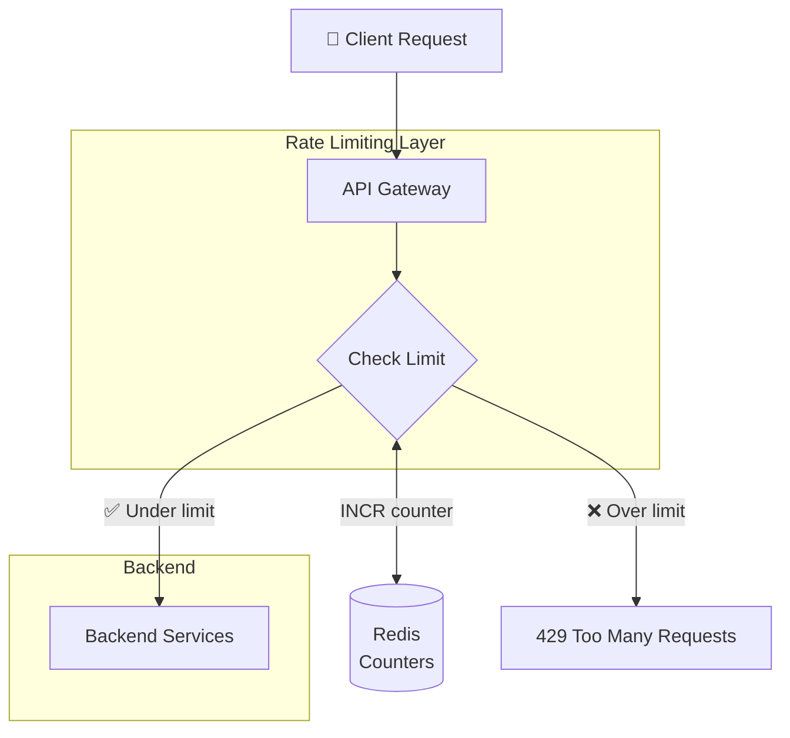
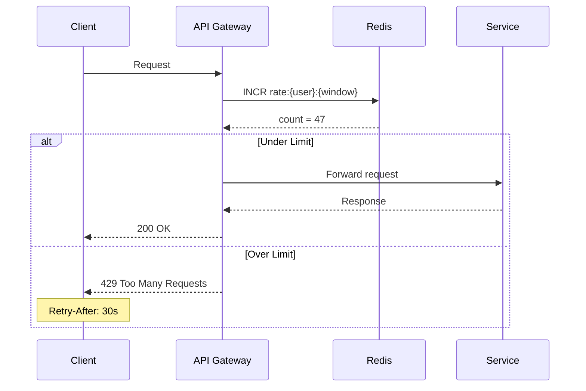

# Rate Limiter Design

Protecting your system from overload, a critical component for any production service.

---

## What is Rate Limiting?

Rate limiting controls how many requests a client can make in a given time period.

**Examples:**
- 100 requests per minute per user
- 1000 API calls per hour per API key
- 5 login attempts per 15 minutes per IP

---

## Why Rate Limit?

### Prevent Abuse

Malicious actors trying to:
- Brute-force passwords
- Scrape your entire database
- Spam user registration
- DDoS your service

### Protect Resources

Legitimate but aggressive clients:
- Buggy code in infinite loops
- Misconfigured batch jobs
- Viral content causing traffic spikes

### Ensure Fair Usage

One heavy user shouldn't consume all resources at the expense of others.

### Control Costs

Cloud resources cost money. Unlimited traffic means unlimited bills.

---

## Where to Rate Limit

### API Gateway / Edge

Rate limit at the entry point before requests reach your services.

**Pros:** Protects everything behind it. Centralized.
**Cons:** Coarse-grained. Hard to apply service-specific limits.

### Individual Services

Each service enforces its own limits.

**Pros:** Fine-grained control per service.
**Cons:** Decentralized. Each service needs implementation.

### Database / Critical Resource

Protect specific resources from overload.

**Pros:** Directly protects the bottleneck.
**Cons:** Failures visible to end users as errors.

**Typical approach:** Layer all three. Gateway for global limits, services for specific limits.

---

## Rate Limiting Algorithms

### Fixed Window

Count requests in fixed time windows (e.g., per minute on the minute).

**How it works:**
- Window: 0:00-0:59, 1:00-1:59, ...
- Count requests in current window
- Reject if count > limit
- Reset count at window boundary

**Pros:** Simple to implement.
**Cons:** Burst at window boundaries. User can make 100 requests at 0:59 and 100 at 1:00 = 200 in 2 seconds.

### Sliding Window Log

Track timestamp of each request. Count requests in last N seconds.

**How it works:**
- Store timestamp of each request
- Count requests with timestamp > (now - window_size)
- Reject if count > limit

**Pros:** No boundary burst problem.
**Cons:** Memory-intensive. Store every request timestamp.

### Sliding Window Counter

Approximate sliding window using weighted average of fixed windows.

**How it works:**
- Track count in current and previous window
- Estimate: previous * (1 - elapsed%) + current
- Reject if estimate > limit

**Pros:** Memory-efficient (just two counters). Smooth.
**Cons:** Approximation, not exact.

### Token Bucket

Bucket holds tokens. Requests consume tokens. Tokens refill at constant rate.

**How it works:**
- Bucket capacity: 100 tokens
- Refill rate: 10 tokens/second
- Request takes 1 token
- No token available? Reject

**Pros:** Allows bursts (up to bucket size). Smooth average rate.
**Cons:** Slightly more complex.

### Leaky Bucket

Requests enter a queue (bucket). Processed at constant rate. Overflow rejected.

**How it works:**
- Queue capacity: 100 requests
- Process rate: 10/second
- Queue full? Reject new request

**Pros:** Very smooth output rate.
**Cons:** Delays requests (they wait in queue).

### Which to Choose?

**Token bucket** is the most commonly used. It handles bursts gracefully while maintaining an average rate.

**Sliding window counter** is good for simple, memory-efficient rate limiting.

---

## Identifying Clients

Who are you rate limiting?

### By IP Address

**Pros:** No authentication needed. Works for anonymous users.
**Cons:** NAT means many users share one IP. VPNs and proxies can bypass.

### By User ID

**Pros:** Accurate per-user limiting.
**Cons:** Requires authentication. Doesn't limit before login.

### By API Key

**Pros:** Identifies applications/integrations.
**Cons:** Key can be shared or stolen.

### Combined

Use multiple identifiers:
- Unauthenticated: limit by IP
- Authenticated: limit by user ID
- API access: limit by API key

---

## Distributed Rate Limiting

Single-server rate limiting is easy. Multi-server is harder.

### The Problem

You have 10 servers. Limit is 100/minute. If each server counts independently, user could make 100 requests to each server = 1000 total.

### Solution: Centralized Counter

All servers read/write to a shared counter (Redis).

```
Server A: Check Redis for user X count
Server B: Check Redis for user X count
Redis: user_X_count = 47
```

**Implementation with Redis:**
- Key: `rate_limit:{user_id}:{window}`
- Value: request count
- INCR atomically, EXPIRE for window

### Consistency vs. Performance

**Strict consistency:** Always check Redis before every request. Adds latency.

**Eventual consistency:** Check locally cached value, sync periodically. May slightly exceed limit.

For most cases, slight over-limiting is acceptable. Don't block on Redis for every request if you can avoid it.

---

## System Design





### Rate Limiter as Middleware

Rate limiting logic runs as middleware in your API gateway or application:

1. Extract client identifier (IP, user ID, API key)
2. Determine which limits apply
3. Check current count against limit
4. If within limit: increment count, proceed
5. If exceeded: return 429 Too Many Requests

---

## Response When Limited

### HTTP 429 Too Many Requests

Standard status code for rate limiting.

### Include Helpful Headers

```
HTTP/1.1 429 Too Many Requests
X-RateLimit-Limit: 100
X-RateLimit-Remaining: 0
X-RateLimit-Reset: 1616098800
Retry-After: 30
```

- **X-RateLimit-Limit:** The limit for this window
- **X-RateLimit-Remaining:** Requests left
- **X-RateLimit-Reset:** When the window resets (Unix timestamp)
- **Retry-After:** Seconds until client should retry

This helps clients implement proper backoff.

---

## Multiple Rate Limits

Apply different limits for different scenarios:

| Scope | Limit | Purpose |
|-------|-------|---------|
| Global | 10,000/sec total | Protect infrastructure |
| Per IP | 100/min | Basic abuse prevention |
| Per User | 1,000/hour | Fair usage |
| Per Endpoint | 10/min for /login | Brute force protection |

Rules are evaluated in order. First exceeded limit triggers 429.

---

## Implementation Options

### Build Your Own

Use Redis for distributed counting. Implement algorithm in your code.

**INCR with EXPIRE for fixed window:**
```
key = "rate:{user}:{current_minute}"
count = INCR key
if count == 1:
    EXPIRE key 60
if count > limit:
    reject
```

**Works for:** Simple cases, full control.

### Cloud Provider

AWS API Gateway, GCP Cloud Endpoints, Azure API Management all have built-in rate limiting.

**Works for:** When using their ecosystem, simple configuration.

### Dedicated Service

Kong, Envoy, NGINX can all do rate limiting.

**Works for:** More complex scenarios, existing API gateway.

---

## Handling Bursts

Strict rate limits can hurt legitimate users during bursts.

### Token Bucket Allows Bursts

With token bucket: if bucket is full (100 tokens), user can burst 100 requests immediately, then sustain at fill rate.

### Burst Limit + Sustained Limit

Two limits:
- 20 requests per second (burst)
- 1000 requests per hour (sustained)

Allows short bursts but limits overall volume.

---

## What Happens When Redis is Down?

Rate limiting depends on Redis. What if Redis fails?

### Fail Open

Without Redis, allow all requests. May be overloaded, but service continues.

**Risk:** No protection during outage.

### Fail Closed

Without Redis, reject all requests. Service protected.

**Risk:** Complete outage if Redis dies.

### Local Fallback

Fall back to local (per-server) rate limiting. Less accurate but works.

**Typical choice:** Fail open or local fallback. Rate limiting failure shouldn't cause complete outage.

---

## Common Mistakes

**Rate limiting only at one layer.** Someone bypasses your gateway and hits service directly.

**Too strict limits.** Legitimate users hit limits during normal usage. Bad experience.

**No feedback to clients.** Just returning 429 without headers. Clients don't know when to retry.

**Ignoring distributed case.** Works locally, but 10 servers means 10x allowed requests.

**Rate limiting on the wrong key.** Limiting by IP when behind a CDN that shows one IP for all users.

**No monitoring.** Don't know how many requests are being rate limited or whether limits are appropriate.

---

## What An Experienced Senior Engineer Thinks About

**Business context.** Rate limits have business implications. Limits affect partners, power users, enterprise customers. Different tiers may need different limits.

**Graceful degradation.** Instead of hard rejection, consider slowing down (adding latency) or reducing functionality.

**DDoS vs. rate limiting.** Rate limiting handles misbehaving clients. DDoS attacks can overwhelm before rate limiting even runs. Need WAF, CDN-level protection for DDoS.

**Observability.** Track: requests allowed, requests rejected, by limit type, by client. This data informs limit tuning.

**Cost allocation.** If you're a platform, rate limits may be tied to pricing tiers. Rate limiting is essentially resource allocation.

---

## Vibe Engineering Guide

When prompting about rate limiting:

**Less useful:**
> "Add rate limiting to my API"

**More useful:**
> "Design rate limiting for my API with:
> - 100 requests/minute per authenticated user
> - 20 requests/minute per IP for unauthenticated users
> - Additional limit of 5 login attempts per 15 minutes
> - Distributed across 5 API servers
>
> Should I use token bucket or sliding window? How do I handle the distributed case with Redis?"

**For troubleshooting:**
> "Users report getting rate limited when they shouldn't be. We're behind CloudFlare and rate limiting by IP. Could CloudFlare be affecting our IP detection? How do I get the real client IP?"

---

## Quick Check

<details>
<summary><b>What's the difference between fixed window and sliding window?</b></summary>

Fixed window counts within fixed time boundaries (0:00-0:59). Allows bursts at boundaries. Sliding window considers the last N seconds from now, avoiding boundary issues.

</details>

<details>
<summary><b>Why is token bucket popular?</b></summary>

It naturally handles bursts (up to bucket capacity) while maintaining an average rate (refill rate). Most real traffic is bursty, so this matches usage patterns well.

</details>

<details>
<summary><b>How do you rate limit across multiple servers?</b></summary>

Use a centralized counter store (Redis). All servers check and increment the same counter. Trade-off between strict consistency (always check Redis) and performance (local caching).

</details>

<details>
<summary><b>What should you return when rate limited?</b></summary>

HTTP 429 Too Many Requests with headers: X-RateLimit-Limit, X-RateLimit-Remaining, X-RateLimit-Reset, Retry-After. Helps clients back off appropriately.

</details>

<details>
<summary><b>Should rate limiting fail open or closed?</b></summary>

Usually fail open or with local fallback. Rate limiting failure shouldn't cause complete service outage. But depends on what you're protecting - some scenarios warrant fail closed.

</details>

---

Next: [Chat System Design](03-chat-system.md)
