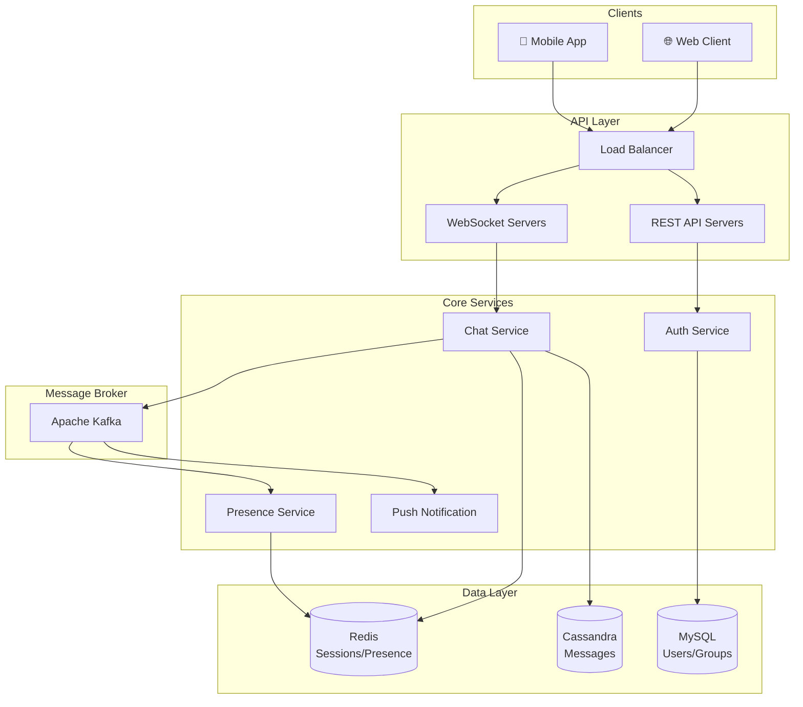

# Chat System Design

Designing real-time messaging handling presence, delivery, and scale.

---

## Requirements

### Functional Requirements

- One-on-one messaging
- Group messaging
- Sent/delivered/read receipts
- Online presence indicators
- Message history
- Push notifications (offline users)

### Non-Functional Requirements

- Real-time delivery (sub-second latency)
- High availability
- Messages must not be lost
- Message ordering within conversations
- Support for millions of concurrent users

---

## Scale Estimation

**Assumptions:**
- 100 million daily active users
- Average user sends 50 messages/day
- Peak load: 3x average

**Calculations:**

Messages per day: 100M × 50 = 5 billion

Messages per second (average): 5B / 86400 ≈ 58,000/sec

Messages per second (peak): 58,000 × 3 ≈ 175,000/sec

Storage (1 year): 5B × 365 × 100 bytes ≈ 180 TB

This is significant scale requiring distributed architecture.

---

## High-Level Architecture



---

## Core Components

### Connection Servers

Handle WebSocket connections. Each server maintains many concurrent connections.

**Responsibilities:**
- Authenticate connections
- Maintain connection state
- Route messages to/from clients
- Track which user is on which server

**Scaling:** Add more connection servers. Each user connects to one server.

### Presence Service

Track who is online.

**Implementation options:**

1. **Heartbeat in Redis:**
   ```
   Key: presence:{user_id}
   Value: {server_id, last_seen}
   TTL: 30 seconds
   ```
   Client sends heartbeat every 20 seconds. TTL expires if heartbeat stops.

2. **Connection tracking:**
   When WebSocket connects, mark online. When disconnects, mark offline.

**Fan-out:** When user status changes, notify their contacts. For popular users, this can be expensive.

### Message Queue

Decouple message ingestion from delivery.

**Why Kafka:**
- High throughput
- Message persistence
- Order preservation per partition

**Partitioning:** By conversation ID. Messages in same conversation go to same partition → ordered.

### Message Storage

Store message history.

**Requirements:**
- Fast writes
- Fast reads by conversation
- Large scale

**Good options:**
- **Cassandra:** Partition by conversation_id, cluster by timestamp. Excellent for this access pattern.
- **DynamoDB:** Partition key: conversation_id, sort key: timestamp.

**Schema conceptually:**

```
Partition: conversation_{id}
  Row: timestamp_1, sender, content, metadata
  Row: timestamp_2, sender, content, metadata
  ...
```

### Push Service

Deliver notifications to offline users.

**Flow:**
1. Message arrives for offline user
2. Push service notified
3. Sends to APNs (iOS) / FCM (Android)
4. User receives push notification

---

## Message Flow

### Sending a Message

1. **Sender's client** sends message via WebSocket
2. **Connection server** receives, validates
3. **Publishes to Kafka** (partitioned by conversation)
4. **Message service** consumes from Kafka
5. **Stores in database** (Cassandra)
6. **Looks up recipients:**
   - Online? → Find their connection server → deliver via WebSocket
   - Offline? → Queue for push notification
7. **Sends receipts** back to sender

### Message Delivery

**Online recipient:**
- Look up in Redis which connection server
- Route message to that server
- Server pushes via WebSocket to client
- Client acknowledges receipt

**Offline recipient:**
- Message stored in database
- Push notification sent
- When user comes online, fetches unsent messages

---

## Group Messaging

Groups add complexity.

### Small Groups (< 100 members)

Simple fan-out. Message sent to each member.

**Storage:** Each user has pointer to group messages. Or: fan-out on write (copy message for each member).

### Large Groups (> 100 members)

Fan-out becomes expensive. 1000 members = 1000 deliveries.

**Optimization:**
- Fan-out on read: store once, members fetch on demand
- Message stored in group timeline
- Members read from group timeline when active

### Group Metadata

Store group info:
- Members list
- Permissions (admin, who can post)
- Group settings

**Consistency:** Use relational database for groups metadata (ACID for membership changes).

---

## Read Receipts

Track who has read which messages.

**Implementation:**

Per user per conversation, track: `last_read_timestamp`

When user opens conversation:
1. Update their `last_read_timestamp`
2. Notify other participants (fan-out)

**Optimization:** Don't real-time update for every message. Throttle or update in batches.

---

## Message History and Sync

Users switch devices, reinstall apps, or go offline for periods.

### Sync Protocol

1. Client stores `last_received_timestamp` per conversation
2. On connect, request messages since that timestamp
3. Server sends missing messages
4. Client acknowledges, updates timestamp

### Pagination

For long histories, paginate:
- Client requests: "last 50 messages before timestamp X"
- Server returns page
- Client can load more on scroll

---

## Scaling Challenges

### WebSocket Connections

Each server has connection limits. 100 million users = many servers.

**At Facebook scale:** Millions of concurrent connections across thousands of servers.

**Load balancing WebSockets:** Sticky by user. User reconnects to same server (or any, since state is external).

### Message Fan-out

Popular users or large groups create fan-out hotspots.

**Solutions:**
- Rate limiting
- Queue per recipient, process in batches
- For very large groups, optimization (read-based)

### Presence at Scale

Tracking presence for 100M users and notifying contacts is expensive.

**Optimization:**
- Lazy presence: only query presence when needed
- Throttle updates
- Limit visibility (only show presence to close contacts)

---

## Reliability

### Message Persistence

Never lose user messages.

- Write to persistent storage before acknowledging
- Replicate database
- Regular backups

### Delivery Guarantees

At-least-once delivery. Accept that duplicates are possible.

**Client-side deduplication:** Message ID allows client to ignore duplicates.

### Failover

- Multiple connection servers (user reconnects to another)
- Multiple message service instances
- Database replication and failover

---

## Security

### End-to-End Encryption

Messages encrypted on sender's device, decrypted on recipient's.

**Implementation:** Key exchange (like Signal Protocol). Server can't read message content.

**Challenge:** Server can't do content-based features (search, moderation) on encrypted messages.

### Authentication

- JWT tokens for API auth
- WebSocket upgraded after HTTP auth
- Token refresh for long-lived connections

---

## Common Mistakes

**Synchronous delivery.** Waiting for all recipients to receive before responding to sender. Recipient unavailability blocks sender.

**Polling instead of push.** Clients poll for new messages. Adds latency, wastes resources. Use WebSocket.

**Single connection server.** All connections on one server. Crashes and everyone disconnects.

**Storing all messages same way.** One-on-one and group messages have different patterns. Consider different storage/sharding.

**Ignoring offline case.** Works great when online, fails when offline users come back. Design sync carefully.

---

## What An Experienced Senior Engineer Thinks About

**Consistency model.** Messages eventually consistent. But read receipts might be delayed. Users should understand the UX.

**Multi-device.** User has phone, tablet, web open. Message goes to all. Read on one → mark read on all.

**End-to-end encryption key management.** Device changes, key rotation. Complex key management for true E2EE.

**Abuse and moderation.** Spam, harassment. Without content access (E2EE), limited options. Metadata-based detection, reporting.

**Geographic distribution.** Global users. Multi-region deployment for latency. Message routing across regions.

---

## Vibe Engineering Guide

When prompting about chat systems:

**Less useful:**
> "Design a chat app"

**More useful:**
> "Design a chat system for 1 million DAU:
> - One-on-one and small groups (up to 50)
> - Real-time delivery with sent/delivered/read receipts
> - Message history (last 30 days)
> - Push notifications for offline users
>
> Focus on: WebSocket connection management, message storage schema, and how to handle the user coming online after being offline."

**For specific problems:**
> "In our chat system, when a user comes online after being offline for a day, fetching all missed messages takes 10+ seconds. We use PostgreSQL with conversation_id and timestamp indexes. What's causing the slowness and how can we improve?"

---

## Quick Check

<details>
<summary><b>Why use WebSockets for chat?</b></summary>

Real-time bidirectional communication. Server can push messages to clients immediately. Polling would add latency and waste resources.

</details>

<details>
<summary><b>Why partition Kafka by conversation ID?</b></summary>

Messages in same conversation go to same partition, preserving order. Order within a conversation matters; order across different conversations doesn't.

</details>

<details>
<summary><b>How do you handle offline users?</b></summary>

Store messages in database. When user comes online, they fetch messages since their last sync timestamp. Push notifications alert them about new messages.

</details>

<details>
<summary><b>Why is group messaging harder?</b></summary>

Fan-out. A message to a 100-person group needs to be delivered 100 times. For large groups, fan-out on write becomes expensive; may need fan-out on read.

</details>

<details>
<summary><b>What's the presence challenge at scale?</b></summary>

Tracking online status for millions of users and notifying their contacts on status change. Requires throttling, lazy updates, or limiting visibility.

</details>

---

Next: [Notification System Design](04-notification-system.md)
