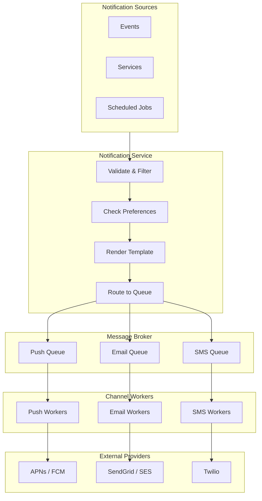

# Notification System Design

Delivering the right message to the right user at the right time across email, push, SMS, and in-app.

---

## Requirements

### Functional Requirements

- Multiple channels: push notification, email, SMS, in-app
- Template-based messaging
- User preferences (opt-in/opt-out per channel)
- Scheduling (send at specific time)
- Rate limiting (don't spam users)
- Delivery tracking

### Non-Functional Requirements

- High throughput (millions of notifications/day)
- Low latency for real-time notifications
- Exactly-once delivery where possible
- Reliable (messages shouldn't be lost)
- Scalable to billions of users

---

## Scale Estimation

**Assumptions:**
- 500 million users
- 10 notifications per user per day average
- 70% push, 20% email, 10% SMS
- Peak: 5x average

**Calculations:**

Daily: 500M × 10 = 5 billion notifications

Per second (average): 5B / 86400 ≈ 58,000/sec

Per second (peak): ~290,000/sec

This requires a robust distributed system.

---

## High-Level Architecture



---

## Core Components

### Notification Service

The orchestrator. Receives requests, processes them, queues for delivery.

**Responsibilities:**
- Validate notification request
- Check user preferences
- Apply rate limiting
- Render templates
- Queue for appropriate channel

### Message Queue

Decouples ingestion from delivery. Kafka recommended for throughput.

**Separate queues per channel:**
- push_notifications
- email_notifications
- sms_notifications

This allows independent scaling and prioritization.

### Channel Workers

Consume from queues, deliver via external providers.

**Push Workers:** Connect to APNs (Apple), FCM (Google).
**Email Workers:** Connect to SendGrid, AWS SES, etc.
**SMS Workers:** Connect to Twilio, SNS, etc.

Workers handle:
- Batching (where providers support it)
- Retries with backoff
- Provider failover

### User Preferences

Store per-user, per-notification-type preferences.

```sql
user_preferences (
  user_id,
  notification_type,  -- 'marketing', 'transactional', 'social'
  channel,            -- 'push', 'email', 'sms'
  enabled BOOLEAN,
  quiet_hours_start,
  quiet_hours_end
)
```

**Check before sending:** Respect unsubscribes and quiet hours.

### Device Registry

For push notifications, track user devices.

```sql
devices (
  user_id,
  device_token,
  platform,            -- 'ios', 'android'
  last_active,
  created_at
)
```

Users can have multiple devices. Push to all active devices.

---

## Notification Flow

### Real-Time Notification

1. **Event occurs:** Order shipped
2. **Event triggers notification:** Order service publishes "OrderShipped" event
3. **Notification service consumes event**
4. **Looks up user preferences:** Should we send push? Email?
5. **Checks rate limits:** Already sent too many today?
6. **Renders template:** "Your order #{id} has shipped!"
7. **Queues for delivery:** Push to push_queue, email to email_queue
8. **Workers consume and deliver**
9. **Track delivery status**

### Scheduled Notification

1. **Notification created with future send_at timestamp**
2. **Stored in database**
3. **Scheduler job runs every minute**
4. **Finds notifications due to be sent**
5. **Moves to queue for delivery**
6. **Normal delivery flow**

---

## Templates

Dynamic content using templates.

**Template:**
```
Hello {{user_name}},

Your order #{{order_id}} has shipped!
Tracking: {{tracking_url}}
```

**Data:**
```json
{
  "user_name": "Alice",
  "order_id": "12345",
  "tracking_url": "https://example.com/track/abc"
}
```

**Rendered:**
```
Hello Alice,

Your order #12345 has shipped!
Tracking: https://example.com/track/abc
```

### Template Management

- Version templates
- A/B testing different templates
- Preview before sending
- Localization (multiple languages)

---

## Rate Limiting

Don't spam users.

### Per-User Limits

- Max 5 push notifications per hour
- Max 2 emails per day (non-transactional)

### Aggregation

Multiple events → one notification.

Instead of 10 "New follower" notifications:
```
"You have 10 new followers"
```

Aggregate similar notifications over a time window.

### Priority

Some notifications are more important:
- Transactional (order confirmation): high priority, bypass limits
- Marketing (promotion): low priority, respect limits
- Security (password reset): highest priority, always send

---

## Delivery Reliability

### At-Least-Once Delivery

Queue ensures messages aren't lost. Retry on failure.

**Problem:** Duplicates possible.

**Solutions:**
- Track sent notifications (notification_id)
- Idempotent delivery (sending same notification twice is okay)
- Providers often dedupe

### Retry Strategy

External providers fail. Retry with exponential backoff.

```
Attempt 1: immediate
Attempt 2: after 1 second
Attempt 3: after 4 seconds
Attempt 4: after 16 seconds
...
Max attempts: 5
```

After max retries, move to dead letter queue for investigation.

### Fallback Channels

Primary channel fails? Try secondary.

**Example:** Push notification fails (user disabled notifications) → send email instead.

Configure fallback chains per notification type.

---

## Tracking and Analytics

### Delivery Status

Track for each notification:
- Queued
- Sent (to provider)
- Delivered (confirmed by provider)
- Opened/Clicked (if trackable)
- Failed (with reason)

### Metrics

- Delivery rate per channel
- Open rate (email)
- Click rate
- Failure rate
- Latency (time from trigger to delivery)

### User-Level Tracking

"What notifications did user X receive?"

Store notification history for support queries.

---

## Push Notification Specifics

### Device Token Management

Tokens change:
- App reinstall
- OS update
- User revokes permission

**Handle invalid tokens:** Provider returns "invalid token" → remove from database.

### Batching

Providers accept batched requests. Send 1000 notifications in one API call vs. 1000 calls.

### APNs vs FCM

**APNs (Apple):**
- Requires certificate
- HTTP/2 based
- Strict payload limits

**FCM (Google):**
- Uses API key
- Also supports HTTP/2
- Broader payload options

Abstract provider differences behind a unified interface.

---

## Email Specifics

### Deliverability

Email is complex. ISPs filter aggressively.

**Factors affecting deliverability:**
- Sender reputation
- SPF, DKIM, DMARC configuration
- Bounce handling
- Unsubscribe handling
- Content quality

**Best practices:**
- Use reputable ESP (SendGrid, SES)
- Authenticate properly
- Handle bounces (remove invalid emails)
- Honor unsubscribes immediately
- Warm up new IPs gradually

### Tracking

- Open tracking: pixel in email
- Click tracking: redirect links

Privacy note: Some email clients block tracking pixels.

---

## Common Mistakes

**Sending too many notifications.** Users disable notifications or uninstall. Respect attention.

**No preference management.** Can't unsubscribe = bad UX and legal issues (CAN-SPAM, GDPR).

**Ignoring time zones.** Sending marketing email at 3 AM user's time.

**No rate limiting.** Bug causes thousands of notifications to one user.

**Synchronous sending.** Waiting for provider to acknowledge before responding. Use queue.

**Not handling failures.** Provider fails, notifications disappear. Track and retry.

**Single provider.** Provider outage = complete notification failure. Have fallbacks.

---

## What An Experienced Senior Engineer Thinks About

**Multi-tenancy.** Notification system shared across products. Isolation, fair queueing, per-tenant rate limits.

**Cost optimization.** SMS is expensive (~$0.01/message). Push is cheap. Route to cost-effective channel when possible.

**Regulatory compliance.** GDPR (opt-in for marketing), CAN-SPAM (unsubscribe), TCPA (SMS consent). Legal requirements vary by region and channel.

**Latency SLA.** Transactional notifications (order confirmation): < 1 minute. Marketing: less urgent.

**Notification fatigue.** Too many notifications → users tune out. Aggregate, prioritize, personalize.

---

## Vibe Engineering Guide

When prompting about notification systems:

**Less useful:**
> "Build a notification system"

**More useful:**
> "Design a notification system for an e-commerce platform:
> - Channels: push, email, SMS
> - 10 million users, ~500K notifications/day
> - Types: transactional (order updates), marketing (promotions)
> - Needs: user preferences, unsubscribe, delivery tracking
>
> Focus on: the notification flow from trigger to delivery, how to handle user preferences, and retry strategy."

**For specific problems:**
> "Our push notifications sometimes arrive hours late. We use Firebase and send synchronously in our backend request. What's causing the delay and how should we restructure?"

---

## Quick Check

<details>
<summary><b>Why use a message queue for notifications?</b></summary>

Decouples sending from delivery. Triggers don't wait for delivery. Handles bursts by queuing. Enables retries. Allows different scaling for different channels.

</details>

<details>
<summary><b>How do you prevent notification spam?</b></summary>

Rate limiting per user, aggregation of similar notifications, user preference management, quiet hours, and different priority levels.

</details>

<details>
<summary><b>What happens when a push token is invalid?</b></summary>

Provider (APNs/FCM) returns error indicating invalid token. Remove that token from database so you don't keep trying.

</details>

<details>
<summary><b>Why is email deliverability complex?</b></summary>

ISPs filter spam aggressively. Factors: sender reputation, DNS configuration (SPF, DKIM, DMARC), bounce handling, unsubscribe compliance, content quality. Use reputable ESPs.

</details>

<details>
<summary><b>Why have separate queues per channel?</b></summary>

Different scaling needs and latencies. Push is fast. Email is slower. SMS is expensive. Separate queues allow independent processing and prioritization.

</details>

---

Next: [News Feed / Timeline Design](05-news-feed.md)
