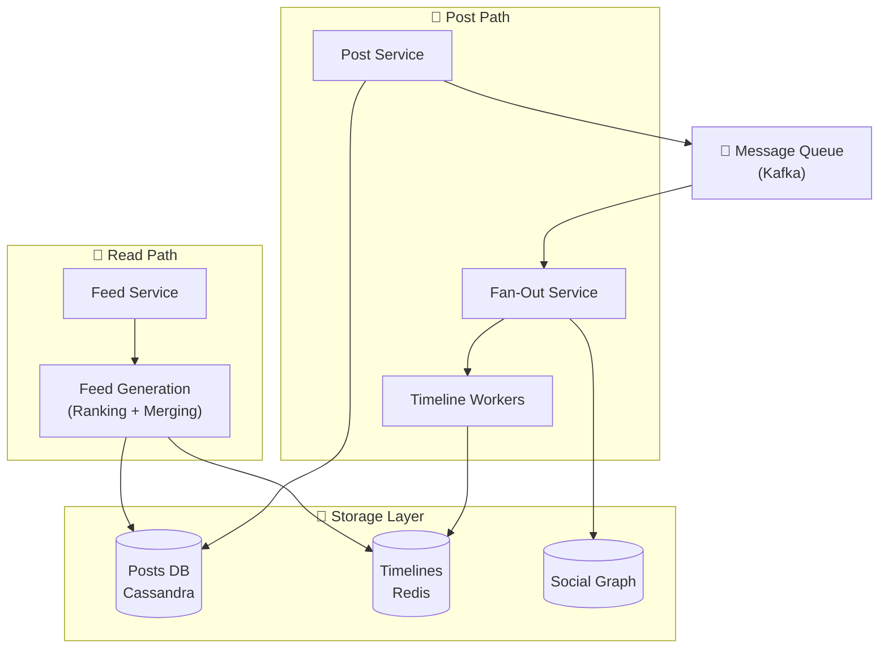
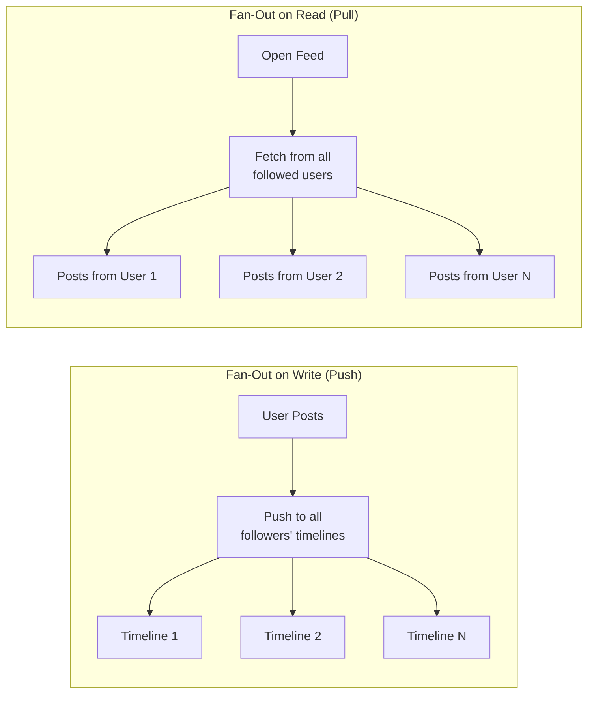

# News Feed / Timeline Design

How social platforms generate personalized feeds ranking, fan-out, and real-time updates.

---

## Requirements

### Functional Requirements

- Users see posts from people they follow
- Feed is personalized and ranked (not just chronological)
- Real-time updates (new posts appear without refresh)
- Support for different content types (text, images, videos)
- Like, comment, share interactions

### Non-Functional Requirements

- Fast feed generation (< 500ms)
- Handle viral content (millions of views)
- Scale to billions of users
- High availability

---

## Scale Estimation

**Assumptions (Twitter-scale):**
- 500 million daily active users
- Average user follows 200 people
- Each user views feed 10 times/day
- Each user posts 0.5 times/day

**Calculations:**

Feed views/day: 500M × 10 = 5 billion

Feed views/second: 5B / 86400 ≈ 58,000/sec

Posts/day: 500M × 0.5 = 250 million

**The challenge:** Generating 5 billion personalized feeds is computationally expensive.

---

## The Core Problem: Fan-Out

When a user posts, how do followers see it?

### Fan-Out on Write (Push Model)

When user posts, immediately distribute to all followers' feeds.

```
User A posts → Push to timelines of all 1M followers
```

**Advantages:**
- Feed reads are fast (pre-computed)
- Simple feed retrieval

**Disadvantages:**
- Celebrity problem: user with 50M followers → 50M writes
- Wasted work if followers don't read
- Delay before all followers see it

### Fan-Out on Read (Pull Model)

When user loads feed, fetch posts from people they follow.

```
User A opens feed → Fetch latest from all 200 followed users
```

**Advantages:**
- Writes are simple (just store the post)
- No wasted work
- Works for celebrities

**Disadvantages:**
- Slow feed reads (must query many sources)
- Heavy on read path

### Hybrid Approach (Best Practice)

Combine both:

**For regular users (< 10K followers):** Fan-out on write. Push to followers' timelines.

**For celebrities (> 10K followers):** Don't fan-out on write. On read, merge recent celebrity posts with pre-computed feed.

```
User opens feed:
  1. Fetch pre-computed timeline
  2. Fetch recent posts from followed celebrities
  3. Merge and rank
  4. Return
```

This balances write load and read latency.

---

## System Architecture





---

## Core Components

### Post Service

Handles creating posts.

1. Validate post content
2. Store in posts database
3. Publish event: "NewPost"
4. Return to client

### Social Graph

Who follows whom.

**Data:**
```
user_123 follows: [user_456, user_789, ...]
user_123 followers: [user_111, user_222, ...]
```

**Storage:** Can be graph database or simple relational tables. Redis sets for fast membership checks.

### Fan-Out Service

When a non-celebrity posts, push to followers' timelines.

1. Consume NewPost event
2. Get follower list
3. For each follower, add post ID to their timeline

**Scaling:** Partition by user. Workers process in parallel.

### Timeline Storage

Pre-computed feed of post IDs per user.

**Redis sorted set:**
```
Key: timeline:{user_id}
Members: post IDs
Scores: timestamp
```

Sorted by recency. Can store last 1000 posts per user.

### Feed Service

Generate feed for user's view request.

1. Fetch timeline from Redis (pre-computed, fast)
2. For followed celebrities, fetch recent posts directly
3. Merge results
4. Apply ranking
5. Fetch full post details from cache/database
6. Return

---

## Ranking

Feeds aren't just chronological. They're ranked by relevance.

### Ranking Signals

- **Recency:** Newer posts score higher
- **Engagement:** Likes, comments, shares
- **Relationship:** Interactions with this person
- **Content type:** User's preferences for video vs. text
- **Time spent:** Previous attention on similar content

### Ranking Pipeline

1. **Candidate generation:** Get last ~1000 relevant posts
2. **First-pass ranking:** Lightweight model, remove clearly irrelevant
3. **Detailed ranking:** ML model scores remaining candidates
4. **Final selection:** Top N for the page

**In practice:** This is where much of the complexity lives. ML models with billions of parameters.

### Exploration vs. Exploitation

Balance:
- Show what we know user likes (exploitation)
- Show new things to learn preferences (exploration)

Too much exploitation = filter bubble. Too much exploration = irrelevant content.

---

## Real-Time Updates

Users want to see new posts without refreshing.

### Push vs. Poll

**Long polling:** Client holds connection, server responds when new content.

**WebSocket:** Persistent connection for bidirectional updates.

**Server-Sent Events:** One-way push from server.

### Implementation

1. User connected via WebSocket
2. When followed user posts (and fan-out happens)
3. Push notification to connected clients
4. Client adds new post to feed UI

### Optimization

Don't push every new post immediately:
- Batch updates (every few seconds)
- Show "New posts available" badge rather than auto-inserting (jarring UX)

---

## Viral Content

A post suddenly gets millions of views.

### The Problem

Everyone wants to see the same post. Cache it.

### Solution

**Hot content cache:** Detect trending posts, cache heavily.

**CDN for media:** Images, videos served from CDN.

**Rate limiting:** Prevent any single post from overwhelming system.

---

## Storage Design

### Posts Table

```
posts (
  post_id,
  author_id,
  content,
  media_urls,
  created_at,
  like_count,
  comment_count,
  share_count
)
```

**Sharding:** By post_id or author_id. Post_id gives even distribution.

### Timelines

Redis sorted sets for in-memory access:
```
ZADD timeline:{user_id} {timestamp} {post_id}
ZREVRANGE timeline:{user_id} 0 20  # Latest 20
```

Keep last ~1000 per user. Older posts fetched on demand.

### Social Graph

```
follows (
  follower_id,
  followee_id,
  created_at
)
```

Index both ways for:
- Who does user follow? (for feed generation)
- Who follows user? (for fan-out)

---

## Common Mistakes

**Pure fan-out on write.** Works until a celebrity posts. 50M follower fan-out overwhelms system.

**Pure fan-out on read.** Works until user follows thousands of people. Feed generation too slow.

**No caching.** Every feed request hits database. Doesn't scale.

**Chronological only.** Users miss important content because they weren't online at the right time.

**No graceful degradation.** Feed service down = no feed. Should serve cached/stale feed.

**Not handling deleted posts.** Post deleted but still appears in cached timelines.

---

## What An Experienced Senior Engineer Thinks About

**Feed freshness vs. latency.** Real-time is expensive. How stale is acceptable? Minutes? Seconds?

**A/B testing feed algorithms.** Changes to ranking affect engagement significantly. Test carefully.

**Content moderation.** Viral harmful content spreads fast. Detection and removal pipeline.

**Privacy in ranking.** Using personal data for ranking has privacy implications. Transparency requirements.

**Cold start.** New user with no follows - what do you show? Onboarding, suggestions.

**Cache invalidation.** Post edited or deleted - invalidate from all caches and timelines.

---

## Vibe Engineering Guide

When prompting about news feed:

**Less useful:**
> "Design a news feed"

**More useful:**
> "Design a Twitter-like feed system:
> - 100M DAU, average user follows 200 accounts
> - Some accounts have millions of followers (celebrities)
> - Feed should be ranked, not just chronological
> - Real-time updates for new posts
>
> Focus on: the fan-out strategy (how to handle celebrities), timeline storage, and feed generation latency."

**For specific problems:**
> "Our feed is chronological but users miss important posts. We want to add ranking based on engagement and relationship strength. We have 50M users. How should we structure the ranking pipeline without adding too much latency?"

---

## Quick Check

<details>
<summary><b>What's fan-out on write vs. fan-out on read?</b></summary>

Write: when post is created, push to all followers' timelines. Read: when feed is loaded, pull from all followed users. Write is faster reads but expensive for celebrities. Read is slow reads but simple writes.

</details>

<details>
<summary><b>Why use a hybrid approach?</b></summary>

Regular users (small follower count) fan-out on write for fast reads. Celebrities (huge follower count) don't - their posts are merged at read time. Balances write load and read latency.

</details>

<details>
<summary><b>Why use Redis for timeline storage?</b></summary>

In-memory for low latency. Sorted sets for ordered timeline. Can store last ~1000 posts per user efficiently. Fast ZREVRANGE for "get latest N" queries.

</details>

<details>
<summary><b>How do you handle viral content?</b></summary>

Detect trending posts, cache heavily, serve media from CDN. Prevent any single post from overwhelming the system through caching and potentially rate limiting.

</details>

<details>
<summary><b>Why rank feeds instead of just chronological?</b></summary>

Users miss important content that was posted when they weren't online. Ranking surfaces high-engagement, relevant content regardless of exact timestamp.

</details>

---

Next: [E-commerce System Design](06-ecommerce.md)
