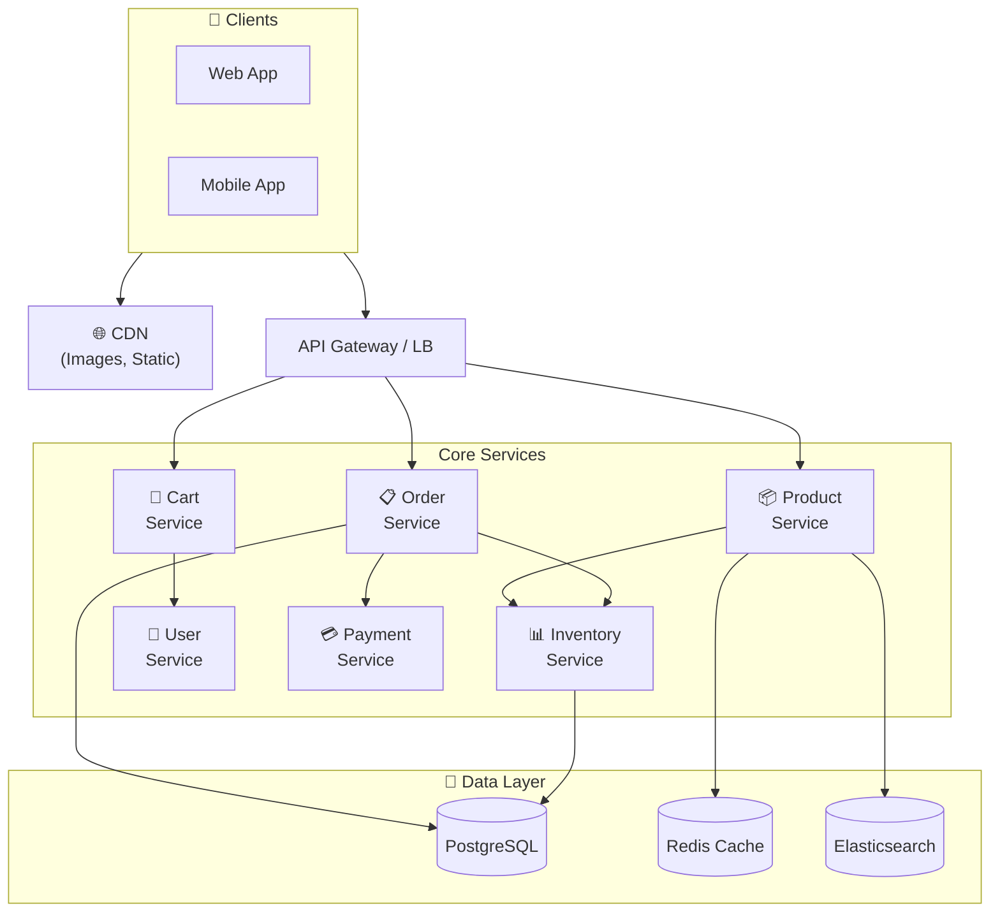

# E-Commerce System Design

Building an online store catalog, cart, checkout, and inventory at scale.

---

## Requirements

### Functional Requirements

- Browse product catalog
- Search and filter products
- Shopping cart
- User accounts and authentication
- Checkout and payment processing
- Order management
- Inventory management
- Reviews and ratings

### Non-Functional Requirements

- High availability (can't miss sales)
- Low latency product pages (SEO, user experience)
- Handle flash sales (traffic spikes)
- Data consistency for inventory and payments
- Scale to millions of products and users

---

## Scale Estimation

**Assumptions (medium e-commerce):**
- 10 million products
- 100 million registered users
- 1 million daily active users
- 100,000 orders/day
- Peak: Black Friday = 10x normal

**Calculations:**

Orders/second (normal): 100K / 86400 ≈ 1.2/sec

Orders/second (peak): ~12/sec

Product page views: ~10 million/day

Cart operations: ~1 million/day

This is moderate scale, but peaks (flash sales, Black Friday) create challenges.

---

## High-Level Architecture



---

## Product Catalog

### Data Model

```sql
products (
  id,
  sku,
  name,
  description,
  price,
  category_id,
  brand_id,
  attributes (JSON),
  created_at,
  updated_at
)

product_variants (
  id,
  product_id,
  size,
  color,
  sku,
  price_adjustment,
  inventory_id
)

categories (
  id,
  name,
  parent_id,
  path  -- "Electronics/Computers/Laptops"
)
```

### Product Page Performance

Product pages must be fast (SEO, user experience).

**Strategies:**
- Cache product data (Redis)
- CDN for images
- Pre-render popular pages
- Async load reviews

### Search

Users search by keyword, filter by category, price, attributes.

**Implementation:**
- Elasticsearch for full-text search
- Index product name, description, attributes
- Faceted search (filter by brand, price range)

---

## Shopping Cart

### Cart Storage Options

**Session-based (anonymous):**
- Store in cookie or session
- Lost if user doesn't log in

**Server-side (logged in):**
- Store in database or Redis
- Persists across devices

**Hybrid:**
- Session for anonymous
- Merge to server-side on login

### Cart Data Model

```sql
carts (
  id,
  user_id,            -- null for anonymous
  session_id,         -- for anonymous
  created_at,
  updated_at
)

cart_items (
  id,
  cart_id,
  product_variant_id,
  quantity,
  price_at_add,       -- Price when added (prices change)
  added_at
)
```

### Cart Challenges

**Price changes:** Store price at time of add. Show notification if price changed at checkout.

**Inventory changes:** Item may go out of stock while in cart. Check at checkout.

**Cart abandonment:** Most carts are abandoned. Send reminder emails (with user consent).

---

## Inventory Management

### The Core Challenge

Selling more than you have = overselling = angry customers.

### Inventory Data Model

```sql
inventory (
  id,
  product_variant_id,
  warehouse_id,
  quantity_available,
  quantity_reserved,
  updated_at
)

inventory_transactions (
  id,
  inventory_id,
  type,              -- reserve, release, ship, receive
  quantity,
  order_id,
  created_at
)
```

### Reservation Pattern

Don't decrement immediately. Reserve during checkout.

```
1. User starts checkout
2. Reserve inventory: quantity_reserved += ordered_quantity
3. If payment succeeds: quantity_available -= ordered_quantity
4. If payment fails or timeout: release reservation
```

**TTL on reservations:** Unreleased reservations expire (e.g., 15 minutes).

### Overselling Prevention

**Pessimistic locking:**
```sql
SELECT * FROM inventory WHERE id = X FOR UPDATE;
-- Check and update
```

**Optimistic locking:**
```sql
UPDATE inventory 
SET quantity_available = quantity_available - 1,
    version = version + 1
WHERE id = X AND version = current_version AND quantity_available >= 1;
```

If no rows affected, concurrent update occurred - retry or fail.

---

## Checkout Flow

### Steps

1. **Cart review:** Validate items, prices, inventory
2. **Shipping address:** Collect or select saved address
3. **Shipping method:** Calculate options and prices
4. **Payment:** Collect payment info, or saved method
5. **Review:** Final confirmation
6. **Submit:** Process order

### Order Creation

```
BEGIN TRANSACTION
  1. Validate cart (inventory, prices)
  2. Create order record (status: pending)
  3. Reserve inventory
  4. Calculate totals (subtotal, tax, shipping)
COMMIT

5. Process payment (external call)

If payment success:
  Update order status (confirmed)
  Deduct inventory
  Send confirmation

If payment fails:
  Update order status (failed)
  Release inventory reservation
```

### Idempotency

Users may double-click "Place Order."

Generate idempotency key on checkout start. Reject duplicate submissions.

---

## Payment Integration

### Use a Payment Gateway

Don't handle card data yourself. Use Stripe, Braintree, Adyen.

**Flow:**
1. Client collects card info directly to gateway (Stripe.js)
2. Gateway returns token
3. Your server uses token to charge
4. You never see card numbers (simplifies PCI compliance)

### Handling Failures

**Gateway timeout:** Query for payment status. Don't assume failure.

**Idempotency keys:** Prevent duplicate charges on retry.

### Refunds

Store original payment reference. Use it for refund API calls.

---

## Order Management

### Order States

```
Created → Confirmed → Processing → Shipped → Delivered
              ↓           ↓
           Cancelled    Returned
```

### Order Data Model

```sql
orders (
  id,
  user_id,
  status,
  shipping_address,
  billing_address,
  subtotal,
  tax,
  shipping_cost,
  total,
  payment_id,
  created_at,
  updated_at
)

order_items (
  id,
  order_id,
  product_variant_id,
  quantity,
  unit_price,
  total_price
)
```

---

## Flash Sales and High Traffic

### The Challenge

Black Friday: 10x traffic. Flash sale: 100x in seconds.

### Strategies

**Caching:** Product pages from cache. Most views don't need real-time data.

**Queue for checkout:** Don't let everyone checkout simultaneously.
```
User clicks "Buy" → enters queue → processes in order
```

**Rate limiting:** Prevent bot abuse.

**CDN:** Offload static content.

**Pre-scaling:** Know peak times, scale infrastructure ahead.

**Graceful degradation:** If overwhelmed, disable non-essential features (reviews, recommendations).

### Inventory for Flash Sales

**Challenge:** 1000 items, 10000 buyers in 1 second.

**Solutions:**
-   **Distributed inventory counters:** Sharded Redis counters for high-speed decrement.
-   **Queue-based processing:** All checkout requests go to a Kafka topic; processed sequentially.
-   **Static Landing Page:** Serve a static HTML page from CDN during the sale; no database hits for the homepage.
-   **Load Shedding:** If queue depth > 10,000, immediately return HTTP 503 to protect the core system.

---

## Common Mistakes

**Not reserving inventory.** Overselling on every sale.

**Synchronous everything.** Checkout blocks on email send, slow payment = timeout.

**No cart expiration.** Carts hold inventory forever.

**Price not captured at add.** Price changes, user pays different than expected.

**No idempotency on checkout.** Double-click = double charge.

**Ignoring flash sale scale.** Works fine normally, crashes on Black Friday.

---

## What An Experienced Senior Engineer Thinks About

**Eventual consistency trade-offs.** Product data eventually consistent is fine. Inventory? Be careful.

**Multi-warehouse.** Inventory across warehouses. Ship from nearest. Complex allocation.

**Personalization.** Product recommendations, personalized pricing. ML integration.

**International.** Multiple currencies, tax rules, shipping options. Complex.

**Fraud.** Payment fraud, coupon abuse, bot purchases. Prevention systems.

---

## Vibe Engineering Guide

When prompting about e-commerce:

**Less useful:**
> "Design an e-commerce site"

**More useful:**
> "Design an e-commerce checkout flow:
> - 100K SKUs, multiple warehouses
> - Need to prevent overselling
> - Handle payment failures gracefully
> - Support flash sales (10x normal traffic)
>
> Focus on: inventory reservation strategy, checkout API design, and how to handle the case where payment gateway times out mid-transaction."

**For specific problems:**
> "During our flash sale, we oversold 500 items. We have inventory checks before payment, but somehow we sold 1500 of 1000 items. What could cause this? How do we prevent it?"

---

## Quick Check

<details>
<summary><b>Why reserve inventory instead of decrementing immediately?</b></summary>

User might abandon checkout. If you decrement immediately, inventory is "gone" but no sale. Reservation holds inventory temporarily, releases if checkout abandoned.

</details>

<details>
<summary><b>How do you prevent overselling?</b></summary>

Optimistic locking (check version, retry on conflict) or pessimistic locking (SELECT FOR UPDATE). Check inventory atomically when reserving.

</details>

<details>
<summary><b>What to do if payment gateway times out?</b></summary>

Don't assume failure - payment may have succeeded. Query gateway for status. If still unknown, mark order for investigation. Don't retry blindly (double charge).

</details>

<details>
<summary><b>How to handle flash sale traffic spikes?</b></summary>

Heavy caching, queue for checkout, pre-scaling, CDN, rate limiting, graceful degradation. Prepare infrastructure ahead of known events.

</details>

---

Next: [Payment System Design](07-payment-system.md)
