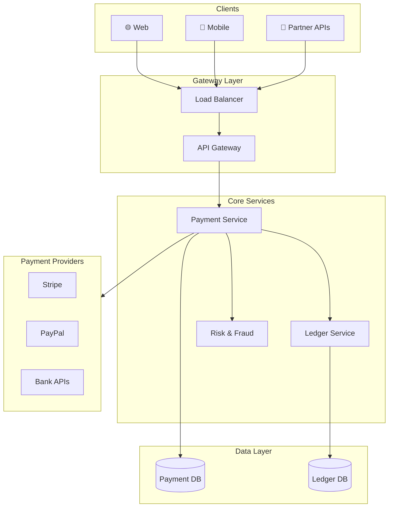
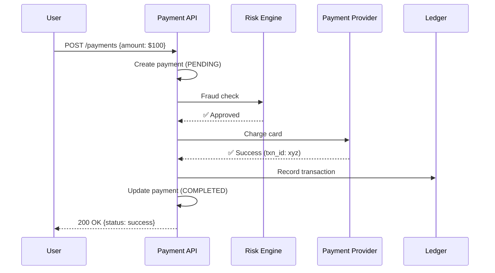

# Payment System Design

Handling money correctly reliability, security, and compliance are non-negotiable.

---

## Requirements

### Functional Requirements

- Process payments (card, bank transfer, digital wallets)
- Handle refunds
- Recurring billing / subscriptions
- Multiple currencies
- Payment method management
- Transaction history

### Non-Functional Requirements

- Exactly-once payment processing (double charges are unacceptable)
- High availability (can't be unable to accept payments)
- PCI DSS compliance (for card data)
- Audit trail for all transactions
- Low latency (but not at the expense of correctness)

---

## The Cardinal Rule

**Never lose money. Never double-charge.**

Everything in payment system design stems from this. When in doubt, favor declined over charged. Refunds are easier than reversing double charges.

---

## Scale Estimation

**Assumptions (medium e-commerce):**
- 1 million orders/day
- 80% paid by card
- Average transaction: $50

**Calculations:**

Transactions/second: 1M / 86400 ≈ 12/sec (peak: ~50/sec)

Daily payment volume: 1M × $50 = $50M/day

This is moderate scale. Payment processors handle much higher volumes.

---

## High-Level Architecture





---

## Core Components

### Payment Service

Orchestrates the payment flow.

**Responsibilities:**
- Validate payment request
- Apply idempotency
- Route to appropriate processor
- Handle retries and fallback
- Update transaction status
- Trigger notifications

### Payment Gateway Integration

Connection to payment processors (Stripe, Braintree, Adyen, etc.).

**Why use a gateway:**
- PCI compliance handled by them
- Multiple payment methods supported
- Fraud detection included
- Retry logic built in

**Multiple gateways:**
- Redundancy (failover)
- Geographic optimization
- Cost optimization
- Feature differences

### Transaction Database

Record of all payment attempts and results.

```sql
transactions (
  id,
  idempotency_key,
  order_id,
  user_id,
  amount,
  currency,
  status,           -- pending, succeeded, failed, refunded
  gateway,
  gateway_reference,
  error_code,
  created_at,
  updated_at
)
```

**Critical:** This is the source of truth. Never lose this data.

### Ledger

Accounting records for all money movement.

**Double-entry bookkeeping:**
- Every transaction has debits and credits
- Sum of debits = sum of credits
- Enables reconciliation

For serious payment systems, a proper ledger is essential.

---

## Idempotency

**The most critical concept in payment systems.**

### What Is Idempotency?

An operation is idempotent if performing it multiple times has the same effect as performing it once.

### Why It Matters

Network is unreliable. Timeouts happen. Client might retry.

```
1. Client sends payment request
2. Server processes, charges card
3. Response times out (network issue)
4. Client retries
5. Server charges card again ← DOUBLE CHARGE!
```

### Implementation

**Idempotency key:** Unique identifier for each payment attempt.

```
Client sends:
  POST /payments
  Idempotency-Key: order-123-attempt-1
  
Server:
  1. Check if we've seen this key before
  2. If yes, return cached result
  3. If no, process payment, store result with key
```

**Storage:**
```sql
idempotency_records (
  key PRIMARY KEY,
  status,
  result,
  created_at
)
```

**TTL:** Keep for reasonable period (24 hours to 7 days).

---

## Payment Flow

### Happy Path

1. **Client initiates checkout**
2. **Payment Service creates transaction** (status: pending)
3. **Generates idempotency key** (or uses client-provided)
4. **Calls payment gateway** with card token
5. **Gateway charges card**, returns success
6. **Update transaction** (status: succeeded)
7. **Credit ledger** (asset: cash, liability: revenue)
8. **Notify order service** (payment complete)
9. **Return success to client**

### Failure Handling

**Gateway returns failure (declined):**
- Update transaction (status: failed, error_code: declined)
- Return failure to client with reason
- Don't retry (user action needed)

**Gateway timeout:**
- Don't assume failure (charge might have gone through)
- Query gateway for status
- If status unknown, mark as "pending_verification"
- Background job reconciles later

**Your service crashes mid-transaction:**
- Transaction is pending in database
- On restart, find pending transactions
- Query gateway for status
- Update accordingly

---

## Refunds

Money flowing backward.

### Flow

1. **Refund request** (user, admin, or automatic)
2. **Validate** (original transaction exists, not already refunded)
3. **Call gateway refund API**
4. **Update transaction** (status: refunded)
5. **Debit ledger** (reverse of original)

### Partial Refunds

Refund less than original amount. Track total refunded per transaction.

### Refund Window

Gateways have limits (120 days typical). After that, refund via other means.

---

## Recurring Payments / Subscriptions

Charging users periodically.

### Components

**Subscription record:**
- Plan details
- Billing cycle
- Next billing date
- Payment method reference

**Billing job:**
- Runs periodically
- Finds subscriptions due for billing
- Attempts payment
- Handles failures (retry, notify, eventual cancellation)

### Retry Logic

Failed subscription payment:
1. Retry after 24 hours
2. Retry after 72 hours
3. Notify user, retry after 7 days
4. Suspend service, final retry
5. Cancel subscription

---

## Security and Compliance

### PCI DSS

Payment Card Industry Data Security Standard.

**The simplest approach:** Never touch raw card data.

**Use tokenization:**
- Client sends card data directly to gateway (Stripe.js, etc.)
- Gateway returns token
- Your server only sees token
- You're "out of scope" for PCI

**If you must handle card data:** PCI compliance is extensive (audits, security requirements).

### Fraud Detection

**Strategies:**
- Velocity checks (too many attempts)
- Address verification (AVS)
- CVV verification
- 3D Secure (additional authentication)
- ML-based fraud scoring (use gateway's)

**Balance:** Too strict = legitimate customers blocked. Too lenient = fraud losses.

### Data Security

- Encrypt sensitive data at rest
- HTTPS only
- Audit logs for all access
- Principle of least privilege

---

## Reconciliation

Comparing your records with gateway/bank records.

### Why Reconcile

- Catch discrepancies
- Find stuck transactions
- Detect fraud
- Financial accuracy

### How

- Daily export from gateway
- Compare with your transactions
- Flag mismatches for investigation
- Resolve and correct ledger

---

## Multi-Currency

### Approaches

**Single currency:** Convert at checkout to your currency. Gateway handles conversion. Simple.

**Multi-currency:** Price in local currency. Settle to your currency. More complex but better UX.

### Considerations

- Exchange rates (when to lock, display vs. actual)
- Settlement currencies
- Currency-specific formatting
- FX fees

---

## Common Mistakes

**No idempotency.** Double charges destroy trust.

**Trusting client-side validation.** Validate amounts server-side.

**Storing card numbers.** Use tokenization. Stay out of PCI scope.

**No reconciliation.** Discrepancies go unnoticed.

**Silent failures.** Transaction fails, no notification with message about payment_status.

**Ignoring webhooks.** Rely only on synchronous responses. Gateway webhooks catch async events (disputes, failed delayed charges).

**No retry backoff.** Hammering gateway when it's having issues.

---

## What An Experienced Senior Engineer Thinks About

**Money as distributed systems problem.** ACID is your friend. But across services? Saga pattern, eventual consistency with clear states.

**Audit trail.** Every money movement must be traceable. Who, when, why, what.

**Edge cases.** Currency rounding, leap seconds in billing, timezone handling for subscription renewal.

**Dispute handling.** Chargebacks happen. Have evidence, respond promptly, learn from patterns.

**Gateway dependency.** Your business depends on their availability. Monitor, have fallback.

**Regulation.** PSD2 in Europe, different rules everywhere. Compliance is ongoing.

---

## Vibe Engineering Guide

When prompting about payment systems:

**Less useful:**
> "Design a payment system"

**More useful:**
> "Design a payment system for an e-commerce platform:
> - 100K orders/day, credit card and PayPal
> - Recurring subscriptions for premium users
> - Need to support refunds
> - Must never double-charge
>
> Focus on: idempotency implementation, handling gateway timeouts, and the database schema for transactions and ledger."

**For specific problems:**
> "We're seeing occasional double charges. We use Stripe via server-to-server calls. When the call times out, we retry. Sometimes the first call actually succeeded. How do we fix this?"

---

## Quick Check

<details>
<summary><b>What is idempotency and why is it critical for payments?</b></summary>

Idempotency means performing an operation multiple times has the same effect as once. Critical because retries happen (timeouts, network issues). Without idempotency, retries cause double charges.

</details>

<details>
<summary><b>What should you do if a payment gateway call times out?</b></summary>

Don't assume failure (payment might have succeeded). Query the gateway for status. If unknown, mark as pending. Background job reconciles. Never blindly retry.

</details>

<details>
<summary><b>Why use payment gateway tokenization?</b></summary>

Keeps you out of PCI scope. Card data goes directly to gateway, who returns a token. You only handle tokens. Dramatically simplifies security compliance.

</details>

<details>
<summary><b>What is reconciliation?</b></summary>

Comparing your transaction records with gateway/bank records. Catches discrepancies, stuck transactions, potential fraud. Should be done daily.

</details>

<details>
<summary><b>Why have multiple payment gateways?</b></summary>

Redundancy (failover if one is down), geographic optimization (lower fees for certain regions), and feature differences (some support certain payment methods).

</details>

---

Next: [Video Streaming Design](08-video-streaming.md)
