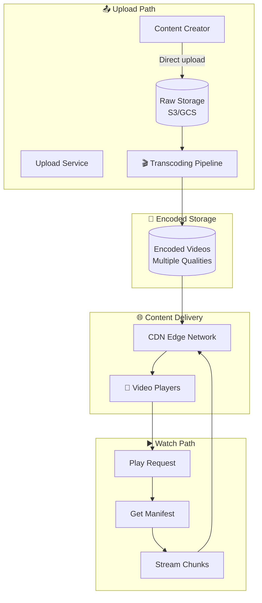

# Video Streaming Design

Delivering video at scale encoding, storage, and streaming to millions.

---

## Requirements

### Functional Requirements

- Upload videos
- Process and encode videos
- Stream videos to viewers
- Adaptive bitrate streaming
- Search and discover videos
- Watch history and recommendations

### Non-Functional Requirements

- Low latency playback start
- Smooth playback (no buffering)
- Scale to millions of concurrent viewers
- Global availability
- Handle viral content (sudden traffic spikes)

---

## Scale Estimation

**Assumptions (YouTube-scale):**
- 2 billion users
- 1 billion video views/day
- 500 hours of video uploaded/minute
- Average video: 5 minutes, 1 GB after encoding (multiple qualities)

**Calculations:**

Views per second: 1B / 86400 ≈ 11,500/sec

Storage (raw): 500 hours × 60 min × 2 GB/min (raw) ≈ 60 TB/minute

Storage (encoded): ~10 TB/minute (5-10 quality levels × chunk sizes)

This is massive scale requiring specialized infrastructure.

---

## High-Level Architecture



---

## Video Upload and Processing

### Upload Flow

1. **Client requests upload URL**
2. **Server returns presigned URL** (direct to object storage)
3. **Client uploads** directly to storage (parallel chunks for large files)
4. **Server notified** of upload completion
5. **Video queued** for processing

### Why Direct Upload?

Video files are large. Don't stream through your servers:
- Would consume bandwidth and CPU
- Presigned URLs allow direct-to-S3/GCS upload
- CDN can serve static content

### Transcoding

Convert raw video to multiple formats and qualities.

**Why transcode:**
- Original might be 4K at 50 Mbps
- Mobile on 3G can't handle that
- Need multiple quality levels

**Output:**

| Quality | Resolution | Bitrate |
|---------|------------|---------|
| 4K | 3840×2160 | 20 Mbps |
| 1080p | 1920×1080 | 5 Mbps |
| 720p | 1280×720 | 2.5 Mbps |
| 480p | 854×480 | 1 Mbps |
| 360p | 640×360 | 0.5 Mbps |

Each quality is also chunked into segments (2-10 seconds each).

### Transcoding Pipeline

1. **Download raw video** from storage
2. **Transcode** to each quality level
3. **Chunk** into segments
4. **Generate manifest** (list of chunks)
5. **Upload processed files** to storage
6. **Mark video as ready**

**Parallel processing:** Transcode different qualities in parallel. Scale with video processing workers.

**Tools:** FFmpeg (core), AWS Elemental, Google Transcoder API.

---

## Adaptive Bitrate Streaming

Player automatically adjusts quality based on network conditions.

### How It Works

1. Player fetches **manifest** (list of available qualities and chunks)
2. Player requests first chunk at default quality
3. Player measures download speed
4. If fast enough, request higher quality
5. If slow, drop to lower quality
6. Continuous adjustment throughout playback

### Protocols

**HLS (HTTP Live Streaming):**
- Apple's protocol
- .m3u8 manifest
- .ts segments
- Widely supported

**DASH (Dynamic Adaptive Streaming over HTTP):**
- Open standard
- .mpd manifest
- Various segment formats
- More flexible

**Both work similarly:** Manifest describes available qualities. Player downloads segments via HTTP.

### Segment Size Trade-offs

**Short segments (2 seconds):**
- Faster quality adaptation
- More requests (overhead)

**Long segments (10 seconds):**
- Fewer requests
- Slower adaptation to network changes

4-6 seconds is common.

---

## Storage

### Raw Video Storage

Original uploads. Kept for reprocessing if formats change.

**Requirements:**
- Durability (can't lose originals)
- Cost-efficient (infrequent access)

**Solution:** S3 Glacier, GCS Coldline

### Encoded Video Storage

Multiple versions, frequently accessed.

**Requirements:**
- High durability
- Fast access
- Large scale

**Solution:** S3 Standard, GCS Standard

### Storage Cost Example

500 hours uploaded/minute × 60 × 24 = 720,000 hours/day

At 1 GB per video hour (encoded): 720 TB/day

At $0.02/GB/month: $14,400/day just for storage

**Why cleanup matters:** Remove truly unpopular videos from hot storage.

---

## Content Delivery

### Why CDN is Critical

Video is bandwidth-intensive. Serving from origin:
- High latency for distant users
- Origin overwhelmed

CDN caches video chunks at edge locations worldwide.

### Cache Strategy

**Chunks are perfect for caching:**
- Immutable (chunk doesn't change after encoding)
- Long TTL possible
- Popular videos cached globally

**Cache hit rates:** 90%+ for popular content.

### Viral Content

Video goes viral → millions of requests for same chunks.

**CDN handles this:** 
- Once chunk is at edge, subsequent requests served locally
- Origin sees request only once per edge location

Without CDN, origin would be destroyed.

---

## Video Player

### Responsibilities

- Parse manifest
- Select appropriate quality
- Buffer ahead
- Handle quality switching
- Display with controls

### Buffering Strategy

Player maintains buffer of upcoming segments.

**Too small buffer:** Frequent buffering pauses.
**Too large buffer:** Uses memory, slow initial load.

Typical: 20-30 seconds buffer target.

### Quality Selection

Measure throughput of recent downloads. Estimate sustainable quality.

```
Last 3 chunks downloaded at 5 Mbps average
5 Mbps > 2.5 Mbps (720p bitrate)
5 Mbps < 5 Mbps (1080p bitrate)
→ Select 720p for safety margin
```

---

## Metadata and Search

### Video Metadata

```sql
videos (
  id,
  title,
  description,
  uploader_id,
  duration,
  upload_time,
  status,        -- processing, ready, failed
  manifest_url,
  thumbnail_url,
  view_count,
  tags
)
```

### Search

Full-text search on title, description, tags.

**Tools:** Elasticsearch/OpenSearch

Index video metadata. Rank by relevance + popularity.

---

## Recommendations

What to watch next.

### Approaches

**Collaborative filtering:** Users similar to you watched X.

**Content-based:** Based on videos you liked, you might like similar ones.

**Hybrid:** Combine multiple signals.

### Signals

- Watch history
- Watch time (did they finish?)
- Likes/dislikes
- Search history
- Demographic info

**At scale:** This is a complex ML problem. Separate recommendation service.

---

## Live Streaming

Different from on-demand.

### Challenges

- No pre-encoding (real-time)
- Much more latency-sensitive
- Can't buffer far ahead
- Massive concurrent viewers

### Architecture Differences

```
Broadcaster → Ingest Server → Real-time Transcoding
                                    ↓
                             Chunk as we go
                                    ↓
                              CDN → Viewers
```

**Latency:** 5-30 seconds is typical. Ultra-low-latency solutions exist (sub-5-second).

---

## Common Mistakes

**Transcoding blocking upload.** User waits hours to see their video. Process async, show "processing" status.

**No CDN.** Every viewer hits origin. Doesn't scale.

**Single quality.** High quality on poor connection = buffering. Low quality on good connection = bad experience.

**Too short segments.** Request overhead dominates. Too long = slow adaptation.

**Ignoring startup time.** Player buffers too long before playing. Users leave.

**Not handling failures.** Transcoding fails, video stuck in limbo forever.

---

## What An Experienced Senior Engineer Thinks About

**Cost per view.** Encoding, storage, CDN bandwidth all cost money. Optimize for the common case. Hot content on fast storage; cold content archived.

**Copyright and content moderation.** Detect copyrighted content. Handle takedowns. Content ID systems.

**Global latency.** Users worldwide. CDN with global presence. Consider multi-region origin.

**Piracy prevention.** DRM (Digital Rights Management). Token-authenticated streaming. Watermarking.

**Analytics.** View counts, watch time, engagement. Real-time and batch processing.

---

## Vibe Engineering Guide

When prompting about video streaming:

**Less useful:**
> "Design YouTube"

**More useful:**
> "Design a video streaming platform:
> - 10,000 videos uploaded/day
> - 10 million views/day
> - Need adaptive bitrate (multiple qualities)
> - Global audience
>
> Focus on: upload and transcoding pipeline, storage strategy, and CDN caching. What quality levels and segment sizes would you recommend?"

**For specific challenges:**
> "Our video startup is seeing high CDN costs. 80% of views are for 5% of videos. 70% of videos get almost no views after the first week. How can we optimize storage and CDN strategy?"

---

## Quick Check

<details>
<summary><b>Why transcode to multiple qualities?</b></summary>

Different devices and network conditions. 4K video can't play on slow mobile connection. Player adapts quality based on available bandwidth.

</details>

<details>
<summary><b>What is adaptive bitrate streaming?</b></summary>

Player measures download speed and automatically switches between quality levels (encoded as separate files). Prevents buffering on slow connections; maximizes quality on fast ones.

</details>

<details>
<summary><b>Why use a CDN for video?</b></summary>

Video is bandwidth-intensive. CDN caches chunks at edge locations near users. Reduces latency and origin load. Essential for scale.

</details>

<details>
<summary><b>Why chunk videos instead of serving whole files?</b></summary>

Allows adaptive quality switching mid-stream. Enables efficient caching (individual chunks cached). Faster start time (don't need whole file to begin playing).

</details>

<details>
<summary><b>How does live streaming differ from on-demand?</b></summary>

Real-time encoding (can't pre-process). Latency-critical (viewers want near-live). Can't buffer far ahead. Higher complexity for same-time delivery to many viewers.

</details>

---

Next: [Search Engine Design](09-search-engine.md)
