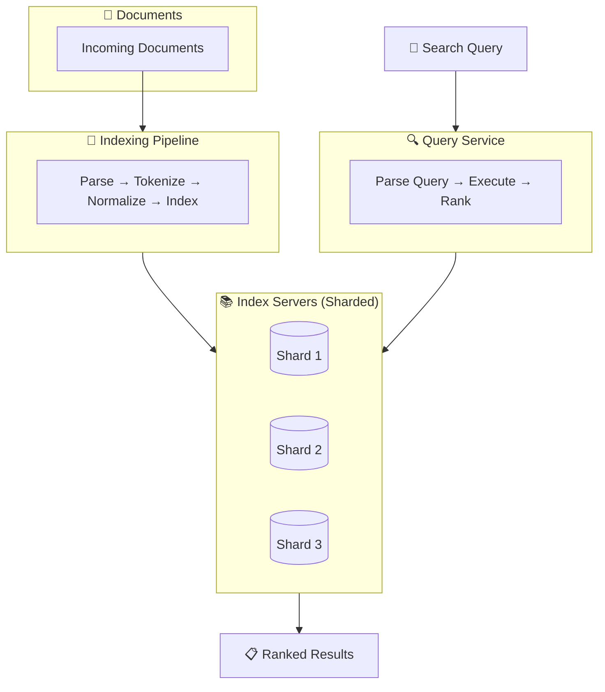
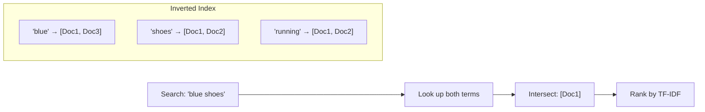

# Search Engine Design

How to build search functionality indexing, ranking, and returning relevant results.

---

## Requirements

### Functional Requirements

- Index documents (web pages, products, articles)
- Search by keywords
- Return ranked, relevant results
- Support filters and facets
- Autocomplete / suggestions

### Non-Functional Requirements

- Fast query response (< 200ms)
- Fresh results (index updates quickly)
- Scale to billions of documents
- Handle thousands of queries per second

---

## How Search Works: The Basics

### The Problem

You have millions of documents. User searches for "blue running shoes."

**Naive approach:** Scan every document. Too slow.

**Solution:** Build an index - a data structure optimized for finding documents containing specific terms.

### Inverted Index

The core data structure of search.

Instead of document → words, flip it to word → documents.

```
Document 1: "blue running shoes for sale"
Document 2: "red running shoes cheap"
Document 3: "blue sneakers on sale"

Inverted Index:
"blue"    → [Doc1, Doc3]
"running" → [Doc1, Doc2]
"shoes"   → [Doc1, Doc2]
"sale"    → [Doc1, Doc3]
"red"     → [Doc2]
...
```

Search for "blue shoes" → intersection of [Doc1, Doc3] and [Doc1, Doc2] → [Doc1]

### Index Structure

For each term, store:
- **Posting list:** Documents containing the term
- **Position:** Where in the document (for phrase queries)
- **Frequency:** How often (for ranking)

---

## Indexing Pipeline

### Document Ingestion

1. **Crawl or receive documents**
2. **Extract text** (parse HTML, PDF, etc.)
3. **Tokenize** (split into words)
4. **Normalize** (lowercase, remove punctuation)
5. **Stem/lemmatize** (running → run)
6. **Build inverted index entries**
7. **Store**

### Processing Steps

**Tokenization:** "The quick-brown fox" → ["the", "quick", "brown", "fox"]

**Normalization:** "Running" → "running"

**Stop words:** Remove common words (the, a, is) that don't help search. Sometimes.

**Stemming:** "running", "runs", "ran" → "run"

**Synonyms:** "shoes" also matches "sneakers" (configurable)

### Updating the Index

Documents change. Index must update.

**Approaches:**
- **Real-time:** Index immediately on change. Complex but fresh.
- **Batch:** Rebuild index periodically. Simpler but stale.
- **Hybrid:** Real-time for recent changes, merge into main index periodically.

---

## Query Processing

### Query Parsing

"blue running shoes" → tokens: ["blue", "running", "shoes"]

Apply same normalization as indexing (lowercase, stem).

### Operator Support

**AND:** All terms must match. (Default for most search engines)
**OR:** Any term matches.
**NOT:** Exclude term.
**Phrase:** "running shoes" → exact sequence.
**Fuzzy:** Handle typos ("runnig" → "running").

### Query Execution

1. Look up each term in inverted index
2. Get posting lists
3. Combine according to operators (AND = intersection)
4. Rank results
5. Return top N

---

## Ranking

Which results come first? Most relevant.

### TF-IDF

**Term Frequency (TF):** How often does the term appear in this document?

**Inverse Document Frequency (IDF):** How rare is this term across all documents?

TF-IDF = TF × IDF

Common words (the, is) have low IDF → don't affect ranking much.
Rare terms have high IDF → boost documents containing them.

### BM25

Improved version of TF-IDF. Standard for text search.

Factors in:
- Term frequency (with diminishing returns)
- Document length (normalize for shorter/longer)
- Inverse document frequency

### Modern Ranking

Beyond text matching:
- **PageRank:** Link popularity (for web)
- **Recency:** Newer documents ranked higher
- **Personalization:** User's past behavior
- **Engagement:** Click-through rate, time on page
- **ML models:** Learn ranking from labeled data

---

## Architecture





### Sharding the Index

Index too large for one server. Shard by:

**Document partitioning:** Each shard has a subset of documents.

Query goes to all shards. Each returns top N. Results merged.

**Term partitioning:** Each shard has a subset of terms.

Query routed to relevant shards. Better for some query patterns, worse for others.

Document partitioning is most common.

### Replication

Each shard replicated for:
- Availability (shard server dies)
- Load distribution (multiple replicas serve queries)

---

## Elasticsearch/OpenSearch

The standard search platform.

### Core Concepts

**Index:** Collection of documents (like a database).

**Document:** JSON object being indexed.

**Mapping:** Schema (field types, analyzer settings).

**Shard:** Horizontal partition of index.

**Replica:** Copy of a shard.

### Typical Setup

```
Index: products
  Shards: 5
  Replicas: 1

Total: 10 shard copies across cluster
```

### When to Use

- Need full-text search
- Complex querying (boolean, facets, aggregations)
- Near-real-time indexing
- Scales to large data volumes

---

## Features

### Autocomplete

Suggest queries as user types.

**Implementation:**
- Index ngrams (prefixes) of popular queries
- "run" matches "running", "runner", "rundown"
- Rank by popularity

### Faceted Search

Filter by categories with counts.

```
Search: "running shoes"
Facets:
  Brand: Nike (45), Adidas (32), Brooks (28)
  Price: $0-50 (20), $50-100 (55), $100+ (30)
  Size: 8 (15), 9 (22), 10 (25), 11 (18)
```

Built into Elasticsearch as aggregations.

### Highlighting

Show matching terms in results.

```
...the best <em>running</em> <em>shoes</em> for...
```

Helps users see why document matched.

### Fuzzy Search

Handle typos.

"runnig" → can match "running" (edit distance 1).

Configurable tolerance level.

---

## Performance Optimization

### Query-Time

- **Caching:** Cache common queries and results
- **Pagination:** Only fetch what's needed
- **Timeout:** Fail fast if query too slow
- **Profile queries:** Find slow parts

### Index-Time

- **Bulk indexing:** Batch documents for efficiency
- **Refresh interval:** Delay visibility for throughput
- **Merge policies:** Tune segment merging

### Hardware

- **SSD:** Much faster than HDD for random reads
- **Memory:** Index hot segments in RAM
- **CPU:** For query parsing and scoring

---

## Common Mistakes

**Not analyzing queries and documents the same way.** Indexing applies stemming; queries don't. Mismatch → no results.

**Indexing everything as text.** Keyword fields for exact match (IDs, status). Text fields for full-text search.

**Too many shards.** Creates overhead. Start with fewer, grow as needed.

**No relevance tuning.** Default BM25 is decent. But domain-specific boosting helps.

**Ignoring analytics.** Not tracking what users search for and what they click. Missing opportunities to improve.

---

## What An Experienced Senior Engineer Thinks About

**Search relevance is never "done."** Continuously measure and improve. A/B test ranking changes.

**Cold start.** New documents have no engagement data. How to rank them fairly?

**Scale and latency trade-offs.** More shards = more parallelism but more overhead. Find the right balance.

**Multi-tenancy.** Multiple customers sharing search infrastructure. Isolation and fairness.

**Index lifecycle.** Old data might be less important. Tiered storage or archival.

---

## Vibe Engineering Guide

When prompting about search:

**Less useful:**
> "Build a search engine"

**More useful:**
> "Design search for an e-commerce site:
> - 10 million products
> - Search by title, description, brand
> - Filter by price range, category, in-stock
> - Autocomplete on product names
> - Results ranked by relevance + popularity
>
> Should I use Elasticsearch? How should I structure the index? What analyzers for product data?"

**For specific problems:**
> "Our Elasticsearch cluster has 50 million documents across 10 shards. Search latency is 500ms average. Users report slow results. What should I check first? How do I profile and optimize?"

---

## Quick Check

<details>
<summary><b>What is an inverted index?</b></summary>

A data structure mapping terms to documents containing them (opposite of document to terms). Enables fast lookup of documents by term. Core data structure of search engines.

</details>

<details>
<summary><b>What is TF-IDF?</b></summary>

Term Frequency × Inverse Document Frequency. Measures term importance: how often it appears in this document, weighted by how rare it is overall. Common words get low scores; distinctive terms get high scores.

</details>

<details>
<summary><b>Why shard a search index?</b></summary>

Index too large for one server. Sharding distributes across multiple servers. Query goes to all shards in parallel, results merged. Enables scale.

</details>

<details>
<summary><b>What's the difference between text and keyword fields?</b></summary>

Text fields are analyzed (tokenized, normalized) for full-text search. Keyword fields are stored exactly for exact match and aggregations. Use text for readable content; keyword for IDs, status, tags.

</details>

<details>
<summary><b>What is BM25?</b></summary>

Ranking algorithm, improved version of TF-IDF. Standard for modern text search. Considers term frequency with diminishing returns, document length normalization, and term rarity.

</details>

---

Next: [Ride Sharing Design](10-ride-sharing.md)
