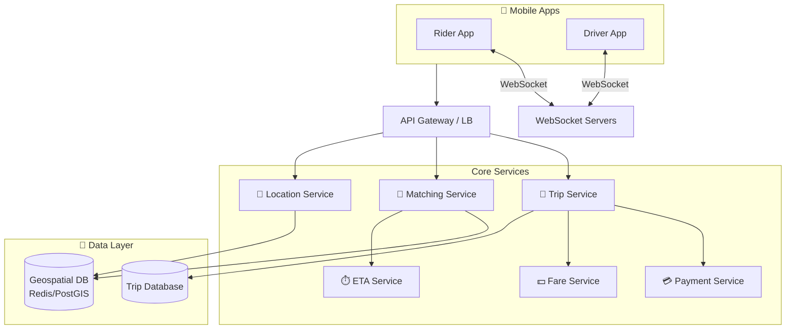
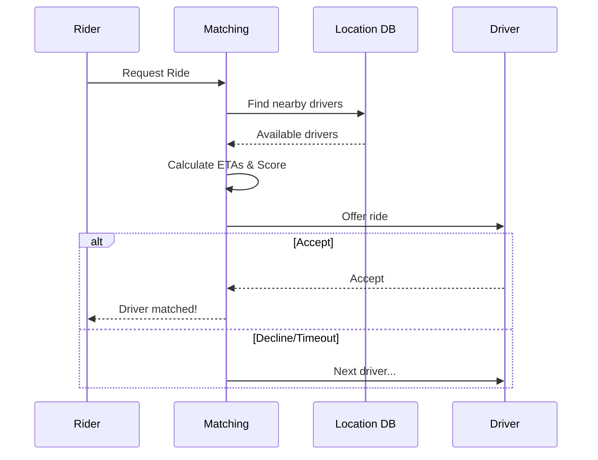

# Ride-Sharing System Design

Matching riders with drivers in real-time location, matching, and routing at scale.

---

## Requirements

### Functional Requirements

- Riders request rides (pickup, destination)
- Drivers go online/offline
- Match riders with nearby drivers
- Real-time tracking during ride
- Fare calculation
- Ratings and reviews
- Payment processing

### Non-Functional Requirements

- Low latency matching (< 10 seconds)
- Real-time location updates
- High availability (transportation is critical)
- Scale to millions of concurrent users
- Accurate fare estimation

---

## Scale Estimation

**Assumptions (Uber-scale city):**
- 1 million active drivers
- 10 million daily rides
- 100,000 concurrent active drivers
- 500,000 concurrent trip requests

**Calculations:**

Requests/second: 10M / 86400 ≈ 115/sec

Location updates/second: 100K drivers × 1 update/3 seconds ≈ 33,000/sec

This is high scale, especially for location updates.

---

## High-Level Architecture





---

## Location Tracking

### The Challenge

100K+ drivers sending location updates every few seconds.

### Storage Options

**Redis with Geospatial:**
```
GEOADD drivers:active 40.7128 -74.0060 driver-123
GEORADIUS drivers:active 40.7128 -74.0060 5 km
```

Pros: Very fast, built-in geo commands.
Cons: Memory-limited, not durable.

**Dedicated Geospatial DB:**
PostGIS, MongoDB with 2dsphere, Redis.

### Location Update Flow

1. Driver app sends location every 3-5 seconds
2. Location service receives update
3. Update driver's position in geospatial store
4. If on active trip, push update to rider

### Geospatial Indexing

**Geohashing:** Convert lat/lng to string prefix.
```
40.7128, -74.0060 → "dr5ru"
Nearby locations share prefix
```

**Quadtrees, R-trees:** Spatial data structures for efficient range queries.

---

## Driver Matching

### The Problem

Rider requests pickup at location X. Find the best available driver.

### Matching Criteria

1. **Distance:** Closest drivers
2. **ETA:** Actual driving time (traffic, one-way streets)
3. **Driver rating:** Higher rated preferred
4. **Driver preferences:** Some drivers prefer airport runs
5. **Vehicle type:** Match request (Economy, XL, Premium)

### Matching Algorithm

```
1. Query nearby drivers (5km radius)
2. Filter: available, correct vehicle type
3. Calculate ETA for each (routing service)
4. Score: f(ETA, rating, other factors)
5. Select top N
6. Offer to highest scored driver
7. If decline/timeout, move to next
```

### Dispatch Approaches

**Offer to one driver:**
- Send to best match
- Wait for accept/decline
- If timeout, try next

**Broadcast to multiple:**
- Send to multiple drivers
- First to accept wins
- Risk: multiple tapping simultaneously

Most use offer-to-one with fast timeouts (15-30 seconds).

---

## Trip Lifecycle

### States

```
Requested → Matching → Driver Assigned → Driver En Route → 
  → Arrived → Trip In Progress → Trip Completed → Payment
                 ↓
            Cancelled
```

### Trip Data Model

```sql
trips (
  id,
  rider_id,
  driver_id,
  status,
  pickup_location,
  dropoff_location,
  requested_at,
  matched_at,
  started_at,
  completed_at,
  fare,
  payment_id
)

trip_route (
  trip_id,
  timestamp,
  location
)
```

---

## Real-Time Communication

### WebSocket Connections

Both rider and driver apps maintain WebSocket connection.

**Used for:**
- Driver location updates to rider
- Trip status changes
- Chat messages
- Match notifications

### Managing Connections at Scale

**Connection servers:** Many servers, each handling thousands of connections.

**Connection routing:** When sending to user X, which server has their connection?
- User→server mapping in Redis
- Or pub/sub: publish to channel, subscribed server delivers

---

## Fare Calculation

### Components

```
Base fare: $2.50
Per mile: $1.50 × 5 miles = $7.50
Per minute: $0.25 × 10 minutes = $2.50
Booking fee: $2.00
Surge multiplier: 1.5×

Total: ($2.50 + $7.50 + $2.50) × 1.5 + $2.00 = $20.75
```

### Surge Pricing

High demand, low supply → increase price.

**Implementation:**
- Divide city into zones
- Track requests and available drivers per zone
- Ratio determines surge multiplier
- Update in real-time

**Balancing:** Surge encourages more drivers to that area.

### Fare Estimation

Before ride: estimate based on route and current surge.

After ride: actual fare based on actual route/time (may differ).

---

## ETA and Routing

### ETA Calculation

**Factors:**
- Distance
- Current traffic
- Time of day
- Driver's current location

**Data sources:**
- Historical trip data
- Real-time traffic APIs
- Driver location stream (detect congestion)

### Route Optimization

**Simple:** Use Google Maps / Apple Maps API.

**At scale:** Build own routing engine (OSRM, Valhalla).

---

## Handling Failures

### Driver Cancels

Trip goes back to matching. Find another driver.

### Rider Cancels

If after driver assigned, rider may pay cancellation fee.

### Driver Offline Mid-Trip

Detect via missing heartbeats. Contact driver. If unresponsive, help rider.

### Payment Fails

Complete trip, retry payment. If fails, save for retry.

---

## Common Mistakes

**Matching only on distance.** ETA is better (distance through traffic vs. around).

**Synchronous matching.** Blocking while calculating ETAs. Should be async with fast response.

**Poor surge calculation.** Too aggressive or not responsive enough.

**Not handling concurrent requests.** Two riders request same driver simultaneously.

**Location update overload.** Too frequent updates overwhelm system.

---

## What An Experienced Senior Engineer Thinks About

**Supply/demand balancing.** Surge pricing, driver positioning incentives, destination filters.

**Safety features.** Trip sharing, emergency button, driver verification.

**Fraud detection.** Fake trips, GPS spoofing, driver/rider collusion.

**Multi-modal.** Rides + bikes + scooters + transit. Unified platform.

**Regulatory compliance.** Different rules in different cities. Driver background checks, insurance.

---

## Vibe Engineering Guide

When prompting about ride-sharing:

**Less useful:**
> "Design Uber"

**More useful:**
> "Design a ride-matching system:
> - 50K concurrent active drivers in a city
> - 5K ride requests per minute
> - Need to match within 10 seconds
> - Should consider ETA, not just distance
>
> Focus on: how to store and query driver locations efficiently, the matching algorithm, and how to handle the case where a driver doesn't respond to a match request."

**For specific problems:**
> "Our matching latency is 20 seconds average. We query nearby drivers from PostgreSQL with PostGIS. We have 30K active drivers. The GEORADIUS query takes 500ms. How can we speed this up?"

---

## Quick Check

<details>
<summary><b>Why is ETA better than distance for matching?</b></summary>

Distance doesn't account for traffic, one-way streets, or current driver direction. A driver 2 miles away but stuck in traffic is worse than a driver 3 miles away on open roads.

</details>

<details>
<summary><b>How do you handle 100K drivers sending location updates?</b></summary>

Efficient geospatial store (Redis, specialized DB), batching updates, sampling (not every 1 second), and geohashing for efficient queries. In-memory for speed.

</details>

<details>
<summary><b>What's surge pricing for?</b></summary>

Balance supply and demand. High demand + low supply → higher prices. This incentivizes more drivers to come to the area and reduces immediate demand.

</details>

<details>
<summary><b>Why use WebSockets?</b></summary>

Real-time updates: rider sees driver moving, driver receives match offers, both get trip status changes. HTTP polling would be too slow and wasteful.

</details>

---

Next: [Distributed File Storage Design](11-distributed-file-storage.md)
