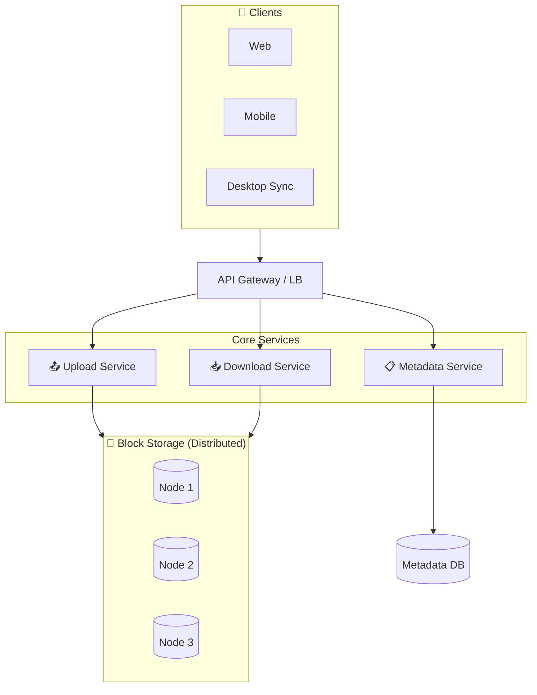
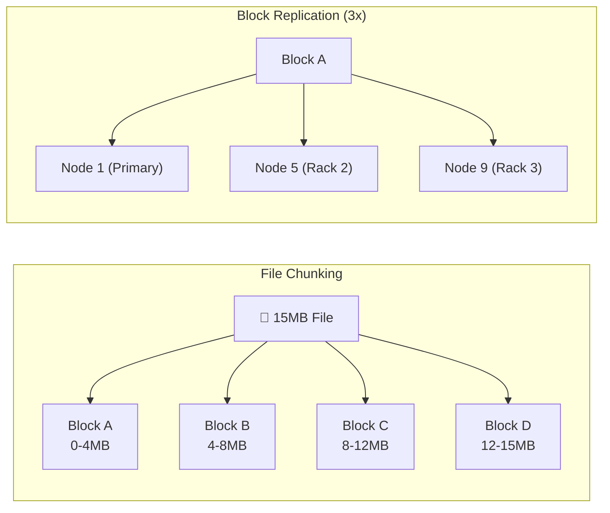

# Distributed File Storage Design

Storing and retrieving files at scale availability, durability, and performance.

---

## Requirements

### Functional Requirements

- Upload files (various sizes: KB to GB)
- Download files
- Delete files
- List files/directories
- Share files (optional)
- Version history (optional)

### Non-Functional Requirements

- High durability (data can't be lost)
- High availability
- Low latency for small files
- High throughput for large files
- Scale to billions of files
- Support very large files (multi-GB)

---

## Scale Estimation

**Assumptions (Dropbox-scale):**
- 500 million users
- 100 million daily active users
- Average 500 files per user
- Average file size: 500 KB
- 1 billion uploads/day

**Calculations:**

Total files: 500M users × 500 files = 250 billion files

Total storage: 250B × 500 KB = 125 PB

Uploads/second: 1B / 86400 ≈ 11,500/sec

This is massive scale requiring distributed storage.

---

## High-Level Architecture





---

## Data Model

### File Metadata

Store metadata separately from file content.

```sql
files (
  id,
  user_id,
  name,
  path,
  size,
  content_hash,
  mime_type,
  created_at,
  updated_at,
  deleted_at
)

file_versions (
  id,
  file_id,
  version,
  size,
  block_list,    -- List of block IDs
  created_at
)

blocks (
  id,
  hash,          -- Content hash (deduplication)
  size,
  storage_nodes  -- Where this block is stored
)
```

### Separation of Concerns

**Metadata service:** Handles file/folder operations, permissions, search.

**Block storage:** Stores actual file data, handles replication.

---

## Chunking Strategy

### Why Chunk?

Large files (GB) are impractical as single units:
- Can't resume partial upload
- Must re-upload entire file for any change
- Network issues waste all progress

### How Chunking Works

1. Client splits file into fixed-size chunks (e.g., 4 MB)
2. Upload each chunk independently
3. Server stores chunks as blocks
4. File metadata lists block IDs in order

```
File: 15 MB document.pdf
Chunks:
  Block A: bytes 0-4MB
  Block B: bytes 4-8MB
  Block C: bytes 8-12MB
  Block D: bytes 12-15MB

Metadata: [Block A, Block B, Block C, Block D]
```

### Chunk Size Trade-offs

**Smaller chunks (1 MB):**
- Better deduplication
- More metadata overhead
- More network requests

**Larger chunks (8 MB):**
- Less metadata
- Less deduplication opportunity
- Fewer requests

4 MB is common default.

---

## Deduplication

### Why Deduplicate?

Many users store same files. Many files have overlapping content.

**Full file dedup:** Same file uploaded twice → store once.

**Block-level dedup:** Same block in different files → store once.

### Content-Addressable Storage

Hash block content → use hash as block ID.

```
Block content → SHA-256 hash → "abc123..."
Store once with key "abc123..."
Any file referencing same content uses same block
```

### Dedup Flow

```
1. Client computes block hashes
2. Sends hash list to server
3. Server responds: "Need blocks: [A, C], have blocks: [B, D]"
4. Client uploads only needed blocks
5. File metadata references all blocks
```

Result: Duplicate content never uploaded or stored twice.

---

## Block Storage

### Storage Node Architecture

Multiple storage nodes, each storing blocks.

```
Storage Cluster:
  Node 1: Blocks [A, C, E, G, ...]
  Node 2: Blocks [A, B, D, F, ...]
  Node 3: Blocks [B, C, E, H, ...]
```

Each block replicated to multiple nodes (typically 3).

### Replication

**Replication factor:** Number of copies (typically 3).

**Placement:** Spread across racks/availability zones.

```
Block A:
  Primary: Node 1 (Rack 1)
  Replica 1: Node 5 (Rack 2)
  Replica 2: Node 9 (Rack 3)
```

### Block Retrieval

Metadata contains block list. Download service:
1. Look up block locations
2. Fetch from any replica (prefer closest)
3. Stream to client

### Erasure Coding (Advanced)

Alternative to replication. More space-efficient.

Instead of 3 copies (3x storage), split into k data + m parity shards.

```
(6,3) erasure coding:
9 shards total, any 6 can reconstruct original
Storage overhead: 1.5x (instead of 3x)
```

Trade-off: More compute for encode/decode.

---

## Upload Flow

### Small File

```
1. Client: POST /upload
2. Server: Validate, check quota
3. Client: Upload file bytes
4. Server: Store block, create metadata
5. Server: Return file ID
```

### Large File (Chunked)

```
1. Client: Request upload session
2. Server: Return session ID, signed URLs for chunks
3. Client: Upload chunks in parallel directly to storage
4. Client: Signal completion
5. Server: Validate all chunks received
6. Server: Create file metadata
```

### Resumable Upload

Client crashed at chunk 50 of 100.

```
1. Client: Resume upload session XYZ
2. Server: Return uploaded chunk list
3. Client: Upload remaining chunks (51-100)
4. Server: Complete file
```

---

## Download Flow

### Small File

Direct download from storage node.

### Large File

1. Client requests file
2. Server returns block list with signed URLs
3. Client downloads blocks in parallel
4. Client reassembles file

### Streaming

For video/audio, allow byte-range requests.

```
GET /files/123 Range: bytes=1000000-2000000
```

Return only requested portion.

---

## Sync Clients

Desktop/mobile clients that sync files.

### Sync Protocol

1. **Detect local changes:** File system watcher
2. **Upload changes:** Chunk, dedup, upload new blocks
3. **Detect remote changes:** Poll or push notification
4. **Download changes:** Fetch new blocks, update local file
5. **Conflict resolution:** Handle simultaneous edits

### Delta Sync

Only sync changed parts of file.

```
File changed from v1 to v2
Chunk-level diff: blocks [B, D] changed
Upload only blocks [B', D']
```

Huge bandwidth savings for large files with small changes.

---

## Metadata Service

### Database Options

**Relational (PostgreSQL):**
- Good for complex queries
- ACID for metadata consistency
- Sharding for scale

**NoSQL (Cassandra, DynamoDB):**
- Simpler scaling
- Eventually consistent (acceptable for metadata)

### Hierarchical Paths

Support folder structure.

```
/documents/work/report.pdf

Flatten: user_id + path as unique key
Or: folders as objects, files reference parent folder
```

### Search

Full-text search on file names.

Elasticsearch index of file metadata.

---

## Common Mistakes

**No chunking for large files.** Large files fail on network issues, can't resume.

**Storing metadata with data.** Metadata operations become slow. Separate them.

**Single point of failure in storage.** No replication = data loss on node failure.

**Unlimited file size without streaming.** Server runs out of memory buffering.

**No deduplication.** Storing same content multiple times. Wasted storage.

---

## What An Experienced Senior Engineer Thinks About

**Consistency model.** When is a file visible after upload? Immediately? After all replicas?

**Encryption.** At rest (storage-level) and in transit (HTTPS). Client-side for sensitive data.

**Quotas and billing.** Per-user storage limits. Metering for billing.

**Compliance.** Data residency (where is data stored), retention policies, GDPR deletion.

**Cold storage.** Rarely accessed files moved to cheaper storage tier.

---

## Vibe Engineering Guide

When prompting about distributed file storage:

**Less useful:**
> "Design Dropbox"

**More useful:**
> "Design a file storage system for:
> - 10 million users, 1 TB average storage per user
> - Files range from KB to 10 GB
> - Need resumable uploads for large files
> - High durability (11 nines) required
>
> Focus on: chunking strategy for large files, deduplication approach, and how blocks are replicated across storage nodes."

**For specific problems:**
> "Our file sync client uploads entire files on any change. A 500MB Excel file with one cell change uploads 500MB. How do we implement delta sync to only upload changed chunks?"

---

## Quick Check

<details>
<summary><b>Why chunk large files?</b></summary>

Enables resumable uploads (restart from last chunk), parallel upload/download, delta sync (only changed chunks), and deduplication at block level.

</details>

<details>
<summary><b>What's content-addressable storage?</b></summary>

Using content hash as the block ID. Same content produces same hash. Enables automatic deduplication - same block only stored once regardless of how many files reference it.

</details>

<details>
<summary><b>How do you achieve 11 nines durability?</b></summary>

Replication across multiple nodes in different failure domains (racks, availability zones). Erasure coding for space-efficient redundancy. Regular integrity checks.

</details>

<details>
<summary><b>What's delta sync?</b></summary>

Syncing only changed parts of a file. File chunked, compare local vs. remote chunks by hash, upload only changed chunks. Huge bandwidth savings for small changes in large files.

</details>

---

Next: [Web Crawler Design](12-web-crawler.md)
