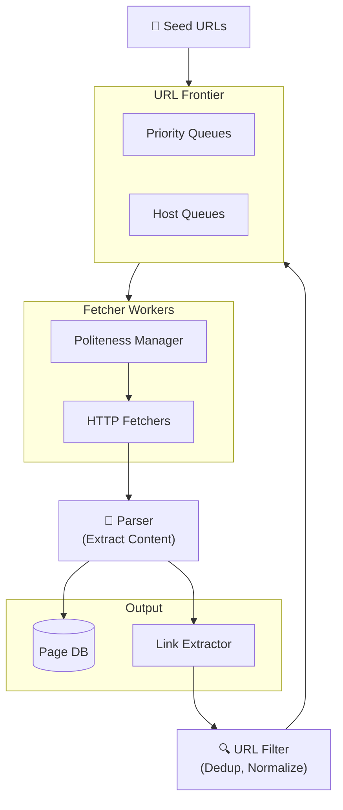
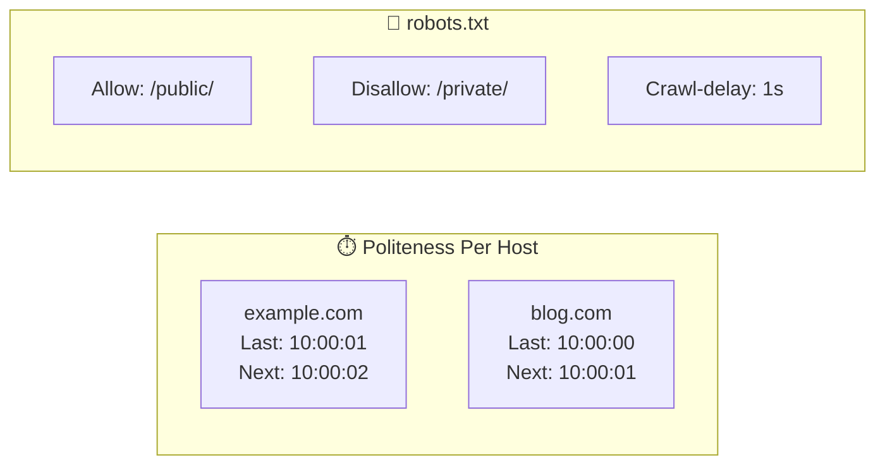

# Web Crawler System Design

Building a system that systematically browses and indexes the web.

---

## Requirements

### Functional Requirements

- Crawl web pages starting from seed URLs
- Extract and follow links
- Store page content for indexing
- Respect robots.txt and crawl policies
- Handle various content types (HTML, PDF, etc.)
- Detect and handle duplicate content

### Non-Functional Requirements

- Politeness: Don't overwhelm websites
- Scalability: Crawl billions of pages
- Freshness: Re-crawl pages periodically
- Robustness: Handle malformed pages, timeouts, errors
- Extensibility: Support new content types

---

## Scale Estimation

**Assumptions (search engine scale):**
- 1 billion pages to crawl
- Average page size: 500 KB
- Re-crawl important pages daily, others weekly
- Target: 1 billion pages in 30 days

**Calculations:**

Pages per second: 1B / (30 × 86400) ≈ 385 pages/sec

Storage: 1B × 500 KB = 500 TB (compressed: ~50 TB)

Bandwidth: 385 × 500 KB = 190 MB/sec = 1.5 Gbps

---

## High-Level Architecture





---

## Core Components

### URL Frontier

Queue of URLs to crawl.

**Not a simple FIFO queue because:**
- Politeness: Can't fetch from same domain too fast
- Priority: Important pages should be crawled first
- Freshness: Need to re-crawl pages

**Implementation:**

Multiple queues organized by:
1. **Priority queues:** High/medium/low priority
2. **Host queues:** Separate queue per host for politeness

```
Priority Selector → Host Queue Selector → Fetch
                         ↓
                Per-host rate limiting
```

### Politeness

Don't overload websites.

**Strategies:**
- Respect robots.txt (required)
- Rate limit per host (e.g., 1 request per second per domain)
- Delay between requests to same host
- Respect Crawl-delay directive

**Robots.txt parsing:**
```
User-agent: *
Disallow: /private/
Crawl-delay: 10
```

Cache robots.txt per domain.

### Fetcher Workers

Download pages in parallel.

**Considerations:**
- Many concurrent connections (thousands)
- Handle timeouts (don't wait forever)
- Follow redirects (up to limit)
- Handle various HTTP responses
- Retry on transient failures

### Content Parser

Extract useful information from pages.

**Tasks:**
- Parse HTML
- Extract text content
- Extract metadata (title, description)
- Extract links
- Detect language
- Detect content type

### Link Extraction

Find URLs in the page.

**Steps:**
1. Extract all href attributes
2. Normalize URLs (resolve relative, remove fragments)
3. Filter (same domain only? external too?)
4. Deduplicate

### URL Deduplication

Don't crawl the same page twice.

**Challenges:**
- Same content at different URLs
- URL normalization (http vs https, trailing slashes)
- Dynamic parameters (session IDs)
- Billions of URLs to track

**Solutions:**
- URL normalization before storing
- Bloom filter for seen URLs (space-efficient, allows false positives)
- Content hash for detecting duplicate content

### Storage

Store crawled content.

**Options:**
- Object storage (S3) for raw content
- Database for metadata
- Search index for full-text

---

## URL Prioritization

Not all pages are equal.

**Factors:**
- PageRank or similar importance signal
- Freshness requirement (news sites need frequent crawling)
- Site quality signals
- Update frequency of the page

**Implementation:**
Priority score → priority queue assignment

---

## Handling Duplicate Content

Same content at multiple URLs.

**Detection:**
- Exact match: Hash entire content
- Near-duplicate: Simhash, MinHash for similar pages

**Action:**
- Store once, record all URLs pointing to it
- Crawl canonical URL, skip duplicates

---

## Re-Crawling

Web changes. Pages need refresh.

**Strategies:**
- Fixed schedule (every N days)
- Adaptive: Pages that change often crawled more frequently
- Priority-based: Important pages more frequently

**Freshness estimation:**
Track historical change rate per page/site.

---

## Distributed Architecture

Single machine can't crawl the web.

**Distribution approach:**
- Partition by URL hash (consistent hashing)
- Each crawler instance handles subset of domains
- Central coordination for URL frontier (or distributed)

**Coordination:**
- Distributed URL frontier (Kafka, Redis)
- Deduplication across crawlers (distributed Bloom filter or central service)

---

## Challenges

### Spider Traps

Infinite URLs generated by the site.

```
/page/1
/page/2
/page/3
... (forever)
```

**Solutions:**
- Limit depth per site
- Limit pages per site
- Detect patterns
- Blacklist problematic sites

### Dynamic Content

JavaScript-rendered pages.

**Solutions:**
- Headless browser (Chrome, Puppeteer)  -  expensive
- Detect if JS required, prioritize server-rendered
- Separate queue for JS-heavy sites

### Large Files

PDFs, videos, etc.

**Solutions:**
- Size limits
- Skip non-text content unless needed
- Stream and abort if too large

---

## Common Mistakes

**Ignoring robots.txt.** Legal and ethical issues. Respect it.

**Overwhelming hosts.** No rate limiting = getting blocked, harming sites.

**Infinite loops.** Spider traps without detection.

**Memory explosion.** Storing all URLs in memory.

**Single point of failure.** No redundancy in frontier or fetchers.

---

## What An Experienced Senior Engineer Thinks About

**Incremental vs. batch crawling.** Continuous crawling vs. periodic full crawls.

**Cost optimization.** Bandwidth, storage, compute costs at scale.

**Quality signals.** Prioritizing valuable content, avoiding spam.

**Legal compliance.** Copyright, terms of service, data protection laws.

---

## Vibe Engineering Guide

When prompting about web crawlers:

**Less useful:**
> "Build a web crawler"

**More useful:**
> "Design a distributed web crawler:
> - Crawl 10,000 pages/second across 1 million domains
> - Must respect robots.txt and rate limit per host
> - Detect duplicate content across URLs
> - Store raw HTML in S3, metadata in PostgreSQL
>
> Focus on: URL frontier design with politeness, deduplication strategy at scale, and how workers coordinate."

**For specific problems:**
> "My crawler keeps revisiting the same URLs. I'm using a HashSet in memory but it's running out of memory with 100M URLs. How do I deduplicate efficiently at scale?"

---

## Quick Check

<details>
<summary><b>Why can't the URL frontier be a simple FIFO queue?</b></summary>

Need to enforce politeness (rate limit per host), prioritize important pages, and handle re-crawling. Requires multiple queues organized by host and priority.

</details>

<details>
<summary><b>How do you handle billions of URLs for deduplication?</b></summary>

Bloom filter: space-efficient probabilistic structure. Allows false positives (might skip a new URL) but no false negatives (won't crawl duplicates). Acceptable trade-off.

</details>

<details>
<summary><b>What's a spider trap?</b></summary>

Site that generates infinite URLs, often through dynamic parameters or calendars. Solutions: limit depth, limit pages per site, detect patterns, blacklist.

</details>

<details>
<summary><b>Why respect robots.txt?</b></summary>

Legal requirement in many jurisdictions, ethical practice, and practical - sites may block or rate-limit crawlers that ignore it.

</details>

---

Next: [Key-Value Store Design](13-key-value-store.md)
