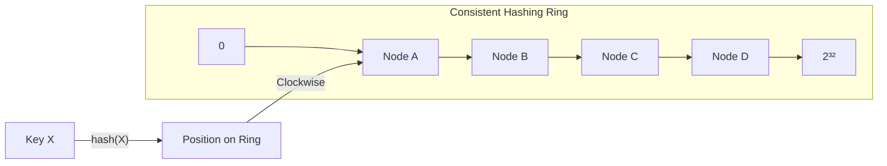
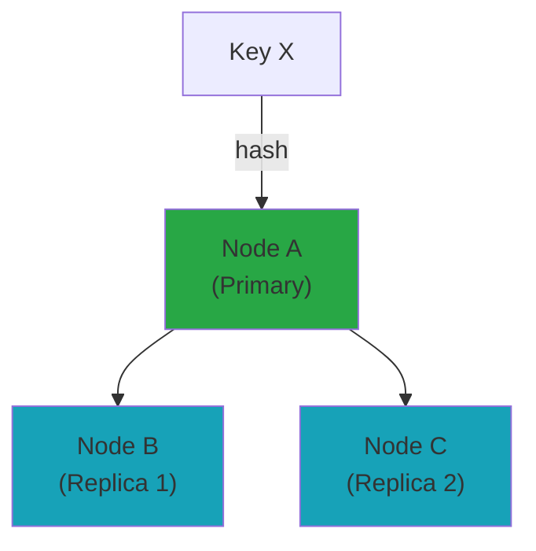

# Key-Value Store Design

Building a distributed storage system for simple key-value data at scale.

---

## Requirements

### Functional Requirements

- Put(key, value): Store a key-value pair
- Get(key): Retrieve value for a key
- Delete(key): Remove a key-value pair
- Keys can be strings, values can be arbitrary bytes

### Non-Functional Requirements

- High availability (always writable)
- Scalability (horizontally scalable)
- Low latency (single-digit milliseconds)
- Durability (data survives failures)
- Tunable consistency (strong or eventual)

---

## Scale Estimation

**Assumptions (DynamoDB-scale):**
- 100 million keys
- Average key: 50 bytes
- Average value: 1 KB
- 100,000 reads/second
- 10,000 writes/second

**Calculations:**

Storage: 100M × 1 KB ≈ 100 GB (before replication)

With 3x replication: 300 GB

Read bandwidth: 100K × 1 KB = 100 MB/sec

Write bandwidth: 10K × 1 KB = 10 MB/sec

---

## Single-Server Design

Start simple before distributing.

### Data Structures

**In-memory hash table:**
- O(1) get/put
- Limited by memory
- Lost on crash

**Log-structured storage:**
- Append writes to log file
- Hash table maps key → log offset
- Compact periodically

**LSM Tree (Log-Structured Merge-Tree):**
- Write to in-memory table (memtable)
- When full, flush to sorted file (SSTable)
- Compact SSTables periodically
- Read: check memtable, then SSTables

**B-Tree:**
- Traditional database structure
- Good read performance
- Random I/O on writes

### Choosing a Storage Engine

| Engine | Writes | Reads | Space |
|--------|--------|-------|-------|
| LSM Tree | Fast (sequential) | Slower (check multiple files) | Good (compression) |
| B-Tree | Slower (random I/O) | Fast (single lookup) | More overhead |

LSM trees common for write-heavy workloads (Cassandra, RocksDB).

---

## Distributed Design

Single server isn't enough. Need to distribute.

### Partitioning (Sharding)

Split data across nodes.



**Consistent hashing:**
- Hash key → position on ring
- Node responsible for range
- Adding/removing nodes moves minimal data

**Virtual nodes:**
- Each physical node has multiple positions on ring
- Better load distribution
- Easier rebalancing

### Replication

Copy data to multiple nodes for durability and availability.



**Replication factor:** Number of copies (typically 3).

**Replica placement:**
- Next N-1 nodes on ring
- Across racks/availability zones

---

## Consistency

Distributed systems face the consistency vs. availability trade-off.

### Quorum Reads/Writes

**Parameters:**
- N = replication factor (total replicas)
- W = write quorum (replicas that must acknowledge write)
- R = read quorum (replicas to read from)

**Guarantee:**
- If W + R > N, read quorum overlaps with write quorum (at least one node has latest value)
- This gives strong consistency *if* no failures occur during operations and conflicts are resolved correctly
- Strong consistency: W = N or R = N
- Eventual consistency: W = 1, R = 1

**Reality check:** The W + R > N formula assumes operations complete without node failures mid-operation. In practice, combine with conflict resolution (timestamps, vector clocks) for robustness.

**Common configurations:**
- N=3, W=2, R=2 (balanced)
- N=3, W=3, R=1 (strong write, fast read)
- N=3, W=1, R=1 (eventual, high availability)

### Handling Conflicts

With W < N, concurrent writes may conflict.

**Last-write-wins:**
- Timestamp decides winner
- Simple but can lose data

**Vector clocks:**
- Track causality
- Detect concurrent writes
- Application resolves conflicts

**CRDTs:**
- Data structures that merge automatically
- No conflicts by design
- Limited to specific data types

---

## Write Path

```
Client → Coordinator → Replicas

1. Client sends put(key, value)
2. Coordinator determines replicas (via consistent hashing)
3. Coordinator sends to all N replicas
4. Coordinator waits for W acknowledgments
5. Returns success to client
```

### Handling Failures

**Hinted handoff:**
- If replica is down, write to another node
- Include hint: "this is for Node X"
- When Node X recovers, forward the write

**Anti-entropy:**
- Background process compares replicas
- Repairs inconsistencies
- Uses Merkle trees to efficiently find differences

---

## Read Path

```
1. Client sends get(key)
2. Coordinator determines replicas
3. Coordinator reads from R replicas
4. Return most recent value (by timestamp)
5. If replicas disagree, trigger read repair
```

### Read Repair

If replicas have different values during read:
- Return most recent to client
- Update stale replicas in background

---

## Failure Detection

Need to know when nodes are down.

**Gossip protocol:**
- Nodes periodically exchange state
- "Node X heartbeat at time T"
- If no heartbeat for threshold, mark suspect
- After longer period, mark dead

---

## Data Model Extensions

### Expiration (TTL)

Keys automatically expire.

```
put(key, value, ttl=3600)  // expires in 1 hour
```

**Implementation:**
- Store expiration time with value
- Background process deletes expired keys
- Check expiration on read

### Versioning

Keep multiple versions.

```
put(key, value, version=1)
get(key, version=1)
get(key)  // returns latest
```

---

## Common Mistakes

**Single coordinator.** Becomes bottleneck. Any node should coordinate.

**No quorum configuration.** Fixed W=N means unavailable when any node is down.

**Ignoring clock skew.** Timestamps from different nodes may not be comparable.

**No compaction.** LSM trees grow unbounded without compaction.

**Synchronous replication to all.** High latency, low availability.

---

## Real-World Examples

| System | Consistency | Notes |
|--------|-------------|-------|
| Redis | Single-node strong, cluster eventual | In-memory, persistence options |
| DynamoDB | Tunable | Managed, single-digit ms |
| Cassandra | Tunable | Wide-column, good for writes |
| etcd | Strong (Raft) | Small data, coordination |

---

## What An Experienced Senior Engineer Thinks About

**Consistency requirements.** What does the application actually need?

**Hot keys.** Some keys accessed much more than others. Need caching or spreading.

**Cross-region.** Replication across regions adds latency complexity.

**Operational complexity.** Distributed systems are hard to operate, debug, recover.

---

## Vibe Engineering Guide

When prompting about key-value stores:

**Less useful:**
> "Build a key-value store"

**More useful:**
> "Design a distributed key-value store:
> - 10 million keys, 10 KB average value
> - 50,000 reads/sec, 5,000 writes/sec
> - Must survive single node failure
> - Eventual consistency acceptable
>
> Focus on: partitioning strategy, replication with configurable quorum, and how to handle node failures without data loss."

**For specific problems:**
> "We're using consistent hashing with 10 nodes. One node has 3x the data of others. How do we rebalance? Should we use virtual nodes?"

---

## Quick Check

<details>
<summary><b>Why use consistent hashing?</b></summary>

Adding or removing nodes only moves data for the affected range, not all data. With regular hashing, changing node count reshuffles everything.

</details>

<details>
<summary><b>What does W + R > N guarantee?</b></summary>

At least one node in read quorum has the latest write. The quorums overlap. This gives strong consistency if enforced.

</details>

<details>
<summary><b>What's hinted handoff?</b></summary>

When a replica is down, write to another node with a hint. When the original comes back, forward the write. Maintains write availability during failures.

</details>

<details>
<summary><b>How do you detect node failures?</b></summary>

Gossip protocol: nodes periodically exchange heartbeats. If no heartbeat for threshold period, mark node as failed. Decentralized, no single failure detector.

</details>

---

Next: [Autocomplete System Design](14-autocomplete.md)
