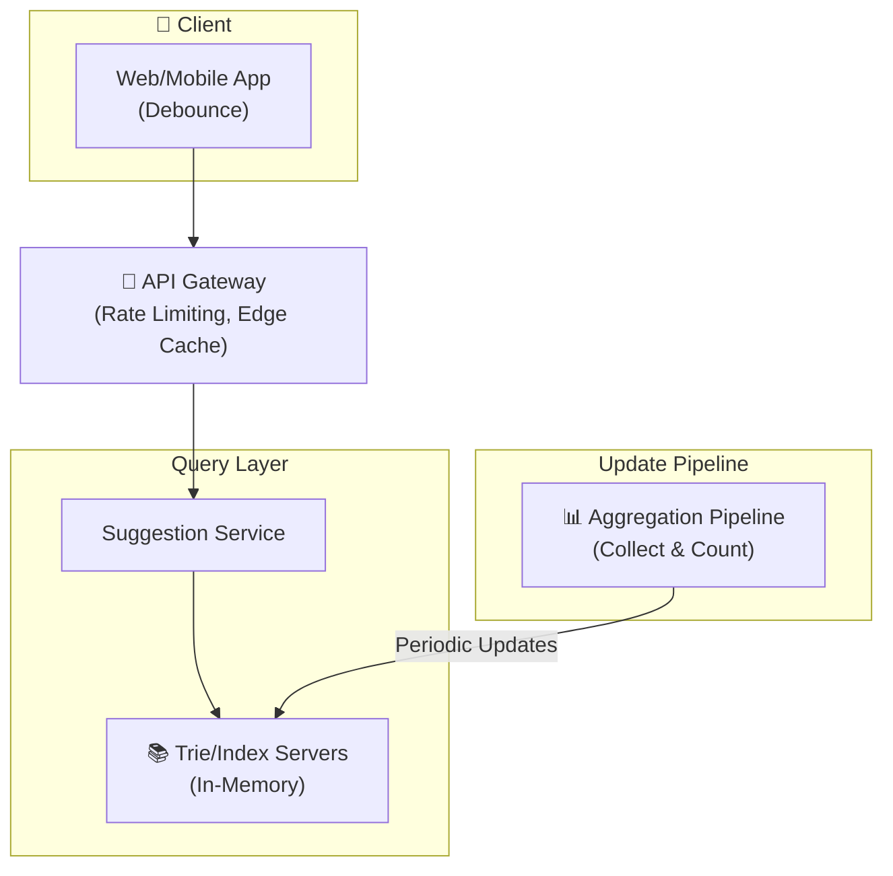
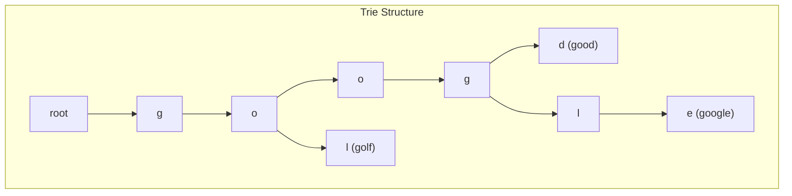

# Autocomplete System Design

Building a typeahead suggestion system fast prefix matching at scale.

---

## Requirements

### Functional Requirements

- Return suggestions as user types
- Match by prefix (typing "goo" suggests "google")
- Rank suggestions by relevance/popularity
- Support multiple languages
- Learn from user behavior

### Non-Functional Requirements

- Very low latency (< 100ms, ideally < 50ms)
- High availability
- Scale to millions of queries per second
- Handle growing vocabulary

---

## Scale Estimation

**Assumptions (Google search scale):**
- 5 billion searches per day
- Average 4 characters typed before selection
- 20% result in autocomplete query per keystroke
- 10 million unique search terms

**Calculations:**

Queries per second: 5B × 4 × 0.2 / 86400 ≈ 46,000 QPS

Peak: 3x average ≈ 140,000 QPS

This is latency-sensitive and high-volume.

---

## High-Level Architecture





---

## Data Structures

### Trie (Prefix Tree)

Primary data structure for prefix matching.

```
            root
           / | \
          g  h  ...
         /
        o
       / \
      o   l (golf)
     /
    g
   / \
  l   d (good)
 /
e (google)
```

**Properties:**
- O(L) lookup where L is prefix length
- Space-efficient for shared prefixes
- Each node can store: count, top suggestions

### Trie Node

Each node contains:
- Children (map or array)
- Is this a complete word?
- Frequency/score for ranking
- Precomputed top-K suggestions (optimization)

### Trie Optimization: Top-K at Each Node

Store top suggestions at each node to avoid traversing.

```
Node 'go':
  children: [o, l, ...]
  top_suggestions: ["google", "go", "google maps", "good morning", "golang"]
```

Lookup becomes: traverse to prefix node → return precomputed top-K.

---

## Ranking

Not all matches are equal. Rank by:

### Factors

1. **Popularity:** How often is this term searched?
2. **Recency:** Recent searches weighted higher
3. **User personalization:** What does this user search?
4. **Context:** Location, language, time of day

### Scoring

Simple approach:
```
score = popularity × decay_factor^(days_since_update)
```

More complex: ML model combining multiple signals.

---

## Client-Side Optimizations

### Debouncing

Don't query on every keystroke.

```
Wait 100-200ms after last keystroke before querying.
If user types "google" quickly, only query for "google", not "g", "go", "goo", "goog", "googl".
```

### Caching

Cache recent queries locally.

```
User types "goo" → fetch suggestions
User types "goog" → already have from "goo", filter client-side
```

### Early Termination

Show results from cache while waiting for server.

---

## Server-Side Optimizations

### In-Memory Storage

Trie must be in memory for speed. Disk is too slow for < 50ms latency.

### Sharding

Split trie by prefix.

```
Shard A: a-m
Shard B: n-z
```

Or consistent hashing on first N characters.

### Replication

Multiple replicas for each shard. Load balance across them.

### Caching

Cache popular prefixes at gateway level.

```
"the", "how", "what" → extremely common, cache results
```

---

## Data Collection Pipeline

Need to know what's popular.

### Collect

- Log all searches
- Aggregate counts
- Clean data (remove PII, offensive content)

### Aggregate

```
Raw logs:
  "google" - user1
  "google" - user2  
  "google maps" - user3

Aggregated:
  "google": 2
  "google maps": 1
```

**Frequency:** Daily or hourly aggregation.

### Update Trie

Rebuild or incrementally update the trie.

**Rebuild:**
- Build new trie from aggregated data
- Swap with running trie
- Simple, but takes time

**Incremental:**
- Update counts in running trie
- Add new terms
- More complex, faster updates

---

## Handling Scale

### Tiered Architecture

```
Edge Layer: CDN with cached popular queries
Regional Layer: Full suggestion service
Central Layer: Aggregation and trie building
```

### Sampling

At massive scale, don't need exact counts.

Sample 1% of queries, multiply by 100. Approximate is sufficient.

---

## Personalization

Show user's own recent/frequent searches.

### Implementation

- Store user's recent searches (Redis, per-user key)
- Merge with global suggestions
- Personal terms ranked higher

### Privacy

- User can clear history
- Don't log sensitive queries
- Comply with data regulations

---

## Multi-Language Support

Different languages have different prefixes.

### Approach

- Separate trie per language
- Detect language from user/query
- Route to appropriate trie

### Challenges

- Mixed language queries
- Transliteration (typing "konnichiwa" for "こんにちは")
- Character encoding

---

## Filtering

Don't suggest offensive or inappropriate content.

### Implementation

- Blocklist of terms
- ML model to detect problematic suggestions
- Human review for edge cases

---

## Common Mistakes

**Querying on every keystroke.** Wastes resources. Debounce.

**Trie on disk.** Too slow. Must be in-memory.

**No precomputed top-K.** Traversing trie on every query is slow.

**Ignoring personalization.** Users expect their searches to appear.

**No content filtering.** Suggesting inappropriate content.

---

## What An Experienced Senior Engineer Thinks About

**Latency budget.** Every millisecond matters. Measure p50, p99 at each layer.

**Cold start.** What to suggest for new users with no history?

**A/B testing.** Test ranking algorithm changes carefully.

**Internationalization.** Different behavior for different markets.

---

## Vibe Engineering Guide

When prompting about autocomplete:

**Less useful:**
> "Build autocomplete"

**More useful:**
> "Design a search autocomplete system:
> - 50,000 queries per second
> - 10 million unique search terms
> - P99 latency < 50ms
> - Should show personalized suggestions for logged-in users
>
> Focus on: data structure for fast prefix lookup, how to keep popularity scores fresh, and how to blend personal history with global trends."

**For specific problems:**
> "Our autocomplete trie has 50 million terms and takes 30 seconds to rebuild. How can we update it more frequently without downtime or waiting for full rebuilds?"

---

## Quick Check

<details>
<summary><b>Why use a trie for autocomplete?</b></summary>

Optimized for prefix lookups. O(L) time where L is prefix length, regardless of vocabulary size. Shares storage for common prefixes.

</details>

<details>
<summary><b>Why store top-K suggestions at each node?</b></summary>

Avoids traversing all children to find best matches. Query is O(L) + O(1) instead of O(L) + O(subtree_size). Critical for latency.

</details>

<details>
<summary><b>Why debounce on the client?</b></summary>

Reduces server load dramatically. User typing 10 characters generates 1 query instead of 10. Better user experience too (fewer UI updates).

</details>

<details>
<summary><b>How do you keep suggestions fresh?</b></summary>

Aggregation pipeline collects recent searches. Periodic trie rebuild or incremental updates. Decay older terms. Balance freshness with stability.

</details>

---

Next: [Metrics and Monitoring System](15-metrics-monitoring.md)
