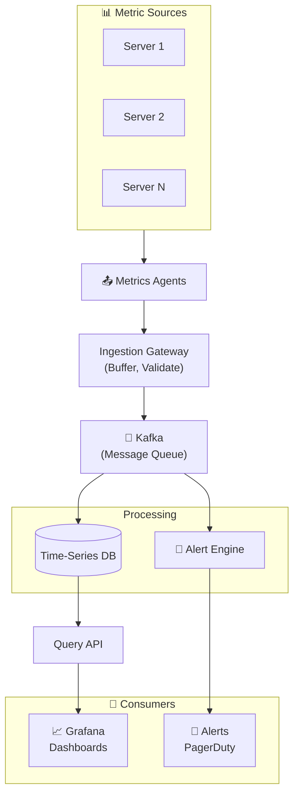
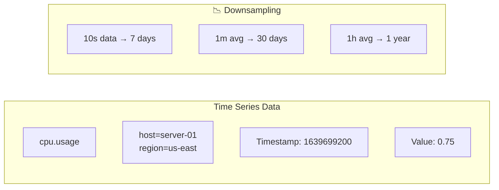

# Metrics and Monitoring System Design

Collecting, storing, and querying time-series data at scale.

---

## Requirements

### Functional Requirements

- Ingest metrics from thousands of servers
- Store time-series data (value + timestamp)
- Query metrics by time range
- Aggregation (avg, sum, max, percentiles)
- Alerting on thresholds
- Dashboard visualization

### Non-Functional Requirements

- High write throughput (millions of data points/second)
- Query latency suitable for dashboards (< 1 second)
- High availability (monitoring can't be down)
- Scalable storage (months to years of data)
- Cost-efficient (metrics are voluminous)

---

## Scale Estimation

**Assumptions (large company):**
- 10,000 servers
- 1,000 metrics per server
- Collection interval: 10 seconds
- 1 year retention

**Calculations:**

Metrics per second: 10K × 1K / 10 = 1 million/sec

Data points per day: 1M × 86400 = 86.4 billion

Storage per year: 86.4B × 365 × 16 bytes ≈ 500 TB

This is a write-heavy, read-moderate workload.

---

## High-Level Architecture





---

## Data Model

### Metric Structure

```
{
  name: "cpu.usage",
  tags: {
    host: "server-01",
    region: "us-east-1",
    service: "api"
  },
  timestamp: 1639699200,
  value: 0.75
}
```

**Name:** What is being measured
**Tags:** Dimensions for filtering/grouping
**Timestamp:** When it was measured
**Value:** The measurement

### Time Series

A time series is a unique combination of name + tags.

```
cpu.usage{host=server-01, region=us-east-1}
cpu.usage{host=server-02, region=us-east-1}
```

Each is a separate time series with its own data points.

---

## Time-Series Database (TSDB)

Specialized database for time-series data.

### Why Not Regular Database?

- High write throughput requirements
- Time-based queries are common (last hour, last day)
- Downsampling and retention policies needed
- Compression optimized for time-series patterns

### Storage Design

**Write path:**
1. Buffer in memory
2. Write to WAL (durability)
3. Batch into compressed blocks
4. Flush to disk

**Time-based partitioning:**
```
2024-01-01/ ← block for Jan 1
2024-01-02/ ← block for Jan 2
...
```

Old blocks archived to cold storage or deleted.

### Compression

Time-series data compresses well:
- Timestamps are sequential (delta encoding)
- Values often similar (XOR encoding)

Compression ratios of 10-15x are common.

### Popular TSDBs

| TSDB | Notes |
|------|-------|
| Prometheus | Pull-based, great for Kubernetes |
| InfluxDB | Push-based, SQL-like query |
| TimescaleDB | PostgreSQL extension |
| VictoriaMetrics | Prometheus-compatible, efficient |
| ClickHouse | Column-store, analytics |

---

## Ingestion

### Collection Patterns

**Push:** Agents send metrics to collector.
```
Server → Agent → Collector → Storage
```

**Pull:** Collector scrapes metrics from servers.
```
Prometheus → scrapes /metrics endpoint
```

**Hybrid:** Push to gateway, pull from gateway.

### Handling High Throughput

**Buffer and batch:**
- Don't write every data point immediately
- Batch in memory, flush periodically

**Message queue:**
- Kafka between ingestion and storage
- Handles bursts, decouples systems

**Sharding:**
- Partition by metric name or tag hash
- Parallel writes to multiple nodes

---

## Query Layer

### Query Types

**Range query:**
```
cpu.usage{host="server-01"} from 1h ago to now
```

**Aggregation:**
```
avg(cpu.usage{service="api"}) by host
```

**Rate calculation:**
```
rate(http_requests_total[5m])
```

### Query Optimization

**Index on tags:** Fast filtering by tag values.

**Time-based sharding:** Only scan relevant time blocks.

**Pre-aggregation:** Store hourly/daily rollups for long-range queries.

**Caching:** Cache expensive queries.

---

## Downsampling

Raw data is expensive to store and query.

**Strategy:**
- Keep 10-second data for 7 days
- Keep 1-minute averages for 30 days
- Keep 1-hour averages for 1 year
- Keep 1-day averages for 5 years

**Implementation:**
- Background job aggregates old data
- Delete raw data after aggregation
- Query automatically uses appropriate resolution

---

## Alerting

### Alert Rules

```
alert: HighCPU
condition: avg(cpu.usage) > 0.9
for: 5 minutes
severity: warning
```

### Alert Evaluation

1. Rule engine queries metrics periodically
2. If condition true, start timer
3. If condition persists for "for" duration, fire alert
4. Send notification (PagerDuty, Slack, email)

### Alert States

```
OK → Pending → Firing
 ↑              │
 └──────────────┘
     (resolved)
```

---

## High Availability

### Ingestion HA

- Multiple ingestion gateways
- Load balancer distributes traffic
- No state in gateways (stateless)

### Storage HA

- Replication factor 2-3
- Writes go to multiple nodes
- Reads can go to any replica

### Query HA

- Multiple query servers
- Can query any replica
- Load balancer for distribution

---

## Common Mistakes

**No backpressure.** Burst of metrics overwhelms storage.

**Too many tags.** High cardinality explodes time series count.

**No downsampling.** Raw data costs grow unbounded.

**Alerting on raw data.** Noisy, too many false positives.

**Single point of failure.** Monitoring must be highly available.

---

## Cardinality Explosion

**The problem:**

Tags create unique time series.

```
cpu.usage{host=X, container_id=Y, request_id=Z}
```

If you have 10K hosts, 100 containers, and use request_id as tag... explosion.

**Solutions:**
- Limit allowed tags
- Don't use high-cardinality values as tags
- Aggregate high-cardinality data, don't store per-instance

---

## What An Experienced Senior Engineer Thinks About

**Cost vs. resolution.** Higher resolution = more storage = more cost.

**Query patterns.** Design schema for how data will be queried.

**Operational simplicity.** Managed services vs. self-hosted.

**Correlation.** How do metrics connect to logs and traces?

---

## Vibe Engineering Guide

When prompting about metrics systems:

**Less useful:**
> "Build a monitoring system"

**More useful:**
> "Design a metrics collection and alerting system:
> - 5,000 servers, 500 metrics each, 10-second intervals
> - Need 30-day retention at full resolution, 1-year downsampled
> - Real-time dashboards (< 2 second query latency)
> - Alerting with < 1 minute detection time
>
> Focus on: ingestion pipeline to handle 250K data points/sec, storage with efficient compression, and downsampling strategy."

**For specific problems:**
> "Our Prometheus is running out of memory with 5M time series. We added container_id as a label and cardinality exploded. How do we monitor per-container metrics without the cardinality problem?"

---

## Quick Check

<details>
<summary><b>Why use a time-series database instead of PostgreSQL?</b></summary>

Optimized for time-series: high write throughput, time-based queries, compression for sequential data, built-in retention and downsampling.

</details>

<details>
<summary><b>What's the cardinality problem?</b></summary>

Each unique combination of name + tags is a time series. High-cardinality tags (like request_id) create millions of series, overwhelming storage and query performance.

</details>

<details>
<summary><b>Why downsample old data?</b></summary>

Raw data is expensive to store and slow to query. Old data rarely needs second-level precision. Store aggregated data for long-term, raw for recent.

</details>

<details>
<summary><b>Why use a message queue for ingestion?</b></summary>

Decouples ingestion from storage. Handles bursts (buffer in queue). Allows storage to consume at its own pace. Prevents data loss if storage is temporarily slow.

</details>

---

Next: [Online/Offline Status System](16-online-offline-status.md)
