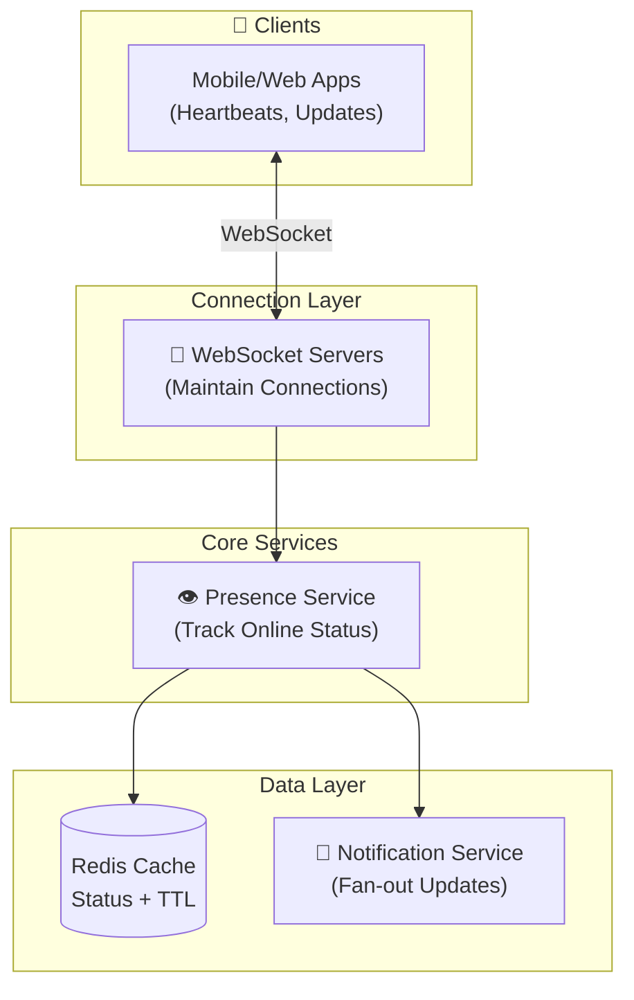
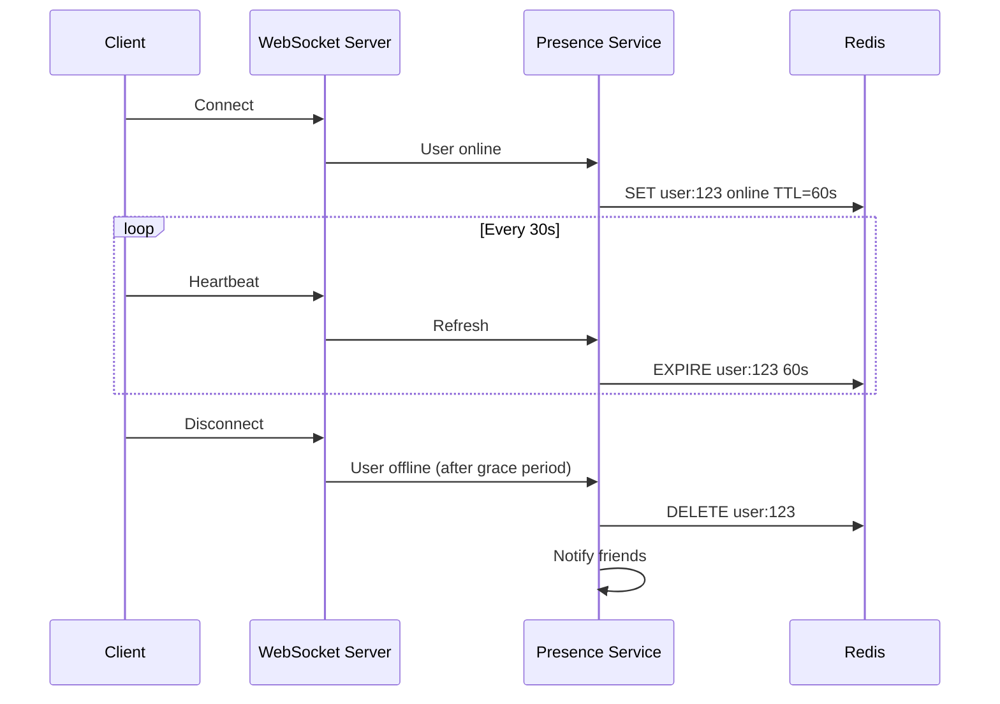

# Online/Offline Status System Design

Building presence detection knowing who's online right now.

---

## Requirements

### Functional Requirements

- Show real-time online/offline status for users
- Update status within a few seconds of change
- Show "last seen" time for offline users
- Handle users on multiple devices
- Scale to millions of concurrent users

### Non-Functional Requirements

- Low latency updates (< 5 seconds)
- High availability (presence is always visible)
- Scalable (millions of users)
- Efficient (minimize battery/network on mobile)

---

## Scale Estimation

**Assumptions (messaging app scale):**
- 100 million daily active users
- 10 million concurrent users at peak
- Average session: 30 minutes
- User has 200 friends to notify on status change

**Calculations:**

Status changes per second: 10M users × 2 changes (online/offline) / 1800 sec ≈ 11,000/sec

Fan-out: 11,000 × 200 friends = 2.2 million notifications/sec

This is a real-time, high fan-out system.

---

## High-Level Architecture





---

## Approach 1: Heartbeat-Based

Client sends periodic heartbeats to server.

### How It Works

1. Client connects, sends "I'm online"
2. Client sends heartbeat every 30 seconds
3. Server marks user online, sets TTL
4. If no heartbeat for 60 seconds, user is offline
5. On disconnect, mark offline immediately

### Implementation

```
Client:
  Every 30s: POST /heartbeat
  On app close: POST /offline

Server:
  On heartbeat: SET user:{id}:online = true, TTL 60s
  On explicit offline: DELETE user:{id}:online
```

### Pros
- Simple
- Works with HTTP
- Battery-friendly intervals

### Cons
- Up to 60s delay for offline detection
- Polling overhead

---

## Approach 2: Connection-Based

Use WebSocket connection state as presence indicator.

### How It Works

1. Client opens WebSocket connection
2. Connection open = online
3. Connection closed = offline
4. Server detects disconnect immediately

### Implementation

```
On WebSocket connect:
  Mark user online
  Subscribe to friend updates

On WebSocket disconnect:
  Mark user offline
  Notify friends
```

### Pros
- Real-time offline detection
- No polling overhead
- Server can push updates

### Cons
- Requires persistent connection
- More server state
- Mobile connection instability

---

## Hybrid Approach

Use WebSocket when possible, heartbeat as backup.

```
If WebSocket connected:
  Use connection state for presence
Else:
  Fall back to heartbeat
```

### Handling Unstable Connections

Mobile connections drop frequently. Don't immediately mark offline.

```
On disconnect:
  Wait 30 seconds
  If no reconnection: mark offline
  If reconnects: cancel offline timer
```

---

## Storage

### What to Store

```
User Presence:
  user_id: 12345
  status: online | offline
  last_seen: timestamp
  devices: [device1, device2]
```

### Redis for Real-Time

```
Key: presence:{user_id}
Value: { status: "online", last_heartbeat: timestamp }
TTL: 60 seconds (auto-expires if no heartbeat)
```

### Multi-Device

User is online if ANY device is online.

```
presence:12345:device:phone = online
presence:12345:device:tablet = online

User 12345 is online (at least one device)
```

User is offline only when ALL devices are offline.

---

## Notification Fan-Out

When user status changes, notify their friends.

### The Problem

User with 500 friends goes offline → 500 notifications.

Celebrity with 1M followers → 1M notifications.

### Solutions

**Pull instead of push:**
- Don't notify on change
- Clients poll friends' status periodically
- Cache friend statuses

**Selective push:**
- Only push to currently online friends
- Offline friends will pull on connect

**Batching:**
- Aggregate status changes
- Send batch updates every few seconds

---

## Fetching Friend Statuses

When user opens app, need to show all friends' statuses.

### Naive Approach

Query each friend's status individually.

```
For each friend_id:
  GET presence:{friend_id}
```

**Problem:** 500 friends = 500 queries.

### Better: Multi-Get

```
MGET presence:101 presence:102 presence:103 ...
```

Single round-trip for all friends.

### With Caching

```
1. Client caches friend statuses
2. On connect: fetch all (cold start)
3. After: receive real-time updates via push
4. Periodically: refresh full list (catch missed updates)
```

---

## "Last Seen" Feature

Show when offline user was last active.

### Implementation

```
On status change to offline:
  SET last_seen:{user_id} = current_timestamp

On query:
  If online: return "online"
  Else: return "last seen {last_seen_time}"
```

### Display Logic

```
< 1 minute ago: "just now"
< 1 hour ago: "X minutes ago"
< 24 hours ago: "X hours ago"
< 1 week ago: "yesterday" / "Tuesday"
> 1 week ago: "date"
```

---

## Privacy Considerations

Users may not want to share status.

### Settings

- Show online status: yes/no
- Show last seen: yes/no
- Show read receipts: yes/no

### Implementation

```
When fetching user status:
  If privacy.show_online_status == false:
    return "hidden" instead of actual status
```

---

## Handling Scale

### Sharding

Partition by user_id.

```
Shard 0: user_id % 4 == 0
Shard 1: user_id % 4 == 1
...
```

### Connection Distribution

Consistent hashing for WebSocket servers.

```
user_id → hash → specific WebSocket server
```

Allows direct routing for push notifications.

---

## Common Mistakes

**No debounce on status change.** Flapping connection = spam notifications.

**Immediate offline on disconnect.** Network blips cause false offline.

**Query per friend.** Doesn't scale. Use multi-get or pub/sub.

**No privacy controls.** Legal issues, user trust.

**Push to all followers.** Celebrity problem. Use selective push or pull.

---

## What An Experienced Senior Engineer Thinks About

**Battery optimization.** Heartbeat intervals affect mobile battery.

**Accuracy vs. cost.** More frequent heartbeats = more accurate but more load.

**Graceful degradation.** What if presence service is down?

**Privacy regulations.** GDPR requires ability to hide presence data.

---

## Vibe Engineering Guide

When prompting about presence systems:

**Less useful:**
> "Build an online/offline indicator"

**More useful:**
> "Design a presence system for a messaging app:
> - 10 million concurrent users
> - Status update latency < 5 seconds
> - Users have average 200 friends
> - Must handle mobile connection instability
>
> Focus on: heartbeat vs WebSocket approach, how to handle fan-out when user status changes, and multi-device presence."

**For specific problems:**
> "Our presence system shows users as offline when they're just on unstable mobile networks. How do we distinguish between 'actually closed app' and 'temporary network blip'? We're using WebSocket connection state."

---

## Quick Check

<details>
<summary><b>Why not mark offline immediately on disconnect?</b></summary>

Mobile connections are unstable. Brief disconnects should not trigger false offline status. Use grace period (30-60 seconds) before marking offline.

</details>

<details>
<summary><b>How handle user with 1M followers going offline?</b></summary>

Don't push to all followers. Either: (1) only push to online friends who care, (2) use pull model where clients fetch status, or (3) batch updates.

</details>

<details>
<summary><b>When is user "online" with multiple devices?</b></summary>

Online if ANY device is connected. Only offline when ALL devices disconnect.

</details>

<details>
<summary><b>Why use Redis for presence?</b></summary>

In-memory for low latency, TTL for automatic expiration, pub/sub for real-time updates, multi-get for batch queries.

</details>

---

Next: [Proximity Service Design](17-proximity-service.md)
