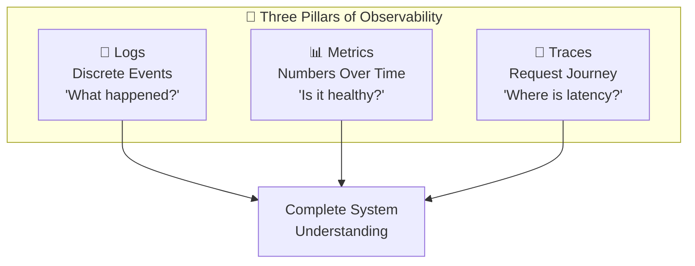
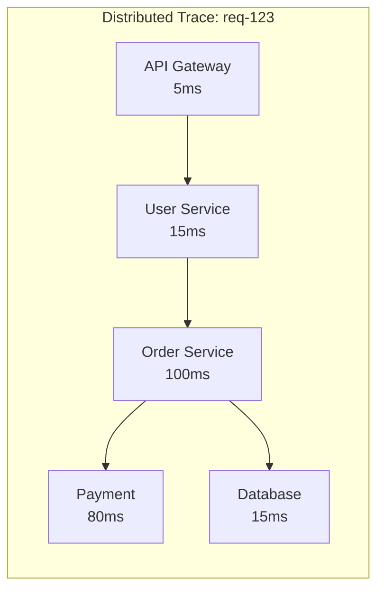

# Observability

Understanding what's happening in your system because you can't fix what you can't see.

---

## What is Observability?

Observability is the ability to understand a system's internal state from its external outputs.

In practice, it means: When something goes wrong at 2 AM, can you figure out why?

It's not just monitoring (watching dashboards). It's the ability to ask arbitrary questions about system behavior and get answers.

---

## The Three Pillars





### Logs

Records of discrete events that happened.

```
2024-01-15 10:30:00 INFO  [req-123] Processing order ord-456
2024-01-15 10:30:02 ERROR [req-123] Payment failed: insufficient funds
```

**What logs tell you:**
- What happened (event)
- When it happened (timestamp)
- Context (request ID, user ID, error message)

**Best practices:**
- Structured logging (JSON) for machine parsing
- Include correlation IDs to trace requests
- Log at appropriate levels (DEBUG, INFO, WARN, ERROR)
- Don't log sensitive data (passwords, PII)

### Metrics

Numeric measurements over time.

```
http_requests_total{status="200"} 15,234
http_request_duration_seconds_p99 0.250
```

**What metrics tell you:**
- Current state (CPU at 80%)
- Trends (requests/sec increasing)
- Aggregates (error rate is 0.1%)

**Key metrics:**
- **RED method (for services):** Rate, Errors, Duration
- **USE method (for resources):** Utilization, Saturation, Errors

**Best practices:**
- Define SLIs (Service Level Indicators) that matter
- Set up dashboards for key metrics
- Alert on symptoms, not just causes

### Traces

Follow a request through multiple services.

```
Request abc123:
  └─ API Gateway (5ms)
       └─ User Service (15ms)
            └─ Database query (10ms)
       └─ Order Service (100ms)
            └─ Payment Service (80ms)
            └─ Database query (15ms)
```

**What traces tell you:**
- Full request path
- Where time is spent
- Which service caused failure

**Best practices:**
- Propagate trace context across services
- Sample traces (don't trace 100% at high volume)
- Focus on slow traces and errors

---

## Why All Three?

Each pillar has strengths:

| Question | Best Answered By |
|----------|------------------|
| What's the current error rate? | Metrics |
| Why did this specific request fail? | Logs |
| Where is latency coming from? | Traces |
| Is the system healthy right now? | Metrics |
| What happened at 2:15 AM? | Logs |
| Which service is the bottleneck? | Traces |

They're complementary. Use all three.

---

## Key Metrics to Track

### Service Metrics (RED)

**Rate:** Requests per second. Is traffic normal?

**Errors:** Error rate. 0.1% errors might be normal; 5% is a problem.

**Duration:** Latency percentiles.
- P50: Half of requests faster than this
- P95: 95% faster than this
- P99: 99% faster than this

P99 matters because **latency follows a Power Law distribution**, not a bell curve. The "long tail" contains the users having the worst experience, often your power users with the most data. 1% of 1 million requests is 10,000 unhappy users.

### Resource Metrics (USE)

**Utilization:** How much of a resource is used. CPU at 80%.

**Saturation:** How much work is queued. Connection pool is full.

**Errors:** Resource-specific errors. Disk I/O errors.

### Database Metrics

- Query rate and latency
- Connection pool usage
- Slow query count
- Replication lag

### Application Metrics

- Business metrics (orders/minute, signups/hour)
- Feature-specific metrics (search latency, payment success rate)
- Dependency health (external API latency)

---

## Distributed Tracing

In microservices, one request touches many services. How do you trace it?

### How It Works

1. Request enters system, gets unique trace ID
2. Each service adds a span (its portion of the trace)
3. Spans include: service name, operation, duration, metadata
4. Trace context propagated via headers
5. All spans collected and visualized together

### Trace Propagation

Headers carry trace context:

```
traceparent: 00-abc123-def456-01
```

Services must propagate these headers on outgoing requests.

### Sampling

At high volume, tracing 100% of requests is expensive.

**Head sampling:** Decide at trace start whether to sample.
**Tail sampling:** Decide after trace completes (keep errors, slow traces).

Sample rate of 1-10% is common. Always sample errors and slow requests.

### Tools

| Tool | Notes |
|------|-------|
| Jaeger | Open source, CNCF |
| Zipkin | Open source, original |
| Datadog APM | Commercial, full-featured |
| AWS X-Ray | AWS native |
| Honeycomb | Observability platform |

---

## Logging Best Practices

### Structured Logging

Machine-parseable format (JSON):

```json
{
  "timestamp": "2024-01-15T10:30:00Z",
  "level": "ERROR",
  "service": "order-service",
  "request_id": "req-123",
  "user_id": "user-456",
  "message": "Payment failed",
  "error": "insufficient_funds",
  "order_id": "ord-789"
}
```

Easier to search, filter, aggregate than plain text.

### Correlation IDs

Unique ID for each request, propagated across services.

```
Request enters: generate request_id = "abc123"
Log: {request_id: "abc123", ...}
Call downstream: pass request_id in header
Downstream logs: {request_id: "abc123", ...}
```

Now you can find all logs for one request across all services.

### Log Levels

| Level | When to Use |
|-------|-------------|
| DEBUG | Detailed debugging information |
| INFO | Normal operations |
| WARN | Something unexpected but recoverable |
| ERROR | Something failed |

Don't log everything as ERROR. Don't log DEBUG in production (usually).

### Log Aggregation

Collect logs from all services in one place.

**Tools:** ELK Stack (Elasticsearch, Logstash, Kibana), Loki, CloudWatch Logs, Splunk.

---

## Alerting

Metrics are useless without alerts on abnormal values.

### Alert on Symptoms, Not Causes

**Symptom (better):** Error rate > 1%, latency P99 > 500ms, availability < 99.9%

**Cause (worse):** CPU > 80%, memory > 90%, queue depth > 100

Alert on what users experience. High CPU doesn't always mean problems.

### Alert Fatigue

Too many alerts = people ignore alerts.

**Solutions:**
- Alert only on actionable issues
- Set appropriate thresholds (not too sensitive)
- Group related alerts
- Prioritize (page for critical only)

### Runbooks

Every alert should have a runbook:
- What does this alert mean?
- What should I check first?
- How do I fix it?

---

## Service Level Objectives (SLOs)

Define what "good" means and measure against it.

### Terms

**SLI (Service Level Indicator):** A specific metric. "P99 latency of API requests."

**SLO (Service Level Objective):** Target for the SLI. "P99 latency < 200ms, 99.9% of the time."

**SLA (Service Level Agreement):** Contractual commitment with consequences.

### Error Budget

If SLO is 99.9% availability, you have 0.1% error budget.

Per month: 30 days × 24 hours × 0.1% = ~43 minutes of allowed downtime.

Use error budget to:
- Allow for deployments (which might cause brief issues)
- Decide when to slow down releases (budget exhausted)
- Balance reliability work vs. feature work

---

## Dashboards

Visual representation of system health.

### Dashboard Types

**High-level:** Overall system health. Green/red status. For executives.

**Service-level:** One service's metrics. For service owners.

**Debug:** Detailed metrics for investigation. For on-call.

### Key Dashboard Principles

- **Start with user experience:** Latency, errors, throughput
- **Show trends:** Current vs. yesterday, vs. last week
- **Include comparisons:** Normal ranges, thresholds
- **Link to drill-down:** High-level → detailed

---

## Common Mistakes

**Only logging.** Metrics and traces provide different insights.

**Logging everything.** Too much noise hides signal. Log what's useful.

**No correlation IDs.** Can't trace requests across services.

**Alerting on every metric.** Alert fatigue. Alert on what matters.

**No runbooks.** Alert fires at 2 AM, on-call has no idea what to do.

**Dashboards without context.** Number shows "1,234" - is that good or bad? Include baselines.

**Ignoring percentiles.** Average latency is misleading. P99 shows what slow users experience.

---

## What An Experienced Senior Engineer Thinks About

**Observability as first-class.** Not an afterthought. Design systems to be observable from the start.

**Cost.** Logs, metrics, traces are expensive at scale. Sample, aggregate, set retention policies.

**Developer experience.** Make it easy for developers to add observability. Libraries, conventions, automation.

**Baseline and comparison.** What's normal? Without baseline, anomalies are invisible.

**Cardinality.** High-cardinality labels (user_id, request_id) can explode metric storage. Be intentional.

**Mean time to detect (MTTD) and resolve (MTTR).** Observability should minimize both.

---

## Vibe Engineering Guide

When prompting about observability:

**Less useful:**
> "Add monitoring to my app"

**More useful:**
> "I have a Node.js service on Kubernetes with 3 dependencies (PostgreSQL, Redis, external payment API). I want to set up:
> - Metrics: request rate, error rate, latency percentiles, dependency health
> - Logging: structured JSON, correlation IDs, log aggregation
> - Tracing: distributed traces through my service and dependencies
>
> I'm on AWS. What tools should I use and how should I structure this?"

**For specific problems:**
> "I have metrics showing P99 latency spiked from 200ms to 2s for 5 minutes yesterday at 3 PM. How do I figure out what caused it? I have logs in CloudWatch and traces in X-Ray."

---

## Quick Check

<details>
<summary><b>What are the three pillars of observability?</b></summary>

Logs (discrete events), Metrics (numeric measurements over time), and Traces (request path through services). Each answers different questions; use all three.

</details>

<details>
<summary><b>Why use P99 instead of average latency?</b></summary>

Average hides outliers. 99% of requests at 100ms and 1% at 10 seconds = 200ms average. But 1% of 1 million requests is 10,000 slow experiences. P99 shows what the slow tail experiences.

</details>

<details>
<summary><b>What's a correlation ID?</b></summary>

Unique identifier generated at request start, propagated across all services. Allows finding all logs for a single request. Essential for debugging in distributed systems.

</details>

<details>
<summary><b>Why alert on symptoms instead of causes?</b></summary>

High CPU doesn't always mean users are affected. High error rate definitely does. Alert on user-impacting conditions (latency, errors, availability).

</details>

<details>
<summary><b>What's an error budget?</b></summary>

If SLO is 99.9% availability, the 0.1% is error budget. Allows for planned risk (deployments). When exhausted, prioritize reliability work. Balances speed and stability.

</details>

---

Next: [Performance Optimization](03-performance-optimization.md)
