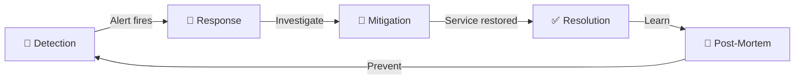
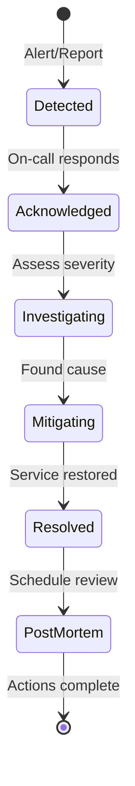

# Incident Management

Responding to production problems detection, response, and learning.

---

## What is an Incident?

An incident is an unplanned event that disrupts or degrades service.

**Examples:**
- Website down
- Significant performance degradation
- Data loss or corruption
- Security breach
- Feature completely broken

**Not incidents:** Minor bugs, slow non-critical processes, planned maintenance.

---

## Incident Severity Levels

Define before needed. Response depends on severity.

### Common Classification

| Severity | Impact | Example | Response |
|----------|--------|---------|----------|
| SEV-1 | Complete outage | Site down | All hands, war room, exec call |
| SEV-2 | Major feature broken | Checkout failing | On-call + backup, immediate |
| SEV-3 | Partial degradation | Slow search | On-call, within hours |
| SEV-4 | Minor issue | UI bug | Normal workflow |

**Define for your context.** What's SEV-1 for a bank differs from a blog.

---

## Incident Lifecycle





### 1. Detection

How do you know something's wrong?

**Sources:**
- Monitoring alerts
- Customer reports
- Error rate spikes
- Social media

**Goal:** Detect before customers. Minutes matter.

### 2. Response

Acknowledge and begin work.

**Steps:**
1. On-call acknowledges alert
2. Assess severity
3. Start incident channel/war room
4. Begin investigation
5. Bring in additional help if needed

### 3. Mitigation

Stop the bleeding. Restore service.

**Priority:** Restore service first, fix root cause later.

**Common mitigations:**
- Rollback deployment
- Restart services
- Scale up resources
- Failover to backup
- Disable problematic feature

### 4. Resolution

Problem is fully fixed. Service restored.

### 5. Post-Incident

Learn from what happened.

- Post-mortem analysis
- Action items
- Documentation

---

## On-Call

Someone responsible for responding when things break.

### On-Call Responsibilities

- Be available during shift
- Respond to alerts within SLA (e.g., 15 minutes)
- Assess and escalate as needed
- Document actions taken

### On-Call Best Practices

**Handoffs:** Clear handoff between shifts. "Here's what's happening."

**Runbooks:** Documented procedures for common alerts.

**Escalation path:** When to wake up the expert.

**Sustainable load:** Alert fatigue burns people out. Fix noisy alerts.

### Rotation

Spread on-call across team. Typical:
- Weekly rotations
- Primary + secondary
- Compensatory time off

---

## Incident Command

For serious incidents, structured response.

### Roles

**Incident Commander (IC):**
- Leads response
- Makes decisions
- Coordinates team
- Communicates status

**Technical Lead:**
- Drives investigation
- Proposes solutions
- Implements fixes

**Communications Lead:**
- Updates stakeholders
- Customer communication
- Status page updates

**Scribe:**
- Documents timeline
- Records actions taken
- Notes for post-mortem

### Why Structure?

Without roles:
- Multiple people doing same thing
- No one doing critical things
- Confusion about who decides
- Poor communication

With roles: Clear ownership, efficient response.

---

## Communication During Incidents

### Internal

**War room:** Dedicated channel/call for incident work.

**Stakeholder updates:** Regular updates to leadership.
```
10:30 AM - Investigating checkout failures
10:45 AM - Identified root cause: database connection pool exhausted
11:00 AM - Mitigation in progress: scaling database
11:15 AM - Service restored
```

### External

**Status page:** Public status for customers.

**Proactive communication:** Don't wait for customers to ask.

**Honest but measured:** Admit issue, share progress, avoid speculation.

```
12:15 PM - Identified: Some users experiencing slow checkout
12:30 PM - Investigating: Our team is working on the issue
12:45 PM - Resolved: The issue has been resolved
```

---

## Post-Mortems

Learn from incidents. Prevent recurrence.

### Blameless Culture

Focus on systems, not people.

**Not:** "Who messed up?"
**But:** "What conditions allowed this to happen?"

People make mistakes. Systems should catch them.

### Post-Mortem Content

1. **Summary:** What happened, in a paragraph
2. **Timeline:** Chronological events with timestamps
3. **Root cause:** Why it happened (often multiple causes)
4. **Impact:** Users affected, duration, business impact
5. **What went well:** Things that helped
6. **What went poorly:** Things that didn't work
7. **Action items:** Concrete tasks to prevent recurrence

### Action Items

**Good action item:**
- Specific and actionable
- Has owner
- Has deadline
- Addresses root cause

```
- [ ] Add database connection pool monitoring (Owner: Alice, Due: Jan 15)
- [ ] Implement connection pool autoscaling (Owner: Bob, Due: Jan 30)
```

**Bad action item:**
- Vague ("be more careful")
- No owner
- No deadline

### Post-Mortem Review

Share with team. Discuss. Learn together.

---

## Runbooks

Documented procedures for handling alerts.

### Runbook Content

```
Alert: High Database CPU

Symptom: Database CPU > 90% for 5 minutes

Likely causes:
1. Expensive query
2. Connection pool exhaustion
3. Normal load spike

Investigation steps:
1. Check slow query log: [link]
2. Check connection count: [query]
3. Check recent deployments: [link]

Mitigation options:
1. Kill expensive query: [command]
2. Restart connection pool: [command]
3. Scale up database: [procedure]

Escalation:
- If unable to resolve in 30 mins, page DBA

Reference:
- Similar incident Jan 5: [link to post-mortem]
```

### Why Runbooks

- Faster response (don't reinvent under pressure)
- Consistency (same approach each time)
- Learning (capture tribal knowledge)
- On-call onboarding (new people can respond)

---

## Alerting Best Practices

### Alert on Symptoms, Not Causes

**Symptom:** Error rate > 1%, latency > 500ms
**Cause:** CPU > 80%, memory > 90%

Alert on what users experience. High CPU might not affect users.

### Actionable Alerts

Every alert should have:
- Clear what's wrong
- Clear what to do
- Runbook link

If you can't do anything about it, don't wake someone up.

### Avoid Alert Fatigue

**Problem:** Too many alerts → people ignore alerts → real issues missed.

**Solutions:**
- Fix noisy alerts
- Consolidate related alerts
- Tune thresholds appropriately
- Review alert volume regularly

---

## Common Mistakes

**No incident process.** Chaos when things go wrong.

**Blame culture.** People hide mistakes instead of learning.

**No runbooks.** Every incident is starting from scratch.

**Too many alerts.** Or alerts without runbooks.

**Poor communication.** Customers learn about outages from Twitter.

**No post-mortems.** Same incidents repeat.

**No follow-through.** Action items never completed.

---

## What An Experienced Senior Engineer Thinks About

**Mean time to detect (MTTD).** How quickly do you know something's wrong?

**Mean time to resolve (MTTR).** How quickly do you fix it?

**Incident frequency.** How often do incidents happen? Trending down?

**Error budget.** SRE concept - some incidents are acceptable. Over budget = slow down releases.

**Organizational learning.** The organization learns from every incident, not just the individuals involved.

---

## Vibe Engineering Guide

When prompting about incidents:

**Less useful:**
> "Handle production incidents"

**More useful:**
> "Help me build an incident management process:
> - Team of 8 engineers, 2 on-call at a time
> - We use PagerDuty for alerting, Slack for communication
> - Currently no formal process, post-mortems are rare
>
> What severity levels should we define? What roles during incidents? How should we structure post-mortems?"

**For specific problems:**
> "We have 50+ alerts per week, and on-call is burned out. Most alerts don't require action. How do we clean up our alerting without missing real issues?"

---

## Quick Check

<details>
<summary><b>What's the first priority during an incident?</b></summary>

Restore service. Mitigate the impact. Root cause analysis comes after. Roll back, restart, failover - whatever stops the bleeding.

</details>

<details>
<summary><b>Why blameless post-mortems?</b></summary>

People make mistakes. Blaming individuals discourages reporting. Focus on systems: what allowed the mistake, how to catch it next time. Psychological safety enables learning.

</details>

<details>
<summary><b>What should be in a runbook?</b></summary>

What the alert means, likely causes, investigation steps, mitigation options, escalation path, related past incidents. Enable anyone on-call to respond.

</details>

<details>
<summary><b>Why alert on symptoms over causes?</b></summary>

Symptoms reflect user impact (errors, latency). Causes don't always affect users (high CPU might be fine). Alert on what matters to users.

</details>

---

Next: [Technical Debt](06-technical-debt.md)
