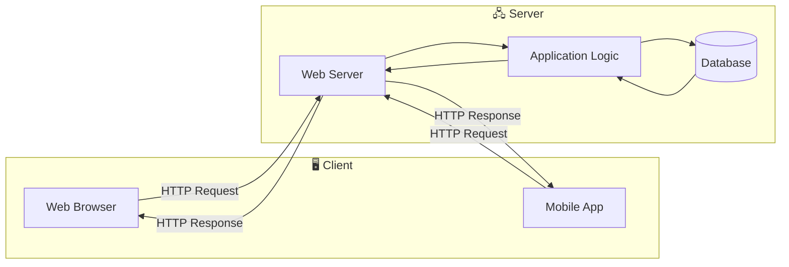
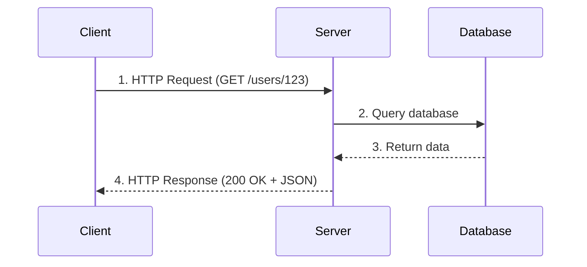
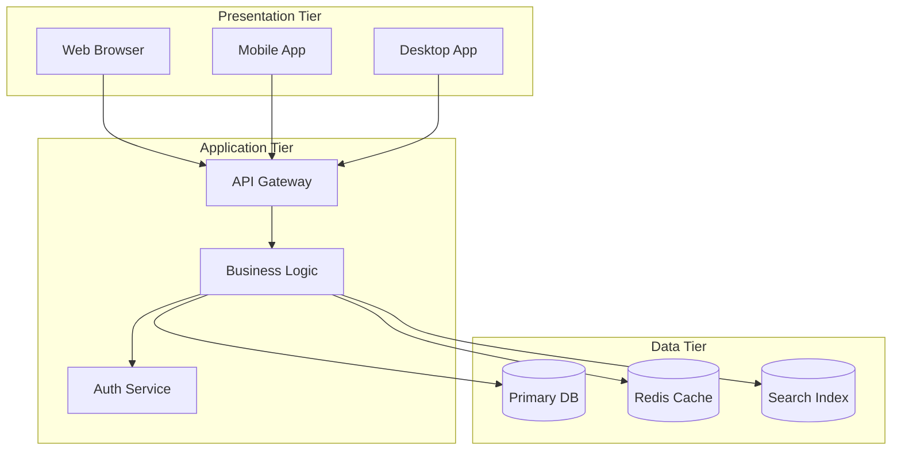
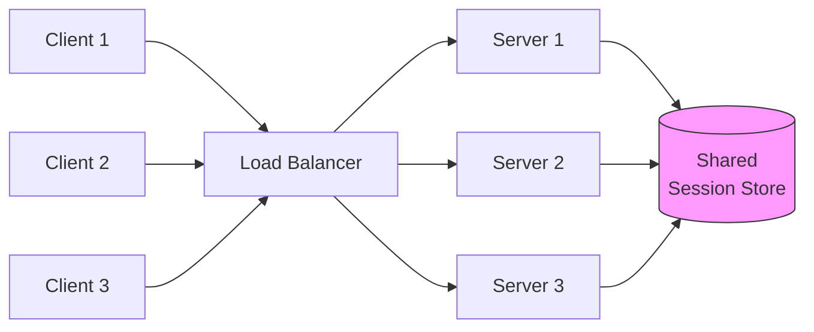
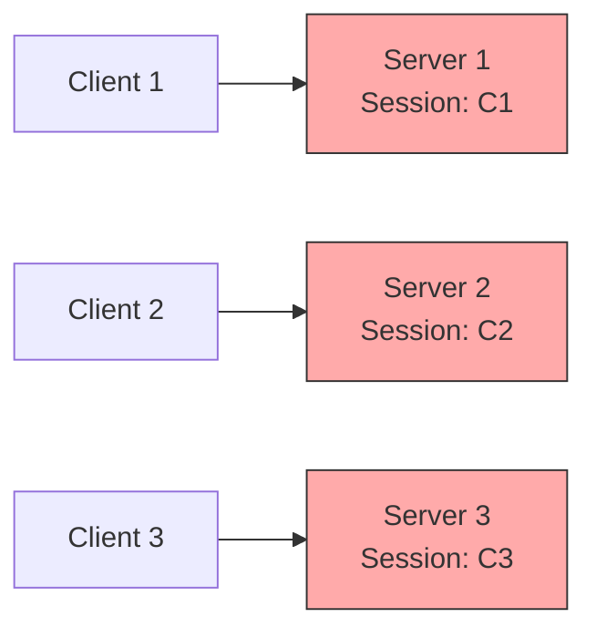

# Client-Server Architecture Diagrams

## Basic Client-Server Model

## Request-Response Cycle

## Three-Tier Architecture

## Stateless vs Stateful Servers

### Stateless Server

### Stateful Server (Not Recommended)

