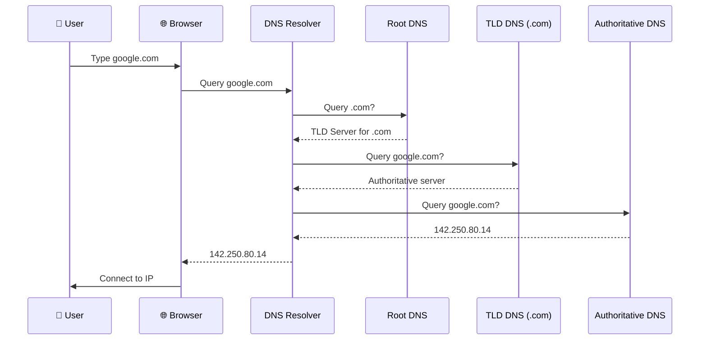
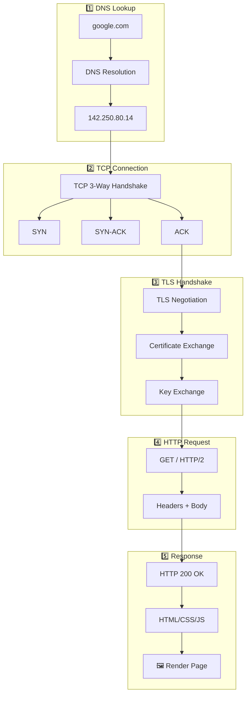
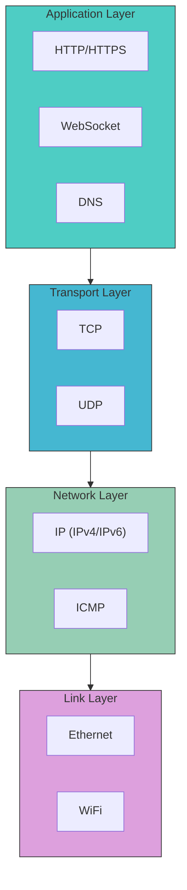
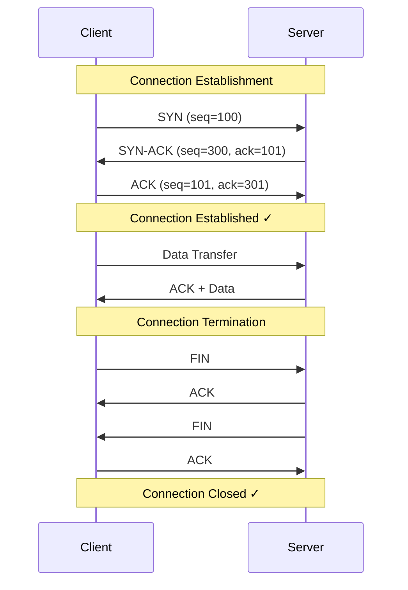
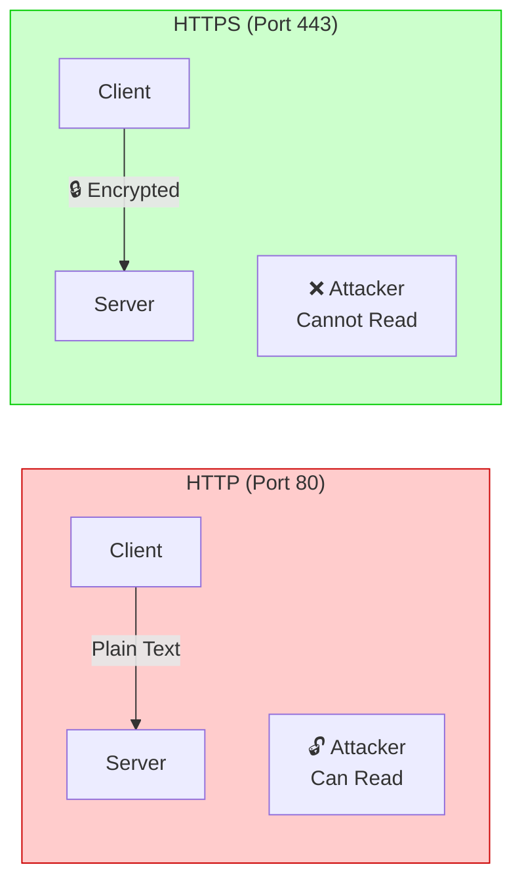

# How the Internet Works - Diagrams

## DNS Resolution Flow

```mermaid
sequenceDiagram
    participant User as 👤 User
    participant Browser as 🌐 Browser
    participant Resolver as DNS Resolver
    participant Root as Root DNS
    participant TLD as TLD DNS (.com)
    participant Auth as Authoritative DNS
    
    User->>Browser: Type google.com
    Browser->>Resolver: Query google.com
    Resolver->>Root: Query .com?
    Root-->>Resolver: TLD Server for .com
    Resolver->>TLD: Query google.com?
    TLD-->>Resolver: Authoritative server
    Resolver->>Auth: Query google.com?
    Auth-->>Resolver: 142.250.80.14
    Resolver-->>Browser: 142.250.80.14
    Browser->>User: Connect to IP
```

## What Happens When You Type a URL

```mermaid
flowchart TB
    subgraph Step1["1️⃣ DNS Lookup"]
        URL["google.com"] --> DNS["DNS Resolution"]
        DNS --> IP["142.250.80.14"]
    end
    
    subgraph Step2["2️⃣ TCP Connection"]
        IP --> TCP["TCP 3-Way Handshake"]
        TCP --> SYN["SYN"]
        TCP --> SYNACK["SYN-ACK"]
        TCP --> ACK["ACK"]
    end
    
    subgraph Step3["3️⃣ TLS Handshake"]
        ACK --> TLS["TLS Negotiation"]
        TLS --> Cert["Certificate Exchange"]
        Cert --> Keys["Key Exchange"]
    end
    
    subgraph Step4["4️⃣ HTTP Request"]
        Keys --> HTTP["GET / HTTP/2"]
        HTTP --> Headers["Headers + Body"]
    end
    
    subgraph Step5["5️⃣ Response"]
        Headers --> Response["HTTP 200 OK"]
        Response --> HTML["HTML/CSS/JS"]
        HTML --> Render["🖼️ Render Page"]
    end
```

## Network Layers (OSI Model Simplified)

```mermaid
flowchart TB
    subgraph Application["Application Layer"]
        HTTP["HTTP/HTTPS"]
        WS["WebSocket"]
        DNS2["DNS"]
    end
    
    subgraph Transport["Transport Layer"]
        TCP2["TCP"]
        UDP["UDP"]
    end
    
    subgraph Network["Network Layer"]
        IPv4["IP (IPv4/IPv6)"]
        ICMP["ICMP"]
    end
    
    subgraph Link["Link Layer"]
        Ethernet["Ethernet"]
        WiFi["WiFi"]
    end
    
    Application --> Transport
    Transport --> Network
    Network --> Link
    
    style Application fill:#4ecdc4,stroke:#333
    style Transport fill:#45b7d1,stroke:#333
    style Network fill:#96ceb4,stroke:#333
    style Link fill:#dda0dd,stroke:#333
```

## TCP Three-Way Handshake

```mermaid
sequenceDiagram
    participant Client
    participant Server
    
    Note over Client,Server: Connection Establishment
    Client->>Server: SYN (seq=100)
    Server->>Client: SYN-ACK (seq=300, ack=101)
    Client->>Server: ACK (seq=101, ack=301)
    Note over Client,Server: Connection Established ✓
    
    Client->>Server: Data Transfer
    Server->>Client: ACK + Data
    
    Note over Client,Server: Connection Termination
    Client->>Server: FIN
    Server->>Client: ACK
    Server->>Client: FIN
    Client->>Server: ACK
    Note over Client,Server: Connection Closed ✓
```

## HTTP vs HTTPS

```mermaid
flowchart LR
    subgraph HTTP["HTTP (Port 80)"]
        C1[Client] -->|"Plain Text"| S1[Server]
        Hacker1[🔓 Attacker<br/>Can Read]
    end
    
    subgraph HTTPS["HTTPS (Port 443)"]
        C2[Client] -->|"🔒 Encrypted"| S2[Server]
        Hacker2[❌ Attacker<br/>Cannot Read]
    end
    
    style HTTP fill:#ffcccc,stroke:#cc0000
    style HTTPS fill:#ccffcc,stroke:#00cc00
```
