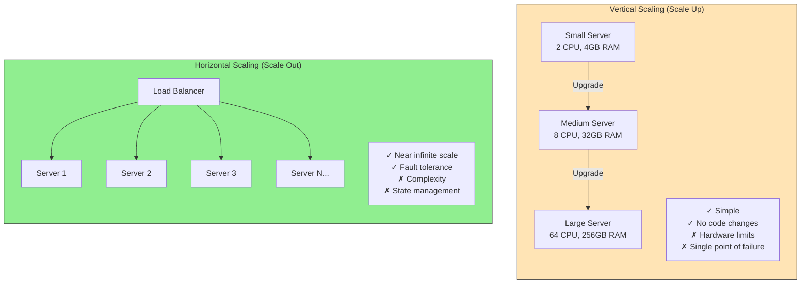
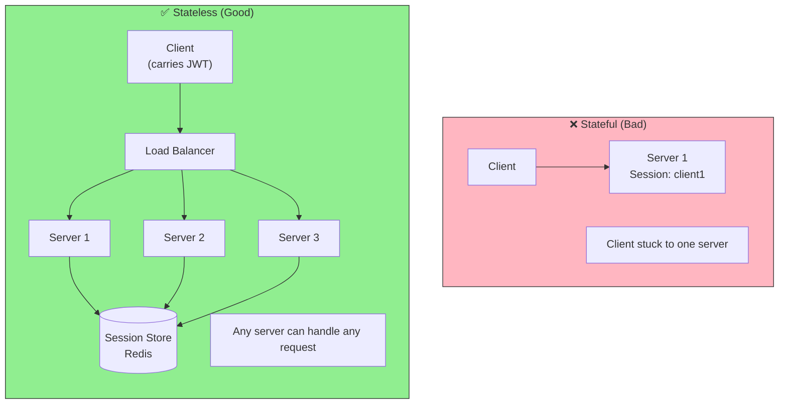
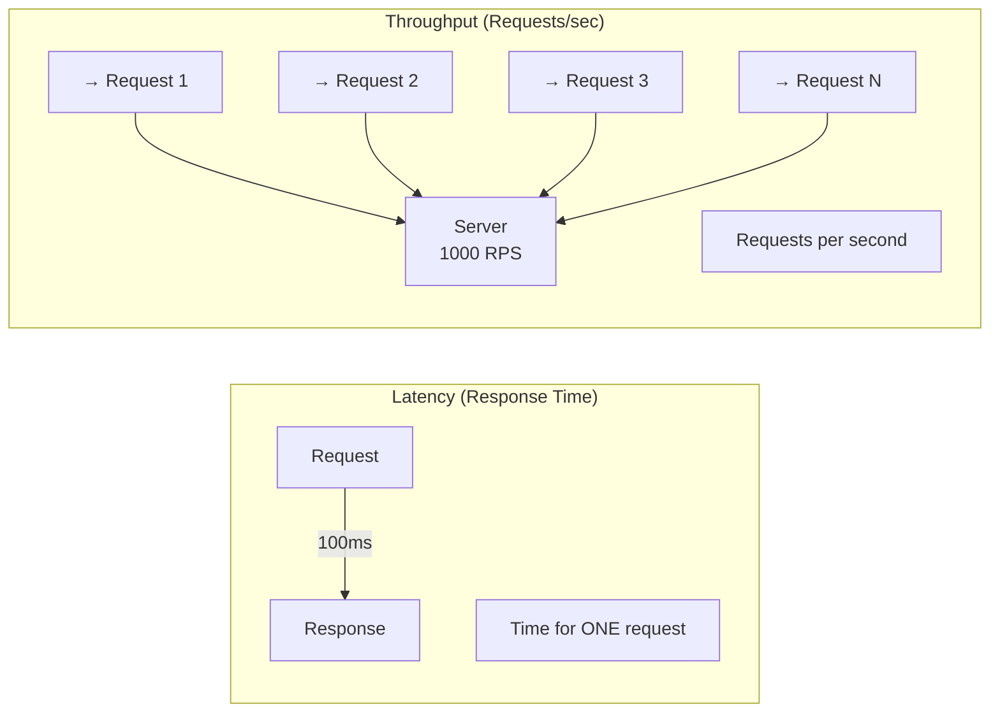
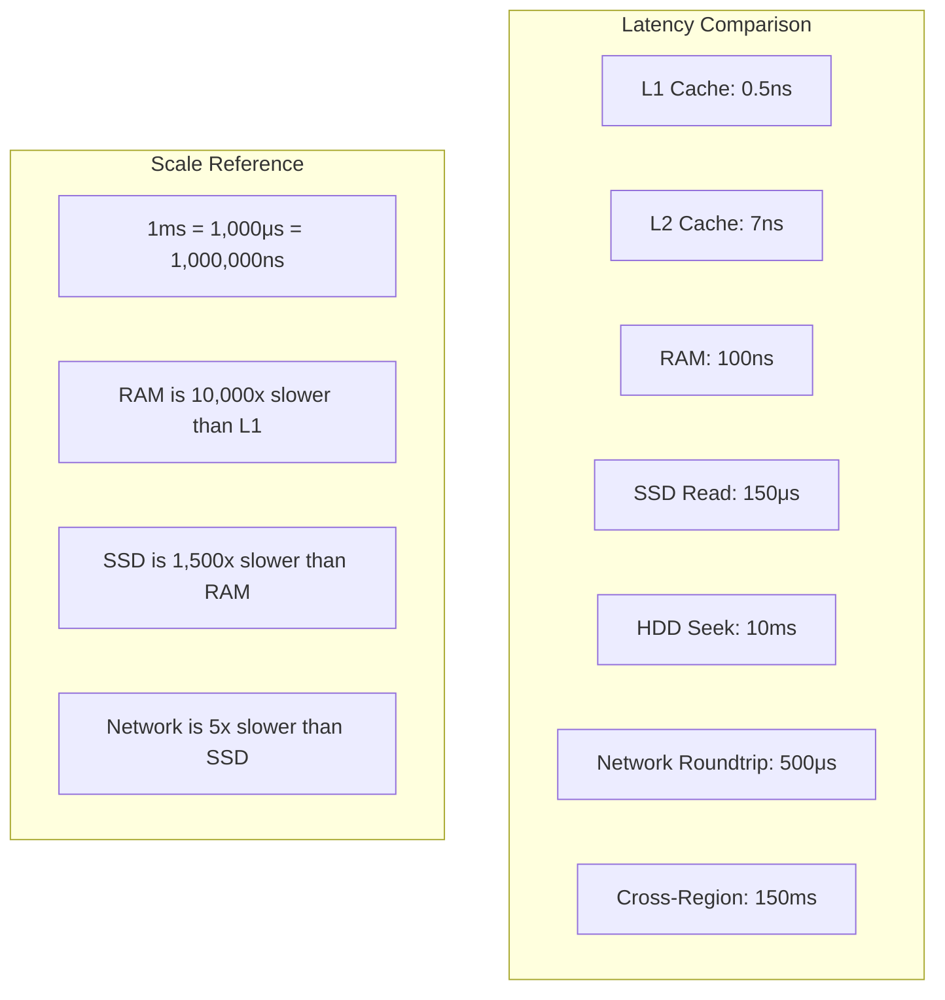
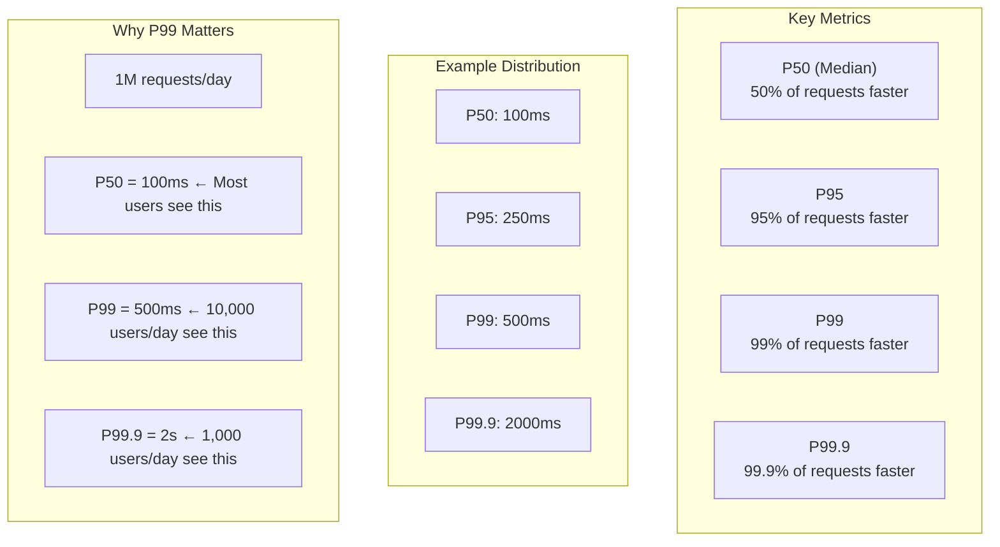
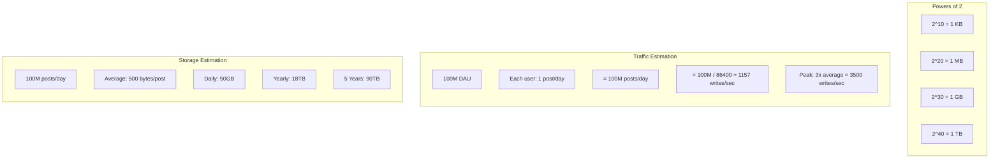
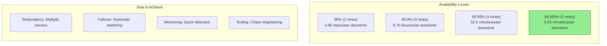

# Scalability Concepts Diagrams

## Horizontal vs Vertical Scaling

## Stateless Architecture

## Throughput vs Latency

## The Numbers Every Developer Should Know

## Load Testing Metrics

## Back-of-Envelope Calculations

## Availability Nines

