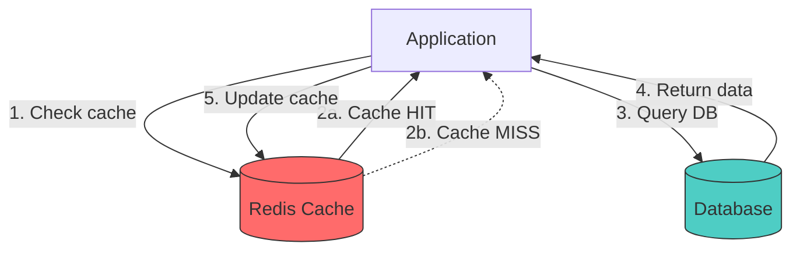
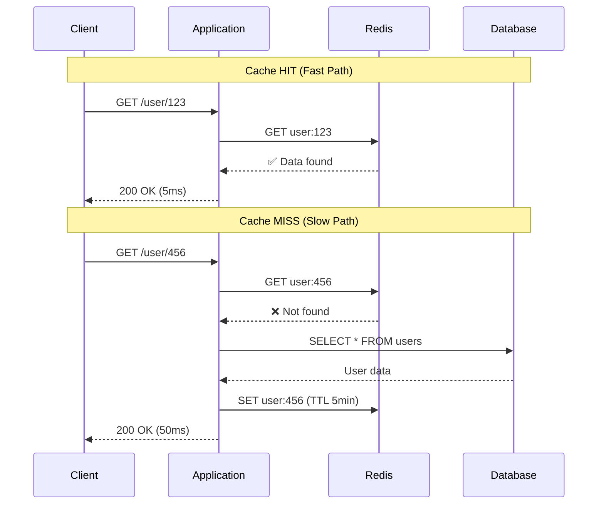
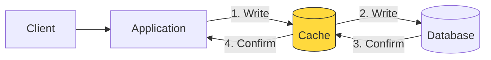
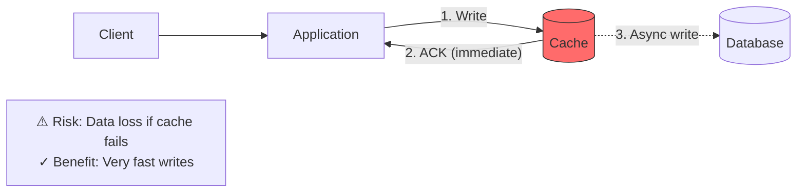
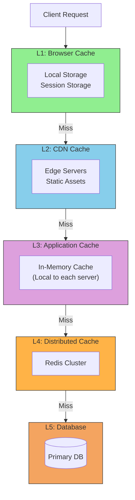
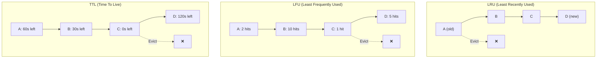
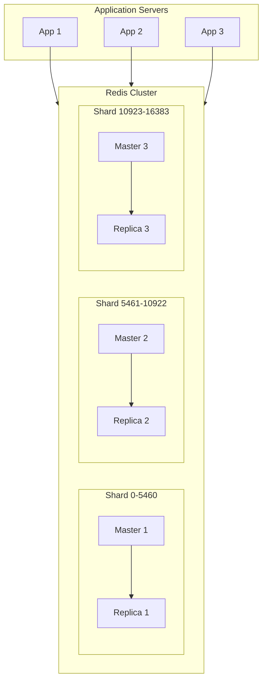
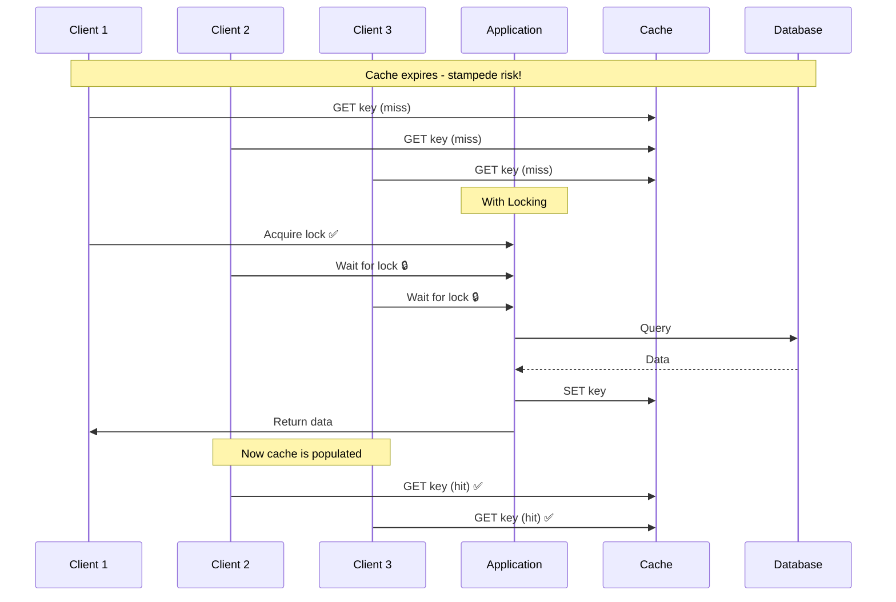

# Caching Architecture Diagrams

## Cache-Aside Pattern (Lazy Loading)

## Cache Hit vs Cache Miss

## Write-Through Cache

## Write-Behind (Write-Back) Cache

## Multi-Level Caching

## Cache Eviction Strategies

## Distributed Cache Architecture

## Cache Stampede Prevention

