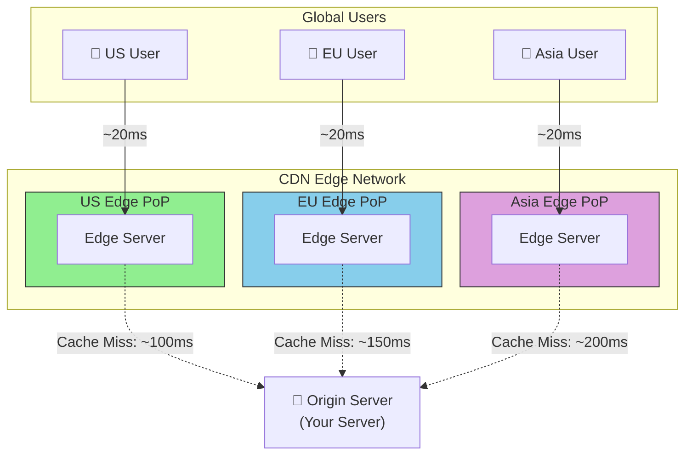
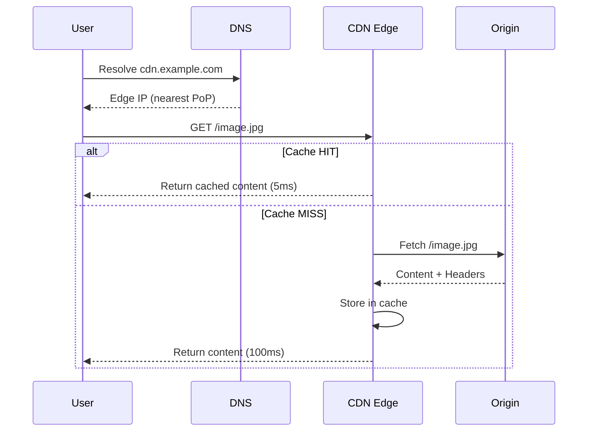
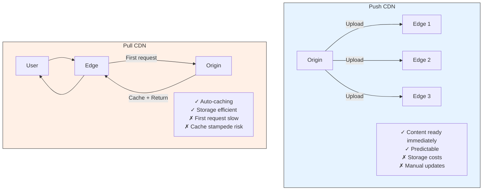
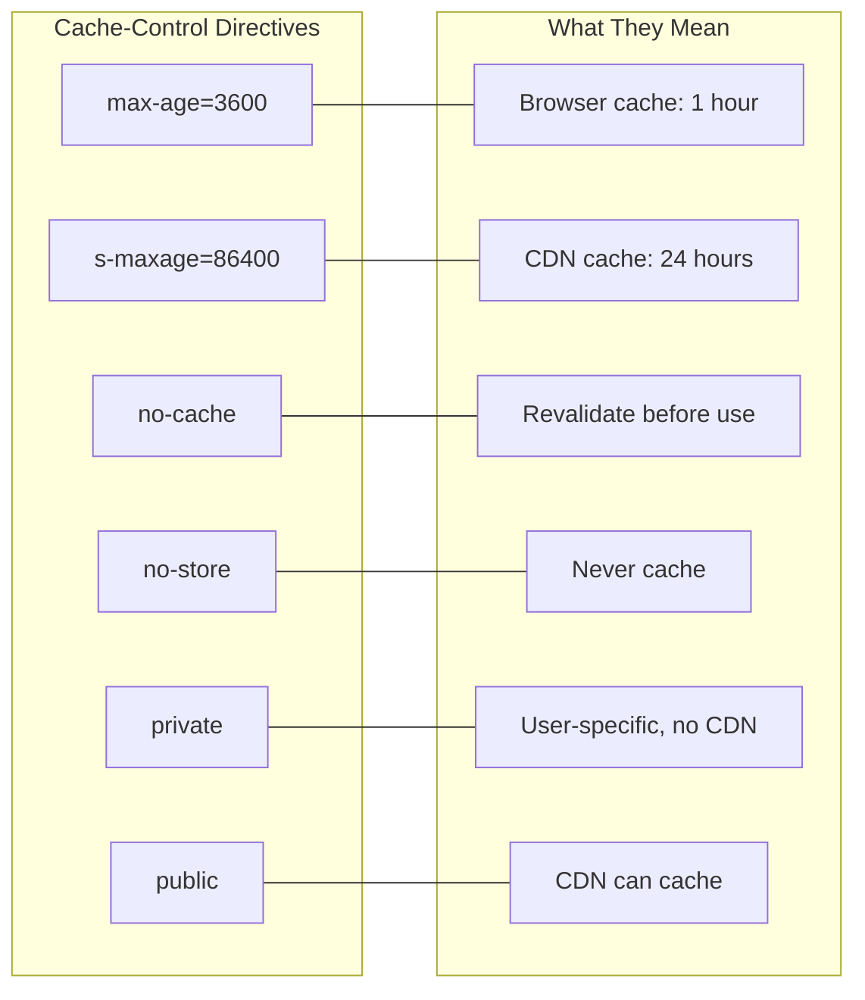
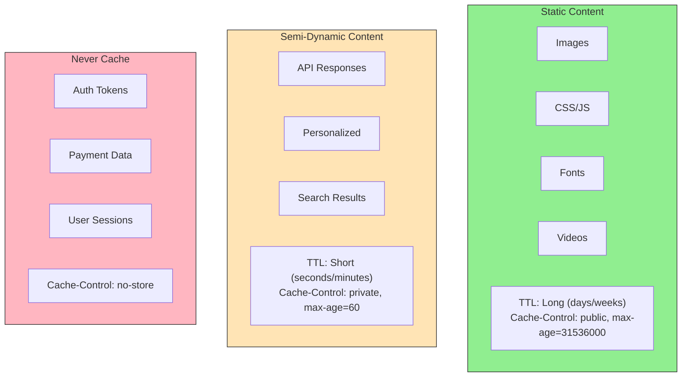
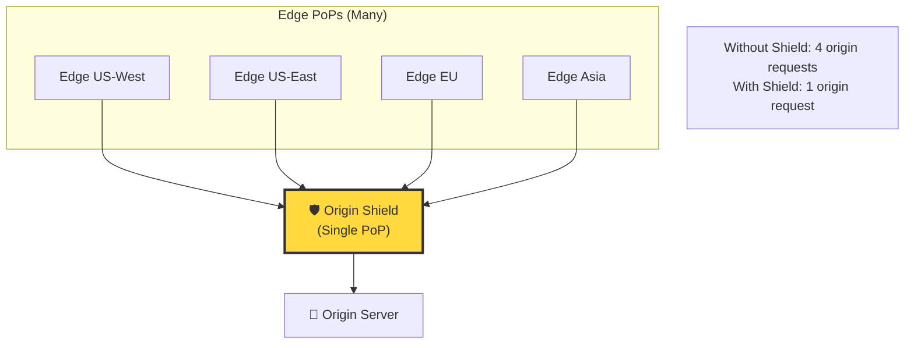
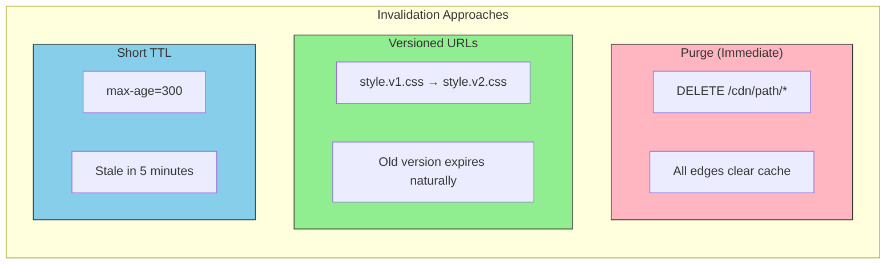

# CDN (Content Delivery Network) Diagrams

## CDN Architecture Overview

## CDN Request Flow

## Push vs Pull CDN

## Cache Control Headers

## CDN for Different Content Types

## CDN with Origin Shield

## CDN Invalidation Strategies

