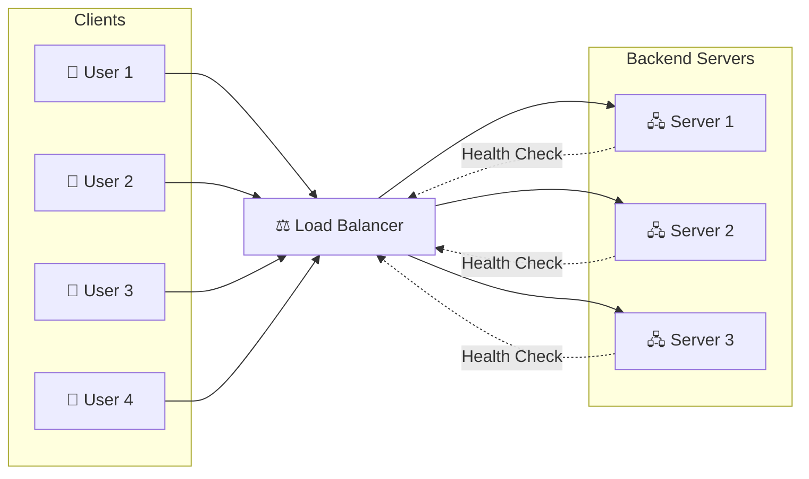
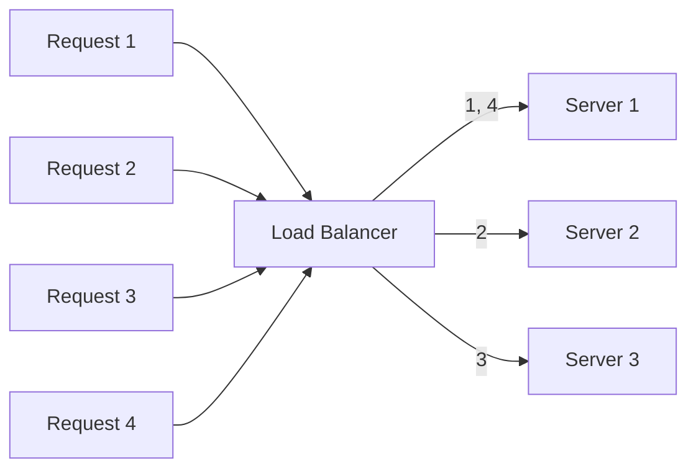
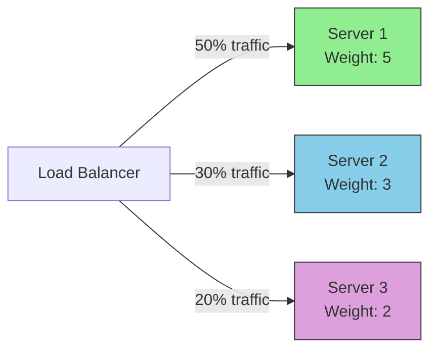
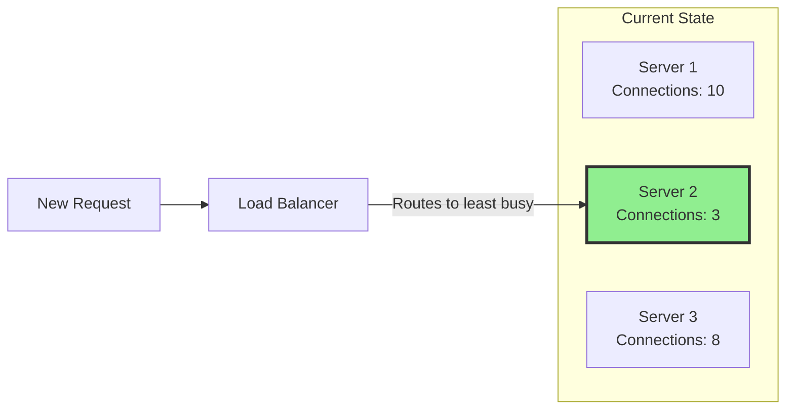
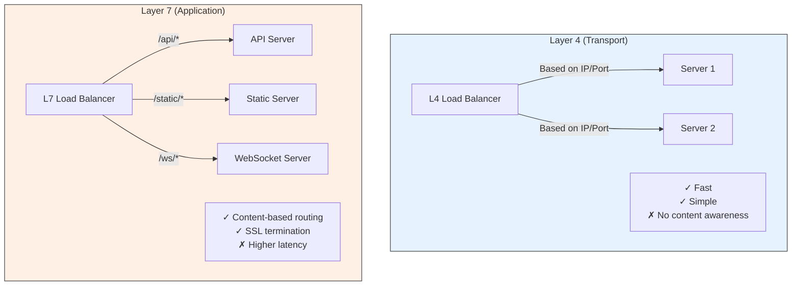
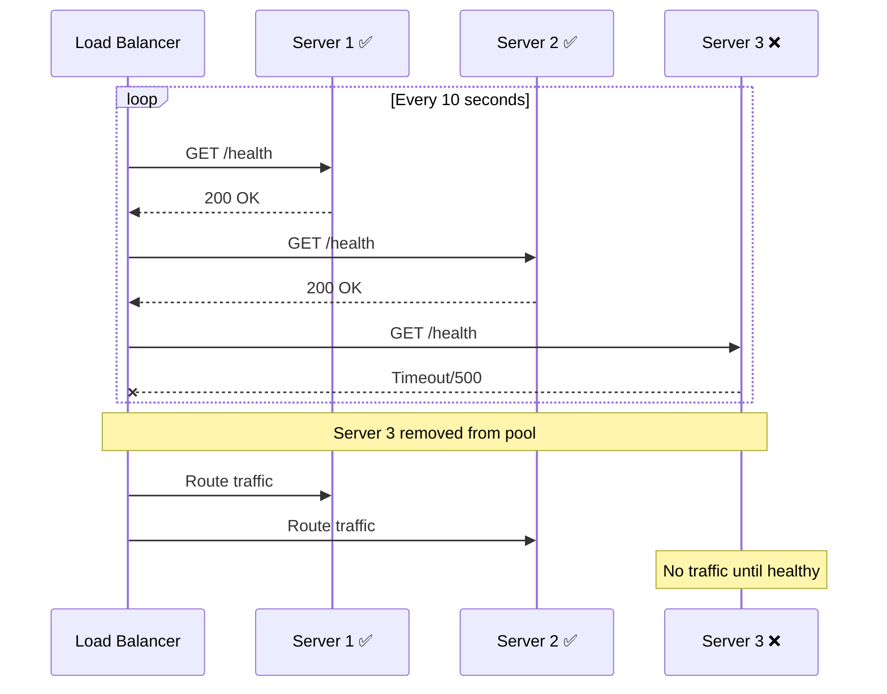
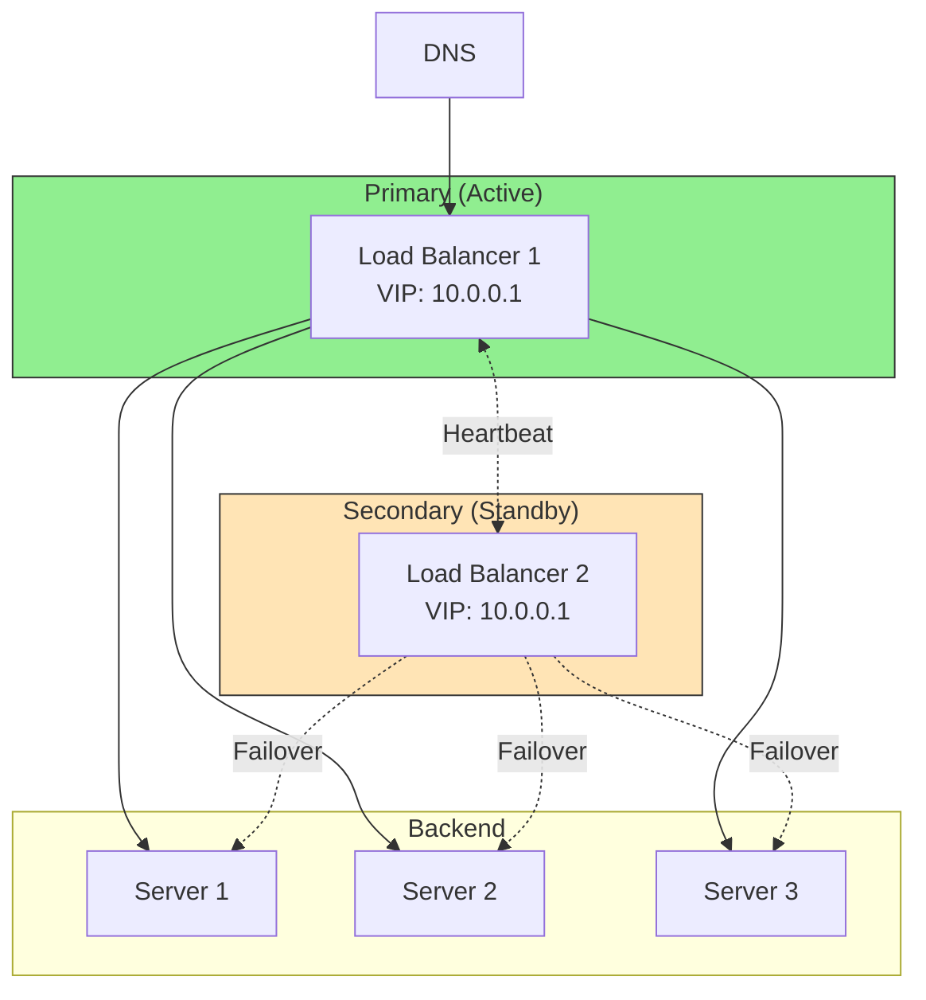

# Load Balancer Diagrams

## Basic Load Balancer Architecture

## Load Balancing Algorithms

### Round Robin

### Weighted Round Robin

### Least Connections

## Layer 4 vs Layer 7 Load Balancing

## Health Checks

## High Availability Setup

